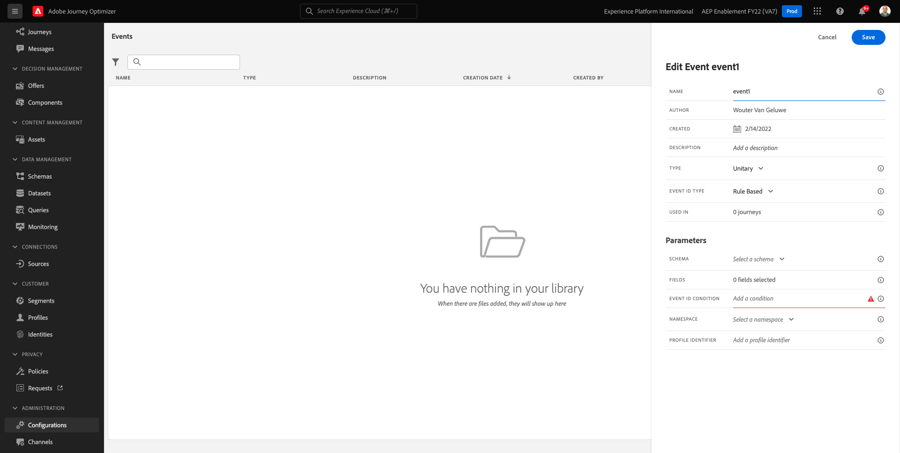

# 7.1 Creare un evento

Accedi a Adobe Journey Optimizer accedendo a [Adobe Experience Cloud](https://experience.adobe.com). Fai clic su **Journey Optimizer**.

Verrai reindirizzato al **Pagina principale**  in Journey Optimizer. In primo luogo, assicurati di utilizzare la sandbox corretta. La sandbox da utilizzare è denominata `--aepSandboxId--`. Per passare da una sandbox all’altra, fai clic su **PROD DI PRODUZIONE (VA7)** e selezionate la sandbox dall’elenco. In questo esempio, la sandbox è denominata **Abilitazione AEP FY22**. Allora sarai nel **Pagina principale** visualizzazione della sandbox `--aepSandboxId--`.

Nel menu a sinistra, scorri verso il basso e fai clic su **Configurazioni**. Fai clic su **Gestisci** pulsante sotto **Eventi**.

Verrà visualizzata una panoramica di tutti gli eventi disponibili. Fai clic su **Crea evento** per iniziare a creare un proprio evento.

Viene quindi visualizzata una nuova finestra di evento vuota.

Prima di tutto, dai al tuo Evento un Nome come questo: `--demoProfileLdap--AccountCreationEvent`.

Quindi, aggiungi una descrizione come questa `Account Creation Event`.

Quindi, assicurati che **Tipo** è impostato su **Unitario** e per **Tipo ID evento** selezione, seleziona **Sistema generato**.

Segue la selezione dello schema. È stato preparato uno schema per questo esercizio. Utilizzare lo schema `Demo System - Event Schema for Website (Global v1.1) v.1`.

Dopo aver selezionato lo schema, nella sezione **Payload** sezione . Ora dovresti passare il cursore sul pulsante **Payload** e vedrai 3 icone a comparsa. Fai clic sul pulsante **Modifica** icona.

Vedrete un **Campi** finestra a comparsa, in cui è necessario selezionare alcuni dei campi necessari per personalizzare l’e-mail.  Sceglieremo altri attributi di profilo in un secondo momento, utilizzando i dati già presenti in Adobe Experience Platform.

Nell’oggetto `--aepTenantId--.demoEnvironment`, assicurati di selezionare i campi **brandLogo** e **brandName**.

Nell’oggetto `--aepTenantId--.identification.core`, assicurati di selezionare il campo **email**.

Fai clic su **Ok** per salvare le modifiche.

Dovresti quindi vedere questo:

Fai clic su **Salva** ancora una volta per salvare le modifiche.

L’evento è ora configurato e salvato.

Fai nuovamente clic sull&#39;evento per aprire **Modifica evento** schermo di nuovo. Passa il puntatore del mouse **Payload** per visualizzare di nuovo le 3 icone. Fai clic sul pulsante **Visualizza payload** icona.

Viene ora visualizzato un esempio del payload previsto.

L’evento dispone di un ID evento di orchestrazione univoco, che puoi trovare scorrendo in quel payload fino a quando non vedi `_experience.campaign.orchestration.eventID`.

L’ID evento è ciò che deve essere inviato a Adobe Experience Platform per attivare il Percorso generato nell’esercizio 7.2. Ricorda questo ID evento, in quanto ne avrai bisogno nell’esercizio 7.3.
`"eventID": "227402c540eb8f8855c6b2333adf6d54d7153d9d7d56fa475a6866081c574736"`

Fai clic su **Ok**, seguito da clic su **Annulla**.

Ora avete finito questo esercizio.

Passaggio successivo: [7.2 Journey Optimizer: Creare il percorso e il messaggio e-mail](./ex2.md)

[Torna al modulo 7](./journey-orchestration-create-account.md)

[Torna a tutti i moduli](../../overview.md)
