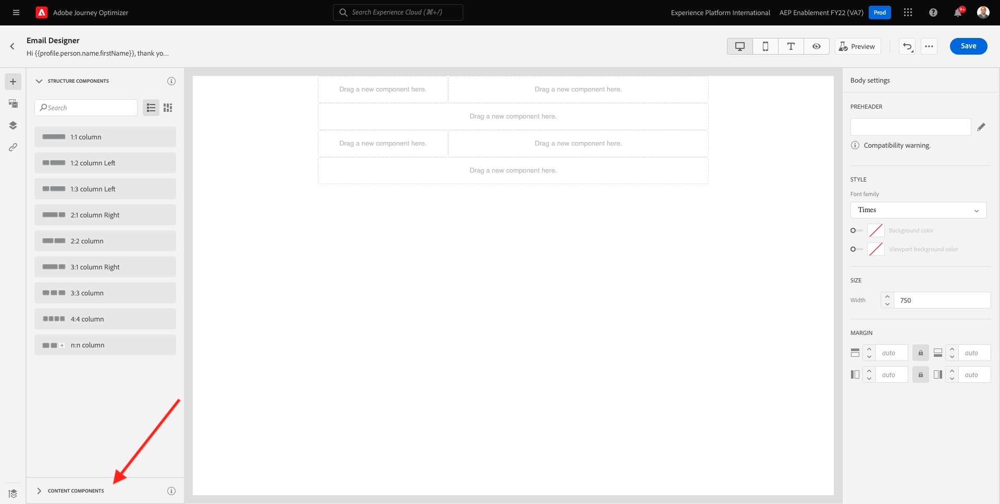
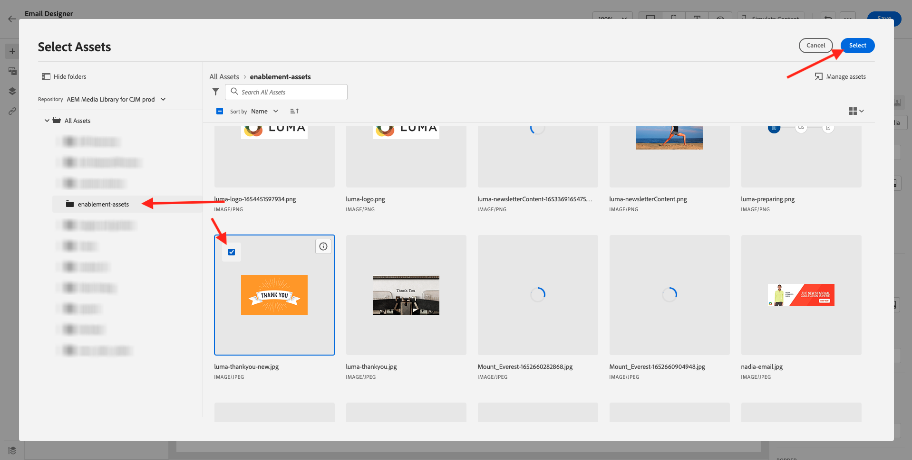
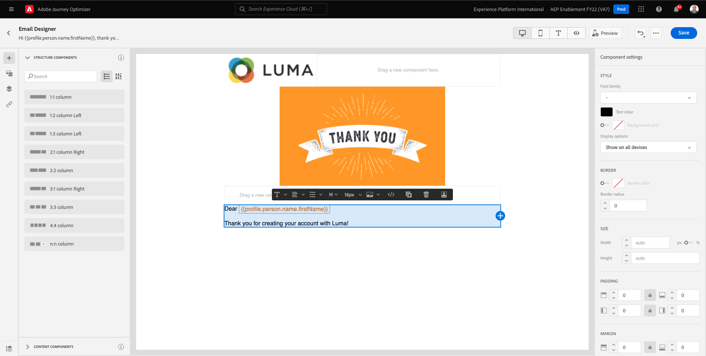

# 7.2 Creare il percorso e il messaggio e-mail

In questo esercizio, configurerai il percorso e il messaggio da attivare quando qualcuno crea un account sul sito web demo.

Accedi a Adobe Journey Optimizer accedendo a [Adobe Experience Cloud](https://experience.adobe.com). Fai clic su **Journey Optimizer**.

Verrai reindirizzato al **Pagina principale**  in Journey Optimizer. In primo luogo, assicurati di utilizzare la sandbox corretta. La sandbox da utilizzare è denominata `--aepSandboxId--`. Per passare da una sandbox all’altra, fai clic su **PROD DI PRODUZIONE (VA7)** e selezionate la sandbox dall’elenco. In questo esempio, la sandbox è denominata **Abilitazione AEP FY22**. Allora sarai nel **Pagina principale** visualizzazione della sandbox `--aepSandboxId--`.

## 7.2.1 Crea il tuo percorso

Nel menu a sinistra, fai clic su **Percorsi**. Quindi, fai clic su **Crea Percorso** per creare un nuovo percorso.

Verrà visualizzata una schermata di percorso vuota.

Nell’esercizio precedente, hai creato una nuova **Evento**. L&#39;hai chiamato così `ldapAccountCreationEvent` e sostituito `ldap` con il tuo ldap. Questo è stato il risultato della creazione dell’evento:

Ora devi prendere questo evento come inizio di questo Percorso. Per farlo, vai sul lato sinistro dello schermo e cerca l’evento nell’elenco degli eventi.

Seleziona l’evento, trascinalo sull’area di lavoro del Percorso e rilascialo. Il tuo Percorso ora si presenta così:

Come secondo passaggio del percorso, devi aggiungere una breve **Wait** passo. Passa al lato sinistro dello schermo e **Orchestrazione** per trovare questo. Utilizzerai gli attributi del profilo e dovrai accertarti che siano popolati nel Profilo del cliente in tempo reale.

Il tuo percorso ora assomiglia a questo. Sul lato destro dello schermo è necessario configurare il tempo di attesa. Impostalo a 1 minuto. In questo modo gli attributi del profilo saranno disponibili per un periodo di tempo sufficiente dopo l’attivazione dell’evento.

Fai clic su **Ok** per salvare le modifiche.

Come terzo passaggio del percorso, devi aggiungere un **E-mail** azione. Vai al lato sinistro dello schermo fino a **Azioni**, seleziona **E-mail** , quindi trascinalo sul secondo nodo del percorso. Ora vedete questo.

Imposta la **Categoria** a **Marketing** e seleziona una superficie e-mail che ti consente di inviare e-mail. In questo caso, la superficie dell’e-mail da selezionare è **E-mail**. Assicurati che le caselle di controllo per **Clic su e-mail** e **aperture e-mail** sono entrambi abilitati.

Il passaggio successivo consiste nel creare il messaggio. A tale scopo, fai clic su **Modifica contenuto**.

## 7.2.2 Creare il messaggio

Per creare il messaggio, fai clic su **Modifica contenuto**.

Ora vedete questo.

Fai clic sul pulsante **Linea oggetto** campo di testo.

Nell’area di testo inizia la scrittura **Ciao**

L&#39;oggetto non è ancora stato completato. Ora devi inserire il token di personalizzazione per il campo **Nome** che è immagazzinato in `profile.person.name.firstName`. Nel menu a sinistra, scorri verso il basso per trovare il **Persona** e fai clic sulla freccia per andare un livello più profondo.

Ora trova la **Nome completo** e fai clic sulla freccia per andare un livello più profondo.

Infine, trova il **Nome** e fai clic sul **+** firmi accanto a esso. Il token di personalizzazione verrà visualizzato nel campo di testo.

Quindi, aggiungi il testo **Grazie per esserti registrato!**. Fai clic su **Salva**.

Allora tornerai qui. Fai clic su **E-mail Designer** per creare il contenuto dell’e-mail.

Nella schermata successiva verranno visualizzati 3 metodi diversi per fornire il contenuto dell’e-mail:

- **Progettazione da zero**: Inizia con un’area di lavoro vuota e utilizza l’editor WYSIWYG per trascinare e rilasciare componenti di struttura e contenuto per creare visivamente il contenuto dell’e-mail.
- **Codice personalizzato**: Crea il tuo modello e-mail codificandolo utilizzando HTML
- **Importa HTML**: Importa un modello HTML esistente, che potrai modificare.

Fai clic su **Progettazione da zero**.

Nel menu a sinistra trovi i componenti struttura che puoi utilizzare per definire la struttura dell’e-mail (righe e colonne).

Trascina e rilascia una **Colonna 1:2 a sinistra** dal menu nell’area di lavoro. Segnaposto per l’immagine del logo.

Trascina e rilascia una **Colonna 1:1** sotto il componente precedente. Questo sarà il blocco banner.

Trascina e rilascia una **Colonna 1:2 a sinistra** sotto il componente precedente. Sarà il contenuto effettivo con un’immagine sul lato sinistro e del testo sul lato destro.

Quindi, trascina e rilascia una **Colonna 1:1** sotto il componente precedente. Questo sarà il piè di pagina dell’e-mail. A questo punto la tela deve avere questo aspetto:

Quindi, utilizziamo Componenti contenuto per aggiungere contenuto all’interno di questi blocchi. Fai clic sul pulsante **Componenti contenuto** voce di menu

Trascina e rilascia una **Immagine** nella prima cella della prima riga. Fai clic su **Sfoglia**.

Vedrete questo. Passa alla cartella **enablement-assets** e selezionare il file **luma-logo.png**. Fai clic su **Seleziona**.

Ora sei di nuovo qui:

Vai a **Componenti contenuto** e trascinare un **Immagine** nella prima cella della prima riga. Fai clic su **Sfoglia**.

In **Risorse** pop-up, vai al **enablement-assets** cartella. In questa cartella trovi tutte le risorse precedentemente preparate e caricate dal team creativo. Seleziona **module23-grazie-new.png** e fai clic su **Seleziona**.

A quel punto avrai questo:

Seleziona l’immagine e scorri verso il basso nel menu di destra fino a visualizzare la **Dimensione** componente cursore larghezza. Usa il cursore per cambiare la larghezza in f.i. **60%**.

Quindi, vai a **Componenti contenuto** e trascina e rilascia una **Testo** nel componente struttura nella quarta riga.

Selezionare il testo predefinito **Digitare il testo qui.** come per qualsiasi editor di testo. Scrivi **Gentile** invece. La barra degli strumenti Testo viene visualizzata in modalità testo.

Nella barra degli strumenti, fai clic su **Aggiungi personalizzazione** icona.

Successivamente, devi portare il **Nome** token di personalizzazione memorizzato in `profile.person.name.firstName`. Nel menu , trova la **Persona** elemento, scegli **Nome completo** , quindi fai clic sul **+** per aggiungere il campo Nome all’editor di espressioni.

Fai clic su **Salva**.

Ora noterai come il campo di personalizzazione è stato aggiunto al testo.

Nello stesso campo di testo, premi **Invio** due volte per aggiungere due righe e scrivere **Grazie per aver creato il tuo account con Luma!**.

Il controllo finale da eseguire per verificare che l’e-mail sia pronta per essere visualizzata in anteprima, fai clic sul pulsante **Simula contenuto** pulsante .

Per iniziare, identifica il profilo da utilizzare per l’anteprima. Seleziona la **email** namespace facendo clic sull’icona accanto a **Immettere lo spazio dei nomi identità** campo .

Nell’elenco dei namespace delle identità, seleziona la **E-mail** spazio dei nomi.

In **Valore identità** immetti l’indirizzo e-mail di un profilo demo precedente già memorizzato nel Profilo cliente in tempo reale. Esempio **woutervangeluwe+06022022-01@gmail.com** e fai clic su **Trova profilo di test** pulsante

Una volta che il tuo profilo si presenta nella tabella, fai clic sul **Anteprima** per accedere alla schermata di anteprima.

Quando l’anteprima è pronta, verifica che la personalizzazione sia corretta nella riga dell’oggetto, che il testo del corpo e il collegamento di annullamento all’abbonamento siano evidenziati come collegamento ipertestuale.

Fai clic su **Chiudi** per chiudere l&#39;anteprima.

Fai clic su **Salva** per salvare il messaggio.

Torna al dashboard dei messaggi facendo clic sul pulsante **freccia** accanto all’oggetto nell’angolo in alto a sinistra.

Hai completato la creazione del messaggio e-mail di registrazione. Fai clic sulla freccia nell&#39;angolo in alto a sinistra per tornare al percorso.

Fai clic su **Ok**.

## 7.2.3 Pubblicare il percorso

Devi ancora dare un Nome al tuo percorso. Per farlo, fai clic sul pulsante **Proprietà** in alto a destra sullo schermo.

Potete quindi inserire il nome del percorso qui. Utilizzare `--demoProfileLdap-- - Account Creation Journey`. Fai clic su **OK** per salvare le modifiche.

Ora puoi pubblicare il percorso facendo clic su **Pubblica**.

Fai clic su **Pubblica** di nuovo.

Verrà visualizzata una barra di conferma verde che indica che il percorso è ora Pubblicato.

Ora avete finito questo esercizio.

Passaggio successivo: [7.3 Aggiorna la proprietà Data Collection e verifica il percorso](./ex3.md)

[Torna al modulo 7](./journey-orchestration-create-account.md)

[Torna a tutti i moduli](../../overview.md)
