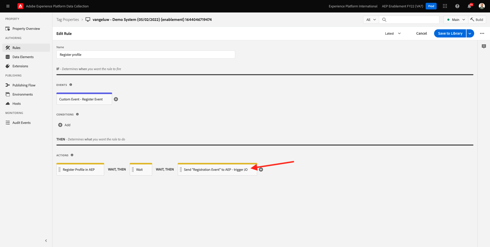
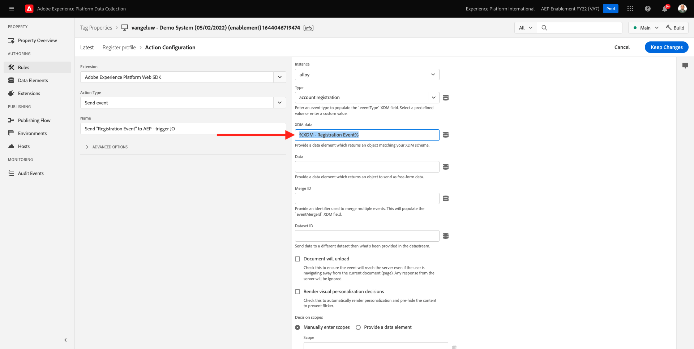

# 7.3 Aggiorna la proprietà Data Collection e verifica il percorso

## 7.3.1 Aggiorna la proprietà Data Collection

Vai a [Raccolta dati Adobe Experience Platform](https://experience.adobe.com/launch/) e seleziona **Tag**.

Questa è la pagina Proprietà raccolta dati di Adobe Experience Platform che hai visto prima.

Nel modulo 0, Demo System ha creato due proprietà Client: uno per il sito web e uno per l’app mobile. Trovarli cercando `--demoProfileLdap--` in **[!UICONTROL Ricerca]** scatola. Fai clic per aprire **Web** proprietà.

Vedrete questo.

Nel menu a sinistra, vai a **Regole** e cerca la regola **Registra profilo**. Fai clic sulla regola **Registra profilo** per aprirlo.

Verranno quindi visualizzati i dettagli di questa regola. Fai clic per aprire l’azione **Invia &quot;Evento di registrazione&quot; ad AEP - trigger JO**.

Vedrai quindi che quando questa azione viene attivata, viene utilizzato un elemento dati specifico per definire la struttura dati XDM. È necessario aggiornare tale elemento dati e definire le **ID evento** dell&#39;evento configurato in [Esercizio 7.1](./ex1.md).

Ora devi aggiornare l’elemento dati **XDM - Evento di registrazione**. Per farlo, vai a **Elementi dati**. Cerca **XDM - Evento di registrazione** e fai clic su per aprire l&#39;elemento dati.

Vedrai questo:

Passa al campo . `_experience.campaign.orchestration.eventID`. Rimuovi il valore corrente e incolla qui il tuo eventID.

Per promemoria, l’ID evento si trova in Adobe Journey Optimizer in **Configurazioni > Eventi** e troverai l’ID evento nel payload di esempio del tuo even, che si presenta così: `"eventID": "227402c540eb8f8855c6b2333adf6d54d7153d9d7d56fa475a6866081c574736"`.

Dopo aver incollato l&#39;ID evento, la schermata dovrebbe essere simile a questa. Quindi, fai clic su **Salva** o **Salva nella libreria**.

Infine, devi pubblicare le modifiche. Vai a **Flusso di pubblicazione** nel menu a sinistra.

Fai clic su **Aggiungi tutte le risorse modificate** quindi fai clic su **Salva e genera in sviluppo**.

La libreria verrà quindi aggiornata e dopo 1-2 minuti potrai procedere e verificare la configurazione.

## 7.3.2 Testare il Percorso

Vai a [https://builder.adobedemo.com/projects](https://builder.adobedemo.com/projects). Dopo aver effettuato l’accesso con il tuo Adobe ID, vedrai questo. Fai clic sul progetto del tuo sito web per aprirlo.

Sulla **Schermi** pagina, fai clic su **Esegui**.

Vedrai il tuo sito web demo aperto. Seleziona l’URL e copialo negli Appunti.

Apri una nuova finestra del browser in incognito.

Incolla l’URL del sito web dimostrativo che hai copiato nel passaggio precedente. Ti verrà quindi chiesto di effettuare l&#39;accesso utilizzando il tuo Adobe ID.

Seleziona il tipo di account e completa il processo di accesso.

Il sito web verrà quindi caricato in una finestra del browser in incognito. Per ogni dimostrazione, è necessario utilizzare una nuova finestra del browser in incognito per caricare l’URL del sito web demo.

Fai clic sull’icona del logo Adobe nell’angolo in alto a sinistra dello schermo per aprire il Visualizzatore profili.

Guarda il pannello Visualizzatore profili e il Profilo cliente in tempo reale con **ID Experience Cloud** come identificatore principale per questo cliente attualmente sconosciuto.

Vai alla pagina Registrazione/Accesso . Fai clic su **CREARE UN ACCOUNT**.

Inserisci i tuoi dati e fai clic su **Registro** dopo di che verrai reindirizzato alla pagina precedente.

Apri il pannello Visualizzatore profili e vai a Profilo cliente in tempo reale. Nel pannello Visualizzatore profilo dovrebbero essere visualizzati tutti i dati personali, come le e-mail e gli identificatori telefonici appena aggiunti.

1 minuto dopo aver creato il tuo account, riceverai l’e-mail di creazione del tuo account da Adobe Journey Optimizer.

Passaggio successivo: [Riepilogo e vantaggi](./summary.md)

[Torna al modulo 7](./journey-orchestration-create-account.md)

[Torna a tutti i moduli](../../overview.md)
