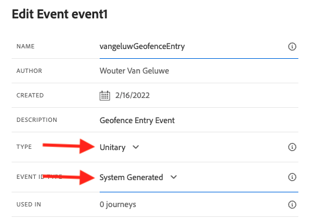

# 8.1 Definire un evento

Accedi a Adobe Journey Optimizer accedendo a [Adobe Experience Cloud](https://experience.adobe.com). Fai clic su **Journey Optimizer**.

Verrai reindirizzato al **Pagina principale**  in Journey Optimizer. In primo luogo, assicurati di utilizzare la sandbox corretta. La sandbox da utilizzare è denominata `--aepSandboxId--`. Per passare da una sandbox all’altra, fai clic su **PROD DI PRODUZIONE (VA7)** e selezionate la sandbox dall’elenco. In questo esempio, la sandbox è denominata **Abilitazione AEP FY22**. Allora sarai nel **Pagina principale** visualizzazione della sandbox `--aepSandboxId--`.

Nel menu a sinistra, scorri verso il basso e fai clic su **Configurazioni**. Fai clic su **Gestisci** pulsante sotto **Eventi**.

Verrà visualizzata una panoramica di tutti gli eventi disponibili. Fai clic su **Crea evento** per iniziare a creare un proprio evento.

Viene quindi visualizzata una nuova finestra di evento vuota.

Come nome dell’evento, utilizza `--demoProfileLdap--GeofenceEntry`. In questo esempio, il Nome evento è `vangeluwGeofenceEntry`.

Imposta descrizione su: `Geofence Entry Event`.

Quindi, assicurati che **Tipo** è impostato su **Unitario** e per **Tipo ID evento** selezione, seleziona **Sistema generato**

Successivamente, è necessario selezionare uno schema. Tutti gli schemi visualizzati qui sono Schemi Adobe Experience Platform.

Noterai che non tutti gli schemi sono visualizzati. In Adobe Experience Platform sono disponibili molti altri schemi.
Per visualizzare in questo elenco, uno schema deve avere un gruppo di campi molto specifico collegato ad esso. Il gruppo di campi che deve essere visualizzato qui è denominato `Orchestration eventID`.

Diamo un’occhiata rapida alla definizione di questi schemi in Adobe Experience Platform.

Nel menu a sinistra, vai a **Schemi** e aprilo in una nuova scheda del browser. In **Schemi**, vai a **Sfoglia** per visualizzare l’elenco degli schemi disponibili.
Apri lo schema `Demo System - Event Schema for Website (Global v1.1)`.

Dopo aver aperto lo schema, viene visualizzato il gruppo di campi `Orchestration eventID` fa parte dello schema.
Questo gruppo di campi ha solo due campi, `_experience.campaign.orchestration.eventID` e `originJourneyID`.

Una volta che questo gruppo di campi e questo campo eventID specifico fanno parte di uno schema, tale schema sarà disponibile per l’utilizzo da parte di Adobe Journey Optimizer.

Torna alla configurazione dell’evento in Adobe Journey Optimizer.

In questo caso d’uso, desideri ascoltare un evento Geofence per capire se un cliente si trova in una posizione specifica, quindi ora seleziona lo schema `Demo System - Event Schema for Website (Global v1.1)` come schema dell&#39;evento.

Adobe Journey Optimizer selezionerà automaticamente alcuni campi obbligatori, ma puoi modificare quelli disponibili in Adobe Journey Optimizer.

Fai clic sul pulsante **matita** per modificare i campi.

Viene quindi visualizzata una finestra a comparsa con una gerarchia di schema che consente di selezionare i campi.

Campi come ECID e Orchestration eventID sono obbligatori e come tali preselezionati.

Tuttavia, un esperto di marketing deve avere accesso flessibile a tutti i punti dati che forniscono contesto a un Percorso. Assicuriamoci quindi di selezionare almeno i seguenti campi (che si trovano all&#39;interno del nodo contestuale Inserisci ):

- Città

Al termine, fai clic su **OK**.

Per identificare il cliente, Adobe Journey Optimizer deve anche disporre di un identificatore . Poiché Adobe Journey Optimizer è collegato a Adobe Experience Platform, l’identificatore principale di uno schema viene automaticamente considerato come identificatore del Percorso.
L’identificatore principale terrà automaticamente conto dell’intero grafico identità di Adobe Experience Platform e collegherà allo stesso profilo tutti i comportamenti di tutte le identità, i dispositivi e i canali disponibili, in modo che Adobe Journey Optimizer sia contestuale, pertinente e coerente.

Fai clic su **Salva** per salvare l’evento personalizzato.

L’evento farà quindi parte dell’elenco degli eventi disponibili.

Infine, è necessario recuperare il `Orchestration eventID` per l’evento personalizzato.

Apri di nuovo l’evento facendo clic su di esso nell’elenco degli eventi.
Nell’evento, fai clic sul pulsante **Visualizza payload** accanto a **Campi**.

Fai clic su **Visualizza payload** apre un payload XDM di esempio per questo evento.

Scorri verso il basso in **Payload** fino a quando non vedi la linea `eventID`.

Annota la `eventID` come sarà necessario nell&#39;ultimo per testare la configurazione.

In questo esempio, la `eventID` è `fa42ab7982ba55f039eacec24c1e32e5c51b310c67f0fa559ab49b89b63f4934`.

Ora hai definito l&#39;evento che attiverà il percorso che stiamo costruendo. Una volta attivato il percorso, i campi geografici come Città e tutti gli altri campi scelti (come Paese, Latitudine e Longitudine) saranno resi disponibili al percorso.

Come illustrato nella descrizione del caso d’uso, è quindi necessario fornire promozioni contestuali a seconda del tempo. Per ottenere le informazioni meteorologiche, dovremo definire fonti di dati esterne che ci forniranno le informazioni meteo per quella posizione. Utilizzerai il **OpenWeather** servizio per fornirci quali informazioni, come parte di 2.

Passaggio successivo: [8.2 Definire un’origine dati esterna](./ex2.md)

[Torna al modulo 8](journey-orchestration-external-weather-api-sms.md)

[Torna a tutti i moduli](../../overview.md)
