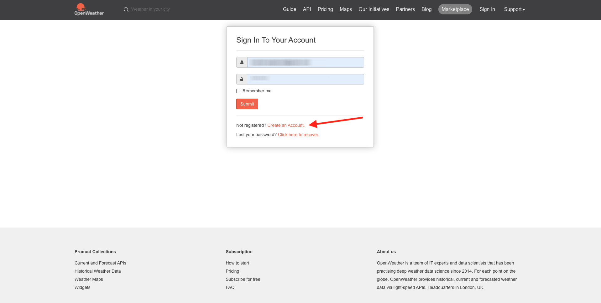
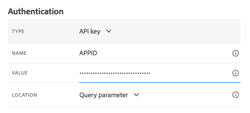
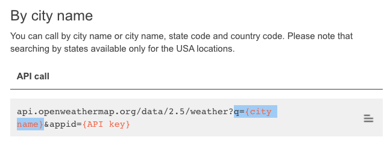
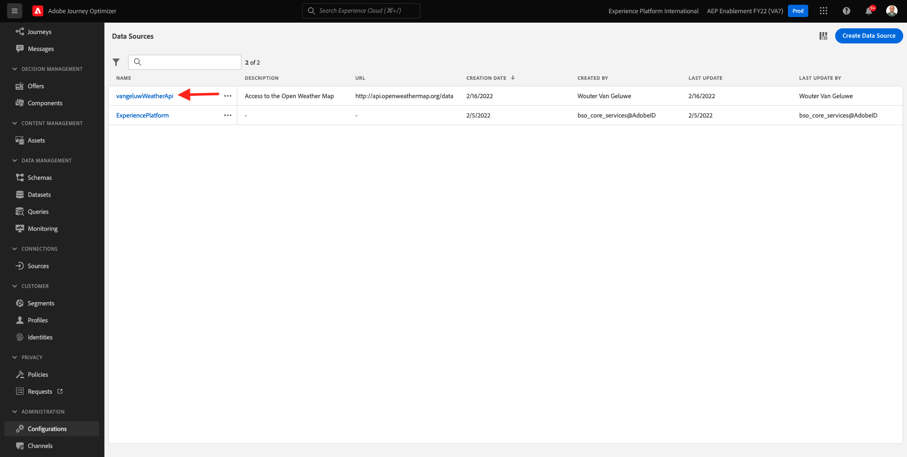

# 8.2 Definire un’origine dati esterna

In questo esercizio creerai un’origine dati esterna personalizzata utilizzando Adobe Journey Optimizer.

Accedi a Adobe Journey Optimizer accedendo a [Adobe Experience Cloud](https://experience.adobe.com). Fai clic su **Journey Optimizer**.


Verrai reindirizzato al **Pagina principale**  in Journey Optimizer. In primo luogo, assicurati di utilizzare la sandbox corretta. La sandbox da utilizzare è denominata `--aepSandboxId--`. Per passare da una sandbox all’altra, fai clic su **PROD DI PRODUZIONE (VA7)** e selezionate la sandbox dall’elenco. In questo esempio, la sandbox è denominata **Abilitazione AEP FY22**. Allora sarai nel **Pagina principale** visualizzazione della sandbox `--aepSandboxId--`.


Nel menu a sinistra, scorri verso il basso e fai clic su **Configurazioni**. Fai clic su **Gestisci** pulsante sotto **Origini dati**.


Vedrai il **Origini dati** elenco.
Fai clic su **Crea origine dati** per iniziare ad aggiungere l’origine dati.


Verrà visualizzato un popup per l&#39;origine dati vuota.


Prima di iniziare la configurazione, è necessario un account con **Mappa meteo aperta** servizio. Segui questi passaggi per creare il tuo account e ottenere la tua chiave API.

Vai a [https://openweathermap.org/](https://openweathermap.org/). Nella home page, fai clic su **Accesso**.


Fai clic su **Creare un account**.



Compila i dettagli.


Fai clic su **Crea account**.


Verrai quindi reindirizzato alla pagina dell’account.


Nel menu , fai clic su **Chiavi API** per recuperare la chiave API, che dovrai impostare l’origine dati esterna personalizzata.


Un **Chiave API** si presenta così: `b2c4c36b6bb59c3458d6686b05311dc3`.

È possibile trovare le **Documentazione API** per **Tempo attuale** [qui](https://openweathermap.org/current).

Nel nostro caso d’uso, implementeremo la connessione con Open Weather Map basata sulla città in cui si trova il cliente.


Torna a **Adobe Journey Optimizer**, al tuo vuoto **Origine dati esterna** popup.


Come nome per l’origine dati, utilizza `--demoProfileLdap--WeatherApi`. In questo esempio, il Nome origine dati è `vangeluwWeatherApi `.

Imposta descrizione su: `Access to the Open Weather Map`.

L’URL dell’API Open Weather Map è: **http://api.openweathermap.org/data/2.5/weather?units=metric**


Quindi, devi selezionare l&#39;autenticazione da utilizzare.

Utilizza queste variabili:

| Campo | Valore |
|:-----------------------:| :-----------------------|
| Tipo | **API key** |
| Nome | **APPID** |
| Valore | **la chiave API** |
| Posizione | **Parametro query** |



Infine, devi definire un **FieldGroup**, che è fondamentalmente la richiesta che invierai all’API Meteo. Nel nostro caso, vogliamo usare il nome della Città per richiedere il Tempo Corrente per quella Città.


In base alla documentazione sulle API meteo, dobbiamo inviare un parametro `q=City`.



Per soddisfare la richiesta API prevista, configura il tuo FieldGroup come segue:

>[!IMPORTANT]
>
>Il nome del gruppo di campi deve essere univoco. Utilizza questa convenzione di denominazione: `--demoProfileLdap--WeatherByCity` in questo caso, il nome deve essere `vangeluwWeatherByCity`


Per il payload di risposta, devi incollare un esempio della risposta che verrà inviata dall’API Meteo.

Puoi trovare la risposta API JSON prevista nella pagina Documentazione API . [qui](https://openweathermap.org/current).


Oppure puoi copiare la risposta JSON da qui:

```json
{"coord": { "lon": 139,"lat": 35},
  "weather": [
    {
      "id": 800,
      "main": "Clear",
      "description": "clear sky",
      "icon": "01n"
    }
  ],
  "base": "stations",
  "main": {
    "temp": 281.52,
    "feels_like": 278.99,
    "temp_min": 280.15,
    "temp_max": 283.71,
    "pressure": 1016,
    "humidity": 93
  },
  "wind": {
    "speed": 0.47,
    "deg": 107.538
  },
  "clouds": {
    "all": 2
  },
  "dt": 1560350192,
  "sys": {
    "type": 3,
    "id": 2019346,
    "message": 0.0065,
    "country": "JP",
    "sunrise": 1560281377,
    "sunset": 1560333478
  },
  "timezone": 32400,
  "id": 1851632,
  "name": "Shuzenji",
  "cod": 200
}
```

Copia la risposta JSON di cui sopra negli Appunti, quindi vai alla schermata di configurazione dell’origine dati personalizzata.

Fai clic sul pulsante **Modifica payload** icona.


Viene visualizzata una finestra a comparsa in cui è ora necessario incollare la risposta JSON di cui sopra.


Incolla la tua risposta JSON, dopodiché visualizzerai questa. Fai clic su **Salva**.


La configurazione dell’origine dati personalizzata è ora completa. Scorri verso l’alto e fai clic su **Salva**.


L&#39;origine dati è stata creata correttamente e fa parte del **Origini dati** elenco.



Passaggio successivo: [8.3 Definire un’azione personalizzata](./ex3.md)

[Torna al modulo 8](journey-orchestration-external-weather-api-sms.md)

[Torna a tutti i moduli](../../overview.md)
