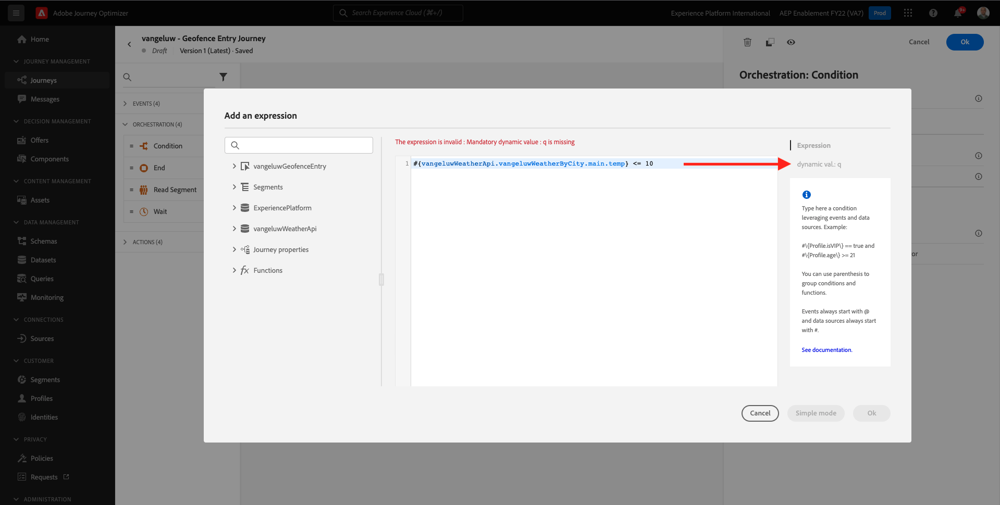
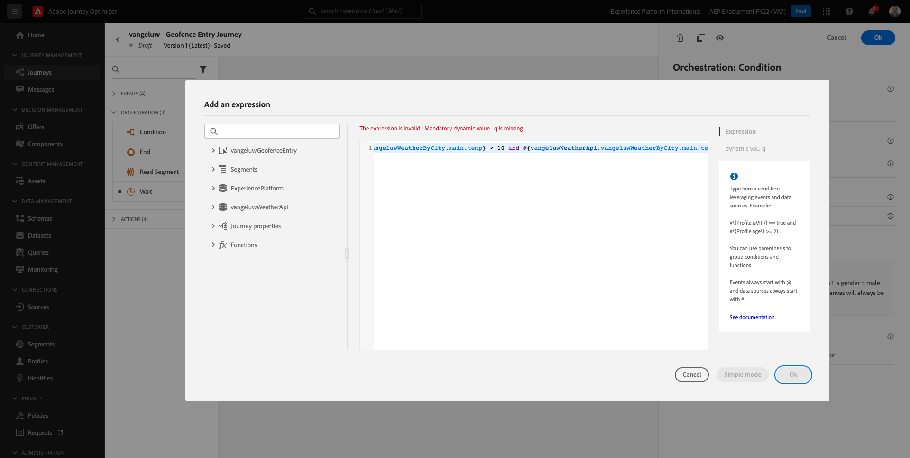
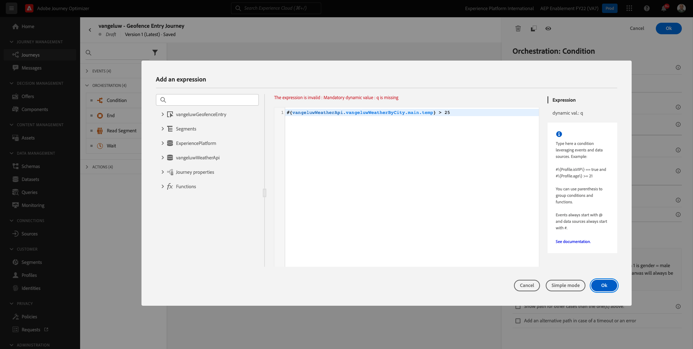
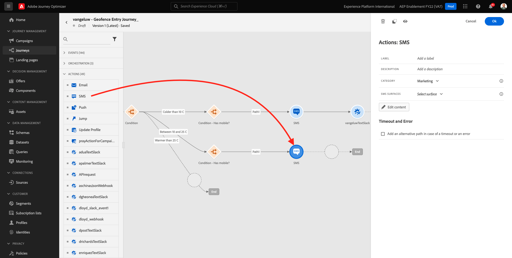
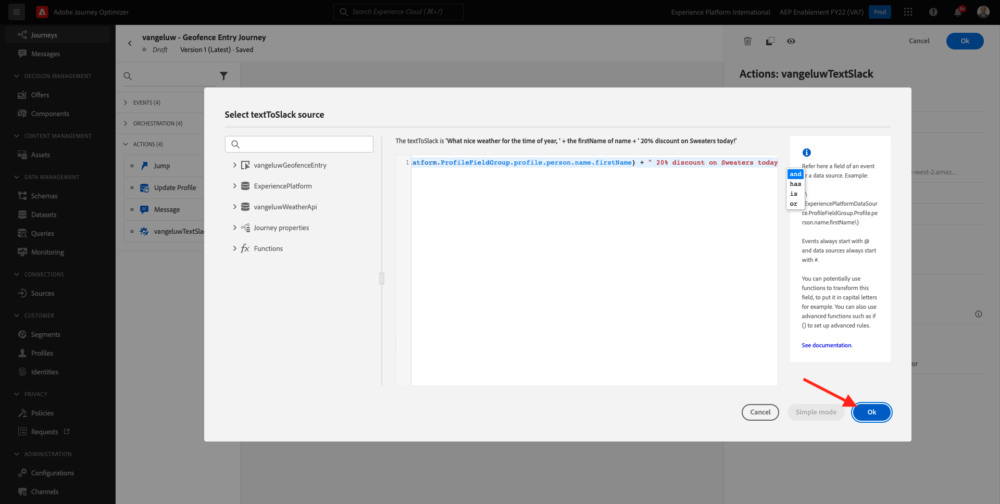
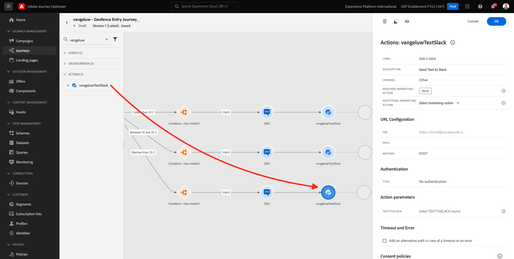
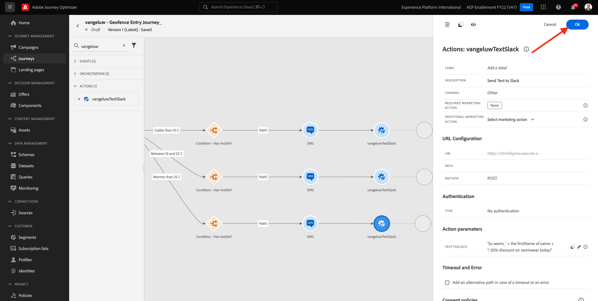

# 8.4 Creare percorsi e messaggi

In questo esercizio, potrai creare un percorso e diversi messaggi di testo utilizzando Adobe Journey Optimizer.

Per questo caso d’uso, l’obiettivo è quello di inviare diversi messaggi SMS in base alle condizioni meteo della posizione del cliente. Sono stati definiti 3 scenari:

- Più freddo di 10° Celsius
- Tra 10° e 25° Celsius
- Più caldo di 25° Celsius

Per queste 3 condizioni, dovrai definire 3 messaggi SMS in Adobe Journey Optimizer.

## 8.4.1 Crea il tuo percorso

Accedi a Adobe Journey Optimizer accedendo a [Adobe Experience Cloud](https://experience.adobe.com). Fai clic su **Journey Optimizer**.


Verrai reindirizzato al **Pagina principale**  in Journey Optimizer. In primo luogo, assicurati di utilizzare la sandbox corretta. La sandbox da utilizzare è denominata `--aepSandboxId--`. Per passare da una sandbox all’altra, fai clic su **PROD DI PRODUZIONE (VA7)** e selezionate la sandbox dall’elenco. In questo esempio, la sandbox è denominata **Abilitazione AEP FY22**. Allora sarai nel **Pagina principale** visualizzazione della sandbox `--aepSandboxId--`.


Nel menu a sinistra, vai a **Percorsi** e fai clic su **Crea Percorso** per iniziare a creare il Percorso.


Dovresti dare un nome al tuo percorso.

Come nome per il percorso, utilizza `--demoProfileLdap-- - Geofence Entry Journey`. In questo esempio, il nome del percorso è `vangeluw - Geofence Entry Journey`. Nessun altro valore deve essere impostato in questo momento. Fai clic su **OK**.


Sul lato sinistro dello schermo, guarda **Eventi**. Dovresti visualizzare l’evento creato in precedenza in tale elenco. Selezionala, quindi trascinala sull’area di lavoro del percorso. Il tuo percorso assomiglia a questo. Fai clic su **Ok**.


Fai clic su **Orchestrazione**. Ora è disponibile la **Orchestrazione** funzionalità. Seleziona **Condizione**, quindi trascinarlo sull&#39;area di lavoro del Percorso.


È ora necessario definire tre condizioni:

- Fa più freddo di 10° Celsius
- È tra 10° e 25° Celsius
- Fa più caldo di 25° Celsius

Definiamo la prima condizione.

### Condizione 1: Più freddo di 10° Celsius

Fai clic sul pulsante **Condizione**.  Fai clic su **Percorso1** e modificare il nome del percorso **Più freddo di 10 C**. Fai clic sul pulsante **Modifica** per l&#39;espressione di Path1.


Verrà visualizzato un vuoto **Editor semplice** schermo. La query sarà un po&#39; più avanzata, quindi avrai bisogno della **Modalità avanzata**. Fai clic su **Modalità avanzata**.


Vedrai il **Editor avanzato** che consente l&#39;immissione del codice.


Seleziona il codice seguente e incollalo nel **Editor avanzato**.

`#{--demoProfileLdap--WeatherApi.--demoProfileLdap--WeatherByCity.main.temp} <= 10`

Vedrete questo.


Per recuperare la temperatura come parte di questa condizione, è necessario fornire la città in cui il cliente è attualmente.
La **Città** deve essere collegato al parametro dinamico `q`, proprio come abbiamo visto in precedenza nella Documentazione API di Open Weather.

Fai clic sul campo **val dinamico: q** come indicato nello screenshot.



È quindi necessario trovare il campo che contiene la città corrente del cliente in una delle origini dati disponibili.


Per trovare il campo, vai a `--demoProfileLdap--GeofenceEntry.placeContext.geo.city`.

Facendo clic su tale campo, verrà aggiunto come valore dinamico per il parametro `q`. Questo campo verrà compilato, ad esempio, dal servizio di geolocalizzazione implementato nella tua app mobile. Nel nostro caso simuleremo questo con l&#39;admin console del sito web demo. Fai clic su **OK**.


### Condizione 2: Tra 10° e 25° Celsius

Dopo aver aggiunto la prima condizione, visualizzerai questa schermata. Fai clic su **Aggiungi percorso**.


Fai doppio clic su **Percorso1** e modifica il nome del percorso in **Tra 10 e 25 C**. Fai clic sul pulsante **Modifica** per l&#39;espressione questo percorso.


Verrà visualizzato un vuoto **Editor semplice** schermo. La query sarà un po&#39; più avanzata, quindi avrai bisogno della **Modalità avanzata**. Fai clic su **Modalità avanzata**.


Vedrai il **Editor avanzato** che consente l&#39;immissione del codice.


Seleziona il codice seguente e incollalo nel **Editor avanzato**.

`#{--demoProfileLdap--WeatherApi.--demoProfileLdap--WeatherByCity.main.temp} > 10 and #{--demoProfileLdap--WeatherApi.--demoProfileLdap--WeatherByCity.main.temp} <= 25`

Vedrete questo.



Per recuperare la temperatura come parte di questa condizione, è necessario fornire la città in cui il cliente è attualmente.
La **Città** deve essere collegato al parametro dinamico **q**, proprio come abbiamo visto in precedenza nella Documentazione API di Open Weather.

Fai clic sul campo **val dinamico: q** come indicato nello screenshot.


È quindi necessario trovare il campo che contiene la città corrente del cliente in una delle origini dati disponibili.


Per trovare il campo, vai a `--demoProfileLdap--GeofenceEntry.placeContext.geo.city`. Facendo clic su tale campo, verrà aggiunto come valore dinamico per il parametro **q**. Questo campo verrà compilato, ad esempio, dal servizio di geolocalizzazione implementato nella tua app mobile. Nel nostro caso simuleremo questo con l&#39;admin console del sito web demo. Fai clic su **OK**.


Quindi, aggiungi la terza condizione.

### Condizione 3: Più caldo di 25° Celsius

Dopo aver aggiunto la seconda condizione, verrà visualizzata questa schermata. Fai clic su **Aggiungi percorso**.


Fare doppio clic su Path1 per modificare il nome in **Più caldo di 25 C**.
Quindi fai clic sul pulsante **Modifica** per l&#39;espressione questo percorso.


Verrà visualizzato un vuoto **Editor semplice** schermo. La query sarà un po&#39; più avanzata, quindi avrai bisogno della **Modalità avanzata**. Fai clic su **Modalità avanzata**.


Vedrai il **Editor avanzato** che consente l&#39;immissione del codice.


Seleziona il codice seguente e incollalo nel **Editor avanzato**.

`#{--demoProfileLdap--WeatherApi.--demoProfileLdap--WeatherByCity.main.temp} > 25`

Vedrete questo.



Per recuperare la temperatura come parte di questa condizione, è necessario fornire la città in cui il cliente è attualmente.
La **Città** deve essere collegato al parametro dinamico **q**, proprio come abbiamo visto in precedenza nella Documentazione API di Open Weather.

Fai clic sul campo **val dinamico: q** come indicato nello screenshot.


È quindi necessario trovare il campo che contiene la città corrente del cliente in una delle origini dati disponibili.


Per trovare il campo, vai a ```--demoProfileLdap--GeofenceEntry.placeContext.geo.city```. Facendo clic su tale campo, verrà aggiunto come valore dinamico per il parametro **q**. Questo campo verrà compilato, ad esempio, dal servizio di geolocalizzazione implementato nella tua app mobile. Nel nostro caso simuleremo questo con l&#39;admin console del sito web demo. Fai clic su **OK**.


Ora disponi di tre percorsi configurati. Fai clic su **Ok**.


Poiché si tratta di un percorso per scopi di apprendimento, ora configureremo un paio di azioni per mostrare la varietà di opzioni che gli addetti al marketing devono ora distribuire.

## 8.4.2 Inviare messaggi per il percorso: Più freddo di 10° Celsius

Per ogni contesto di temperatura, cercheremo di inviare un messaggio di testo al nostro cliente. Possiamo inviare un messaggio di testo solo se disponiamo di un numero di cellulare disponibile per un cliente, quindi dobbiamo prima verificare di sì.

Concentriamoci su **Più freddo di 10 C**.


Prendiamo un altro **Condizione** e trascinalo come indicato nella schermata sottostante. Verificheremo se per questo cliente è disponibile un numero di cellulare.


Ad esempio, stiamo configurando l’opzione solo se il cliente dispone di un numero di cellulare. Aggiungi un’etichetta di **Ha il cellulare?**.

Fai clic sul pulsante **Modifica** per l&#39;icona Espressione per la **Percorso1** percorso.


Nelle Origini dati visualizzate a sinistra, passa a **ExperiencePlatform.ProfileFieldGroup.profile.mobilePhone.number**. Stai leggendo il numero di cellulare direttamente dal Profilo del cliente in tempo reale di Adobe Experience Platform.


Selezionare il campo **Numero**, quindi trascinarlo nell’area di lavoro Condizione.

Selezionare l’operatore **non è vuoto**. Fai clic su **Ok**.


Vedrete questo. Fai clic su **OK** di nuovo.


Il tuo percorso sarà così. Fai clic su **Azioni** come indicato nello screenshot.


Seleziona l’azione **SMS**, quindi trascinalo e rilascialo dopo la condizione appena aggiunta.


Imposta la **Categoria** a **Marketing** e seleziona una superficie SMS che ti consente di inviare SMS. In questo caso, la superficie dell’e-mail da selezionare è **SMS**.


Il passaggio successivo consiste nel creare il messaggio. A tale scopo, fai clic su **Modifica contenuto**.


Ora visualizzi il dashboard dei messaggi, in cui puoi configurare il testo dell’SMS. Fai clic sul pulsante **Componi messaggio** area per creare il messaggio.


Inserisci il seguente testo: `Brrrr... {{profile.person.name.firstName}}, it's freezing. 20% discount on jackets today!`. Fai clic su **Salva**.


Vedrete questo. Fai clic sulla freccia nell&#39;angolo in alto a sinistra per tornare al percorso.


Allora tornerai qui. Fai clic su **Ok**.


Nel menu a sinistra, torna a **Azioni**, seleziona Azione `--demoProfileLdap--TextSlack`, quindi trascinalo e rilascialo dopo il **Messaggio** azione.


Vai a **Parametri azione** e fai clic su **Modifica** Icona del parametro `TEXTTOSLACK`.


Nella finestra a comparsa, fai clic su **Modalità avanzata**.


Seleziona il codice seguente, copialo e incollalo nel **Editor modalità avanzata**. Fai clic su **Ok**.

`"Brrrr..." + #{ExperiencePlatform.ProfileFieldGroup.profile.person.name.firstName} + " It's freezing. 20% discount on Jackets today!"`


Verrà visualizzata l&#39;azione completata. Fai clic su **Ok**.


Questo percorso del percorso è ora pronto.

## 8.4.3 Inviare messaggi per il percorso: Tra 10° e 25° Celsius

Per ogni contesto di temperatura, cercheremo di inviare un messaggio di testo al nostro cliente. Possiamo inviare un messaggio di testo solo se disponiamo di un numero di cellulare disponibile per un cliente, quindi dobbiamo prima verificare di sì.

Concentriamoci su **Tra 10 e 25 C** percorso.


Prendiamo un altro **Condizione** e trascinalo come indicato nella schermata sottostante. Verificheremo se per questo cliente è disponibile un numero di cellulare.


Ad esempio, stiamo configurando l’opzione solo se il cliente dispone di un numero di cellulare. Aggiungi un’etichetta di **Ha il cellulare?**.

Fai clic sul pulsante **Modifica** per l&#39;icona Espressione per la **Percorso1** percorso.


Nelle Origini dati visualizzate a sinistra, passa a **ExperiencePlatform.ProfileFieldGroup.profile.mobilePhone.number**. Stai leggendo il numero di cellulare direttamente dal Profilo del cliente in tempo reale di Adobe Experience Platform.


Selezionare il campo **Numero**, quindi trascinarlo nell’area di lavoro Condizione.

Selezionare l’operatore **non è vuoto**. Fai clic su **Ok**.


Vedrete questo. Fai clic su **Ok**.


Il tuo percorso sarà così. Fai clic su **Azioni** come indicato nello screenshot.


Seleziona l’azione **SMS**, quindi trascinalo e rilascialo dopo la condizione appena aggiunta.



Imposta la **Categoria** a **Marketing** e seleziona una superficie SMS che ti consente di inviare SMS. In questo caso, la superficie dell’e-mail da selezionare è **SMS**.


Il passaggio successivo consiste nel creare il messaggio. A tale scopo, fai clic su **Modifica contenuto**.


Ora visualizzi il dashboard dei messaggi, in cui puoi configurare il testo dell’SMS. Fai clic sul pulsante **Componi messaggio** area per creare il messaggio.


Inserisci il seguente testo: `What a nice weather for the time of year, {{profile.person.name.firstName}} - 20% discount on Sweaters today!`. Fai clic su **Salva**.


Vedrete questo. Fai clic sulla freccia nell&#39;angolo in alto a sinistra per tornare al percorso.


Ora vedrai l&#39;azione completata. Fai clic su **Ok**.


Nel menu a sinistra, torna a **Azioni**, seleziona Azione `--demoProfileLdap--TextSlack`, quindi trascinalo e rilascialo dopo il **Messaggio** azione.


Vai a **Parametri azione** e fai clic su **Modifica** Icona del parametro `TEXTTOSLACK`.


Nella finestra a comparsa, fai clic su **Modalità avanzata**.


Seleziona il codice seguente, copialo e incollalo nel **Editor modalità avanzata**. Fai clic su **Ok**.

`"What nice weather for the time of year, " + #{ExperiencePlatform.ProfileFieldGroup.profile.person.name.firstName} + " 20% discount on Sweaters today!"`



Verrà visualizzata l&#39;azione completata. Fai clic su **Ok**.


Questo percorso del percorso è ora pronto.

## 8.4.4 Inviare messaggi per il percorso: Più caldo di 25° Celsius

Per ogni contesto di temperatura, cercheremo di inviare un messaggio di testo al nostro cliente. Possiamo inviare un messaggio di testo solo se disponiamo di un numero di cellulare disponibile per un cliente, quindi dobbiamo prima verificare di sì.

Concentriamoci su **Più caldo di 25 C** percorso.


Prendiamo un altro **Condizione** e trascinalo come indicato nella schermata sottostante. Verificherai se per questo cliente è disponibile un numero di cellulare.


Ad esempio, stiamo configurando l’opzione solo se il cliente dispone di un numero di cellulare. Aggiungi un’etichetta di **Ha il cellulare?**.

Fai clic sul pulsante **Modifica** per l&#39;icona Espressione per la **Percorso1** percorso.


Nelle Origini dati visualizzate a sinistra, passa a **ExperiencePlatform.ProfileFieldGroup.profile.mobilePhone.number**. Stai leggendo il numero di cellulare direttamente dal Profilo del cliente in tempo reale di Adobe Experience Platform.


Selezionare il campo **Numero**, quindi trascinarlo nell’area di lavoro Condizione.

Selezionare l’operatore **non è vuoto**. Fai clic su **Ok**.


Vedrete questo. Fai clic su **OK**.


Il tuo percorso sarà così. Fai clic su **Azioni** come indicato nello screenshot.


Seleziona l’azione **SMS**, quindi trascinalo e rilascialo dopo la condizione appena aggiunta.


Imposta la **Categoria** a **Marketing** e seleziona una superficie SMS che ti consente di inviare SMS. In questo caso, la superficie dell’e-mail da selezionare è **SMS**.


Il passaggio successivo consiste nel creare il messaggio. A tale scopo, fai clic su **Modifica contenuto**.


Ora visualizzi il dashboard dei messaggi, in cui puoi configurare il testo dell’SMS. Fai clic sul pulsante **Componi messaggio** area per creare il messaggio.


Inserisci il seguente testo: `So warm, {{profile.person.name.firstName}}! 20% discount on swimwear today!`. Fai clic su **Salva**.


Vedrete questo. Fai clic sulla freccia nell&#39;angolo in alto a sinistra per tornare al percorso.


Ora vedrai l&#39;azione completata. Fai clic su **Ok**.


Nel menu a sinistra, torna a **Azioni**, seleziona Azione `--demoProfileLdap--TextSlack`, quindi trascinalo e rilascialo dopo il **Messaggi** azione.



Vai a **Parametri azione** e fai clic su **Modifica** Icona del parametro `TEXTTOSLACK`.


Nella finestra a comparsa, fai clic su **Modalità avanzata**.


Seleziona il codice seguente, copialo e incollalo nel **Editor modalità avanzata**. Fai clic su **Ok**.

`"So warm, " + #{ExperiencePlatform.ProfileFieldGroup.profile.person.name.firstName} + "! 20% discount on swimwear today!"`


Verrà visualizzata l&#39;azione completata. Fai clic su **Ok**.



Questo percorso del percorso è ora pronto.

## 8.4.5 Pubblica il tuo percorso

Il percorso è ora completamente configurato. Fai clic su **Pubblica**.


Fai clic su **Pubblica** di nuovo.


Il percorso è ora pubblicato.


Passaggio successivo: [8.5 Attiva il tuo percorso](./ex5.md)

[Torna al modulo 8](journey-orchestration-external-weather-api-sms.md)

[Torna a tutti i moduli](../../overview.md)
