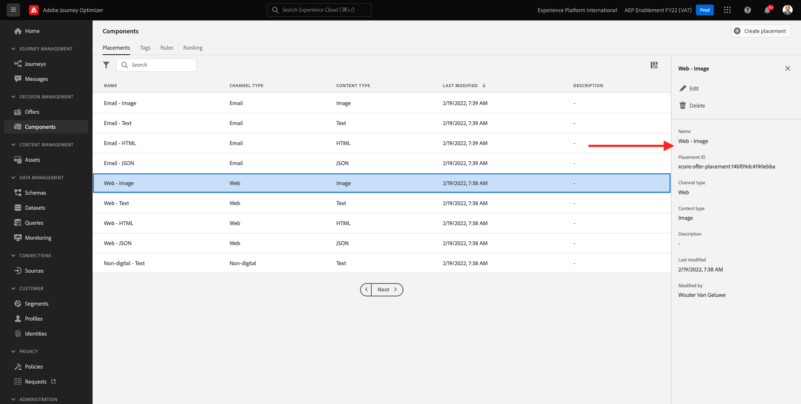

# 9.1 Offer decisioning 101

## 9.1.1 Terminologia

Per comprendere meglio l’Offer decisioning, ti consigliamo vivamente di leggere il [panoramica](https://experienceleague.adobe.com/docs/journey-optimizer/using/offer-decisioniong/get-started-decision/starting-offer-decisioning.html?lang=en) su come funziona Offer Decisioning Application Service con Adobe Experience Platform.

Offer decisioning:

| Termine | Spiegazione |
| ------------------------- | -------------------------------------------------------------------------------------------------------------------------------------------------------------------------------------------------------------------------------------------------------- |
| **Nome** | Un’offerta è un messaggio di marketing a cui possono essere associate regole che specificano gli utenti idonei per visualizzare l’offerta. Un&#39;offerta ha uno stato: progetto, approvato o archiviato. |
| **Posizionamento** | La combinazione di posizione (o tipo di canale) e contesto (o tipo di contenuto) in cui viene visualizzata un’offerta per un utente finale. In effetti è la combinazione di Text, HTML, Image, JSON in Mobile, Web, Social, Instant Messaging e canali non digitali. |
| **Regola** | La logica che definisce e controlla l’idoneità degli utenti finali per un’offerta. |
| **Offerta personalizzata** | Un messaggio di marketing personalizzabile basato su regole e vincoli di idoneità. |
| **Offerta di fallback** | L’offerta predefinita visualizzata quando un utente finale non è idoneo per nessuna delle offerte della raccolta utilizzata. |
| **Limitazione** | Utilizzato in una definizione di offerta per definire quante volte può essere presentata un’offerta in totale e a un utente specifico. |
| **Priorità** | Livello per determinare il livello di priorità da un set di risultati di offerte. |
| **Raccolta** | Utilizzato per filtrare un sottoinsieme di offerte dall’elenco di offerte personalizzate per velocizzare il processo di offer decisioning. |
| **Decisione** | Una combinazione di un insieme di offerte, posizionamento e profilo a cui l’addetto al marketing desidera che il motore decisionale fornisca l’offerta migliore. |
| **AEM Assets Essentials** | Un’esperienza universale e centralizzata per l’archiviazione, la ricerca e la selezione delle risorse nelle soluzioni Adobe Experience Cloud e Adobe Experience Platform. |

{style=&quot;table-layout:auto&quot;}

## 9.1.2 Offer decisioning

Accedi a Adobe Journey Optimizer accedendo a [Adobe Experience Cloud](https://experience.adobe.com). Fai clic su **Journey Optimizer**.

Verrai reindirizzato al **Pagina principale**  in Journey Optimizer. In primo luogo, assicurati di utilizzare la sandbox corretta. La sandbox da utilizzare è denominata `--aepSandboxId--`. Per passare da una sandbox all’altra, fai clic su **PROD DI PRODUZIONE (VA7)** e selezionate la sandbox dall’elenco. In questo esempio, la sandbox è denominata **Abilitazione AEP FY22**. Allora sarai nel **Pagina principale** visualizzazione della sandbox `--aepSandboxId--`.

Nel menu a sinistra, fai clic su **Offerte**. Verrà ora visualizzato il menu Offerte , che contiene elementi come Offerte, Raccolte e Decisioni.

Fai clic su **Componenti**. Verrà ora visualizzato il menu Offerte, che contiene elementi come Posizionamenti, Tag, Regole e Classificazioni.

## 9.1.3 Posizionamenti

Vai a **Posizionamenti**.

In **Posizionamenti** Puoi definire i posizionamenti per le offerte. Quando definisci una decisione, il posizionamento definisce dove verrà visualizzata l’offerta risultante (Tipo di canale) e in quale forma o forma (Tipo di contenuto).

Se non trovi posizionamenti nella tua istanza Adobe Experience Platform, creali come indicato di seguito e nella schermata .

| Nome | Tipo di canale | Tipo di contenuto |
| ---------------------- | ------------ | ------------ |
| **Non digitale - Testo** | Non digitale | Testo |
| **Web - JSON** | Web | JSON |
| **Web - HTML** | Web | HTML |
| **Web - Testo** | Web | Testo |
| **Web - Immagine** | Web | Immagine |
| **E-mail - JSON** | E-mail | JSON |
| **E-mail - HTML** | E-mail | HTML |
| **E-mail - Testo** | E-mail | Testo |
| **E-mail - Immagine** | E-mail | Immagine |

{style=&quot;table-layout:auto&quot;}

**Nota**: Non modificare nulla dei posizionamenti già disponibili.

Fai clic su un posizionamento per visualizzarne le impostazioni.

Verranno visualizzati tutti i campi del Posizionamento:

- **Nome** del posizionamento
- **ID posizionamento**
- **Tipo di canale** per il posizionamento
- **Tipo di contenuto** del posizionamento, che può essere **Testo**, **HTML**, **Immagine** o **JSON**
- **Descrizione** campo che consente di aggiungere una descrizione aggiuntiva per il posizionamento

## 9.1.4 Norme decisionali

Una regola (detta anche regola di ammissibilità) è equivalente a una **Segmento**. Una regola è infatti un segmento stesso con l’unica differenza che una regola può essere utilizzata con un’offerta per fornire l’offerta migliore a un profilo in Adobe Experience Platform.

Come già sai definire i segmenti in base ai moduli di abilitazione precedenti, rivediamo rapidamente l’ambiente di segmentazione:

Vai a **Regole**. Fai clic su **+ Crea regola**.

Viene quindi visualizzato l’ambiente di segmentazione di Adobe Experience Platform.

Ora puoi accedere a tutti i campi che fanno parte dello schema dell’Unione per il profilo cliente in tempo reale e generare qualsiasi regola.

È anche interessante sapere che è possibile riutilizzare semplicemente segmenti già definiti in Adobe Experience Platform, andando **Tipi di pubblico** > ``--aepTenantIdSchema--``.

Vedrai questo:

Se lo desideri, ora puoi configurare le tue Regole. Per questo esercizio, sono necessarie due regole:

- all - Clienti maschili
- all - Clienti femminili

Se queste regole non esistono ancora, createle. Se esistono già, utilizza queste regole e non creare nuove regole.

L&#39;attributo da utilizzare per generare la regola è **Profilo individuale XDM** > **Persona** > **Genere**.

Ad esempio, ecco la definizione della regola **all - Clienti maschili**:

Ad esempio, ecco la definizione della regola **all - Clienti femminili**:

## 9.1.5 Offerte

Vai a **Offerte** e seleziona **Offerte**. Fai clic su **+ Crea offerta**.

Vedrete questa finestra a comparsa.

Non creare offerte ora - lo farai nel prossimo esercizio.

Ora sono disponibili due tipi di offerte:

- Offerte personalizzate
- Offerte di fallback

Un’offerta personalizzata è un contenuto specifico che deve essere mostrato in una situazione specifica. Un’offerta personalizzata è creata appositamente per fornire un’esperienza personale e contestuale se vengono soddisfatti criteri specifici.

Un’offerta di fallback è un’offerta che viene visualizzata se i criteri per le offerte personalizzate non sono soddisfatti.

## 9.1.6 Decisioni

Una decisione combina posizionamenti, una raccolta di offerte personalizzate e un’offerta di fallback da utilizzare in ultima analisi dal motore di Offer decisioning per trovare l’offerta migliore per un profilo specifico, in base a ciascuna delle singole caratteristiche di offerta personalizzata come priorità, vincolo di idoneità e limite totale/utente.

Per configurare le **Decisione**, fai clic su **Decisioni**.

Nel prossimo esercizio configurerai le tue offerte e decisioni.

Passaggio successivo: [9.2 Configurare le offerte e le decisioni](./ex2.md)

[Torna al modulo 9](./offer-decisioning.md)

[Torna a tutti i moduli](./../../overview.md)
