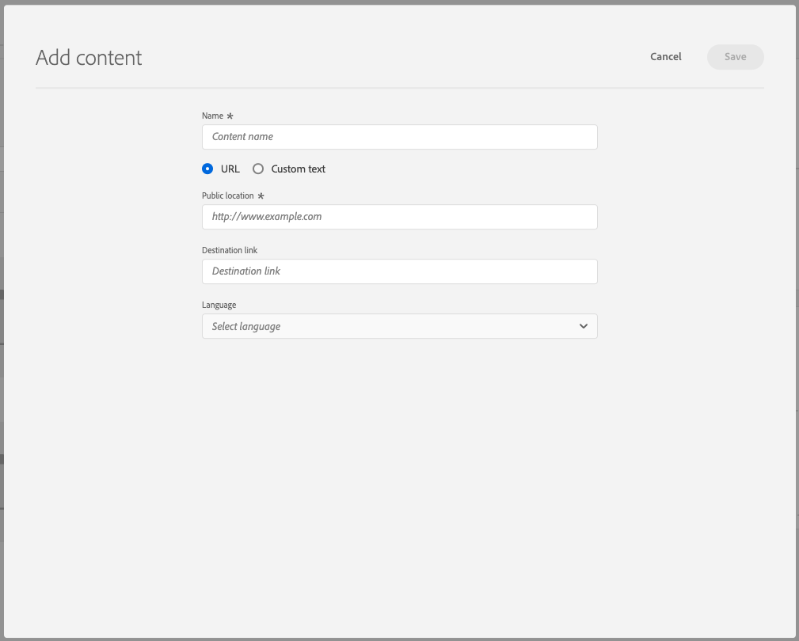
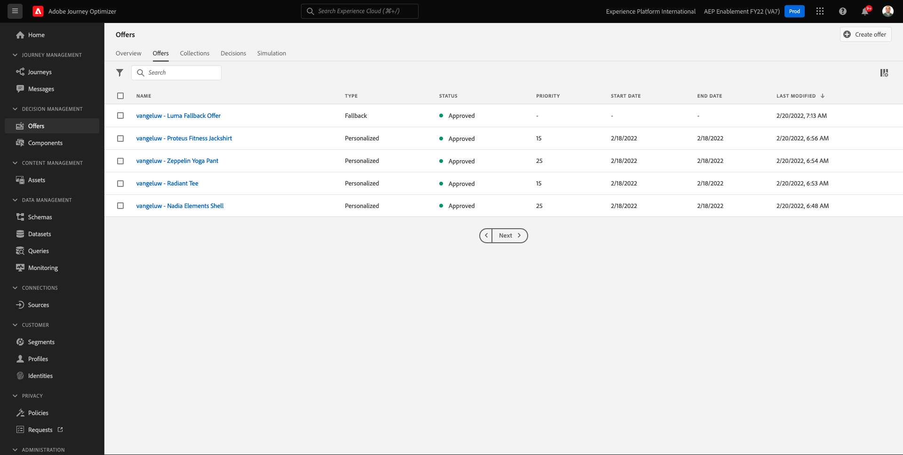

# 9.2 Configurare le offerte e le decisioni

## 9.2.1 Creare offerte personalizzate

In questo esercizio, ne creerai quattro **Offerte personalizzate**. Di seguito sono riportati i dettagli da tenere in considerazione durante la creazione di tali offerte:

| Nome | Date Range | Collegamento immagine per e-mail | Collegamento immagine per web | Testo | Priorità | Ammissibilità | Lingua |
|-----|------------|----------------------|--------------------|------|:--------:|--------------|:-------:|
| `--demoProfileLdap-- - Nadia Elements Shell` | oggi - 1 mese dopo | https://bit.ly/3nPiwdZ | https://bit.ly/2INwXjt | `{{ profile.person.name.firstName }}, 10% discount on Nadia Elements Shell` | 25 | all - Clienti femminili | Inglese (Stati Uniti) |
| `--demoProfileLdap-- - Radiant Tee` | oggi - 1 mese dopo | https://bit.ly/2HfA17v | https://bit.ly/3pEIdzn | `{{ profile.person.name.firstName }}, 5% discount on Radiant Tee` | 15 | all - Clienti femminili | Inglese (Stati Uniti) |
| `--demoProfileLdap-- - Zeppelin Yoga Pant` | oggi - 1 mese dopo | https://bit.ly/2IOaItW | https://bit.ly/2INZHZd | `{{ profile.person.name.firstName }}, 10% discount on Zeppelin Yoga Pant` | 25 | all - Clienti maschili | Inglese (Stati Uniti) |
| `--demoProfileLdap-- - Proteus Fitness Jackshirt` | oggi - 1 mese dopo | https://bit.ly/330a43n | https://bit.ly/36USaQW | `{{ profile.person.name.firstName }}, 5% discount on Proteus Fitness Jackshirt` | 15 | all - Clienti maschili | Inglese (Stati Uniti) |

{style=&quot;table-layout:auto&quot;}

Accedi a Adobe Journey Optimizer accedendo a [Adobe Experience Cloud](https://experience.adobe.com). Fai clic su **Journey Optimizer**.

Verrai reindirizzato al **Pagina principale**  in Journey Optimizer. In primo luogo, assicurati di utilizzare la sandbox corretta. La sandbox da utilizzare è denominata `--aepSandboxId--`. Per passare da una sandbox all’altra, fai clic su **PROD DI PRODUZIONE (VA7)** e selezionate la sandbox dall’elenco. In questo esempio, la sandbox è denominata **Abilitazione AEP FY22**. Allora sarai nel **Pagina principale** visualizzazione della sandbox `--aepSandboxId--`.

Nel menu a sinistra, fai clic su **Offerte** e poi vai a **Offerte**. Fai clic su **+ Crea offerta**.

Vedrete questa finestra a comparsa. Seleziona **Offerta personalizzata** e fai clic su **Successivo**.

Ora sei sul **Dettagli** visualizza.

In questo caso, devi configurare l’offerta `--demoProfileLdap-- - Nadia Elements Shell`. Utilizza le informazioni nella tabella precedente per compilare i campi. In questo esempio, il nome dell’offerta personalizzata è **vangeluw - Nadia Elements Shell**. Inoltre, imposta la **Data e ora di inizio** a ieri e imposta il **Data e ora di fine** a una data tra un mese.

Una volta fatto, dovreste avere questo. Fai clic su **Avanti**.

Ora devi creare **Rappresentazioni**. Le rappresentazioni sono una combinazione di un **Posizionamento** e una risorsa reale.

Per **Rappresentazione 1**, seleziona:

- Canale: Web
- Posizionamento: Web - Immagine
- Contenuto: URL
- Posizione pubblica: copia l’URL dalla colonna **Collegamento immagine per web** nella tabella precedente

In alternativa, è possibile selezionare **Libreria risorse** per il contenuto, quindi fai clic su **Sfoglia**.

Verrà visualizzata una finestra a comparsa della libreria Risorse, vai alla cartella . **enablement-assets** e seleziona il file di immagine **nadia-web.png**. Quindi, fai clic su **Seleziona**.

Vedrai questo:

Fai clic su **+ Aggiungi rappresentanza**.

Per **Rappresentazione 2**, seleziona:

- Canale: E-mail
- Posizionamento: E-mail - Immagine
- Contenuto: URL
- Posizione pubblica: copia l’URL dalla colonna **Collegamento immagine per e-mail** nella tabella precedente

In alternativa, è possibile selezionare **Libreria risorse** per il contenuto, quindi fai clic su **Sfoglia**.

Verrà visualizzata una finestra a comparsa della libreria Risorse, vai alla cartella . **enablement-assets** e seleziona il file di immagine **nadia-email.png**. Quindi, fai clic su **Seleziona**.

Vedrai questo:

Quindi, fai clic su **+ Aggiungi rappresentazione**.

Per **Rappresentazione 3**, seleziona:

- Canale: Non digitale
- Posizionamento: Non digitale - Testo

Quindi, devi aggiungere del contenuto. In questo caso, significa aggiungere il testo da utilizzare come invito all’azione.

Fai clic su **Aggiungi contenuto**.

Vedrete questa finestra a comparsa.

Seleziona **Testo personalizzato** e compilare i seguenti campi:

Guarda il **Testo** campo della tabella precedente e inserisci il testo qui, in questo caso: `{{ profile.person.name.firstName }}, 10% discount on Nadia Elements Shell`.

Noterai inoltre che puoi selezionare qualsiasi attributo di profilo e includerlo come campo dinamico nel testo dell’offerta. In questo esempio, il campo `{{ profile.person.name.firstName }}` farà in modo che il nome del cliente che riceverà l’offerta venga incluso nel testo dell’offerta.

Vedrete questo. Fai clic su **Salva**.

Ora avete questo. Fai clic su **Avanti**.

Vedrai questo:

Seleziona **Per regola decisionale definita** e fai clic su **+** icona per aggiungere la regola **all - Clienti femminili**.

Vedrete questo. Compila il **Priorità** come indicato nella tabella precedente. Fai clic su **Avanti**.

Viene visualizzata una panoramica del nuovo **Offerta personalizzata**.

Infine, fai clic su **Salva e approva**.

Potrai quindi vedere l’offerta personalizzata appena creata diventare disponibile nella Panoramica delle offerte:

È ora necessario ripetere i passaggi precedenti per creare le altre tre offerte personalizzate per i prodotti Tee radiante, Zeppelin Yoga Pant e Proteus Fitness Jackshirt.

Al termine, il tuo **Panoramica dell’offerta** schermo per **Offerte personalizzate** dovrebbe mostrare tutte le tue offerte.

## 9.2.2 Creare l&#39;offerta di fallback

Dopo aver creato quattro offerte personalizzate, ora devi configurare un **Offerta di fallback**.

Assicurati di essere nel **Offerte** visualizza:

Fai clic su **+ Crea offerta**.

Vedrete questa finestra a comparsa. Seleziona **Offerta di fallback** e fai clic su **Successivo**.

Vedrai questo:

Immetti questo nome per la tua offerta di fallback: `--demoProfileLdap-- - Luma Fallback Offer`. Fai clic su **Avanti**.

Ora devi creare **Rappresentazioni**. Le rappresentazioni sono una combinazione di un **Posizionamento** e una risorsa reale.

Per **Rappresentazione 1**, seleziona:

- Canale: Web
- Posizionamento: Web - Immagine
- Contenuto: URL
- Posizione pubblica: `https://bit.ly/3nBOt9h`

In alternativa, è possibile selezionare **Libreria risorse** per il contenuto, quindi fai clic su **Sfoglia**.

Verrà visualizzata una finestra a comparsa della libreria Risorse, vai alla cartella . **enablement-assets** e seleziona il file di immagine **spriteyogastraps-web.png**. Quindi, fai clic su **Seleziona**.

Vedrai questo:

Per **Rappresentazione 2**, seleziona:

- Canale: E-mail
- Posizionamento: E-mail - Immagine
- Contenuto: URL
- Posizione pubblica: `https://bit.ly/3nF4qvE`

In alternativa, è possibile selezionare **Libreria risorse** per il contenuto, quindi fai clic su **Sfoglia**.

Verrà visualizzata una finestra a comparsa della libreria Risorse, vai alla cartella . **enablement-assets** e seleziona il file di immagine **spriteyogastraps-email.png**. Quindi, fai clic su **Seleziona**.

Vedrai questo:

Quindi, fai clic su **+ Aggiungi rappresentazione**.

Per **Rappresentazione 3**, seleziona:

- Canale: Non digitale
- Posizionamento: Non digitale - Testo

Quindi, devi aggiungere del contenuto. In questo caso, significa aggiungere il collegamento immagine.

Fai clic su **Aggiungi contenuto**.

Vedrete questa finestra a comparsa.

Seleziona **Testo personalizzato** e compilare i seguenti campi:

Inserisci il testo `{{ profile.person.name.firstName }}, discover our Sprite Yoga Straps!` e fai clic su **Salva**.

Vedrete questo. Fai clic su **Avanti**.

Viene visualizzata una panoramica del nuovo **Offerta di fallback**. Fai clic su **Fine**.

Infine, fai clic su **Salva e approva**.

Nel tuo **Panoramica dell’offerta** a questo punto verrà visualizzato questo:

## 9.2.3 Creare la raccolta

Una raccolta viene utilizzata per **filter** crea un sottoinsieme di offerte dall’elenco delle offerte personalizzate e utilizzalo come parte di una decisione per accelerare il processo decisionale.

Vai a **Raccolte**. Fai clic su **+ Crea raccolta**.

Poi vedrete questa finestra a comparsa. Configura la raccolta in questo modo. Fai clic su **Avanti**.

- Nome raccolta: use `--demoProfileLdap-- - Luma Collection`
- Seleziona **Creare una raccolta statica**.

Nella schermata successiva, seleziona i quattro **Offerte personalizzate** creato nell&#39;esercizio precedente. Fai clic su **Salva**.

Ora verrà visualizzato questo:

## 9.2.4 Crea la tua decisione

Una decisione combina Posizionamenti, una Raccolta di Offerte personalizzate e un’Offerta di fallback da utilizzare in ultima analisi dal motore di Offer decisioning per trovare l’offerta migliore per un profilo specifico, in base a ciascuna delle singole caratteristiche di offerta personalizzata come priorità, vincolo di idoneità e limite totale/utente.

Per configurare le **Decisione**, vai a **Decisioni**. Fai clic su **+ Crea attività**.

Vedrai questo:

Compila i campi come questo. Fai clic su **Avanti**.

- Nome: `--demoProfileLdap-- - Luma Decision`
- Data e ora di inizio: ieri
- Data e ora di fine: oggi + 1 mese

Nella schermata successiva, è necessario aggiungere posizionamenti negli ambiti decisionali. Sarà necessario creare ambiti decisionali per i posizionamenti **Web - Immagine**, **E-mail - Immagine** e **Non digitale - Testo**.

In primo luogo, crea il campo di applicazione della decisione per **Non digitale - Testo** selezionando tale posizione nel menu a discesa . Quindi, fai clic sul pulsante **Aggiungi** per aggiungere criteri di valutazione.

Seleziona la raccolta `--demoProfileLdap-- - Luma Collection` e fai clic su **Aggiungi**.

Vedrete questo. Fai clic sul pulsante **-** per aggiungere un nuovo ambito decisionale.

Selezionare il posizionamento **Web - Immagine** e aggiungi la tua raccolta `--demoProfileLdap-- - Luma Collection` in base ai criteri di valutazione. Quindi, fai clic sul pulsante **+** per aggiungere un nuovo ambito decisionale.

Selezionare il posizionamento **E-mail - Immagine** e aggiungi la tua raccolta `--demoProfileLdap-- - Luma Collection` in base ai criteri di valutazione. Quindi, fai clic su **Successivo**.

Ora devi selezionare il tuo **Offerta di fallback**, denominato `--demoProfileLdap-- - Luma Fallback Offer`. Fai clic su **Avanti**.

Rivedi la tua decisione. Fai clic su **Fine**.

Nella finestra a comparsa, fai clic su **Salva e attiva**.

Infine, vedrai la tua decisione nella panoramica:

La decisione è stata configurata correttamente. La tua decisione è ora live e può essere utilizzata per fornire offerte ottimizzate e personalizzate ai tuoi clienti in tempo reale.

Passaggio successivo: [9.3 Prepara ad Offer decisioning la proprietà del client di raccolta dati e la configurazione dell&#39;SDK per web](./ex3.md)

[Torna al modulo 9](./offer-decisioning.md)

[Torna a tutti i moduli](./../../overview.md)
