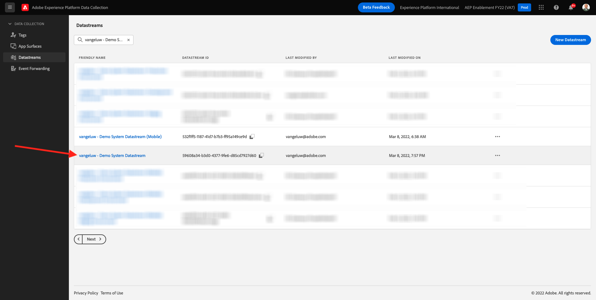
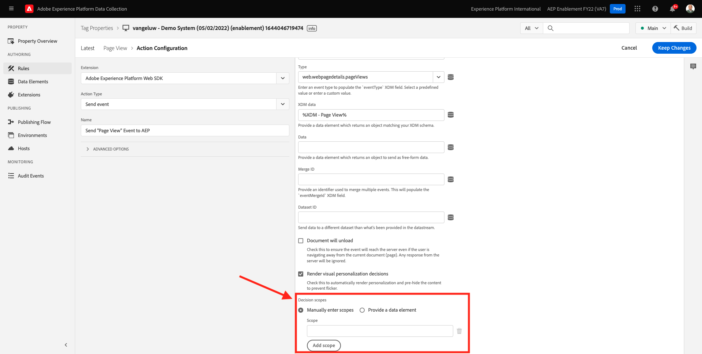
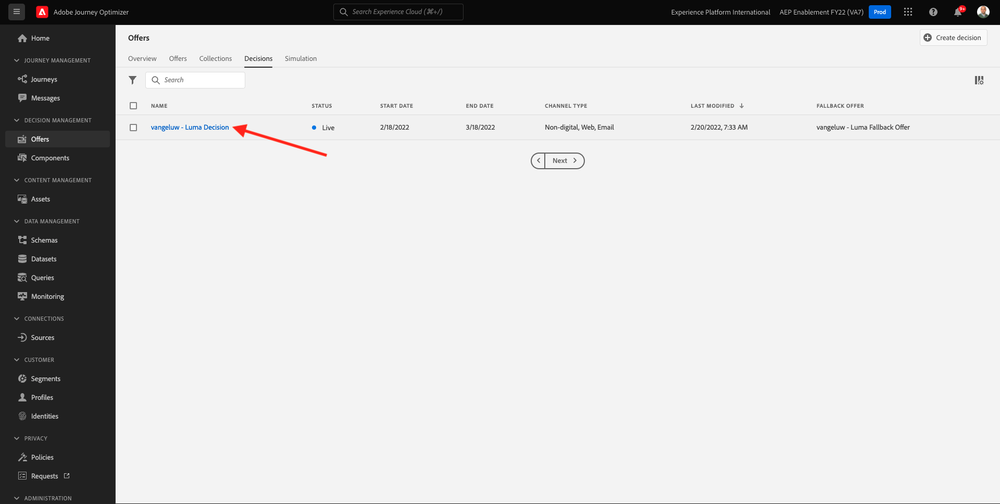
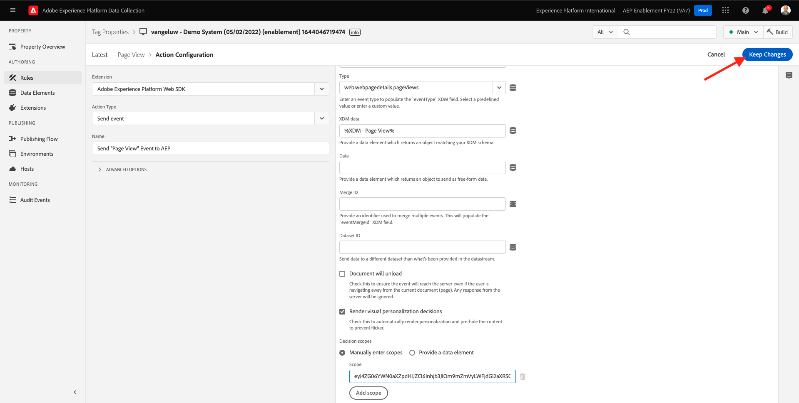

# 9.3 Prepara ad Offer decisioning la proprietà client di raccolta dati di Adobe Experience Platform e la configurazione dell&#39;SDK per web

>[!NOTE]
>
>L’utilizzo di Offer Decisioning in Adobe Experience Platform Web SDK è attualmente disponibile in fase di accesso anticipato a determinati utenti. Questa funzionalità non è disponibile per tutte le organizzazioni IMS.

## 9.3.1 Aggiorna il tuo Datastream

In [Esercizio 0.2](./../../modules/module0/ex2.md), hai creato il tuo **[!UICONTROL Datastream]**. Hai quindi utilizzato il nome `--demoProfileLdap-- - Demo System Datastream`.

In questo esercizio, devi configurare che **[!UICONTROL Datastream]** per lavorare con **[!DNL Offer Decisioning]**.

Per farlo, vai a [https://experience.adobe.com/#/data-collection/](https://experience.adobe.com/#/data-collection/). Vedrete questo. Fai clic su **[!UICONTROL Datastreams]** o **[!UICONTROL Datastreams (Beta)]**.

Nell’angolo in alto a destra dello schermo, seleziona il nome della sandbox, che deve essere `--aepSandboxId--`.


Cerca il tuo **[!UICONTROL Datastream]**, denominato `--demoProfileLdap-- - Demo System Datastream`. Fai clic su **[!UICONTROL Datastream]** per aprirlo.



Vedrete questo. Fai clic su **...** accanto a **Adobe Experience Platform** quindi fai clic su **Modifica**.


Per abilitare **[!DNL Offer Decisioning]**, seleziona la casella per **[!DNL Offer Decisioning]**. Fai clic su **Salva**.


Le **[!UICONTROL Datastream]** è ora pronto per lavorare con **[!DNL Offer Decisioning]**.


## 9.3.2 Configura la proprietà client di raccolta dati di Adobe Experience Platform per richiedere offerte personalizzate

Vai a [https://experience.adobe.com/#/data-collection/](https://experience.adobe.com/#/data-collection/), a **[!UICONTROL Client]**. Cerca le proprietà di raccolta dati, denominate `--demoProfileLdap-- - Demo System (DD/MM/YYYY)`. Apri la proprietà del client di raccolta dati per il Web.


Nella tua proprietà, vai a **[!UICONTROL Regole]** e apri la regola **[!UICONTROL Visualizzazione a pagina]**.


Fai clic per aprire [!UICONTROL Azione] **[!UICONTROL AEP Web SDK - Evento di invio]**.


Vedrete questo. Noterai l&#39;opzione di menu per **[!UICONTROL Ambiti decisionali]**.



Per ogni richiesta inviata al server Edge e a Adobe Experience Platform, è possibile fornire uno o più **[!UICONTROL Ambiti decisionali]**. A **[!UICONTROL Campo di applicazione della decisione]** è una combinazione di due elementi:

- [!UICONTROL ID decisione]
- [!UICONTROL ID posizionamento]

Diamo un&#39;occhiata dove potete trovare questi due elementi.

### 9.3.2.1 Recupera il tuo [!UICONTROL ID posizionamento]

La [!UICONTROL ID posizionamento] identifica la posizione e il tipo di risorsa richiesti. Ad esempio, l’immagine protagonista nella home page del sito web Luma corrisponde alla [!UICONTROL ID posizionamento] per [!UICONTROL Web - Immagine].

>[!NOTE]
>
>Come parte del modulo 6, hai già configurato un’attività di targeting delle esperienze Adobe Target che cambierà l’immagine della posizione dell’eroe sulla homepage, come puoi vedere nella schermata . Per l&#39;esercizio, ora farà apparire le tue offerte sull&#39;immagine sotto l&#39;immagine protagonista come indicato nello screenshot.


Per trovare il [!UICONTROL ID posizionamento] per [!UICONTROL Web - Immagine] vai su Adobe Journey Optimizer andando a [Adobe Experience Cloud](https://experience.adobe.com). Fai clic su **Journey Optimizer**.


Verrai reindirizzato al **Pagina principale**  in Journey Optimizer. In primo luogo, assicurati di utilizzare la sandbox corretta. La sandbox da utilizzare è denominata `--aepSandboxId--`. Per passare da una sandbox all’altra, fai clic su **PROD DI PRODUZIONE (VA7)** e selezionate la sandbox dall’elenco. In questo esempio, la sandbox è denominata **Abilitazione AEP FY22**. Allora sarai nel **Pagina principale** visualizzazione della sandbox `--aepSandboxId--`.


Quindi, vai a [!UICONTROL Componenti] e poi a [!UICONTROL Posizionamenti]. Fai clic sul pulsante [!UICONTROL Web - Immagine] posizionamento per visualizzarne i dettagli.


Come puoi vedere nell’immagine precedente, in questo esempio il [!UICONTROL ID posizionamento] è `xcore:offer-placement:14bf09dc4190ebba`. Annota la [!UICONTROL ID posizionamento] per il tuo posizionamento [!UICONTROL Web - Immagine] come ne avrete bisogno nel prossimo esercizio.

### 9.3.2.2 Recupera il tuo [!UICONTROL ID decisione]

La [!UICONTROL ID decisione] identifica la combinazione di Offerte personalizzate e Offerte di fallback che desideri utilizzare. Nell’esercizio precedente, hai creato la tua [!UICONTROL Decisione] e lo ha chiamato `--demoProfileLdap-- - Luma Decision`.

Per trovare il [!UICONTROL ID decisione] per `--demoProfileLdap-- - Luma Decision`, vai a [https://platform.adobe.com](https://platform.adobe.com).

Quindi, vai a [!UICONTROL Offerte] e poi vai a [!UICONTROL Decisioni]. Fai clic per selezionare il tuo [!UICONTROL Decisione], denominato `--demoProfileLdap-- - Luma Decision`.


Come puoi vedere nell’immagine precedente, in questo esempio il [!UICONTROL ID decisione] è `xcore:offer-activity:14c052382e1b6505`. Annota la [!UICONTROL ID decisione] per la vostra decisione `--demoProfileLdap-- - Luma Decision` come ne avrete bisogno nel prossimo esercizio.

Ora che hai recuperato i due elementi necessari per creare un **[!UICONTROL Ambiti decisionali]**, puoi continuare con il passaggio successivo, che comporta la codifica dell’ambito decisionale.

### Codifica 9.3.2.3 BASE64

La **[!UICONTROL Campo di applicazione della decisione]** è necessario immettere una stringa codificata BASE64. Questa stringa codificata BASE64 è una combinazione della [!UICONTROL ID posizionamento] e [!UICONTROL ID decisione], come potete vedere di seguito.

```json
{
  "activityId":"xcore:offer-activity:14c052382e1b6505",
  "placementId":"xcore:offer-placement:14bf09dc4190ebba"
}
```

La **[!UICONTROL Campo di applicazione della decisione]** può essere generato in due modi:

- Utilizzare un servizio pubblico come [https://www.base64encode.org/](https://www.base64encode.org/). Immetti il codice JSON come menzionato sopra, fai clic su **[!UICONTROL Codifica]** e otterrai la tua stringa codificata BASE64 qui sotto.

   

- Recupera la stringa codificata BASE64 da Adobe Experience Platform. Vai a [!UICONTROL Decisioni] e fai clic su per aprire [!UICONTROL Decisione], denominato `--demoProfileLdap-- - Luma Decision`.

   

   Dopo l&#39;apertura `--demoProfileLdap-- - Luma Decision`Lo vedrete. Individua il posizionamento [!UICONTROL Web - Immagine] e fai clic su **[!UICONTROL Copia]** pulsante . Quindi, fai clic su **[!UICONTROL Ambito della decisione codificato]**. La **[!UICONTROL Campo di applicazione della decisione]** viene ora copiato negli Appunti.

   

Quindi, torna a Launch, alla tua azione **[!UICONTROL AEP Web SDK - Evento di invio]**.


Incolla l’ambito decisionale codificato nel campo di input.


Salva le modifiche nell’azione. **[!UICONTROL AEP Web SDK - Evento di invio]** facendo clic su **[!UICONTROL Mantieni modifiche]**.



Quindi, fai clic su **[!UICONTROL Salva]** o **[!UICONTROL Salva nella libreria]**


In Raccolta dati di Adobe Experience Platform, vai a **[!UICONTROL Flusso di pubblicazione]** e aprire il **[!UICONTROL Libreria di sviluppo]** denominato **[!UICONTROL Principale]**. Fai clic su **[!UICONTROL + Aggiungi tutte le risorse modificate]** quindi fai clic su **[!UICONTROL Salva e genera per sviluppo]**. Le modifiche verranno ora pubblicate sul sito web demo.


Ogni volta che carichi un **Pagina Generale** ora, come per esempio la homepage del sito web demo, Offer Decisioning valuterà quale sia l&#39;offerta applicabile e restituirà una risposta al sito web con i dettagli dell&#39;offerta da mostrare. La visualizzazione dell’offerta sul sito web richiede una configurazione aggiuntiva, che eseguirai nel passaggio successivo.

## 9.3.3 Configura la proprietà client di raccolta dati di Adobe Experience Platform per ricevere e applicare offerte personalizzate

Vai a [https://experience.adobe.com/#/data-collection/](https://experience.adobe.com/#/data-collection/), a **[!UICONTROL Proprietà]**. Cerca le proprietà di raccolta dati, denominate `--demoProfileLdap-- - Demo System (DD/MM/YYYY)`. Apri la proprietà Raccolta dati per il Web.


Nella tua proprietà, vai a **[!UICONTROL Regole]**.


Cerca e apri la regola **Decisione ricevuta**.


Vedrete questo. Apri l’azione . **Posiziona l’offerta sulla pagina**.


Fai clic su **[!UICONTROL Apri editor]**


Sovrascrivi il codice incollando il codice seguente nell&#39;editor.

```javascript
if(!Array.isArray(event.decisions)) {
  console.log('No decisions returned')
  return;
}
console.log("decision",event.decisions)

event.decisions.forEach(function(payload) {
  payload.items.forEach(function(item){
    console.log("Response from Offer Decisioning ", item.data.content);
   
    var element = document.querySelector("#root > div > div > div.app-content > div > section.feature_part.padding_top > div > div.row.align-items-center.justify-content-between > div.col-lg-7.col-sm-6.\\30  > div");
    if(!element){
      console.log("Offer Placement Area Selector not found")
      return;
    }
    if(!item.data){
      return
    }
    //check if offer already exists
    var offer = document.querySelector("#root > div > div > div.app-content > div > section.feature_part.padding_top > div > div.row.align-items-center.justify-content-between > div.col-lg-7.col-sm-6.\\30  > div");
    if(!offer){ 
      element.insertAdjacentHTML('afterbegin', item.data.content) 
    }
    else { 
      console.log("item.data.deliveryURL: " + item.data.deliveryURL)
      document.querySelector("#root > div > div > div.app-content > div > section.feature_part.padding_top > div > div.row.align-items-center.justify-content-between > div.col-lg-7.col-sm-6.\\30  > div").style.background="url('"+item.data.deliveryURL+"')";
      document.querySelector("#root > div > div > div.app-content > div > section.feature_part.padding_top > div > div.row.align-items-center.justify-content-between > div.col-lg-7.col-sm-6.\\30  > div").style.backgroundRepeat="no-repeat";
      document.querySelector("#root > div > div > div.app-content > div > section.feature_part.padding_top > div > div.row.align-items-center.justify-content-between > div.col-lg-7.col-sm-6.\\30  > div").style.backgroundPosition="center center";
      document.querySelector("#root > div > div > div.app-content > div > section.feature_part.padding_top > div > div.row.align-items-center.justify-content-between > div.col-lg-7.col-sm-6.\\30  > div").style.backgroundSize = "contain";
    }  
  })
});
```

Le linee 26-27-28-29 applicheranno al sito web l&#39;immagine restituita dall&#39;Offer decisioning. Fai clic su **[!UICONTROL Salva]**.


Fai clic su **[!UICONTROL Mantieni modifiche]**.


Quindi, fai clic su **[!UICONTROL Salva]** o **[!UICONTROL Salva nella libreria]**


In Raccolta dati di Adobe Experience Platform, vai a **[!UICONTROL Flusso di pubblicazione]** e aprire il **[!UICONTROL Libreria di sviluppo]** denominato **[!UICONTROL Principale]**. Fai clic su **[!UICONTROL + Aggiungi tutte le risorse modificate]** quindi fai clic su **[!UICONTROL Salva e genera per sviluppo]**. Le modifiche verranno ora pubblicate sul sito web demo.


Con questa modifica, questa regola in Adobe Experience Platform Data Collection sarà in ascolto della risposta dell’Offer decisioning che fa parte della risposta dell’SDK per web e, quando la risposta viene ricevuta, l’immagine dell’offerta verrà visualizzata nella home page.

Osservando il sito web dimostrativo, vedrai che questa immagine verrà sostituita ora:

>[!NOTE]
>
>Come parte del modulo 6, hai già configurato un’attività di targeting delle esperienze Adobe Target che cambierà l’immagine della posizione dell’eroe sulla homepage, come puoi vedere nella schermata . Per l&#39;esercizio, ora farà apparire le tue offerte sull&#39;immagine sotto l&#39;immagine protagonista come indicato nello screenshot.


E invece delle immagini predefinite del sito web Luma, ora vedrai un&#39;offerta come questa. In questo caso, viene visualizzata l’offerta di fallback.


Ora hai configurato 2 tipi di personalizzazione:

- 1 Attività di targeting delle esperienze con Adobe Target nel modulo 6
- 1 Implementazione di Offer decisioning tramite la proprietà Raccolta dati

Nel prossimo esercizio vedrai come combinare le offerte e le decisioni create in Adobe Journey Optimizer con un’attività di targeting delle esperienze Adobe Target.

Passaggio successivo: [9.4 Combinare Adobe Target e Offer Decisioning](./ex4.md)

[Torna al modulo 9](./offer-decisioning.md)

[Torna a tutti i moduli](./../../overview.md)
