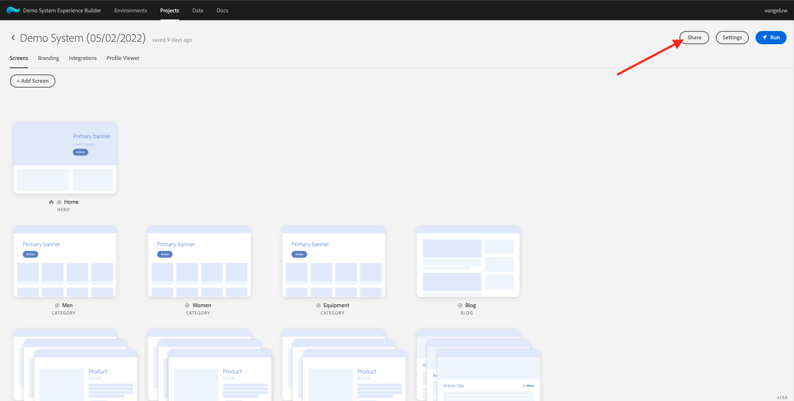
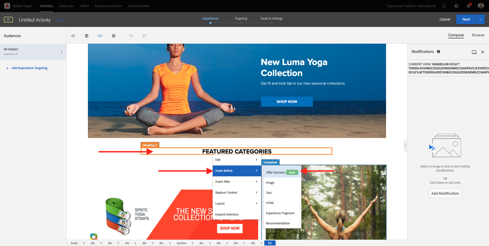
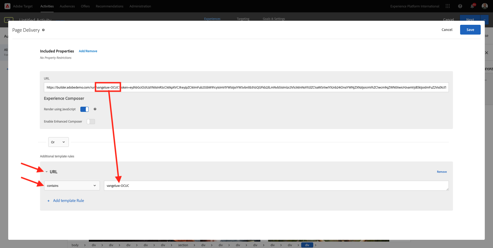

# 9.4 Combinare Adobe Target e Offer Decisioning

## 9.4.1 Raccogli il collegamento condivisibile del progetto demo

Per caricare il progetto del sito web demo in Adobe Target, devi prima raccogliere un collegamento speciale che consentirà ad Adobe Target di caricare il progetto del sito web demo.

Per farlo, vai a [https://builder.adobedemo.com/projects](https://builder.adobedemo.com/projects). Dopo aver effettuato l’accesso con il tuo Adobe ID, vedrai questo. Fai clic sul progetto del tuo sito web per aprirlo.

Ora vedrete questo. Fai clic su **Condividi**.

Fai clic su **Genera collegamento** quindi copia il collegamento negli Appunti.

Vai a [https://bitly.com](https://bitly.com), incolla il collegamento copiato e fai clic su **Abbrevia**. Ora riceverai un collegamento abbreviato, simile al seguente: `https://bit.ly/3JxN7aG`. Sarà necessario quel collegamento nel prossimo esercizio.

## 9.4.2 Raccolta

Ora vai alla home page di Adobe Experience Cloud andando a [https://experiencecloud.adobe.com/](https://experiencecloud.adobe.com/). Fai clic su **Target**.

Sulla **Adobe Target** nella home page verranno visualizzate tutte le attività esistenti.

Fai clic su **+ Crea attività** per creare una nuova attività.

Seleziona **Targeting esperienza**.

Ora seleziona **Visivo** e incolla il collegamento abbreviato nel campo . **Inserisci URL attività**. Fai clic su **Avanti**.

Il progetto del sito web demo verrà caricato nel Compositore esperienza visivo.

Vai a **Sfoglia** modalità di clic **Consenti tutto** nella finestra a comparsa di consenso cookie.

Fare clic sull&#39;area contenente il testo **Categorie supportate**. Fai clic su **Inserisci prima** quindi seleziona **Decisione di offerta**.

Vedrete questa finestra a comparsa. Seleziona la sandbox `--aepSandboxId--` quindi seleziona il posizionamento **Web - Immagine**.

Quindi, seleziona la tua decisione `--demoProfileLdap-- - Luma Decision`. Fai clic su **Salva**.

Vedrete questo. Assicurati di aggiungere una regola di modello aggiuntiva **URL** **contiene** **nome-progetto**. CLick **Salva**.

Vedrete questo. Fai clic su **Avanti**.

Immetti un nome per la tua offerta, usa questo nome: `--demoProfileLdap-- - XT with Offers (VEC)`. Fai clic su **Avanti**.

Vedrete questo. Definisci i **Metrica per obiettivo** come indicato. Fai clic su **Salva e chiudi**.

L’offerta viene ora creata e pubblicata.

Una volta pubblicata l’offerta, puoi abilitarla.

Passaggio successivo: [9.5 Utilizza la tua decisione in un messaggio e-mail e sms](./ex5.md)

[Torna al modulo 9](./offer-decisioning.md)

[Torna a tutti i moduli](./../../overview.md)
