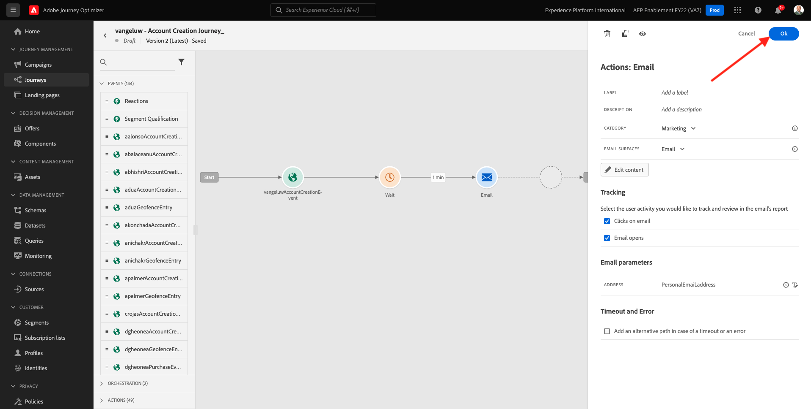

# 9.5 Utilizza la tua decisione in un messaggio e-mail

In questo esercizio, utilizzerai la tua decisione per personalizzare la consegna di un’e-mail e di un SMS.

Vai a **Percorsi**. Trova il percorso creato nell&#39;esercizio 7.2, denominato `--demoProfileLdap-- - Account Creation Journey`. Fai clic sul percorso per aprirlo.

Vedrete questo. Fai clic su **Creare una nuova versione**.

Fai clic su **Creare una nuova versione**.

Fai clic sul pulsante **E-mail** , quindi fai clic su **Modifica contenuto**.

Viene quindi visualizzato il dashboard dei messaggi. Fai clic su **E-mail Designer**.

Vedrete questo.

Vedrete questo. Trascina un nuovo **Colonna 1:1** componente struttura nell’area di lavoro.

Nel menu , vai a **Componenti contenuto**. Seleziona la **Decisione di offerta** , quindi trascina e rilascia questo componente nel segnaposto dell’offerta di contenuti dell’e-mail come indicato. Quindi, fai clic su **Aggiungi**.

Seleziona il tipo di posizionamento da includere nell’e-mail. In **Posizionamenti** menu a discesa, seleziona **E-mail - Immagine**, quindi seleziona la tua decisione `--demoProfileLdap-- - Luma Decision`. Fai clic su **Aggiungi**.

Ora puoi visualizzare tutte le offerte personalizzate e l’offerta di fallback all’interno della finestra di progettazione e-mail. Fai clic su  **Simula contenuto** per visualizzare in anteprima il messaggio e-mail con un profilo cliente reale.

Per iniziare, identifica il profilo da utilizzare per l’anteprima. Seleziona la **email** Inserisci lo spazio dei nomi e l’indirizzo e-mail di un profilo cliente creato sul sito web demo. Quindi, fai clic su **Anteprima**.

Una volta visualizzato il messaggio e-mail e visualizzato correttamente l’offerta, fai clic sul pulsante **Chiudi** pulsante .

Infine, fai clic su **Salva**.

Ora fai clic sulla freccia per tornare alla schermata precedente.

Vedrete questo. Fai clic sulla freccia nell&#39;angolo in alto a sinistra per tornare al percorso.

Fai clic su **Ok** per chiudere **E-mail** azione.

Fai clic su **Pubblica** per pubblicare il percorso aggiornato.

Conferma facendo clic su **Pubblica** di nuovo.

Il messaggio è ora pubblicato.

Quando crei un nuovo account sul sito web demo, riceverai questa e-mail:

Ha finito questo esercizio.

Passaggio successivo: [9.6 Verifica la tua decisione utilizzando l&#39;API](./ex6.md)

[Torna al modulo 9](./offer-decisioning.md)

[Torna a tutti i moduli](./../../overview.md)
