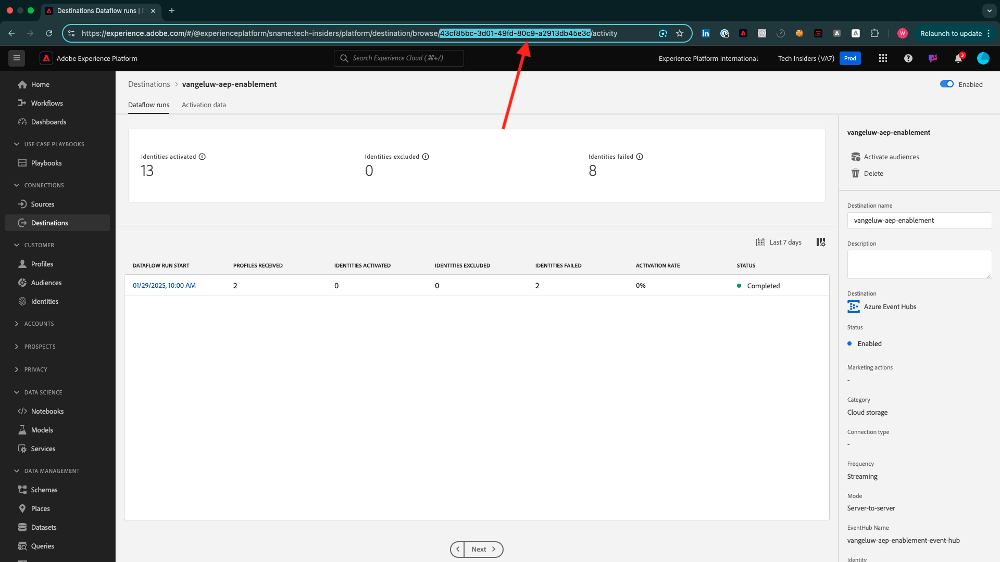

# Come viene misurato il completamento?

Vai a [https://certification.adobe.com](https://certification.adobe.com) e passa al corso **XXX**.

Per completare un modulo, devi fornire una prova di completamento.

Di seguito sono riportate le prove di completamento previste per ogni modulo.

## Guida introduttuva

La prova di completamento prevista per il modulo **Guida introduttiva** è l&#39;ID del progetto Demo System per il Web creato.

L&#39;ID del progetto Demo System per il formato Web è simile al seguente: `--aepUserLdap-- - QIMU`.

## 1.1 Raccolta dati di Adobe Experience Platform ed estensione Web SDK

La prova di completamento prevista per il modulo **Raccolta dati e Web SDK** è il **ID ambiente** della proprietà Raccolta dati per il Web.

L&#39;ID ambiente della proprietà Data Collection per il formato Web è simile al seguente: `EN5211f7792b4442f8a45deb68f8902d3a`.

## 1.2 Acquisizione dei dati

La prova di completamento prevista per il modulo **Acquisizione dati** è l&#39;ID del flusso di dati per la connessione Source Data Landing Zone.

L&#39;ID del flusso di dati è simile al seguente: **374c2c6d-f39a-4b0b-b568-40c41e6c4e8e**.

## 1.3 Federated Audience Composition

La prova di completamento prevista per il modulo **Federated Audience Composition** è l&#39;ID del Federated Data Model creato.

L&#39;ID del Federated Data Model è simile al seguente: **DMO5110** e può essere prelevato dall&#39;URL come indicato nell&#39;immagine seguente.

## 2.1 Profilo cliente in tempo reale

La prova di completamento prevista per il modulo **Profilo cliente in tempo reale** è il **ID pubblico** creato tramite l&#39;interfaccia utente, `--aepUserLdap-- - Male customers with interest in iPhone 15 Pro`.

L&#39;ID pubblico è simile al seguente: **81a9acbe-12e6-424b-b658-abba3a435c83**.

## 2.2 Servizi intelligenti

La prova di completamento prevista per il modulo **Intelligent Services** è il **ID pubblico** creato tramite l&#39;interfaccia utente, `--aepUserLdap-- - Customer AI High Propensity`.

L&#39;ID pubblico è simile al seguente: **cb6db21d-8fa3-484a-93ac-25aa1ab48412**.

## 2.3 Real-Time CDP: Creare un pubblico e agire!

La prova di completamento prevista per il modulo **Real-Time CDP: crea un pubblico e intervieni.** è l&#39;ID della **destinazione del webhook SDK delle destinazioni**.

L&#39;ID della destinazione del webhook è simile al seguente: **b5b4b959-3166-40e2-8279-8223d00c3987** e può essere ricavato dall&#39;URL come indicato nell&#39;immagine seguente.

## 2.4 Real-Time CDP: da Audience Activation a Microsoft Azure Event Hub

La prova di completamento prevista per il modulo **Real-Time CDP: Audience Activation all&#39;hub eventi di Microsoft Azure** è l&#39;ID della destinazione **dell&#39;hub eventi di Microsoft Azure** in Adobe Experience Platform.

È possibile trovare l&#39;**ID destinazione hub eventi di Microsoft Azure**, che ha l&#39;aspetto di questo **43cf85bc-3d01-49fd-80c9-a2913db45e3c**, nell&#39;URL come indicato di seguito:

## 2.5 Connessioni Real-Time CDP: Inoltro eventi

La prova di completamento prevista per il modulo **Connessioni Real-Time CDP: Inoltro eventi** è l&#39;ID **proprietà di inoltro eventi**.

È possibile trovare l&#39;**ID proprietà inoltro eventi**, che ha l&#39;aspetto di questo **PRa18819171c1241dfb16d74a49993dd5b**, nell&#39;URL come indicato nell&#39;immagine seguente:

## 2.6 Trasmettere dati da Apache Kafka a Real-Time CDP

La prova di completamento prevista per il modulo **Trasmetti i dati da Apache Kafka a Real-Time CDP** è l&#39;ID del connettore di origine `--aepUserLdap-- - Kafka`.

L&#39;ID è simile al seguente **f843d50a-ee30-4ca8-a766-0e4f3d29a2f7** ed è disponibile qui:

## 3.1 Adobe Journey Optimizer: Orchestrazione

La prova di completamento prevista per il modulo **Adobe Journey Optimizer: Orchestration** è l&#39;ID del percorso creato.

L&#39;ID del percorso si presenta così, **594fa01f-1a3b-450c-ba09-b7e3ff377c0f**, e può essere preso dall&#39;URL come indicato nell&#39;immagine seguente.

## 3.2 Adobe Journey Optimizer: origini dati esterne e azioni personalizzate

La prova di completamento prevista per il modulo **Adobe Journey Optimizer: origini dati esterne e azioni personalizzate** è l&#39;ID del percorso creato.

L&#39;ID del percorso è simile al seguente: **6962d3bc-4f44-4f9c-b326-83978f245f2a** e può essere ricavato dall&#39;URL come indicato nell&#39;immagine seguente.

## 3.3 Adobe Journey Optimizer: Offer decisioning

La prova di completamento prevista per il modulo **Adobe Journey Optimizer: Offer Decisioning** è l&#39;ID della **decisione** creata.

Puoi trovare l&#39;**ID decisione**, che si presenta così **dps:offer-activity:1a08ba4b529b2fb2**, qui:

## 3.4 Adobe Journey Optimizer: Percorsi basati su eventi

La prova di completamento prevista per il modulo **Adobe Journey Optimizer: Percorsi basati su eventi** è l&#39;ID del percorso creato.

L&#39;ID del percorso è simile al seguente: **5f5efc7e-49f7-44c1-85df-b23482b38d32** e può essere ricavato dall&#39;URL come indicato nell&#39;immagine seguente.

## 4.1 Customer Journey Analytics: creare un dashboard con Analysis Workspace

La prova di completamento prevista per il modulo **Customer Journey Analytics: crea un dashboard con Analysis Workspace** è l&#39;ID del progetto `--aepUserLdap-- - Omnichannel Analysis`.

Il formato è simile al seguente: **677bcb247064db3c7de2a0e4**, è possibile trovarlo nell&#39;URL dopo l&#39;apertura del progetto.

## 4.2 Customer Journey Analytics: inserire e analizzare i dati Google Analytics in Adobe Experience Platform con il connettore Source BigQuery

La prova di completamento prevista per il modulo **Customer Journey Analytics: inserire e analizzare dati di Google Analytics in Adobe Experience Platform con il connettore di Source BigQuery** è l&#39;ID della connessione di origine **BigQuery**.

L&#39;**ID connessione BigQuery**, che ha l&#39;aspetto di questo **b63a810c-a8cc-4c6b-a57e-dcb7e3368cf8**, è disponibile qui:

## 5.1 Servizio query

La prova di completamento prevista per il modulo **Query Service** è l&#39;ID del set di dati per il set di dati `--aepUserLdap--_callcenter_interaction_analysis` ottenuto dopo il completamento del modulo.

L&#39;ID è simile al seguente: **675033c903fb3b2aefed8a0a**.

{width="50px" align="left"}

>[!NOTE]
>
>Se hai domande, vuoi condividere feedback generali su suggerimenti in merito a contenuti futuri, contatta direttamente Tech Insiders, inviando un&#39;e-mail a **techinsiders@adobe.com**.

[Torna a tutti i moduli](./overview.md)