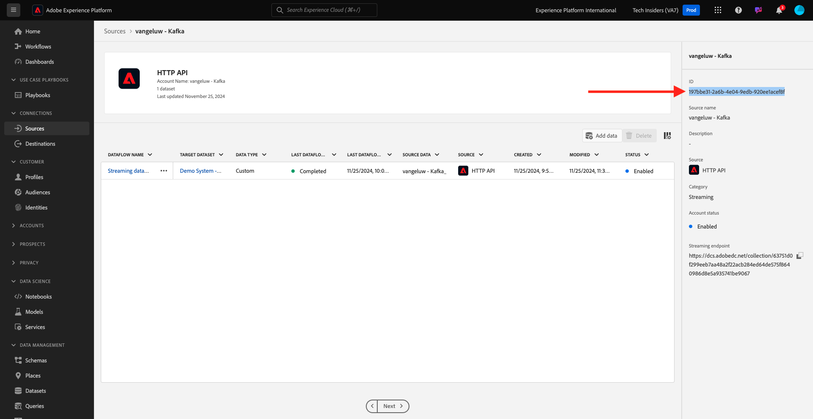

# Come viene misurato il completamento?

Vai a [https://certification.adobe.com](https://certification.adobe.com) e passa al corso **XXX**.

Per completare un modulo, devi fornire una prova di completamento.

Di seguito sono riportate le prove di completamento previste per ogni modulo.

## Guida introduttuva

La prova di completamento prevista per il modulo **Guida introduttiva** è l&#39;ID del progetto Demo System per il Web creato.

L&#39;ID del progetto Demo System per il formato Web è simile al seguente: `--demoProfileLdap-- - OCUC`.

## 1.1 Raccolta dati di Adobe Experience Platform ed estensione Web SDK

La prova di completamento prevista per il modulo **Raccolta dati e Web SDK** è il nome della proprietà Raccolta dati per il Web.

Il nome della proprietà Raccolta dati per il formato Web è simile al seguente: `--demoProfileLdap-- - Demo System (05/02/2022) (enablement) 1644046719474`.

## 1.2 Acquisizione dei dati

La prova di completamento prevista per il modulo **Acquisizione dati** è l&#39;ID del set di dati per i 2 set di dati creati.

Il formato ID del set di dati è simile al seguente: **5f069724723ef41916a8b5d2**.

`--demoProfileLdap-- - Demo System - Event Dataset for Website`

`--demoProfileLdap-- - Demo System - Profile Dataset for Website`

## 1.3 Federated Audience Composition

La prova di completamento prevista per il modulo **Composizione pubblico federato** è...

## 2.1 Profilo cliente in tempo reale

La prova di completamento prevista per il modulo **Profilo cliente in tempo reale** è il **ID segmento** del segmento creato tramite l&#39;interfaccia utente, `--demoProfileLdap-- - Male customers with interest in Montana Wind Jacket`.

Il formato ID segmento è simile al seguente: **8cb7034d-d4ae-4d26-a61f-a76559c12457**.

## 2.2 Servizi intelligenti

La prova di completamento prevista per il modulo **Intelligent Services** è l&#39;ID del **servizio Customer AI propensione all&#39;acquisto del prodotto**.

Il formato è simile al seguente: **12729** ed è possibile recuperarlo dall&#39;URL dopo l&#39;apertura del servizio.

## 2.3 Real-Time CDP: Creare un pubblico e agire!

La prova di completamento prevista per il modulo **Real-Time CDP** è l&#39;ID della tua **attività Adobe Target**.

Il formato è simile al seguente: **111804**.

## 2.4 Real-Time CDP: da Audience Activation a Microsoft Azure Event Hub

La prova di completamento prevista per il modulo **RTCDP: EventHub** è l&#39;ID della destinazione **Microsoft Azure Event Hub** in Adobe Experience Platform.

L&#39;**ID destinazione hub eventi di Microsoft Azure**, che si presenta come **fa3f7ce5-86fd-4096-bf7c-e586fdc096ba**, qui:

## 2.5 Connessioni Real-Time CDP: Inoltro eventi

La prova di completamento prevista per il modulo **Connessioni RTCDP** è il tuo **ID proprietà inoltro eventi**.

L&#39;ID **Proprietà di inoltro eventi**, che si presenta come questo **PR40f44184c888472e9c19d8d602aab0de**, è disponibile qui:

## 2.6 Trasmettere dati da Apache Kafka a Real-Time CDP

La prova di completamento prevista per il modulo **Apache Kafka** è l&#39;ID del connettore di origine `--demoProfileLdap-- - Kafka`.

L&#39;ID è simile al seguente **f843d50a-ee30-4ca8-a766-0e4f3d29a2f7** ed è disponibile qui:

## 3.1 Adobe Journey Optimizer: Orchestrazione

La prova di completamento prevista per il modulo **AJO: Orchestration** è l&#39;eventID per `--demoProfileLdap--AccountCreationEvent`.

Formato: **227402c540eb8f8855c6b2333adf6d54d7153d9d7d56fa475a6866081c574736**.

## 3.2 Adobe Journey Optimizer: origini dati esterne e azioni personalizzate

La prova di completamento prevista per il modulo **AJO: azioni personalizzate** è l&#39;eventID per l&#39;evento `--demoProfileLdap--GeofenceEntry`.

Il formato è simile al seguente: **fa42ab7982ba55f039eacec24c1e32e5c51b310c67f0fa559ab49b89b63f4934**.

## 3.3 Adobe Journey Optimizer: Offer decisioning

La prova di completamento prevista per il modulo **AJO: Offers** è l&#39;ID della **decisione di offerta** creata.

Puoi trovare l&#39;**ID decisione offerta**, che ha l&#39;aspetto di questo **xcore:offer-activity:1122fcc4603ea499**, qui:

## 3.4 Adobe Journey Optimizer: Percorsi basati su eventi

La prova di completamento prevista per il modulo **AJO: Events** è l&#39;eventID per `--demoProfileLdap--StoreEntryEvent`.

Il formato è simile al seguente: **e3a8f0bdc0b609667cd96a72a6b1e5aafa0ddaf6ccf121c574e6a2030860a633**.

## 4.1 Customer Journey Analytics: creare un dashboard con Analysis Workspace

La prova di completamento prevista per il modulo **CJA** è l&#39;ID del progetto `--demoProfileLdap-- - Omnichannel Analysis`.

Il formato è simile al seguente: **6217344f6249ac70c726db60**, è possibile trovarlo nell&#39;URL dopo l&#39;apertura del progetto.

## 4.2 Customer Journey Analytics: inserire e analizzare i dati Google Analytics in Adobe Experience Platform con il connettore Source BigQuery

La prova di completamento prevista per il modulo **CJA: BigQuery** è l&#39;ID della connessione **BigQuery**.

L&#39;**ID connessione BigQuery**, che ha l&#39;aspetto di **85a2394d-8b94-410c-a239-4d8b94b10c38**, è disponibile qui:

## 5.1 Servizio query

La prova di completamento prevista per il modulo **Query Service** è l&#39;ID del set di dati per il set di dati `--demoProfileLdap--_callcenter_interaction_analysis` ottenuto dopo il completamento del modulo.

Il formato è simile al seguente: **62076f68f14a9d194995d4e2**.

[Torna a tutti i moduli](./overview.md)
