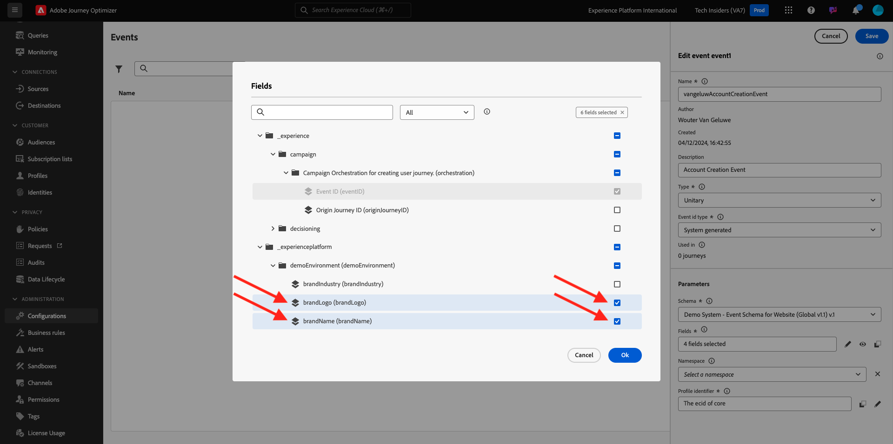

# 3.1.1 Creare l’evento

Accedi a Adobe Journey Optimizer da [Adobe Experience Cloud](https://experience.adobe.com). Fare clic su **Journey Optimizer**.

Verrai reindirizzato alla visualizzazione **Home** in Journey Optimizer. Innanzitutto, assicurati di utilizzare la sandbox corretta. La sandbox da utilizzare si chiama `--aepSandboxName--`. Per passare da una sandbox all&#39;altra, fare clic su **Production Prod (VA7)** e selezionare la sandbox dall&#39;elenco. In questo esempio, la sandbox è denominata **AEP Enablement FY22**. Ti troverai quindi nella **Home** della tua sandbox `--aepSandboxName--`.

Nel menu a sinistra, scorri verso il basso e fai clic su **Configurazioni**. Fare clic sul pulsante **Gestisci** in **Eventi**.

Viene quindi visualizzata una panoramica di tutti gli eventi disponibili. Fai clic su **Crea evento** per iniziare a creare il tuo evento.

Viene visualizzata una nuova finestra di evento vuota.

Prima di tutto, assegna all&#39;evento un nome simile al seguente: `--aepUserLdap--AccountCreationEvent`.

Aggiungere quindi una descrizione come `Account Creation Event`.

Assicurarsi quindi che il tipo **Type** sia impostato su **Unitario** e per la selezione del tipo **ID evento** selezionare **Generato dal sistema**.

Di seguito è riportata la selezione dello schema. Per questo esercizio è stato preparato uno schema. Utilizzare lo schema `Demo System - Event Schema for Website (Global v1.1) v.1`.

Dopo aver selezionato lo schema, nella sezione **Payload** verranno selezionati diversi campi. Passa il cursore del mouse sulla sezione **Payload** per visualizzare la finestra a comparsa delle 3 icone. Fai clic sull&#39;icona **Modifica**.

Verrà visualizzata una finestra popup **Campi** in cui è necessario selezionare alcuni dei campi necessari per personalizzare l&#39;e-mail.  In seguito sceglieremo altri attributi di profilo, utilizzando i dati già presenti in Adobe Experience Platform.

Nell&#39;oggetto `--aepTenantId--.demoEnvironment`, assicurarsi di selezionare i campi **brandLogo** e **brandName**.

Nell&#39;oggetto `--aepTenantId--.identification.core`, assicurarsi di selezionare il campo **email**.

Fai clic su **Ok** per salvare le modifiche.

Dovresti quindi vedere quanto segue:

Fai clic ancora una volta su **Salva** per salvare le modifiche.

L’evento è ora configurato e salvato.

Fai di nuovo clic sull&#39;evento per aprire di nuovo la schermata **Modifica evento**. Passa di nuovo il puntatore del mouse sul campo **Payload** per visualizzare nuovamente le 3 icone. Fai clic sull&#39;icona **Visualizza payload**.

Ora vedrai un esempio del payload previsto.

Il tuo evento ha un ID evento di orchestrazione univoco, che puoi trovare scorrendo verso il basso in tale payload fino a visualizzare `_experience.campaign.orchestration.eventID`.

L’ID evento è ciò che deve essere inviato a Adobe Experience Platform per attivare il Percorso che verrà generato nell’esercizio 7.2. Ricorda questo eventID, in quanto sarà necessario nell’esercizio 7.3.
`"eventID": "227402c540eb8f8855c6b2333adf6d54d7153d9d7d56fa475a6866081c574736"`

Fare clic su **Ok**, quindi su **Annulla**.

Hai terminato questo esercizio.

Passaggio successivo: [3.1.2 Journey Optimizer: creare il percorso e il messaggio di posta elettronica](./ex2.md)

[Torna al modulo 3.1](./journey-orchestration-create-account.md)

[Torna a tutti i moduli](../../../overview.md)
