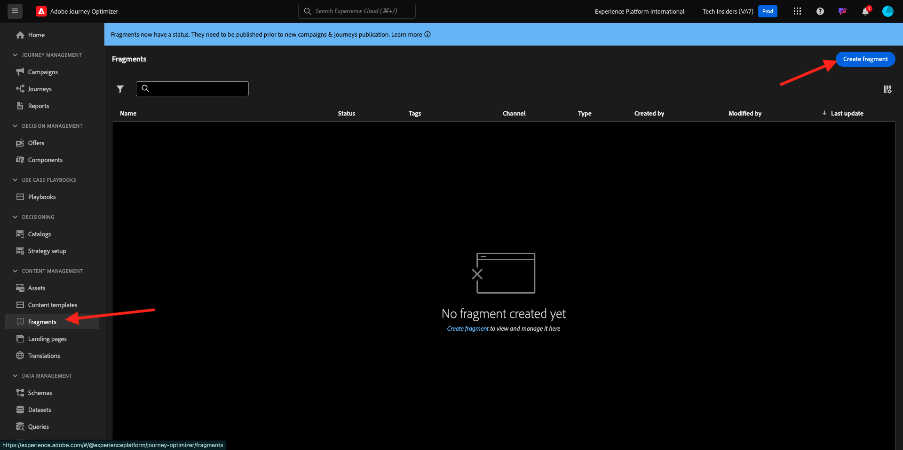
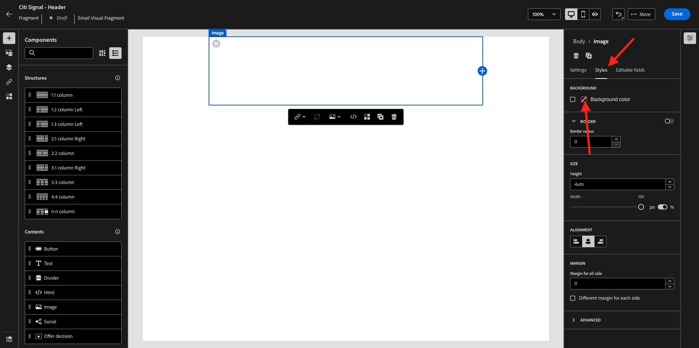

# 3.1.2 Creare frammenti da utilizzare nel messaggio

In questo esercizio configurerai 2 frammenti, 1 per un’intestazione riutilizzabile e 1 per un piè di pagina riutilizzabile.

Accedi a Adobe Journey Optimizer da [Adobe Experience Cloud](https://experience.adobe.com). Fare clic su **Journey Optimizer**.


Verrai reindirizzato alla visualizzazione **Home** in Journey Optimizer. Innanzitutto, assicurati di utilizzare la sandbox corretta. La sandbox da utilizzare si chiama `--aepSandboxName--`.


## 3.1.2.1 Creare il frammento di intestazione

Nel menu a sinistra, fai clic su **Frammenti**. Un frammento è un componente riutilizzabile all’interno di Journey Optimizer che evita la duplicazione e facilita le modifiche future che dovrebbero interessare tutti i messaggi, come le modifiche a un’intestazione o a un piè di pagina in un messaggio e-mail.

Fare clic su **Crea frammento**.



Immettere il nome `--aepUserLdap-- - CitiSignal - Header` e selezionare **Tipo: frammento visivo**. Fai clic su **Crea**.


Poi vedrai questo. Nel menu a sinistra trovi i componenti struttura che puoi utilizzare per definire la struttura dell’e-mail (righe e colonne).

Trascina e rilascia una **colonna 1:1** dal menu nell&#39;area di lavoro. Questo sarà il segnaposto per l&#39;immagine del logo.


Successivamente, puoi utilizzare i Componenti contenuto per aggiungere contenuto all’interno di questi blocchi. Trascina e rilascia un componente **Immagine** nella prima cella della prima riga. Fare clic su **Sfoglia**.


Viene visualizzata un’apertura a comparsa con il Media Library di AEM Assets. Vai alla cartella **citi-signal-images**, fai clic per selezionare l&#39;immagine **CitiSignal-Logo-White.png** e fai clic su **Select**.

>[!NOTE]
>
>Se non trovi le immagini Citi Signal nella tua libreria AEM Assets, puoi trovarle [qui](../../../assets/ajo/CitiSignal-images.zip). Scaricali sul desktop, crea la cartella **citi-signal-images** e carica tutte le immagini in quella cartella.


Poi vedrai questo. L&#39;immagine è bianca e non è ancora visualizzata. A questo punto è necessario definire un colore di sfondo per la corretta visualizzazione dell&#39;immagine. Fai clic su **Stili**, quindi fai clic sulla casella **Colore di sfondo**.



Nel popup, cambiare il codice colore **Hex** in **#8821F4** e quindi cambiare lo stato attivo facendo clic nel campo **100%**. Viene quindi visualizzato il nuovo colore applicato all&#39;immagine.


L&#39;immagine è anche un po&#39; troppo grande in questo momento. Modifichiamo la larghezza facendo scorrere il commutatore **Larghezza** in **40%**.


Il frammento di intestazione è ora pronto. Fai clic su **Salva**, quindi fai clic sulla freccia per tornare alla schermata precedente.


Il frammento deve essere pubblicato prima di poter essere utilizzato. Fare clic su **Publish**.


Dopo alcuni minuti, lo stato del frammento sarà **Live**.
Successivamente, devi creare un nuovo frammento per il piè di pagina dei messaggi e-mail. Fare clic su **Crea frammento**.


## 3.1.2.1 Creare il frammento di piè di pagina

Fare clic su **Crea frammento**.


Immettere il nome `--aepUserLdap-- - CitiSignal - Footer` e selezionare **Tipo: frammento visivo**. Fai clic su **Crea**.


Poi vedrai questo. Nel menu a sinistra trovi i componenti struttura che puoi utilizzare per definire la struttura dell’e-mail (righe e colonne).

Trascina e rilascia una **colonna 1:1** dal menu nell&#39;area di lavoro. Questo sarà il segnaposto per il contenuto del piè di pagina.


Successivamente, puoi utilizzare i Componenti contenuto per aggiungere contenuto all’interno di questi blocchi. Trascina e rilascia un componente **HTML** nella prima cella della prima riga. Fare clic sul componente per selezionarlo, quindi fare clic sull&#39;icona **&lt;/>** per modificare il codice sorgente di HTML.


Poi vedrai questo.


Copia il frammento di codice HTML seguente e incollalo nella finestra **Modifica HTML** in Journey Optimizer.

```html
<!--[if mso]><table cellpadding="0" cellspacing="0" border="0" width="100%"><tr><td style="text-align: center;" ><![endif]-->
<table style="width: auto; display: inline-block;">
  <tbody>
    <tr class="component-social-container">
      <td style="padding: 5px">
        <a style="text-decoration: none;" href="https://www.facebook.com" data-component-social-icon-id="facebook">
        
        </a>
      </td>
      <td style="padding: 5px">
        <a style="text-decoration: none;" href="https://x.com" data-component-social-icon-id="twitter">
        
        </a>
      </td>
      <td style="padding: 5px">
        <a style="text-decoration: none;" href="https://www.instagram.com" data-component-social-icon-id="instagram">
         
        </a>
      </td>
    </tr>
  </tbody>
</table>
<!--[if mso]></td></tr></table><![endif]-->
```

Allora avrai questo. Alle righe 7, 12 e 17 ora devi inserire un file di immagine, utilizzando le risorse nella libreria di AEM Assets.


Verificare che il cursore si trovi nella riga 7, quindi scegliere **Assets** dal menu a sinistra. Fai clic su **Apri selettore risorse** per selezionare l&#39;immagine.


Apri la cartella **citi-signal-images** e fai clic per selezionare l&#39;immagine **Icon_Facebook.png**. Fai clic su **Seleziona**.


Assicurati che il cursore si trovi sulla riga 12, quindi fai clic su **Apri selettore risorse** per selezionare l&#39;immagine.


Apri la cartella **citi-signal-images** e fai clic per selezionare l&#39;immagine **Icon_X.png**. Fai clic su **Seleziona**.


Assicurati che il cursore si trovi alla riga 17, quindi fai clic su **Apri selettore risorse** per selezionare l&#39;immagine.


Apri la cartella **citi-signal-images** e fai clic per selezionare l&#39;immagine **Icon_Instagram.png**. Fai clic su **Seleziona**.


Poi vedrai questo. Fai clic su **Salva**.


Tornerai nell&#39;editor. Le icone non sono ancora visibili perché lo sfondo e i file di immagine sono tutti in bianco. Per cambiare il colore di sfondo, passa a **Stili** e fai clic sulla casella di controllo **Colore di sfondo**.


Cambia il codice colore **Hex** in **#000000**.


Modifica l’allineamento in modo che sia centrato.


Aggiungiamo altre parti al piè di pagina. Trascina e rilascia un componente **Immagine** sopra il componente HTML appena creato. Fare clic su **Sfoglia**.


Fare clic per selezionare il file di immagine **`CitiSignal_Footer_Logo.png`** e fare clic su **Seleziona**.


Passa a **Stili** e fai clic sulla casella di controllo **Colore di sfondo**. Torniamo a usare il nero. Cambia il codice colore **Hex** in **#000000**.


Modifica la larghezza in **20%** e verifica che l&#39;allineamento sia impostato per essere centrato.


Trascina e rilascia un componente **Testo** sotto il componente HTML creato. Fare clic su **Sfoglia**.


Copiare e incollare il testo seguente sostituendo il testo segnaposto.

```
1234 N. South Street, Anywhere, US 12345

Unsubscribe

©2024 CitiSignal, Inc and its affiliates. All rights reserved.
```

Imposta l&#39;allineamento **Testo** da centrare.


Cambia **Colore carattere** in bianco, **#FFFFFF**.


Cambia il **colore di sfondo** in nero, **#000000**.


Selezionare il testo **Annulla sottoscrizione** nel piè di pagina e fare clic sull&#39;icona **Collegamento** nella barra dei menu. Imposta **Type** su **External Opt-out/Unsubscription** e imposta l&#39;URL su **https://aepdemo.net/unsubscribe.html** (non è consentito avere un URL vuoto per il collegamento di annullamento dell&#39;abbonamento).


Allora avrai questo. Il piè di pagina è pronto. Fare clic su **Salva** e quindi sulla freccia per tornare alla pagina precedente.


Fai clic su **Publish** per pubblicare il piè di pagina in modo che possa essere utilizzato in un&#39;e-mail.


Dopo alcuni minuti lo stato del piè di pagina verrà modificato in **Live**.


Hai terminato questo esercizio.

Passaggio successivo: [3.1.3 Creare il percorso e il messaggio di posta elettronica](./ex3.md)

[Torna al modulo 3.1](./journey-orchestration-create-account.md)

[Torna a tutti i moduli](../../../overview.md)
