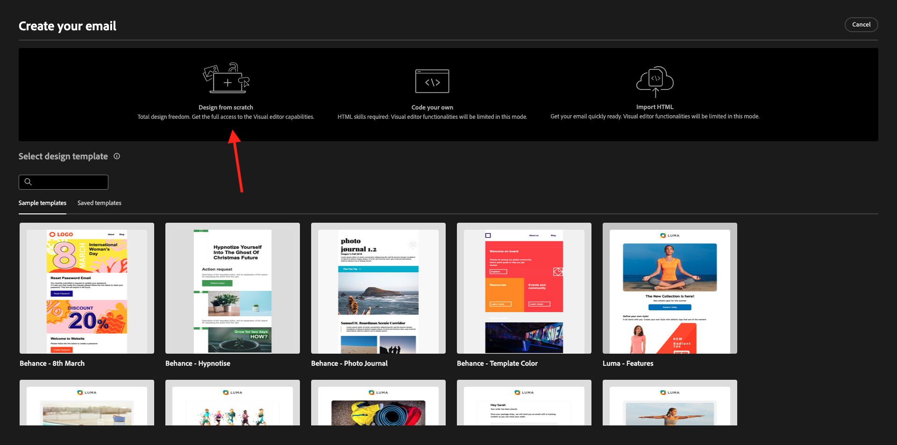
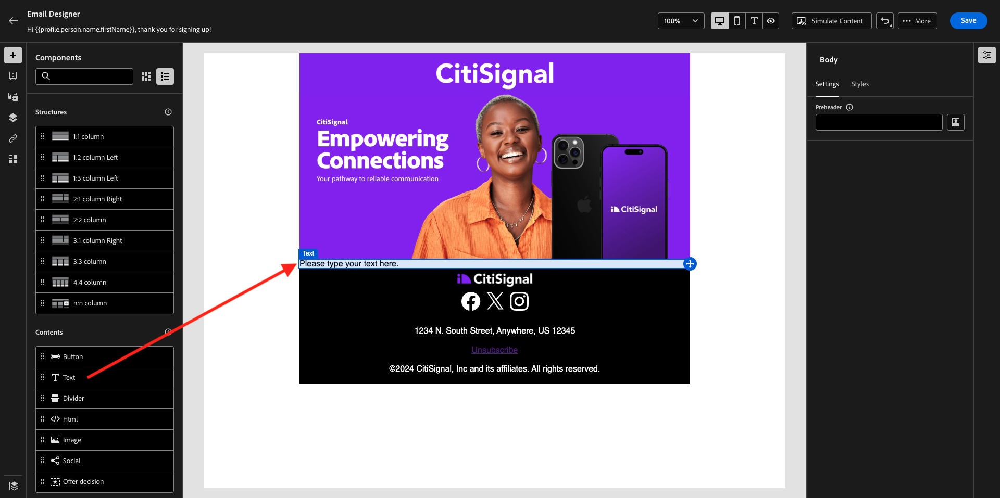
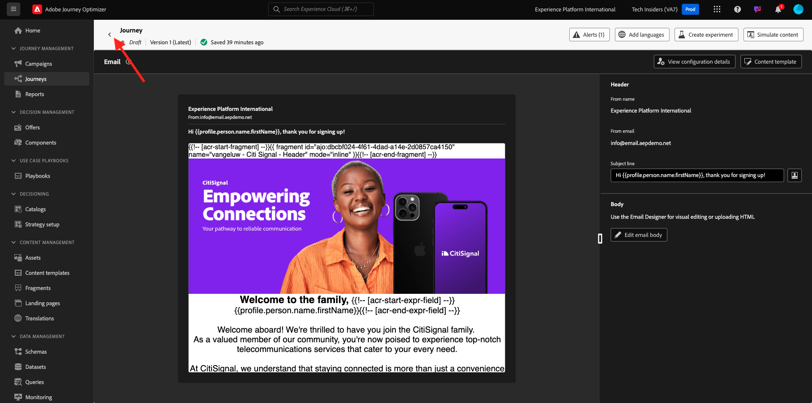

# 3.1.2 Creare il percorso e il messaggio e-mail

In questo esercizio configurerai il percorso e il messaggio da attivare quando qualcuno crea un account sul sito web demo.

Accedi a Adobe Journey Optimizer da [Adobe Experience Cloud](https://experience.adobe.com). Fare clic su **Journey Optimizer**.

Verrai reindirizzato alla visualizzazione **Home** in Journey Optimizer. Innanzitutto, assicurati di utilizzare la sandbox corretta. La sandbox da utilizzare si chiama `--aepSandboxName--`. Per passare da una sandbox all&#39;altra, fare clic su **Production Prod (VA7)** e selezionare la sandbox dall&#39;elenco. In questo esempio, la sandbox è denominata **AEP Enablement FY22**. Ti troverai quindi nella **Home** della tua sandbox `--aepSandboxName--`.

## 3.1.2.1 Creare il percorso

Nel menu a sinistra, fai clic su **Percorsi**. Fare clic su **Crea Percorso** per creare un nuovo percorso.

Viene quindi visualizzata una schermata di percorso vuota.

Nell&#39;esercizio precedente è stato creato un nuovo **evento**. L&#39;utente ha assegnato un nome simile a `ldapAccountCreationEvent` e ha sostituito `ldap` con il proprio ldap. Questo è stato il risultato della creazione dell’evento:

Ora devi prendere questo evento come inizio di questo Percorso. Per farlo, vai sul lato sinistro della schermata e cerca l’evento nell’elenco degli eventi.

Seleziona l’evento, trascinalo sull’area di lavoro del Percorso. Il Percorso si presenta ora come segue:

Come secondo passaggio del percorso, devi aggiungere un breve passaggio **Attendi**. Vai sul lato sinistro della schermata alla sezione **Orchestration** per trovarlo. Utilizzerai gli attributi del profilo e dovrai accertarti che siano popolati in Real-time Customer Profile.

Il tuo percorso ora si presenta così. Sul lato destro dello schermo è necessario configurare il tempo di attesa. Imposta su 1 minuto. In questo modo gli attributi del profilo saranno disponibili dopo l’attivazione dell’evento.

Fai clic su **Ok** per salvare le modifiche.

Come terzo passaggio del percorso, devi aggiungere un&#39;azione **E-mail**. Vai sul lato sinistro della schermata a **Azioni**, seleziona l&#39;azione **E-mail**, quindi trascinala sul secondo nodo del percorso. Ora vedete questo.

Imposta **Categoria** su **Marketing** e seleziona una superficie e-mail che ti consenta di inviare messaggi e-mail. In questo caso, la superficie e-mail da selezionare è **E-mail**. Assicurati che le caselle di controllo per **Clic su e-mail** e **aperture e-mail** siano entrambe abilitate.

Il passaggio successivo consiste nel creare il messaggio. A tale scopo, fare clic su **Modifica contenuto**.

## 3.1.2.2 Creare il messaggio

Per creare il messaggio, fai clic su **Modifica contenuto**.

Ora vedete questo.

Fare clic sul campo di testo **Oggetto**.

Nell&#39;area di testo inizia a scrivere **Ciao**

L’oggetto non è ancora stato completato. Successivamente devi inserire il token di personalizzazione per il campo **First name**, memorizzato in `profile.person.name.firstName`. Nel menu a sinistra, scorri verso il basso per trovare l&#39;elemento **Person** e fai clic sulla freccia per approfondire il livello.

Trovare ora l&#39;elemento **Nome completo** e fare clic sulla freccia per approfondire il livello.

Infine, trovare il campo **Nome** e fare clic sul segno **+** accanto ad esso. Il token di personalizzazione verrà quindi visualizzato nel campo di testo.

Quindi, aggiungere il testo **. Grazie per la registrazione.**. Fai clic su **Salva**.

Allora tornerai qui. Fai clic su **Invia e-mail a Designer** per creare il contenuto dell&#39;e-mail.

Nella schermata successiva ti verranno richiesti 3 metodi diversi per fornire il contenuto dell’e-mail:

- **Progettazione da zero**: inizia con un&#39;area di lavoro vuota e utilizza l&#39;editor di WYSIWYG per trascinare i componenti struttura e contenuto per creare visivamente il contenuto dell&#39;e-mail.
- **Crea un codice personale**: crea un modello di e-mail personalizzato codificandolo con HTML
- **Importa HTML**: importa un modello di HTML esistente che potrai modificare.

Fare clic su **Progetta da zero**.

Nel menu a sinistra trovi i componenti struttura che puoi utilizzare per definire la struttura dell’e-mail (righe e colonne).

Trascina e rilascia una colonna **1:2 a sinistra** dal menu nell&#39;area di lavoro. Questo sarà il segnaposto per l&#39;immagine del logo.

Trascina e rilascia una **colonna 1:1** sotto il componente precedente. Questo sarà il blocco del banner.

Trascina e rilascia una colonna **1:2 a sinistra** sotto il componente precedente. Si tratta del contenuto effettivo con un’immagine sul lato sinistro e un testo sul lato destro.

Trascina quindi una **colonna 1:1** sotto il componente precedente. Questo sarà il piè di pagina dell’e-mail. L’area di lavoro ora dovrebbe essere simile alla seguente:

Quindi, utilizziamo i Componenti contenuto per aggiungere contenuto all’interno di questi blocchi. Fare clic sulla voce di menu **Componenti contenuto**

Trascina e rilascia un componente **Immagine** nella prima cella della prima riga. Fare clic su **Sfoglia**.

Poi vedrai questo. Passa alla cartella **enablement-assets** e seleziona il file **luma-logo.png**. Fai clic su **Seleziona**.

Ora sei di nuovo qui:

Vai a **Componenti contenuto** e trascina un componente **Immagine** nella prima cella della prima riga. Fare clic su **Sfoglia**.

Nel pop-up **Assets**, vai alla cartella **enablement-assets**. In questa cartella troverai tutte le risorse preparate e caricate in precedenza dal team creativo. Seleziona **module23-thankyou-new.png** e fai clic su **Seleziona**.

A questo punto si otterrà:

Seleziona l&#39;immagine e, nel menu a destra, scorri verso il basso fino a visualizzare il componente cursore di larghezza **Dimensioni**. Utilizzate il cursore per modificare la larghezza in f.i. **60%**.

Quindi, vai a **Componenti contenuto** e trascina un componente **Testo** nel componente struttura nella quarta riga.

Selezionare il testo predefinito **Digitare qui il testo.** come si farebbe con qualsiasi editor di testo. Scrivi invece **Gentile**. Osserva la barra degli strumenti di testo visualizzata quando sei in modalità testo.

Nella barra degli strumenti, fai clic sull&#39;icona **Aggiungi personalizzazione**.

Successivamente, devi portare il token di personalizzazione **First name** memorizzato in `profile.person.name.firstName`. Nel menu, trovare l&#39;elemento **Person**, espandere l&#39;elemento **Full Name** e quindi fare clic sull&#39;icona **+** per aggiungere il campo First Name all&#39;editor di espressioni.

Fai clic su **Salva**.

Ora noterai come il campo di personalizzazione è stato aggiunto al testo.

Nello stesso campo di testo, premi **Invio** due volte per aggiungere due righe e scrivi **Grazie per aver creato il tuo account con Luma!**.

Il controllo finale da eseguire per verificare che l&#39;e-mail sia pronta è l&#39;anteprima, fare clic sul pulsante **Simula contenuto**.

Per iniziare, identifica il profilo da utilizzare per l’anteprima. Seleziona lo spazio dei nomi **email** facendo clic sull&#39;icona accanto al campo **Enter identity namespace** (Inserisci spazio dei nomi delle identità).

Nell&#39;elenco degli spazi dei nomi di identità, seleziona lo spazio dei nomi **E-mail**.

Nel campo **Valore identità** immettere l&#39;indirizzo di posta elettronica di un profilo demo precedente già archiviato nel profilo cliente in tempo reale. Ad esempio **woutervangeluwe+06022022-01@gmail.com** e fare clic sul pulsante **Trova profilo di test**

Quando il tuo profilo viene visualizzato nella tabella, fai clic sulla scheda **Anteprima** per accedere alla schermata di anteprima.

Quando l’anteprima è pronta, verifica che la personalizzazione sia corretta nella riga dell’oggetto e che il testo del corpo e il collegamento di annullamento dell’abbonamento siano evidenziati come collegamento ipertestuale.

Fai clic su **Chiudi** per chiudere l&#39;anteprima.

Fai clic su **Salva** per salvare il messaggio.

Torna alla dashboard dei messaggi facendo clic sulla **freccia** accanto al testo dell&#39;oggetto nell&#39;angolo in alto a sinistra.

Hai completato la creazione dell’e-mail di registrazione. Fai clic sulla freccia nell’angolo in alto a sinistra per tornare al percorso.

Fare clic su **Ok**.

## 3.1.2.3 Publish il tuo percorso

È comunque necessario assegnare un nome al percorso. Per farlo, fai clic sull&#39;icona **Proprietà** in alto a destra nella schermata.

È quindi possibile immettere qui il nome del percorso. Utilizzare `--aepUserLdap-- - Account Creation Journey`. Fai clic su **OK** per salvare le modifiche.

È ora possibile pubblicare il percorso facendo clic su **Publish**.

Fai di nuovo clic su **Publish**.

Viene visualizzata una barra di conferma verde che indica che il percorso è ora pubblicato.

Hai terminato questo esercizio.

Passaggio successivo: [3.1.3 Aggiorna la proprietà di raccolta dati e verifica il percorso](./ex3.md)

[Torna al modulo 3.1](./journey-orchestration-create-account.md)

[Torna a tutti i moduli](../../../overview.md)
