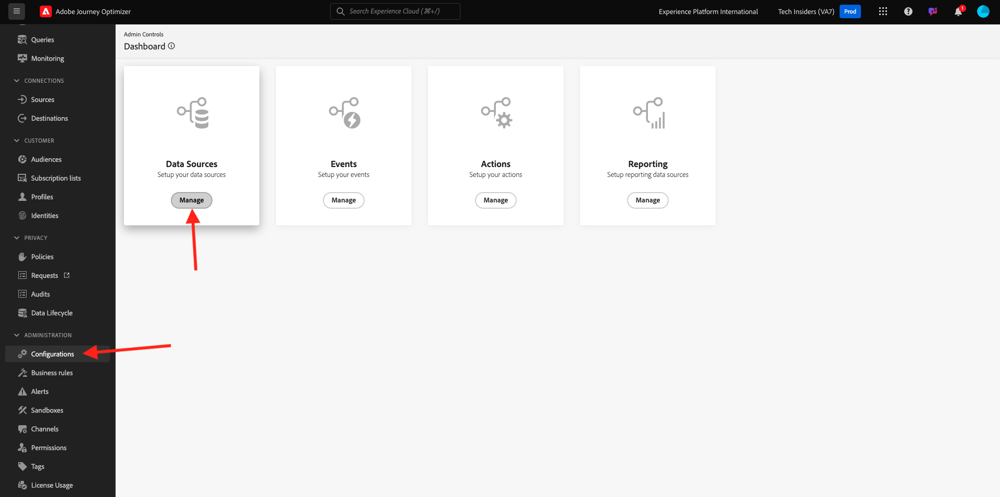

# 3.2.2 Definire una sorgente di dati esterna

In questo esercizio creerai un’origine dati esterna personalizzata utilizzando Adobe Journey Optimizer.

Accedi a Adobe Journey Optimizer da [Adobe Experience Cloud](https://experience.adobe.com). Fare clic su **Journey Optimizer**.


Verrai reindirizzato alla visualizzazione **Home** in Journey Optimizer. Innanzitutto, assicurati di utilizzare la sandbox corretta. La sandbox da utilizzare si chiama `--aepSandboxId--`. Per passare da una sandbox all&#39;altra, fare clic su **Production Prod (VA7)** e selezionare la sandbox dall&#39;elenco. In questo esempio, la sandbox è denominata **AEP Enablement FY22**. Ti troverai quindi nella **Home** della tua sandbox `--aepSandboxId--`.


Nel menu a sinistra, scorri verso il basso e fai clic su **Configurazioni**. Fare clic sul pulsante **Gestisci** in **Origini dati**.



Verrà quindi visualizzato l&#39;elenco **Origini dati**.
Fai clic su **Crea Source dati** per iniziare ad aggiungere la tua origine dati.


Verrà visualizzata una finestra a comparsa dell&#39;origine dati vuota.


Prima di iniziare la configurazione, è necessario un account con il servizio **Apri mappa meteo**. Per creare l’account e ottenere la chiave API, segui la procedura riportata di seguito.

Vai a [https://openweathermap.org/](https://openweathermap.org/). Nella home page fare clic su **Accedi**.


Fai clic su **Crea un account**.


Compila i dettagli.


Fare clic su **Crea account**.


Verrai quindi reindirizzato alla pagina del tuo account.


Nel menu, fai clic su **Chiavi API** per recuperare la tua chiave API, che dovrai impostare l&#39;origine dati esterna personalizzata.


Una chiave **API** si presenta così: `b2c4c36b6bb59c3458d6686b05311dc3`.

Puoi trovare la **documentazione API** per il **meteo attuale** [qui](https://openweathermap.org/current).

Nel nostro caso d’uso, implementeremo il collegamento con Open Weather Map in base alla città in cui si trova il cliente.


Torna a **Adobe Journey Optimizer**, al popup **External Data Source** vuoto.


Come nome per l&#39;origine dati, utilizzare `--demoProfileLdap--WeatherApi`. In questo esempio, il nome dell&#39;origine dati è `vangeluwWeatherApi `.

Imposta descrizione su: `Access to the Open Weather Map`.

L&#39;URL per l&#39;API Open Weather Map è: **http://api.openweathermap.org/data/2.5/weather?units=metric**


Quindi, seleziona l’Autenticazione da utilizzare.

Utilizza queste variabili:

| Campo | Valore |
|:-----------------------:| :-----------------------|
| Tipo | **Chiave API** |
| Nome | **APPID** |
| Valore | **la tua chiave API** |
| Posizione | **Parametro query** |


Infine, devi definire un **GruppoCampi**, che è sostanzialmente la richiesta che invierai all&#39;API Meteo. Nel nostro caso, vogliamo usare il nome della Città per richiedere il Tempo Attuale per quella Città.


In base alla documentazione dell&#39;API meteo, è necessario inviare un parametro `q=City`.


Per corrispondere alla richiesta API prevista, configura il FieldGroup come segue:

>[!IMPORTANT]
>
>Il nome del gruppo di campi deve essere univoco. Utilizzare questa convenzione di denominazione: `--demoProfileLdap--WeatherByCity`. In questo caso, il nome deve essere `vangeluwWeatherByCity`


Per il payload di risposta, è necessario incollare un esempio della risposta che verrà inviata dall’API meteo.

La risposta JSON API prevista è disponibile nella pagina della documentazione API [qui](https://openweathermap.org/current).


Oppure puoi copiare la risposta JSON da qui:

```json
{"coord": { "lon": 139,"lat": 35},
  "weather": [
    {
      "id": 800,
      "main": "Clear",
      "description": "clear sky",
      "icon": "01n"
    }
  ],
  "base": "stations",
  "main": {
    "temp": 281.52,
    "feels_like": 278.99,
    "temp_min": 280.15,
    "temp_max": 283.71,
    "pressure": 1016,
    "humidity": 93
  },
  "wind": {
    "speed": 0.47,
    "deg": 107.538
  },
  "clouds": {
    "all": 2
  },
  "dt": 1560350192,
  "sys": {
    "type": 3,
    "id": 2019346,
    "message": 0.0065,
    "country": "JP",
    "sunrise": 1560281377,
    "sunset": 1560333478
  },
  "timezone": 32400,
  "id": 1851632,
  "name": "Shuzenji",
  "cod": 200
}
```

Copia la risposta JSON di cui sopra negli Appunti, quindi vai alla schermata di configurazione dell’origine dati personalizzata.

Fai clic sull&#39;icona **Modifica payload**.


Viene visualizzata una finestra a comparsa in cui è necessario incollare la risposta JSON precedente.


Incolla la risposta JSON, dopo di che visualizzerai questo. Fai clic su **Salva**.


La configurazione dell’origine dati personalizzata è stata completata. Scorri verso l&#39;alto e fai clic su **Salva**.


L&#39;origine dati è stata creata correttamente e fa parte dell&#39;elenco **Origini dati**.


Passaggio successivo: [3.2.3 Definisci un&#39;azione personalizzata](./ex3.md)

[Torna al modulo 3.2](journey-orchestration-external-weather-api-sms.md)

[Torna a tutti i moduli](../../../overview.md)
