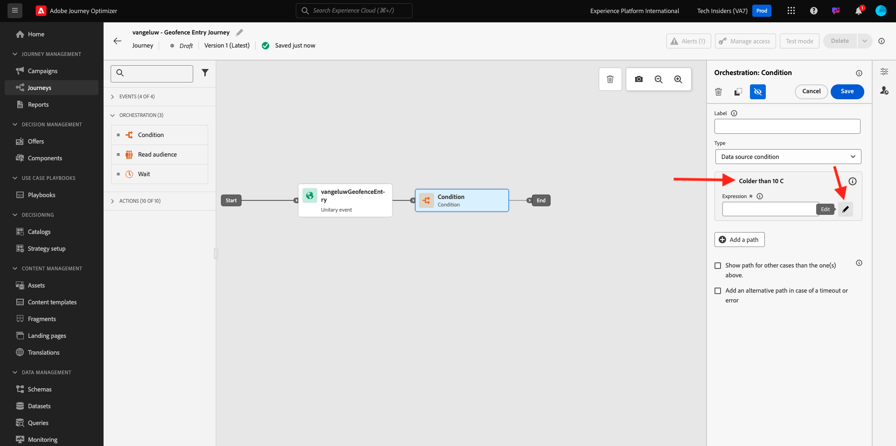
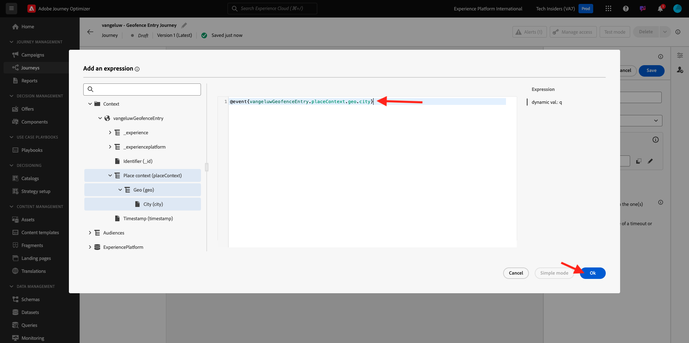

# 3.2.4 Creare percorso e messaggi

In questo esercizio verranno creati un percorso e diversi messaggi di testo utilizzando Adobe Journey Optimizer.

Per questo caso d’uso, l’obiettivo è quello di inviare messaggi diversi in base alle condizioni meteo della posizione del cliente. Sono stati definiti 3 scenari:

- Più freddo di 10° Celsius
- Tra 10° e 25° Celsius
- Più caldo di 25° Celsius

Per queste 3 condizioni, dovrai definire 3 messaggi in Adobe Journey Optimizer.

## 3.2.4.1 Creare il percorso

Accedi a Adobe Journey Optimizer da [Adobe Experience Cloud](https://experience.adobe.com). Fare clic su **Journey Optimizer**.


Verrai reindirizzato alla visualizzazione **Home** in Journey Optimizer. Innanzitutto, assicurati di utilizzare la sandbox corretta. La sandbox da utilizzare si chiama `--aepSandboxName--`. Ti troverai quindi nella **Home** della tua sandbox `--aepSandboxName--`.


Nel menu a sinistra, vai a **Percorsi** e fai clic su **Crea Percorso** per iniziare a creare il Percorso.


Dovresti dare un nome al tuo percorso.

Come nome del percorso, utilizzare `--aepUserLdap-- - Geofence Entry Journey`. Al momento non è necessario impostare altri valori. Fai clic su **Salva**.


Sul lato sinistro della schermata, osserva **Eventi**. Dovresti visualizzare nell’elenco l’evento creato in precedenza. Selezionala, quindi trascinala sull’area di lavoro del percorso. Il tuo percorso si presenta così. Fai clic su **Salva**.


Fare clic su **Orchestrazione**. Sono ora disponibili le funzionalità di **Orchestrazione**. Seleziona **Condizione**, quindi trascinala sull&#39;area di lavoro del Percorso.


Ora devi configurare tre percorsi per questa condizione:

- Fa più freddo di 10°C
- È tra i 10° e i 25° Celsius
- Fa più caldo di 25° Celsius

Definiamo la prima condizione.

### Condizione 1: più freddo di 10° Celsius

Fai clic sulla **Condizione**.  Fai clic su **Percorso1** e modifica il nome del percorso in **Più freddo di 10°C**. Fai clic sull&#39;icona **Modifica** per l&#39;espressione di Path1.



Verrà visualizzata una schermata **Editor semplice** vuota. La query sarà un po&#39; più avanzata, quindi sarà necessaria la **Modalità avanzata**. Fare clic su **Modalità avanzata**.


Verrà visualizzato l&#39;**Editor avanzato** che consente l&#39;immissione di codice.


Selezionare il codice seguente e incollarlo nell&#39;**Editor avanzato**.

`#{--aepUserLdap--WeatherApi.--aepUserLdap--WeatherByCity.main.temp} <= 10`

Poi vedrai questo.


Per recuperare la temperatura come parte di questa condizione, devi fornire la città in cui si trova attualmente il cliente.
La **Città** deve essere collegata al parametro dinamico `q`, proprio come hai visto in precedenza nella documentazione di Open Weather API.

Fai clic sul campo **valore dinamico: q** come indicato nella schermata.


È quindi necessario trovare il campo che contiene la città corrente del cliente in una delle origini dati disponibili. In questo caso, è necessario trovarlo in **Contesto**.


Per trovare il campo, passare a `--aepUserLdap--GeofenceEntry.placeContext.geo.city`.

Facendo clic su tale campo o su **+**, verrà aggiunto come valore dinamico per il parametro `q`. Questo campo verrà compilato, ad esempio, dal servizio di geolocalizzazione implementato nell’app mobile. In questo caso, simulerai utilizzando la proprietà di raccolta dati del sito web demo. Fai clic su **OK**.



### Condizione 2: tra 10° e 25° Celsius

Dopo aver aggiunto la prima condizione, viene visualizzata questa schermata. Fare clic su **Aggiungi un percorso**.


Fare doppio clic su **Percorso1** e modificare il nome del percorso in **Tra 10 e 25 C**. Fai clic sull&#39;icona **Modifica** per l&#39;espressione questo percorso.


Verrà visualizzata una schermata **Editor semplice** vuota. La query sarà un po&#39; più avanzata, quindi sarà necessaria la **Modalità avanzata**. Fare clic su **Modalità avanzata**.


Verrà visualizzato l&#39;**Editor avanzato** che consente l&#39;immissione di codice.


Selezionare il codice seguente e incollarlo nell&#39;**Editor avanzato**.

`#{--aepUserLdap--WeatherApi.--aepUserLdap--WeatherByCity.main.temp} > 10 and #{--aepUserLdap--WeatherApi.--aepUserLdap--WeatherByCity.main.temp} <= 25`

Poi vedrai questo.


Per recuperare la temperatura come parte di questa Condizione, devi fornire la città in cui si trova attualmente il cliente.
La **Città** deve essere collegata al parametro dinamico **q**, proprio come hai visto in precedenza nella documentazione di Open Weather API.

Fai clic sul campo **valore dinamico: q** come indicato nella schermata.


Devi quindi trovare il campo che contiene la città corrente del cliente in una delle Origini dati disponibili.


Per trovare il campo, passare a `--aepUserLdap--GeofenceEntry.placeContext.geo.city`. Facendo clic su tale campo, verrà aggiunto come valore dinamico per il parametro **q**. Questo campo verrà compilato, ad esempio, dal servizio di geolocalizzazione implementato nell’app mobile. In questo caso, simulerai utilizzando la proprietà di raccolta dati del sito web demo. Fai clic su **OK**.


Ora aggiungerai la terza condizione.

### Condizione 3: Più caldo di 25° Celsius

Dopo aver aggiunto la seconda condizione, viene visualizzata questa schermata. Fare clic su **Aggiungi un percorso**.


Fare doppio clic su Path1 per modificare il nome in **Più caldo di 25 C**.
Quindi fai clic sull&#39;icona **Modifica** per l&#39;espressione questo percorso.


Verrà visualizzata una schermata **Editor semplice** vuota. La query sarà un po&#39; più avanzata, quindi sarà necessaria la **Modalità avanzata**. Fare clic su **Modalità avanzata**.


Verrà visualizzato l&#39;**Editor avanzato** che consente l&#39;immissione di codice.


Selezionare il codice seguente e incollarlo nell&#39;**Editor avanzato**.

`#{--aepUserLdap--WeatherApi.--aepUserLdap--WeatherByCity.main.temp} > 25`

Poi vedrai questo.


Per recuperare la temperatura come parte di questa Condizione, devi fornire la città in cui si trova attualmente il cliente.
La **Città** deve essere collegata al parametro dinamico **q**, proprio come hai visto in precedenza nella documentazione di Open Weather API.

Fai clic sul campo **valore dinamico: q** come indicato nella schermata.


Devi quindi trovare il campo che contiene la città corrente del cliente in una delle Origini dati disponibili.


Per trovare il campo, passare a ```--aepUserLdap--GeofenceEntry.placeContext.geo.city```. Facendo clic su tale campo, verrà aggiunto come valore dinamico per il parametro **q**. Questo campo verrà compilato, ad esempio, dal servizio di geolocalizzazione implementato nell’app mobile. In questo caso, simulerai utilizzando la proprietà di raccolta dati del sito web demo. Fai clic su **OK**.


Ora sono disponibili tre percorsi configurati. Fai clic su **Salva**.


Poiché si tratta di un percorso a scopo di apprendimento, ora configurerai un paio di azioni per mostrare la varietà di opzioni che gli esperti di marketing devono ora fornire per inviare i messaggi.

## 3.2.4.2 Inviare messaggi per il percorso: più freddo di 10° Celsius

Per ogni contesto di temperatura, tenterai di inviare un messaggio di testo a un cliente. Per questo esercizio, invierai un messaggio reale a un canale di Slack invece di un numero di telefono cellulare.

Concentriamoci sul percorso **Più vecchio di 10 C**.


Nel menu a sinistra, torna a **Azioni**, seleziona l&#39;azione `--aepUserLdap--TextSlack`, quindi trascinala dopo l&#39;azione **Messaggio**.


Vai a **Parametri azione** e fai clic sull&#39;icona **Modifica** per il parametro `textToSlack`.


Nella finestra popup, fare clic su **Modalità avanzata**.


Selezionare il codice seguente, copiarlo e incollarlo nell&#39;**Editor modalità avanzata**. Fare clic su **Ok**.

`"Brrrr..." + #{ExperiencePlatform.ProfileFieldGroup.profile.person.name.firstName} + ",  it's cold and freezing outside. Get comfortable at home with a 20% discount on a Disney+ subscription!"`


Verrà visualizzata l&#39;azione completata. Fai clic su **Salva**.


Questo percorso del percorso è ora pronto.

## 3.2.4.3 Inviare messaggi per la traccia: tra 10° e 25° Celsius

Per ciascuno dei contesti di temperatura, tenterai di inviare un messaggio al cliente. Per questo esercizio, invierai un messaggio reale a un canale di Slack invece di un numero di telefono cellulare.

Concentriamoci su **Percorso tra 10 e 25 C**.


Nel menu a sinistra, torna a **Azioni**, seleziona l&#39;azione `--aepUserLdap--TextSlack`, quindi trascinala dopo l&#39;azione **Messaggio**.


Vai a **Parametri azione** e fai clic sull&#39;icona **Modifica** per il parametro `textToSlack`.


Nella finestra popup, fare clic su **Modalità avanzata**.


Selezionare il codice seguente, copiarlo e incollarlo nell&#39;**Editor modalità avanzata**. Fare clic su **Ok**.

`"What nice weather for the time of year, " + #{ExperiencePlatform.ProfileFieldGroup.profile.person.name.firstName} + " 20% discount on Apple AirPods so you can go for a walk and listen to your favorite podcast!"`


Verrà visualizzata l&#39;azione completata. Fare clic su **Ok**.


Questo percorso del percorso è ora pronto.

## 3.2.4.4 Inviare messaggi per il percorso: più caldo di 25° Celsius

Per ciascuno dei contesti di temperatura, tenterai di inviare un messaggio al cliente. Per questo esercizio, invierai un messaggio reale a un canale di Slack invece di un numero di telefono cellulare.

Concentriamoci su **Percorso più caldo di 25 C**.


Nel menu a sinistra, torna a **Azioni**, seleziona l&#39;azione `--aepUserLdap--TextSlack`, quindi trascinala dopo l&#39;azione **Messaggi**.


Vai a **Parametri azione** e fai clic sull&#39;icona **Modifica** per il parametro `textToSlack`.


Nella finestra popup, fare clic su **Modalità avanzata**.


Selezionare il codice seguente, copiarlo e incollarlo nell&#39;**Editor modalità avanzata**. Fare clic su **Ok**.

`"So warm, " + #{ExperiencePlatform.ProfileFieldGroup.profile.person.name.firstName} + "! 20% discount on adding 10GB of extra data so you can get online at the beach!"`


Verrà visualizzata l&#39;azione completata. Fai clic su **Salva**.


Questo percorso del percorso è ora pronto.

## 3.2.4.5 Publish del percorso

Il percorso è ora completamente configurato. Fare clic su **Publish**.


Fai di nuovo clic su **Publish**.


Il percorso è stato pubblicato.


Passaggio successivo: [3.2.5 Attiva il percorso](./ex5.md)

[Torna al modulo 3.2](journey-orchestration-external-weather-api-sms.md)

[Torna a tutti i moduli](../../../overview.md)
