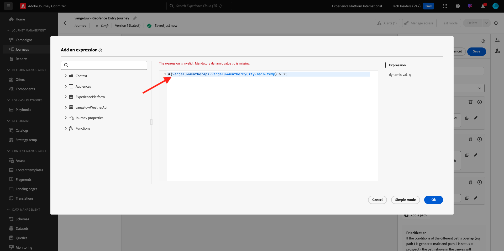

# 3.2.4 Creare percorso e messaggi

In questo esercizio verranno creati un percorso e diversi messaggi di testo utilizzando Adobe Journey Optimizer.

Per questo caso d’uso, l’obiettivo è quello di inviare diversi messaggi SMS in base alle condizioni meteo della posizione del cliente. Sono stati definiti 3 scenari:

- Più freddo di 10° Celsius
- Tra 10° e 25° Celsius
- Più caldo di 25° Celsius

Per queste 3 condizioni, dovrai definire 3 messaggi SMS in Adobe Journey Optimizer.

## 3.2.4.1 Creare il percorso

Accedi a Adobe Journey Optimizer da [Adobe Experience Cloud](https://experience.adobe.com). Fare clic su **Journey Optimizer**.


Verrai reindirizzato alla visualizzazione **Home** in Journey Optimizer. Innanzitutto, assicurati di utilizzare la sandbox corretta. La sandbox da utilizzare si chiama `--aepSandboxId--`. Per passare da una sandbox all&#39;altra, fare clic su **Production Prod (VA7)** e selezionare la sandbox dall&#39;elenco. In questo esempio, la sandbox è denominata **AEP Enablement FY22**. Ti troverai quindi nella **Home** della tua sandbox `--aepSandboxId--`.


Nel menu a sinistra, vai a **Percorsi** e fai clic su **Crea Percorso** per iniziare a creare il Percorso.


Dovresti dare un nome al tuo percorso.

Come nome del percorso, utilizzare `--demoProfileLdap-- - Geofence Entry Journey`. In questo esempio, il nome del percorso è `vangeluw - Geofence Entry Journey`. Al momento non è necessario impostare altri valori. Fai clic su **OK**.


Sul lato sinistro della schermata, osserva **Eventi**. Dovresti visualizzare nell’elenco l’evento creato in precedenza. Selezionala, quindi trascinala sull’area di lavoro del percorso. Il tuo percorso si presenta così. Fare clic su **Ok**.


Fare clic su **Orchestrazione**. Sono ora disponibili le funzionalità di **Orchestrazione**. Seleziona **Condizione**, quindi trascinala sull&#39;area di lavoro del Percorso.


Ora devi definire tre condizioni:

- Fa più freddo di 10°C
- È tra i 10° e i 25° Celsius
- Fa più caldo di 25° Celsius

Definiamo la prima condizione.

### Condizione 1: più freddo di 10° Celsius

Fai clic sulla **Condizione**.  Fai clic su **Percorso1** e modifica il nome del percorso in **Più freddo di 10°C**. Fai clic sull&#39;icona **Modifica** per l&#39;espressione di Path1.


Verrà visualizzata una schermata **Editor semplice** vuota. La query sarà un po&#39; più avanzata, quindi sarà necessaria la **Modalità avanzata**. Fare clic su **Modalità avanzata**.


Verrà visualizzato l&#39;**Editor avanzato** che consente l&#39;immissione di codice.


Selezionare il codice seguente e incollarlo nell&#39;**Editor avanzato**.

`#{--demoProfileLdap--WeatherApi.--demoProfileLdap--WeatherByCity.main.temp} <= 10`

Poi vedrai questo.


Per recuperare la temperatura come parte di questa condizione, devi fornire la città in cui si trova attualmente il cliente.
La **Città** deve essere collegata al parametro dinamico `q`, proprio come abbiamo visto in precedenza nella documentazione di Open Weather API.

Fai clic sul campo **valore dinamico: q** come indicato nella schermata.


Devi quindi trovare il campo che contiene la città corrente del cliente in una delle Origini dati disponibili.


Per trovare il campo, passare a `--demoProfileLdap--GeofenceEntry.placeContext.geo.city`.

Facendo clic su tale campo, verrà aggiunto come valore dinamico per il parametro `q`. Questo campo verrà compilato, ad esempio, dal servizio di geolocalizzazione implementato nell’app mobile. Nel nostro caso, simuleremo questo con l’Admin Console del sito web demo. Fai clic su **OK**.


### Condizione 2: tra 10° e 25° Celsius

Dopo aver aggiunto la prima condizione, viene visualizzata questa schermata. Fare clic su **Aggiungi percorso**.


Fare doppio clic su **Percorso1** e modificare il nome del percorso in **Tra 10 e 25 C**. Fai clic sull&#39;icona **Modifica** per l&#39;espressione questo percorso.


Verrà visualizzata una schermata **Editor semplice** vuota. La query sarà un po&#39; più avanzata, quindi sarà necessaria la **Modalità avanzata**. Fare clic su **Modalità avanzata**.


Verrà visualizzato l&#39;**Editor avanzato** che consente l&#39;immissione di codice.


Selezionare il codice seguente e incollarlo nell&#39;**Editor avanzato**.

`#{--demoProfileLdap--WeatherApi.--demoProfileLdap--WeatherByCity.main.temp} > 10 and #{--demoProfileLdap--WeatherApi.--demoProfileLdap--WeatherByCity.main.temp} <= 25`

Poi vedrai questo.


Per recuperare la temperatura come parte di questa Condizione, devi fornire la città in cui si trova attualmente il cliente.
La **Città** deve essere collegata al parametro dinamico **q**, proprio come abbiamo visto in precedenza nella documentazione di Open Weather API.

Fai clic sul campo **valore dinamico: q** come indicato nella schermata.


Devi quindi trovare il campo che contiene la città corrente del cliente in una delle Origini dati disponibili.


Per trovare il campo, passare a `--demoProfileLdap--GeofenceEntry.placeContext.geo.city`. Facendo clic su tale campo, verrà aggiunto come valore dinamico per il parametro **q**. Questo campo verrà compilato, ad esempio, dal servizio di geolocalizzazione implementato nell’app mobile. Nel nostro caso, simuleremo questo con l’Admin Console del sito web demo. Fai clic su **OK**.


Ora aggiungerai la terza condizione.

### Condizione 3: Più caldo di 25° Celsius

Dopo aver aggiunto la seconda condizione, viene visualizzata questa schermata. Fare clic su **Aggiungi percorso**.


Fare doppio clic su Path1 per modificare il nome in **Più caldo di 25 C**.
Quindi fai clic sull&#39;icona **Modifica** per l&#39;espressione questo percorso.


Verrà visualizzata una schermata **Editor semplice** vuota. La query sarà un po&#39; più avanzata, quindi sarà necessaria la **Modalità avanzata**. Fare clic su **Modalità avanzata**.


Verrà visualizzato l&#39;**Editor avanzato** che consente l&#39;immissione di codice.


Selezionare il codice seguente e incollarlo nell&#39;**Editor avanzato**.

`#{--demoProfileLdap--WeatherApi.--demoProfileLdap--WeatherByCity.main.temp} > 25`

Poi vedrai questo.



Per recuperare la temperatura come parte di questa Condizione, devi fornire la città in cui si trova attualmente il cliente.
La **Città** deve essere collegata al parametro dinamico **q**, proprio come abbiamo visto in precedenza nella documentazione di Open Weather API.

Fai clic sul campo **valore dinamico: q** come indicato nella schermata.


Devi quindi trovare il campo che contiene la città corrente del cliente in una delle Origini dati disponibili.


Per trovare il campo, passare a ```--demoProfileLdap--GeofenceEntry.placeContext.geo.city```. Facendo clic su tale campo, verrà aggiunto come valore dinamico per il parametro **q**. Questo campo verrà compilato, ad esempio, dal servizio di geolocalizzazione implementato nell’app mobile. Nel nostro caso, simuleremo questo con l’Admin Console del sito web demo. Fai clic su **OK**.


Ora sono disponibili tre percorsi configurati. Fare clic su **Ok**.


Poiché questo è un percorso a scopo di apprendimento, ora configureremo un paio di azioni per mostrare la varietà di opzioni che gli esperti di marketing devono ora fornire per inviare i messaggi.

## 3.2.4.2 Inviare messaggi per il percorso: più freddo di 10° Celsius

Per ciascuno dei contesti di temperatura, tenteremo di inviare un messaggio di testo al nostro cliente. Possiamo inviare un messaggio di testo solo se abbiamo un numero di cellulare disponibile per un cliente, quindi dovremo prima verificare che lo facciamo.

Concentriamoci su **Più freddo di 10°C**.


Prendiamo un altro elemento **Condizione** e trasciniamolo come indicato nella schermata seguente. Verificheremo se per questo cliente è disponibile un numero di cellulare.


Questo è solo un esempio: stiamo configurando l’opzione solo se il cliente ha a disposizione un numero di cellulare. Aggiungere un&#39;etichetta di **Dispone di un dispositivo mobile?**.

Fare clic sull&#39;icona **Modifica** per l&#39;espressione per il percorso **Percorso1**.


Nell&#39;area Origini dati visualizzata a sinistra, passa a **ExperiencePlatform.ProfileFieldGroup.profile.mobilePhone.number**. Ora stai leggendo il numero di cellulare direttamente dal profilo cliente in tempo reale di Adobe Experience Platform.


Seleziona il campo **Numero**, quindi trascinalo nell&#39;area di lavoro delle condizioni.

Selezionare l&#39;operatore **non è vuoto**. Fare clic su **Ok**.


Poi vedrai questo. Fare di nuovo clic su **OK**.


Il percorso sarà quindi simile al seguente. Fai clic su **Azioni** come indicato nella schermata.


Seleziona l&#39;azione **SMS**, quindi trascinala e rilasciala dopo la condizione appena aggiunta.


Imposta **Categoria** su **Marketing** e seleziona una superficie SMS che ti consenta di inviare SMS. In questo caso, la superficie e-mail da selezionare è **SMS**.


Il passaggio successivo consiste nel creare il messaggio. A tale scopo, fare clic su **Modifica contenuto**.


Ora viene visualizzato il dashboard dei messaggi, in cui puoi configurare il testo dell’SMS. Fai clic sull&#39;area **Componi messaggio** per creare il messaggio.


Immettere il testo seguente: `Brrrr... {{profile.person.name.firstName}}, it's freezing. 20% discount on jackets today!`. Fai clic su **Salva**.


Poi vedrai questo. Fai clic sulla freccia nell’angolo in alto a sinistra per tornare al percorso.


Allora tornerai qui. Fare clic su **Ok**.


Nel menu a sinistra, torna a **Azioni**, seleziona l&#39;azione `--demoProfileLdap--TextSlack`, quindi trascinala dopo l&#39;azione **Messaggio**.


Vai a **Parametri azione** e fai clic sull&#39;icona **Modifica** per il parametro `TEXTTOSLACK`.


Nella finestra popup, fare clic su **Modalità avanzata**.


Selezionare il codice seguente, copiarlo e incollarlo nell&#39;**Editor modalità avanzata**. Fare clic su **Ok**.

`"Brrrr..." + #{ExperiencePlatform.ProfileFieldGroup.profile.person.name.firstName} + " It's freezing. 20% discount on Jackets today!"`


Verrà visualizzata l&#39;azione completata. Fare clic su **Ok**.


Questo percorso del percorso è ora pronto.

## 3.2.4.3 Inviare messaggi per la traccia: tra 10° e 25° Celsius

Per ciascuno dei contesti di temperatura, tenteremo di inviare un messaggio di testo al nostro cliente. Possiamo inviare un messaggio di testo solo se abbiamo un numero di cellulare disponibile per un cliente, quindi dovremo prima verificare che lo facciamo.

Concentriamoci su **Percorso tra 10 e 25 C**.


Prendiamo un altro elemento **Condizione** e trasciniamolo come indicato nella schermata seguente. Verificheremo se per questo cliente è disponibile un numero di cellulare.


Questo è solo un esempio: stiamo configurando l’opzione solo se il cliente ha a disposizione un numero di cellulare. Aggiungere un&#39;etichetta di **Dispone di un dispositivo mobile?**.

Fare clic sull&#39;icona **Modifica** per l&#39;espressione per il percorso **Percorso1**.


Nell&#39;area Origini dati visualizzata a sinistra, passa a **ExperiencePlatform.ProfileFieldGroup.profile.mobilePhone.number**. Ora stai leggendo il numero di cellulare direttamente dal profilo cliente in tempo reale di Adobe Experience Platform.


Seleziona il campo **Numero**, quindi trascinalo nell&#39;area di lavoro delle condizioni.

Selezionare l&#39;operatore **non è vuoto**. Fare clic su **Ok**.


Poi vedrai questo. Fare clic su **Ok**.


Il percorso sarà quindi simile al seguente. Fai clic su **Azioni** come indicato nella schermata.


Seleziona l&#39;azione **SMS**, quindi trascinala e rilasciala dopo la condizione appena aggiunta.


Imposta **Categoria** su **Marketing** e seleziona una superficie SMS che ti consenta di inviare SMS. In questo caso, la superficie e-mail da selezionare è **SMS**.


Il passaggio successivo consiste nel creare il messaggio. A tale scopo, fare clic su **Modifica contenuto**.


Ora viene visualizzato il dashboard dei messaggi, in cui puoi configurare il testo dell’SMS. Fai clic sull&#39;area **Componi messaggio** per creare il messaggio.


Immettere il testo seguente: `What a nice weather for the time of year, {{profile.person.name.firstName}} - 20% discount on Sweaters today!`. Fai clic su **Salva**.


Poi vedrai questo. Fai clic sulla freccia nell’angolo in alto a sinistra per tornare al percorso.


Ora vedrai l’azione completata. Fare clic su **Ok**.


Nel menu a sinistra, torna a **Azioni**, seleziona l&#39;azione `--demoProfileLdap--TextSlack`, quindi trascinala dopo l&#39;azione **Messaggio**.


Vai a **Parametri azione** e fai clic sull&#39;icona **Modifica** per il parametro `TEXTTOSLACK`.


Nella finestra popup, fare clic su **Modalità avanzata**.


Selezionare il codice seguente, copiarlo e incollarlo nell&#39;**Editor modalità avanzata**. Fare clic su **Ok**.

`"What nice weather for the time of year, " + #{ExperiencePlatform.ProfileFieldGroup.profile.person.name.firstName} + " 20% discount on Sweaters today!"`


Verrà visualizzata l&#39;azione completata. Fare clic su **Ok**.


Questo percorso del percorso è ora pronto.

## 3.2.4.4 Inviare messaggi per il percorso: più caldo di 25° Celsius

Per ciascuno dei contesti di temperatura, tenteremo di inviare un messaggio di testo al nostro cliente. Possiamo inviare un messaggio di testo solo se abbiamo un numero di cellulare disponibile per un cliente, quindi dovremo prima verificare che lo facciamo.

Concentriamoci su **Percorso più caldo di 25 C**.


Prendiamo un altro elemento **Condizione** e trasciniamolo come indicato nella schermata seguente. Verificherai se per questo cliente è disponibile un numero di cellulare.


Questo è solo un esempio: stiamo configurando l’opzione solo se il cliente ha a disposizione un numero di cellulare. Aggiungere un&#39;etichetta di **Dispone di un dispositivo mobile?**.

Fare clic sull&#39;icona **Modifica** per l&#39;espressione per il percorso **Percorso1**.


Nell&#39;area Origini dati visualizzata a sinistra, passa a **ExperiencePlatform.ProfileFieldGroup.profile.mobilePhone.number**. Ora stai leggendo il numero di cellulare direttamente dal profilo cliente in tempo reale di Adobe Experience Platform.


Seleziona il campo **Numero**, quindi trascinalo nell&#39;area di lavoro delle condizioni.

Selezionare l&#39;operatore **non è vuoto**. Fare clic su **Ok**.


Poi vedrai questo. Fai clic su **OK**.


Il percorso sarà quindi simile al seguente. Fai clic su **Azioni** come indicato nella schermata.


Seleziona l&#39;azione **SMS**, quindi trascinala e rilasciala dopo la condizione appena aggiunta.


Imposta **Categoria** su **Marketing** e seleziona una superficie SMS che ti consenta di inviare SMS. In questo caso, la superficie e-mail da selezionare è **SMS**.


Il passaggio successivo consiste nel creare il messaggio. A tale scopo, fare clic su **Modifica contenuto**.


Ora viene visualizzato il dashboard dei messaggi, in cui puoi configurare il testo dell’SMS. Fai clic sull&#39;area **Componi messaggio** per creare il messaggio.


Immettere il testo seguente: `So warm, {{profile.person.name.firstName}}! 20% discount on swimwear today!`. Fai clic su **Salva**.


Poi vedrai questo. Fai clic sulla freccia nell’angolo in alto a sinistra per tornare al percorso.


Ora vedrai l’azione completata. Fare clic su **Ok**.


Nel menu a sinistra, torna a **Azioni**, seleziona l&#39;azione `--demoProfileLdap--TextSlack`, quindi trascinala dopo l&#39;azione **Messaggi**.


Vai a **Parametri azione** e fai clic sull&#39;icona **Modifica** per il parametro `TEXTTOSLACK`.


Nella finestra popup, fare clic su **Modalità avanzata**.


Selezionare il codice seguente, copiarlo e incollarlo nell&#39;**Editor modalità avanzata**. Fare clic su **Ok**.

`"So warm, " + #{ExperiencePlatform.ProfileFieldGroup.profile.person.name.firstName} + "! 20% discount on swimwear today!"`


Verrà visualizzata l&#39;azione completata. Fare clic su **Ok**.


Questo percorso del percorso è ora pronto.

## 3.2.4.5 Publish del percorso

Il percorso è ora completamente configurato. Fare clic su **Publish**.


Fai di nuovo clic su **Publish**.


Il percorso è stato pubblicato.


Passaggio successivo: [3.2.5 Attiva il percorso](./ex5.md)

[Torna al modulo 3.2](journey-orchestration-external-weather-api-sms.md)

[Torna a tutti i moduli](../../../overview.md)
