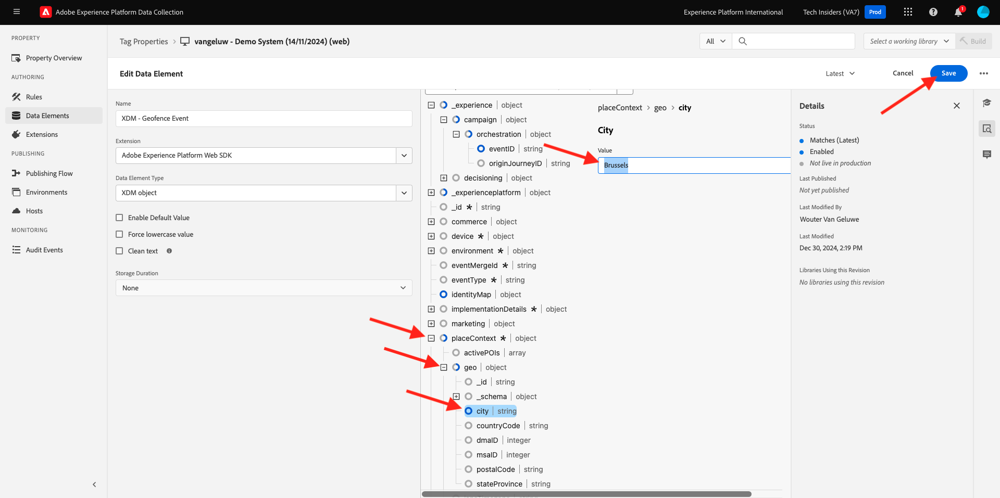

# 3.2.5 Attivare il percorso

In questo esercizio, verificherai e attiverai il percorso configurato in questo modulo.

## 3.2.5.1 Aggiornare la configurazione dell’evento recinto geografico

Vai a [Raccolta dati Adobe Experience Platform](https://experience.adobe.com/launch/) e seleziona **Tag**.

Questa è la pagina Proprietà raccolta dati di Adobe Experience Platform che hai visto prima.

In **Guida introduttiva**, Demo System ha creato due proprietà client: una per il sito Web e una per l&#39;app mobile. Trovarli cercando `--aepUserLdap--` nella casella **[!UICONTROL Cerca]**. Fare clic per aprire la proprietà **Web**.

Poi vedrai questo.

Nel menu a sinistra, vai a **Regole** e cerca la regola **Evento recinto geografico**. Fai clic sulla regola **Evento recinto geografico** per aprirla.

Vedrai quindi i dettagli di questa regola. Fare clic per aprire l&#39;azione **Adobe Experience Platform Web SDK - Invia evento**.

Quando questa azione viene attivata, vedrai che viene utilizzato un elemento dati specifico per definire la struttura dati XDM. È necessario aggiornare l&#39;elemento dati e definire l&#39;**ID evento** dell&#39;evento configurato in [Esercizio 3.2.1](./ex1.md).

Ora devi andare ad aggiornare l&#39;elemento dati **XDM - Evento recinto geografico**. A tale scopo, passare a **Elementi dati**. Cerca **XDM - Evento recinto geografico** e fai clic per aprire l&#39;elemento dati.

A questo punto viene visualizzato quanto segue:

Passare al campo `_experience.campaign.orchestration.eventID`. Rimuovi il valore corrente e incolla il tuo eventID lì.

Come promemoria, l&#39;ID evento si trova in Adobe Journey Optimizer in **Configurazioni > Eventi** e troverai l&#39;ID evento nel payload di esempio del tuo evento, che si presenta così: `"eventID": "4df8dc10731eba7b0c37af83a9db38d4de7aa6aebcce38196d9d47929b9c598e"`.

Successivamente, devi definire la città in questo elemento dati. Vai a **placeContext > geo > city** e immetti una città scelta. Fare clic su **Salva** o **Salva nella libreria**.

Infine, devi pubblicare le modifiche. Vai a **Flusso di pubblicazione** nel menu a sinistra e fai clic su **Uomo** per aprire la libreria.

Fai clic su **Aggiungi tutte le risorse modificate**, quindi fai clic su **Salva e genera in sviluppo**.

## 3.2.5.2 Attivare il percorso

Vai a [https://dsn.adobe.com](https://dsn.adobe.com). Dopo aver effettuato l’accesso con il tuo Adobe ID, visualizzerai questo. Fai clic sui tre punti **...** del progetto del sito Web, quindi fai clic su **Esegui** per aprirlo.

Poi vedrai il tuo sito web demo aperto. Seleziona l’URL e copialo negli Appunti.

Apri una nuova finestra del browser in incognito.

Incolla l’URL del sito web demo, che hai copiato nel passaggio precedente. Ti verrà quindi chiesto di effettuare l’accesso con il tuo Adobe ID.

Seleziona il tipo di account e completa la procedura di accesso.

Vedrai quindi il tuo sito web caricato in una finestra del browser in incognito. Per ogni esercizio, dovrai utilizzare una nuova finestra del browser in incognito per caricare l’URL del sito web demo.

Fai clic sull’icona del logo di Adobe nell’angolo in alto a sinistra dello schermo per aprire il Visualizzatore profili.

Apri il pannello Visualizzatore profilo e passa a Profilo cliente in tempo reale. Nel pannello Visualizzatore profili dovresti visualizzare tutti i dati personali, come gli identificatori e-mail e telefonici appena aggiunti.

Nel pannello Visualizzatore profili, fai clic su **UTILITÀ**. Immetti `geofenceevent` e fai clic su **Invia**.

>[!NOTE]
>
>Se nel pannello Visualizzatore profili non è disponibile l&#39;opzione per inviare un evento di chiamata diretta, è possibile inviarne manualmente uno aprendo la visualizzazione per sviluppatori del browser e passando a **Console**, quindi incollando e inviando il comando: `_satellite.track('geofenceevent')`.

Un paio di secondi dopo, nel canale di Slack verrà visualizzato il messaggio di Adobe Journey Optimizer.

Passaggio successivo: [Riepilogo e vantaggi](./summary.md)

[Torna al modulo 3.2](journey-orchestration-external-weather-api-sms.md)

[Torna a tutti i moduli](../../../overview.md)
