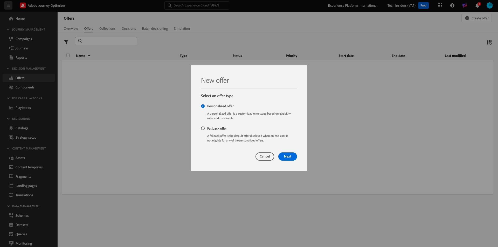

# 3.3.1 Offer decisioning 101

## 3.3.1.1 Terminologia

Per comprendere meglio Offer Decisioning, ti consigliamo vivamente di leggere la [panoramica](https://experienceleague.adobe.com/docs/journey-optimizer/using/offer-decisioniong/get-started-decision/starting-offer-decisioning.html?lang=en) sul funzionamento del servizio applicativo Offer Decisioning con Adobe Experience Platform.

Utilizzando Offer Decisioning, è necessario comprendere i seguenti concetti:

| Termine | Spiegazione |
| ------------------------- | -------------------------------------------------------------------------------------------------------------------------------------------------------------------------------------------------------------------------------------------------------- |
| **Offerta** | Un’offerta è un messaggio di marketing a cui possono essere associate delle regole che determinano gli utenti idonei per visualizzare l’offerta. Un’offerta ha uno stato: bozza, approvata o archiviata. |
| **Posizionamento** | La combinazione di posizione (o tipo di canale) e contesto (o tipo di contenuto) in cui un’offerta viene visualizzata per un utente finale. In effetti, si tratta della combinazione di testo, HTML, immagine, JSON in canali mobili, web, social, messaggistica istantanea e non digitali. |
| **Regola** | La logica che definisce e controlla l’idoneità degli utenti finali a un’offerta. |
| **Offerta Personalizzata** | Un messaggio di marketing personalizzabile basato su regole e vincoli di idoneità. |
| **Offerta di fallback** | L’offerta predefinita viene visualizzata quando un utente finale non è idoneo per nessuna delle offerte nella raccolta utilizzata. |
| **Limitazione** | Utilizzato in una definizione di offerta per definire quante volte un’offerta può essere presentata in totale e a un utente specifico. |
| **Priorità** | Livello per determinare la classificazione di priorità da un set di risultati di offerte. |
| **Raccolta** | Utilizzato per filtrare un sottoinsieme di offerte dall’elenco delle offerte personalizzate per velocizzare l’offer decisioning. |
| **Decisione** | Combinazione di un set di offerte, posizionamento e profilo per cui l’addetto marketing desidera che il motore decisionale fornisca l’offerta migliore. |
| **AEM Assets Essentials** | Un&#39;esperienza universale e centralizzata per l&#39;archiviazione, la ricerca e la selezione delle risorse nelle soluzioni Adobe Experience Cloud e Adobe Experience Platform. |

{style="table-layout:auto"}

## 3.3.1.2 Offer decisioning

Accedi a Adobe Journey Optimizer da [Adobe Experience Cloud](https://experience.adobe.com). Fare clic su **Journey Optimizer**.

Verrai reindirizzato alla visualizzazione **Home** in Journey Optimizer. Innanzitutto, assicurati di utilizzare la sandbox corretta. La sandbox da utilizzare si chiama `--aepSandboxName--`. Ti troverai quindi nella **Home** della tua sandbox `--aepSandboxName--`.

Nel menu a sinistra, fai clic su **Offerte**. Ora visualizzerai il menu Offerte, che contiene elementi come Offerte, Raccolte e Decisioni.

Fare clic su **Componenti**. Ora vedrai elementi come Posizionamenti, Qualificatore raccolta, Regole e Classificazioni.

## 3.3.1.3 Posizionamenti

Vai a **Posizionamenti**.

Nella scheda **Posizionamenti** puoi definire i posizionamenti per le offerte. Quando definisci una decisione, il posizionamento definisce dove verrà visualizzata l’offerta risultante (Tipo di canale) e in quale forma o modulo (Tipo di contenuto).

Se non vedi alcun posizionamento nell’ambiente, crealo come indicato di seguito e nella schermata.

| Nome | Tipo di canale | Tipo di contenuto |
| ---------------------- | ------------ | ------------ |
| **Non digitale - Testo** | Non digitale | Testo |
| **Web - JSON** | Web | JSON |
| **Web - HTML** | Web | HTML |
| **Web - Testo** | Web | Testo |
| **Web - Immagine** | Web | Immagine |
| **E-mail - JSON** | E-mail | JSON |
| **E-mail - HTML** | E-mail | HTML |
| **E-mail - Testo** | E-mail | Testo |
| **E-mail - Immagine** | E-mail | Immagine |

{style="table-layout:auto"}

**Nota**: non modificare i posizionamenti già disponibili.

Fai clic su un posizionamento per visualizzarne le impostazioni.

Ora vengono visualizzati tutti i campi del posizionamento:

- **Nome** del posizionamento
- **ID posizionamento**
- **Tipo di canale** per il posizionamento
- **Tipo di contenuto** del posizionamento, che può essere **Testo**, **HTML**, **Immagine** o **JSON**
- **Descrizione** campo che consente di aggiungere una descrizione aggiuntiva per il posizionamento

## 3.3.1.4 Regole decisionali

Una regola (detta anche regola di idoneità) equivale a un pubblico **1}.** Una regola è in effetti un pubblico con l’unica differenza che una regola può essere utilizzata con un’offerta per fornire l’offerta migliore a un profilo in Adobe Experience Platform.

Poiché sai già come definire i tipi di pubblico in base ai moduli di abilitazione precedenti, rivediamo rapidamente l’ambiente di segmentazione:

Vai a **Regole**. Fare clic su **+ Crea regola**.

Viene quindi visualizzata l’interfaccia di Adobe Experience Platform per la creazione del pubblico.

Ora puoi accedere a tutti i campi che fanno parte dello schema di unione per Real-time Customer Profile e creare qualsiasi regola.

È inoltre utile sapere che puoi semplicemente riutilizzare i tipi di pubblico già definiti in Adobe Experience Platform, da **Tipi di pubblico** > ``--aepTenantId--``.

A questo punto viene visualizzato quanto segue:

Se lo desideri, ora puoi configurare le tue regole. Per questo esercizio, sono necessarie due regole:

- all - Clienti maschi
- all - Clienti femminili

Se queste regole non esistono ancora, creale. Se esistono già, utilizza queste regole e non crearne di nuove.

L&#39;attributo da utilizzare per generare la regola è **Profilo individuale XDM** > **Persona** > **Genere**.

Ad esempio, ecco la definizione della regola **all - Clienti maschi**:

Ad esempio, ecco la definizione della regola **all - Clienti femmine**:

## 3.3.1.5 Offerte

Vai a **Offerte** e seleziona **Offerte**. Fare clic su **+ Crea offerta**.

Poi vedrai questo popup.

Non creare offerte ora: lo farai nel prossimo esercizio.

Ora sono disponibili due tipi di offerte:

- Offerte personalizzate
- Offerte di fallback

Un’offerta personalizzata è un contenuto specifico che deve essere visualizzato in una situazione specifica. Un’offerta personalizzata è progettata appositamente per fornire un’esperienza personale e contestuale, se sono soddisfatti criteri specifici.

Un’offerta di fallback è un’offerta che viene visualizzata se i criteri per le offerte personalizzate non sono soddisfatti.

## 3.3.1.6 Decisioni

Una decisione combina posizionamenti, una raccolta di offerte personalizzate e un’offerta di fallback che devono essere utilizzati dal motore di Offer decisioning per trovare l’offerta migliore per un profilo specifico, in base a ciascuna delle singole caratteristiche di offerta personalizzata come priorità, vincolo di idoneità e limite totale/utente.

Per configurare **Decisione**, fai clic su **Decisioni**.

Nel prossimo esercizio, configurerai le tue offerte e la tua decisione.

Passaggio successivo: [3.3.2 Configurare le offerte e la decisione](./ex2.md)

[Torna al modulo 3.3](./offer-decisioning.md)

[Torna a tutti i moduli](./../../../overview.md)
