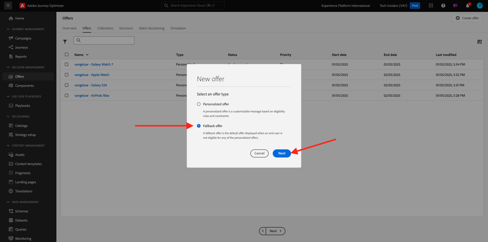
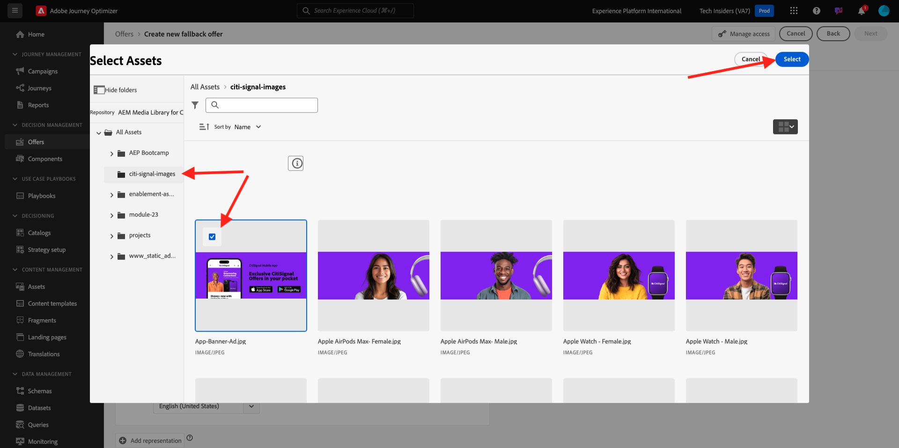
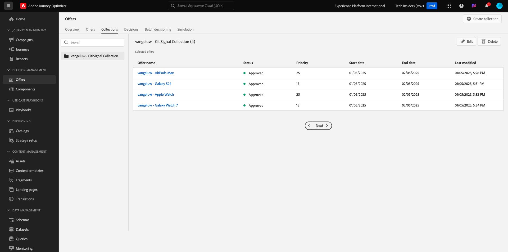

# 3.3.2 Configurare le offerte e la decisione

## 3.3.2.1 Creare le offerte personalizzate

In questo esercizio creerai quattro **offerte personalizzate**. Di seguito sono riportati i dettagli da tenere in considerazione per la creazione di tali offerte:

| Nome | Date Range | Collegamento immagine per e-mail | Collegamento immagine per il Web | Testo | Priorità | Idoneità | Lingua |
|-----|------------|----------------------|--------------------|------|:--------:|--------------|:-------:|
| `--aepUserLdap-- - Nadia Elements Shell` | oggi - 1 mese dopo | https://bit.ly/3nPiwdZ | https://bit.ly/2INwXjt | `{{ profile.person.name.firstName }}, 10% discount on Nadia Elements Shell` | 25 | all - Clienti femminili | Inglese (Stati Uniti) |
| `--aepUserLdap-- - Radiant Tee` | oggi - 1 mese dopo | https://bit.ly/2HfA17v | https://bit.ly/3pEIdzn | `{{ profile.person.name.firstName }}, 5% discount on Radiant Tee` | 15 | all - Clienti femminili | Inglese (Stati Uniti) |
| `--aepUserLdap-- - Zeppelin Yoga Pant` | oggi - 1 mese dopo | https://bit.ly/2IOaItW | https://bit.ly/2INZHZd | `{{ profile.person.name.firstName }}, 10% discount on Zeppelin Yoga Pant` | 25 | all - Clienti maschi | Inglese (Stati Uniti) |
| `--aepUserLdap-- - Proteus Fitness Jackshirt` | oggi - 1 mese dopo | https://bit.ly/330a43n | https://bit.ly/36USaQW | `{{ profile.person.name.firstName }}, 5% discount on Proteus Fitness Jackshirt` | 15 | all - Clienti maschi | Inglese (Stati Uniti) |

{style="table-layout:auto"}

Accedi a Adobe Journey Optimizer da [Adobe Experience Cloud](https://experience.adobe.com). Fare clic su **Journey Optimizer**.

Verrai reindirizzato alla visualizzazione **Home** in Journey Optimizer. Innanzitutto, assicurati di utilizzare la sandbox corretta. La sandbox da utilizzare si chiama `--aepSandboxName--`. Per passare da una sandbox all&#39;altra, fare clic su **Production Prod (VA7)** e selezionare la sandbox dall&#39;elenco. In questo esempio, la sandbox è denominata **AEP Enablement FY22**. Ti troverai quindi nella **Home** della tua sandbox `--aepSandboxName--`.

Nel menu a sinistra, fai clic su **Offerte**, quindi passa a **Offerte**. Fare clic su **+ Crea offerta**.

Poi vedrai questo popup. Seleziona **Offerta personalizzata** e fai clic su **Avanti**.

Ora sei nella visualizzazione **Dettagli**.

In questo caso, è necessario configurare l&#39;offerta `--aepUserLdap-- - Nadia Elements Shell`. Utilizzare le informazioni della tabella precedente per compilare i campi. In questo esempio, il nome dell&#39;offerta personalizzata è **vangeluw - Nadia Elements Shell**. Impostare inoltre **Data e ora inizio** su ieri e **Data e ora fine** su una data compresa tra un mese.

Una volta fatto, dovresti avere questo. Fai clic su **Avanti**.

È ora necessario creare **Rappresentazioni**. Le rappresentazioni sono una combinazione di un **posizionamento** e una risorsa reale.

Per **Rappresentazione 1**, selezionare:

- Canale: Web
- Posizionamento: Web - Immagine
- Contenuto: URL
- Percorso pubblico: copia l&#39;URL dalla colonna **Collegamento immagine per il Web** nella tabella precedente

In alternativa, è possibile selezionare **Libreria risorse** per il contenuto e quindi fare clic su **Sfoglia**.

Viene visualizzata una finestra a comparsa della libreria Assets, vai alla cartella **enablement-assets** e seleziona il file di immagine **nadia-web.png**. Quindi fare clic su **Seleziona**.

A questo punto viene visualizzato quanto segue:

Fare clic su **+ Aggiungi rappresentazione**.

Per **Rappresentazione 2**, selezionare:

- Canale: e-mail
- Posizionamento: e-mail - Immagine
- Contenuto: URL
- Percorso pubblico: copia l&#39;URL dalla colonna **Collegamento immagine per e-mail** nella tabella precedente

In alternativa, è possibile selezionare **Libreria risorse** per il contenuto e quindi fare clic su **Sfoglia**.

Viene visualizzata una finestra a comparsa della libreria Assets, vai alla cartella **enablement-assets** e seleziona il file di immagine **nadia-email.png**. Quindi fare clic su **Seleziona**.

A questo punto viene visualizzato quanto segue:

Fare clic su **+ Aggiungi rappresentazione**.

Per **Rappresentazione 3**, selezionare:

- Canale: non digitale
- Posizionamento: non digitale - Testo

Successivamente, devi aggiungere il contenuto. In questo caso significa aggiungere il testo da utilizzare come invito all’azione.

Fare clic su **Aggiungi contenuto**.

Poi vedrai questo popup.

Seleziona **Testo personalizzato** e compila questi campi:

Osserva il campo **Testo** della tabella precedente e immetti qui il testo, in questo caso: `{{ profile.person.name.firstName }}, 10% discount on Nadia Elements Shell`.

Puoi anche selezionare qualsiasi attributo di profilo e includerlo come campo dinamico nel testo dell’offerta. In questo esempio, il campo `{{ profile.person.name.firstName }}` assicurerà che il nome del cliente che riceverà questa offerta sarà incluso nel testo dell&#39;offerta.

Poi vedrai questo. Fai clic su **Salva**.

Ora hai questo. Fai clic su **Avanti**.

A questo punto viene visualizzato quanto segue:

Seleziona **Per regola di decisione definita** e fai clic sull&#39;icona **+** per aggiungere la regola **all - Clienti femmine**.

Poi vedrai questo. Compila la **Priorità** come indicato nella tabella precedente. Fai clic su **Avanti**.

Viene quindi visualizzata una panoramica della nuova **offerta personalizzata**.

Infine, fare clic su **Salva e approva**.

Vedrai quindi che la tua Offerta personalizzata appena creata diventa disponibile nella Panoramica delle offerte:

Ora dovresti ripetere i passaggi precedenti per creare le altre tre offerte personalizzate per i prodotti Radiant Tee, Zeppelin Yoga Pant e Proteus Fitness Jackshirt.

Al termine, la schermata **Panoramiche offerte** per **Offerte personalizzate** dovrebbe mostrare tutte le offerte.

## 3.3.2.2 Creare l’offerta di fallback

Dopo aver creato quattro offerte personalizzate, ora devi configurare una **offerta di fallback**.

Verifica di essere nella visualizzazione **Offerte**:

Fare clic su **+ Crea offerta**.

Poi vedrai questo popup. Seleziona **Offerta di fallback** e fai clic su **Avanti**.

A questo punto viene visualizzato quanto segue:

Immetti questo nome per l&#39;offerta di fallback: `--aepUserLdap-- - Luma Fallback Offer`. Fai clic su **Avanti**.

È ora necessario creare **Rappresentazioni**. Le rappresentazioni sono una combinazione di un **posizionamento** e una risorsa reale.

Per **Rappresentazione 1**, selezionare:

- Canale: Web
- Posizionamento: Web - Immagine
- Contenuto: URL
- Percorso pubblico: `https://bit.ly/3nBOt9h`

In alternativa, è possibile selezionare **Libreria risorse** per il contenuto e quindi fare clic su **Sfoglia**.

Viene quindi visualizzata una finestra a comparsa della libreria Assets, vai alla cartella **enablement-assets** e seleziona il file di immagine **spriteyogastraps-web.png**. Quindi fare clic su **Seleziona**.

A questo punto viene visualizzato quanto segue:

Per **Rappresentazione 2**, selezionare:

- Canale: e-mail
- Posizionamento: e-mail - Immagine
- Contenuto: URL
- Percorso pubblico: `https://bit.ly/3nF4qvE`

In alternativa, è possibile selezionare **Libreria risorse** per il contenuto e quindi fare clic su **Sfoglia**.

Viene quindi visualizzata una finestra a comparsa della libreria Assets, vai alla cartella **enablement-assets** e seleziona il file di immagine **spriteyogastraps-email.png**. Quindi fare clic su **Seleziona**.

A questo punto viene visualizzato quanto segue:

Fare clic su **+ Aggiungi rappresentazione**.

Per **Rappresentazione 3**, selezionare:

- Canale: non digitale
- Posizionamento: non digitale - Testo

Successivamente, devi aggiungere il contenuto. In questo caso significa aggiungere il collegamento immagine.

Fare clic su **Aggiungi contenuto**.

Poi vedrai questo popup.

Seleziona **Testo personalizzato** e compila questi campi:

Immettere il testo `{{ profile.person.name.firstName }}, discover our Sprite Yoga Straps!` e fare clic su **Salva**.

Poi vedrai questo. Fai clic su **Avanti**.

Viene quindi visualizzata una panoramica della nuova **Offerta di fallback**. Fai clic su **Fine**.

Infine, fare clic su **Salva e approva**.

Nella schermata **Panoramiche offerte**, viene visualizzato quanto segue:

## 3.3.2.3 Creare la raccolta

Una raccolta viene utilizzata per **filtrare** un sottoinsieme di offerte dall&#39;elenco delle offerte personalizzate e utilizzarlo come parte di una decisione al fine di velocizzare il processo decisionale.

Vai a **Raccolte**. Fare clic su **+ Crea raccolta**.

Poi vedrai questo popup. Configura la tua raccolta in questo modo. Fai clic su **Avanti**.

- Nome raccolta: utilizzare `--aepUserLdap-- - Luma Collection`
- Selezionare **Crea raccolta statica**.

Nella schermata successiva, seleziona le quattro **offerte personalizzate** create nell&#39;esercizio precedente. Fai clic su **Salva**.

Ora visualizzerai questo:

## 3.3.2.4 Creare una decisione

Una decisione combina posizionamenti, una raccolta di offerte personalizzate e un’offerta di fallback che dovrà essere utilizzata dal motore di Offer decisioning per trovare l’offerta migliore per un profilo specifico, in base a ciascuna delle singole caratteristiche di offerta personalizzata come priorità, vincolo di idoneità e limite totale/utente.

Per configurare **Decisione**, passa a **Decisioni**. Fare clic su **+ Crea attività**.

A questo punto viene visualizzato quanto segue:

Compila i campi in questo modo. Fai clic su **Avanti**.

- Nome: `--aepUserLdap-- - Luma Decision`
- Data e ora di inizio: ieri
- Data e ora di fine: oggi + 1 mese

Nella schermata successiva, devi aggiungere posizionamenti negli ambiti decisionali. Dovrai creare ambiti decisionali per i posizionamenti **Web - Immagine**, **E-mail - Immagine** e **Non digitale - Testo**.

Innanzitutto, crea l&#39;ambito di decisione per **Non digitale - Testo** selezionando tale posizione nel menu a discesa. Quindi fare clic sul pulsante **Aggiungi** per aggiungere i criteri di valutazione.

Seleziona la tua raccolta `--aepUserLdap-- - Luma Collection` e fai clic su **Aggiungi**.

Poi vedrai questo. Fare clic sul pulsante **-** per aggiungere un nuovo ambito di decisione.

Selezionare il posizionamento **Web - Immagine** e aggiungere la raccolta `--aepUserLdap-- - Luma Collection` in base ai criteri di valutazione. Quindi, fare nuovamente clic sul pulsante **+** per aggiungere un nuovo ambito di decisione.

Seleziona il posizionamento **E-mail - Immagine** e aggiungi la tua raccolta `--aepUserLdap-- - Luma Collection` in base ai criteri di valutazione. Quindi fare clic su **Avanti**.

È ora necessario selezionare **Offerta di fallback**, denominata `--aepUserLdap-- - Luma Fallback Offer`. Fai clic su **Avanti**.

Rivedi la tua decisione. Fai clic su **Fine**.

Nel popup, fare clic su **Salva e attiva**.

E infine, vedrai la tua decisione nella panoramica:

La decisione è stata configurata correttamente. La tua decisione è ora live e può essere utilizzata per fornire ai clienti offerte ottimizzate e personalizzate in tempo reale.

Passaggio successivo: [3.3.3 Prepara la proprietà del client di raccolta dati e la configurazione dell&#39;SDK Web per l&#39;Offer decisioning](./ex3.md)

[Torna al modulo 3.3](./offer-decisioning.md)

[Torna a tutti i moduli](./../../../overview.md)
