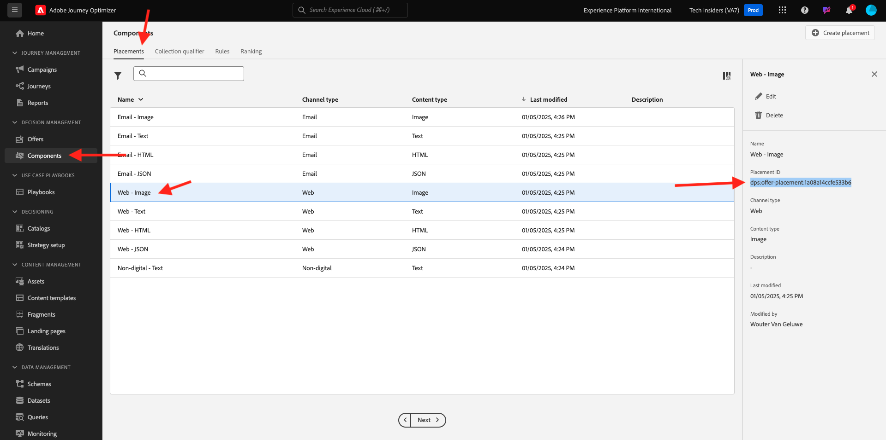
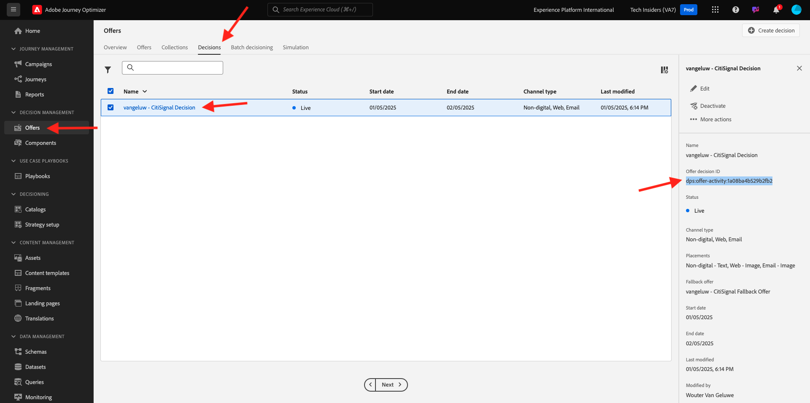
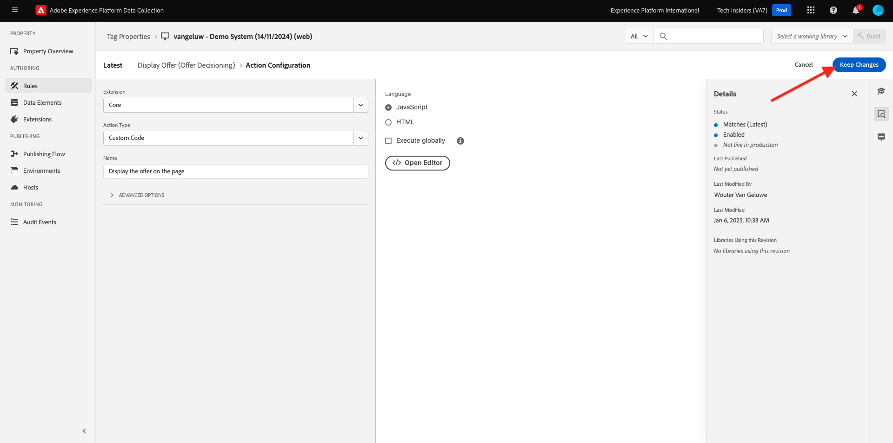

# 3.3.3 Prepara la proprietà client di Adobe Experience Platform Data Collection e la configurazione dell’SDK per web, ad Offer decisioning

## 3.3.3.1 Aggiornare lo stream di dati

Nell&#39;esercizio [0.2](./../../../modules/gettingstarted/gettingstarted/ex2.md) hai creato **[!UICONTROL Datastream]** personalizzato. È stato quindi utilizzato il nome `--demoProfileLdap-- - Demo System Datastream`.

In questo esercizio, devi configurare **[!UICONTROL Datastream]** affinché funzioni con **[!DNL Offer Decisioning]**.

Per eseguire questa operazione, vai a [https://experience.adobe.com/#/data-collection/](https://experience.adobe.com/it#/data-collection/). Poi vedrai questo. Fare clic su **[!UICONTROL Datastreams]** o **[!UICONTROL Datastreams (Beta)]**.

Nell&#39;angolo in alto a destra dello schermo, seleziona il nome della sandbox, che dovrebbe essere `--aepSandboxId--`.


Cerca il **[!UICONTROL flusso di dati]**, denominato `--demoProfileLdap-- - Demo System Datastream`. Fai clic sul **[!UICONTROL Datastream]** per aprirlo.


Poi vedrai questo. Fare clic su **...** accanto a **Adobe Experience Platform** e quindi su **Modifica**.


Per abilitare **[!DNL Offer Decisioning]**, selezionare la casella per **[!DNL Offer Decisioning]**. Fai clic su **Salva**.


Il **[!UICONTROL Datastream]** è ora pronto per funzionare con **[!DNL Offer Decisioning]**.


## 3.3.3.2 Configura la proprietà Client di raccolta dati di Adobe Experience Platform per richiedere offerte personalizzate

Vai a [https://experience.adobe.com/#/data-collection/](https://experience.adobe.com/it#/data-collection/), a **[!UICONTROL Client]**. Cercare le proprietà della raccolta dati, denominate `--demoProfileLdap-- - Demo System (DD/MM/YYYY)`. Apri la proprietà del client Data Collection per il Web.


Nella tua proprietà, vai a **[!UICONTROL Regole]** e apri la regola **[!UICONTROL Visualizzazione pagina]**.


Fai clic per aprire [!UICONTROL Azione] **[!UICONTROL AEP Web SDK - Invia evento]**.


Poi vedrai questo. Noterai l&#39;opzione di menu per **[!UICONTROL ambiti decisionali]**.


Per ogni richiesta inviata al server Edge e a Adobe Experience Platform, è possibile fornire uno o più **[!UICONTROL ambiti decisionali]**. Un ambito **[!UICONTROL Decisione]** è una combinazione di due elementi:

- [!UICONTROL ID decisione]
- [!UICONTROL ID posizionamento]

Diamo prima un&#39;occhiata dove puoi trovare questi due elementi.

### 3.3.3.2.1 Recupera [!UICONTROL ID posizionamento]

L&#39;[!UICONTROL ID posizionamento] identifica la posizione e il tipo di risorsa necessari. Ad esempio, l&#39;immagine protagonista nella home page del sito Web Luma corrisponde all&#39;[!UICONTROL ID posizionamento] per [!UICONTROL Web - Immagine].

>[!NOTE]
>
>Come parte del modulo 6, hai già configurato un’attività Adobe Target Experience Targeting che modificherà l’immagine della posizione principale sulla home page, come puoi vedere nella schermata. Ai fini dell’esercizio, ora farai apparire le offerte sull’immagine sotto l’immagine protagonista come indicato nella schermata.


Per trovare l&#39;[!UICONTROL ID posizionamento] per [!UICONTROL Web - Immagine], vai a Adobe Journey Optimizer da [Adobe Experience Cloud](https://experience.adobe.com). Fare clic su **Journey Optimizer**.


Verrai reindirizzato alla visualizzazione **Home** in Journey Optimizer. Innanzitutto, assicurati di utilizzare la sandbox corretta. La sandbox da utilizzare si chiama `--aepSandboxId--`. Per passare da una sandbox all&#39;altra, fare clic su **Production Prod (VA7)** e selezionare la sandbox dall&#39;elenco. In questo esempio, la sandbox è denominata **AEP Enablement FY22**. Ti troverai quindi nella **Home** della tua sandbox `--aepSandboxId--`.


Quindi, vai a [!UICONTROL Componenti] e quindi a [!UICONTROL Posizionamenti]. Fai clic sul posizionamento [!UICONTROL Web - Immagine] per visualizzarne i dettagli.



Come puoi vedere nell&#39;immagine precedente, in questo esempio l&#39;[!UICONTROL ID posizionamento] è `xcore:offer-placement:14bf09dc4190ebba`. Scrivere il [!UICONTROL ID posizionamento] per il posizionamento per [!UICONTROL Web - Immagine] in quanto sarà necessario nel prossimo esercizio.

### 3.3.3.2.2 Recupera [!UICONTROL ID decisione]

L&#39;[!UICONTROL ID decisione] identifica la combinazione di offerte personalizzate e offerte di fallback che si desidera utilizzare. Nell&#39;esercizio precedente, hai creato la tua [!UICONTROL decisione] e l&#39;hai denominata `--demoProfileLdap-- - Luma Decision`.

Per trovare l&#39;[!UICONTROL ID decisione] per `--demoProfileLdap-- - Luma Decision`, vai a [https://platform.adobe.com](https://platform.adobe.com).

Quindi, passa a [!UICONTROL Offerte] e vai a [!UICONTROL Decisioni]. Fai clic per selezionare la [!UICONTROL decisione], denominata `--demoProfileLdap-- - Luma Decision`.



Come puoi vedere nell&#39;immagine precedente, in questo esempio [!UICONTROL ID decisione] è `xcore:offer-activity:14c052382e1b6505`. Scrivere l&#39;[!UICONTROL ID decisione] per la decisione `--demoProfileLdap-- - Luma Decision` in quanto sarà necessario nel prossimo esercizio.

Dopo aver recuperato i due elementi necessari per creare **[!UICONTROL ambiti decisionali]**, puoi continuare con il passaggio successivo, che comporta la codifica dell&#39;ambito decisionale.

### 3.3.3.2.3 Codifica BASE64

**[!UICONTROL Ambito decisione]** da immettere è una stringa con codifica BASE64. Questa stringa con codifica BASE64 è una combinazione di [!UICONTROL ID posizionamento] e [!UICONTROL ID decisione], come illustrato di seguito.

```json
{
  "activityId":"xcore:offer-activity:14c052382e1b6505",
  "placementId":"xcore:offer-placement:14bf09dc4190ebba"
}
```

L&#39;**[!UICONTROL Ambito decisione]** può essere generato in due modi:

- Utilizza un servizio pubblico come [https://www.base64encode.org/](https://www.base64encode.org/). Immetti il codice JSON come indicato in precedenza, fai clic su **[!UICONTROL Codifica]** per ottenere la stringa con codifica BASE64 di seguito.

  

- Recupera la stringa con codifica BASE64 da Adobe Experience Platform. Vai a [!UICONTROL Decisioni] e fai clic per aprire la [!UICONTROL Decisione], che si chiama `--demoProfileLdap-- - Luma Decision`.

  

  Dopo aver aperto `--demoProfileLdap-- - Luma Decision`, verrà visualizzato questo messaggio. Individua il posizionamento [!UICONTROL Web - Immagine] e fai clic sul pulsante **[!UICONTROL Copia]**. Fare clic su **[!UICONTROL Ambito di decisione codificato]**. L&#39;**[!UICONTROL Ambito decisione]** è ora copiato negli Appunti.

  

Quindi, torna a Launch, alla tua azione **[!UICONTROL AEP Web SDK - Invia evento]**.


Incolla l’ambito di decisione codificato nel campo di input.


Salva le modifiche nell&#39;azione **[!UICONTROL AEP Web SDK - Invia evento]** facendo clic su **[!UICONTROL Mantieni modifiche]**.


Fare clic su **[!UICONTROL Salva]** o **[!UICONTROL Salva nella libreria]**


In Raccolta dati Adobe Experience Platform, vai a **[!UICONTROL Flusso di pubblicazione]** e apri la **[!UICONTROL Libreria di sviluppo]** denominata **[!UICONTROL Principale]**. Fare clic su **[!UICONTROL + Aggiungi tutte le risorse modificate]** e quindi su **[!UICONTROL Salva e genera per sviluppo]**. Le modifiche verranno ora pubblicate sul sito web della demo.


Ogni volta che carichi una **pagina generale**, come ad esempio la home page del sito Web demo, l&#39;Offer decisioning valuterà l&#39;offerta applicabile e restituirà una risposta al sito Web con i dettagli dell&#39;offerta da mostrare. La visualizzazione dell’offerta sul sito web richiede una configurazione aggiuntiva, che verrà eseguita nel passaggio successivo.

## 3.3.3.3 Configura la proprietà Client di raccolta dati di Adobe Experience Platform per ricevere e applicare offerte personalizzate

Vai a [https://experience.adobe.com/#/data-collection/](https://experience.adobe.com/it#/data-collection/), a **[!UICONTROL Proprietà]**. Cercare le proprietà della raccolta dati, denominate `--demoProfileLdap-- - Demo System (DD/MM/YYYY)`. Apri la proprietà Data Collection per il Web.


Nella tua proprietà, passa a **[!UICONTROL Regole]**.


Cerca e apri la regola **Decisione ricevuta**.


Poi vedrai questo. Apri l&#39;azione **Inserisci l&#39;offerta nella pagina**.


Fai clic su **[!UICONTROL Apri editor]**


Sovrascrivi il codice incollando il codice seguente nell’editor.

```javascript
if(!Array.isArray(event.decisions)) {
  console.log('No decisions returned')
  return;
}
console.log("decision",event.decisions)

event.decisions.forEach(function(payload) {
  payload.items.forEach(function(item){
    console.log("Response from Offer Decisioning ", item.data.content);
   
    var element = document.querySelector("#root > div > div > div.app-content > div > section.feature_part.padding_top > div > div.row.align-items-center.justify-content-between > div.col-lg-7.col-sm-6.\\30  > div");
    if(!element){
      console.log("Offer Placement Area Selector not found")
      return;
    }
    if(!item.data){
      return
    }
    //check if offer already exists
    var offer = document.querySelector("#root > div > div > div.app-content > div > section.feature_part.padding_top > div > div.row.align-items-center.justify-content-between > div.col-lg-7.col-sm-6.\\30  > div");
    if(!offer){ 
      element.insertAdjacentHTML('afterbegin', item.data.content) 
    }
    else { 
      console.log("item.data.deliveryURL: " + item.data.deliveryURL)
      document.querySelector("#root > div > div > div.app-content > div > section.feature_part.padding_top > div > div.row.align-items-center.justify-content-between > div.col-lg-7.col-sm-6.\\30  > div").style.background="url('"+item.data.deliveryURL+"')";
      document.querySelector("#root > div > div > div.app-content > div > section.feature_part.padding_top > div > div.row.align-items-center.justify-content-between > div.col-lg-7.col-sm-6.\\30  > div").style.backgroundRepeat="no-repeat";
      document.querySelector("#root > div > div > div.app-content > div > section.feature_part.padding_top > div > div.row.align-items-center.justify-content-between > div.col-lg-7.col-sm-6.\\30  > div").style.backgroundPosition="center center";
      document.querySelector("#root > div > div > div.app-content > div > section.feature_part.padding_top > div > div.row.align-items-center.justify-content-between > div.col-lg-7.col-sm-6.\\30  > div").style.backgroundSize = "contain";
    }  
  })
});
```

Le righe 26-27-28-29 applicano al sito web l&#39;immagine restituita dall&#39;Offer decisioning. Fai clic su **[!UICONTROL Salva]**.


Fai clic su **[!UICONTROL Mantieni modifiche]**.



Fare clic su **[!UICONTROL Salva]** o **[!UICONTROL Salva nella libreria]**


In Raccolta dati Adobe Experience Platform, vai a **[!UICONTROL Flusso di pubblicazione]** e apri la **[!UICONTROL Libreria di sviluppo]** denominata **[!UICONTROL Principale]**. Fare clic su **[!UICONTROL + Aggiungi tutte le risorse modificate]** e quindi su **[!UICONTROL Salva e genera per sviluppo]**. Le modifiche verranno ora pubblicate sul sito web della demo.


Con questa modifica, questa regola nella raccolta dati di Adobe Experience Platform ascolterà la risposta di Offer Decisioning che fa parte della risposta dell’SDK web e, quando la risposta viene ricevuta, l’immagine dell’offerta verrà visualizzata sulla pagina home.

Osservando il sito web demo, vedrai che questa immagine verrà sostituita ora:

>[!NOTE]
>
>Come parte del modulo 6, hai già configurato un’attività Adobe Target Experience Targeting che modificherà l’immagine della posizione principale sulla home page, come puoi vedere nella schermata. Ai fini dell’esercizio, ora farai apparire le offerte sull’immagine sotto l’immagine protagonista come indicato nella schermata.


E invece delle immagini predefinite del sito web Luma, ora vedrai un’offerta come questa. In questo caso, viene visualizzata l’offerta di fallback.


Hai configurato 2 tipi di personalizzazione:

- 1 attività Targeting esperienza con Adobe Target nel modulo 6
- 1 Offer decisioning di implementazione tramite la proprietà Data Collection

Nel prossimo esercizio vedrai come combinare le offerte e le decisioni che sono state create in Adobe Journey Optimizer con un’attività Targeting esperienza di Adobe Target.

Passaggio successivo: [3.3.4 Combina Adobe Target e Offer Decisioning](./ex4.md)

[Torna al modulo 3.3](./offer-decisioning.md)

[Torna a tutti i moduli](./../../../overview.md)
