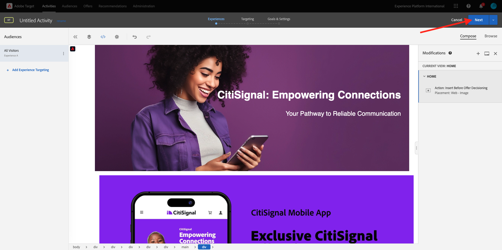

# 3.3.4 Combinare Adobe Target e Offer Decisioning

## 3.3.4.1 Raccogliere il collegamento condivisibile del progetto demo

Per caricare il progetto demo del sito web in Adobe Target, devi innanzitutto raccogliere un collegamento speciale che consenta ad Adobe Target di caricare il progetto demo del sito web.

Per eseguire questa operazione, vai a [https://dsn.adobe.com/projects](https://builder.adobedemo.com/projects). Dopo aver effettuato l’accesso con il tuo Adobe ID, visualizzerai questo. Fai clic sul progetto del tuo sito web per aprirlo.

Ora vedrai questo. Vai a **Condividi**. Fare clic su **Genera collegamento** e quindi copiare il collegamento negli Appunti.

Vai a [https://bitly.com](https://bitly.com), incolla il collegamento copiato e fai clic su **Crea collegamento**.

Verrà visualizzato un collegamento abbreviato, simile al seguente: `https://adobe.ly/3PpGcFk`. Sarà necessario il collegamento nell&#39;esercizio successivo.

## 3.3.4.2 Raccolta

Passare alla home page di Adobe Experience Cloud da [https://experiencecloud.adobe.com/](https://experiencecloud.adobe.com/). Fai clic su **Target**.

Nella home page di **Adobe Target** verranno visualizzate tutte le attività esistenti. Fai clic su **Crea attività** e quindi su **Targeting esperienza**.

Ora seleziona **Visivo** e incolla il collegamento abbreviato nel campo **Inserisci l&#39;URL attività**. Fai clic su **Crea**.

Vedrai quindi il tuo progetto demo del sito web caricato nel Compositore esperienza visivo.

>[!NOTE]
>
>Nel caso in cui il sito Web non venga caricato correttamente, installa e abilita questa estensione Chrome: **Adobe Target VEC Helper** dal Chrome Web Store, quindi riprova.

Fare clic sull&#39;area contenente l&#39;offerta Disney+. Assicurarsi di selezionare il **contenitore** completo. Fai clic su **Inserisci prima**, quindi seleziona **Decisione offerta**.

Poi vedrai questo popup. Seleziona la sandbox `--aepSandboxName--` e quindi il posizionamento **Web - Immagine**.

Quindi, selezionare la decisione `--aepUserLdap-- - CitiSignal Decision`. Fai clic su **Salva**.

Poi vedrai questo. Fai clic su **Rivedi regola**.

Assicurati che la regola di aggiunta del modello **URL** **contenga** **nome-progetto**. Fai clic su **Salva**.

Poi vedrai questo. Fai clic su **Avanti**.

Immettere un nome per l&#39;offerta, utilizzare questo nome: `--aepUserLdap-- - XT with Offers (VEC)`. Fai clic su **Avanti**.

Poi vedrai questo. Definisci la **metrica obiettivo** come indicato. Fai clic su **Salva e chiudi**.

L&#39;offerta è stata creata ed è in fase di pubblicazione. Una volta pubblicata l’offerta, puoi attivarla.

Passaggio successivo: [3.3.5 Utilizza la tua decisione in un messaggio e-mail e sms](./ex5.md)

[Torna al modulo 3.3](./offer-decisioning.md)

[Torna a tutti i moduli](./../../../overview.md)
