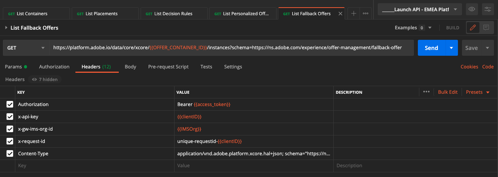

# 3.3.6 Testare la decisione utilizzando l’API

## 3.3.6.1 Utilizzare l’API Offer Decisioning tramite Postman

Scarica [questa raccolta Postman per Offer Decisioning](./../../../assets/postman/postman_offer-decisioning.zip) sul desktop e decomprimi. A questo punto si otterrà:

Il file è ora disponibile sul desktop:

- [!UICONTROL _Modulo 14- Decisioning Service.postman_collection.json]

In [Esercizio 2.1.3 - Autenticazione Postman per Adobe I/O](./../../../modules/rtcdp-b2c/module2.1/ex3.md) hai installato Postman. Per questo esercizio dovrai utilizzare nuovamente Postman.

Apri Postman. Fai clic su **[!UICONTROL Importa]**.

Fai clic su **[!UICONTROL Carica file]**.

Seleziona il file **[!UICONTROL _Module 14- Decisioning Service.postman_collection.json]** e fai clic su **[!UICONTROL Apri]**.

La raccolta sarà quindi disponibile in Postman.

Ora disponi di tutto il necessario in Postman per iniziare a interagire con Adobe Experience Platform tramite le API.

### 3.3.6.1.1 Elenco dei contenitori

Fai clic per aprire la richiesta **[!UICONTROL GET - Contenitori elenco]**.

Sotto **[!UICONTROL Params]**, vedrai questo:

- proprietà: `_instance.parentName==aepenablementfy22`

In questo parametro, **[!UICONTROL aepenablementfy22]** è il nome della sandbox utilizzata in Adobe Experience Platform. La sandbox da utilizzare è `--aepSandboxName--`. Sostituire il testo **[!UICONTROL aepenablementfy22]** con `--aepSandboxName--`.

Dopo aver sostituito il nome della sandbox, fai clic su **[!UICONTROL Invia]**.

Questa è la risposta, che mostra il contenitore di offerta per la sandbox specificata. Copia l&#39;**[!UICONTROL instanceId]** del contenitore come indicato di seguito e scrivilo in un file di testo sul computer. Per il prossimo esercizio dovrai utilizzare **[!UICONTROL contenitore instanceId]**.

### 3.3.6.1.2 Elenco dei posizionamenti

Fai clic per aprire la richiesta **[!UICONTROL GET - Elenca posizionamenti]**. Fai clic su **[!UICONTROL Invia]**.

Ora puoi visualizzare tutti i posizionamenti disponibili nel contenitore delle offerte. I posizionamenti visualizzati sono stati definiti nell&#39;interfaccia utente di Adobe Experience Platform, come è possibile vedere nell&#39;esercizio [3.3.1.3](./ex1.md).

### 3.3.6.1.3 Elencare le regole di decisione

Fai clic per aprire la richiesta **[!UICONTROL GET - Elenca regole di decisione]**. Fai clic su **[!UICONTROL Invia]**.

Nella risposta verranno visualizzate le regole di decisione definite nell&#39;interfaccia utente di Adobe Experience Platform, come è possibile vedere nell&#39;esercizio [3.3.1.4](./ex1.md).

### 3.3.6.1.4 Elencare Offerte Personalizzate

Fai clic per aprire la richiesta **[!UICONTROL GET - Elenco offerte personalizzate]**. Fai clic su **[!UICONTROL Invia]**.

Nella risposta verranno visualizzate le offerte personalizzate definite nell&#39;interfaccia utente di Adobe Experience Platform in [Esercizio 3.3.2.1](./ex2.md).

### 3.3.6.1.5 Elenco delle offerte di fallback

Fai clic per aprire la richiesta **[!UICONTROL GET - Elenca offerte di fallback]**. Fai clic su **[!UICONTROL Invia]**.

Nella risposta verrà visualizzata l&#39;offerta di fallback definita nell&#39;interfaccia utente di Adobe Experience Platform in [Esercizio 3.3.2.2](./ex2.md).

### 3.3.6.1.6 Raccolte di elenchi

Fai clic per aprire la richiesta **[!UICONTROL GET - Elenca raccolte]**.

Nella risposta verrà visualizzata la raccolta definita nell&#39;interfaccia utente di Adobe Experience Platform in [Esercizio 3.3.2.3](./ex2.md).

### 3.3.6.1.7 Ottieni offerte dettagliate per il profilo cliente

Fai clic per aprire la richiesta **[!UICONTROL POST - Ottieni offerte dettagliate per il profilo cliente]**. Questa richiesta è simile alla precedente, ma restituirà effettivamente dettagli come URL dell’immagine, testo, ecc.

Per questa richiesta, simile all&#39;esercizio precedente che ha requisiti simili, devi fornire i valori per **[!UICONTROL xdm:placementId]** e **[!UICONTROL xdm:activityId]** per recuperare i dettagli dell&#39;offerta specifica per un cliente.

È necessario compilare il campo **[!UICONTROL xdm:activityId]**. Puoi recuperarlo nell’interfaccia utente di Adobe Experience Platform, come indicato di seguito.

È necessario compilare il campo **[!UICONTROL xdm:placementId]**. Puoi recuperarlo nell’interfaccia utente di Adobe Experience Platform, come indicato di seguito. Nell&#39;esempio seguente è possibile visualizzare il placementId per il posizionamento **[!UICONTROL Web - Immagine]**.

Vai a **[!UICONTROL Corpo]** e immetti l&#39;indirizzo e-mail del cliente per il quale desideri richiedere un&#39;offerta. Fai clic su **[!UICONTROL Invia]**.

Infine, vedrai il risultato di che tipo di offerta personalizzata e quali risorse devono essere visualizzate al cliente.

Hai completato l&#39;esercizio.

Passaggio successivo: [Riepilogo e vantaggi](./summary.md)

[Torna al modulo 3.3](./offer-decisioning.md)

[Torna a tutti i moduli](./../../../overview.md)
