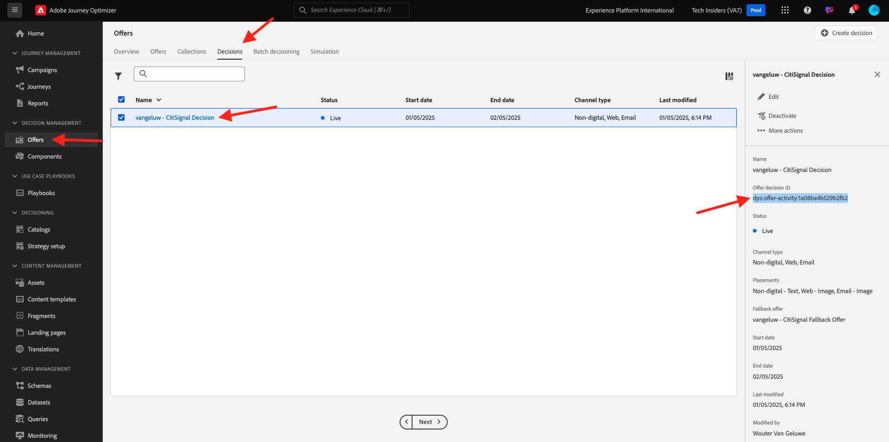

# 3.3.6 Testare la decisione utilizzando l’API

## 3.3.6.1 Utilizzare l’API Offer Decisioning tramite Postman

Scarica [questa raccolta Postman per Offer Decisioning](./../../../assets/postman/postman_offer-decisioning.zip) sul desktop e decomprimi. A questo punto si otterrà:

Il file è ora disponibile sul desktop:

- `_AJO- Decisioning Service.postman_collection.json`

In [Esercizio 2.1.3 - Autenticazione Postman per Adobe I/O](./../../../modules/rtcdp-b2c/module2.1/ex3.md) hai installato Postman. Per questo esercizio dovrai utilizzare nuovamente Postman.

Aprire Postman e importare il file `_AJO- Decisioning Service.postman_collection.json`. La raccolta sarà quindi disponibile in Postman.

Ora disponi di tutto il necessario in Postman per iniziare a interagire con Adobe Experience Platform tramite le API.

Prima di poter utilizzare le API seguenti, assicurati di autenticare nuovamente utilizzando la raccolta **Adobe IO - OAuth** configurata nell&#39;esercizio 2.1.3.

### 3.3.6.2 Ottenere offerte per il profilo cliente

Fai clic per aprire la richiesta **POST - Ottieni offerte per il profilo cliente**. La prima cosa da aggiornare è la variabile **Header** per **x-sandbox-name**. Impostare su `--aepSandboxName--`.

Per questa richiesta, sono presenti diversi campi che devono essere aggiornati. Vai a **Corpo**.

- **xdm:placementId**
- **xdm:activityId**
- **xdm:id**
- **xdm:itemCount** (impostalo come valore a scelta)

È necessario compilare il campo **xdm:activityId**. Puoi recuperarlo nell’interfaccia utente di Adobe Experience Platform, come indicato di seguito.

È necessario compilare il campo **[!UICONTROL xdm:placementId]**. Puoi recuperarlo nell’interfaccia utente di Adobe Experience Platform, come indicato di seguito. Nell&#39;esempio seguente è possibile visualizzare il placementId per il posizionamento **[!UICONTROL Web - Immagine]**.

Per il campo **xdm:id**, immetti l&#39;indirizzo e-mail del profilo cliente per il quale desideri richiedere un&#39;offerta. Una volta impostati tutti i valori come desiderato, fare clic su **[!UICONTROL Invia]**.

Infine, vedrai il risultato di che tipo di offerta personalizzata e quali risorse devono essere visualizzate al cliente. In questo esempio sono stati richiesti 2 elementi e, come puoi vedere, sono state restituite 2 offerte personalizzate. 1 offerta per Apple Watch e un’altra offerta per Galaxy Watch 7.

Hai completato l&#39;esercizio.

Passaggio successivo: [Riepilogo e vantaggi](./summary.md)

[Torna al modulo 3.3](./offer-decisioning.md)

[Torna a tutti i moduli](./../../../overview.md)
