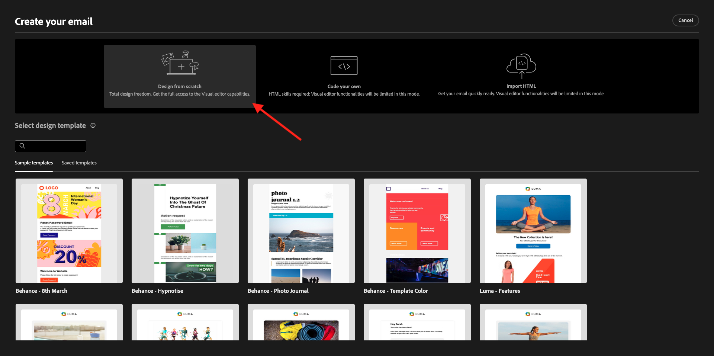
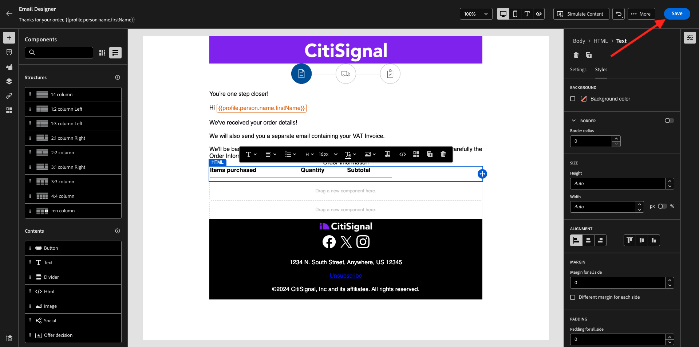
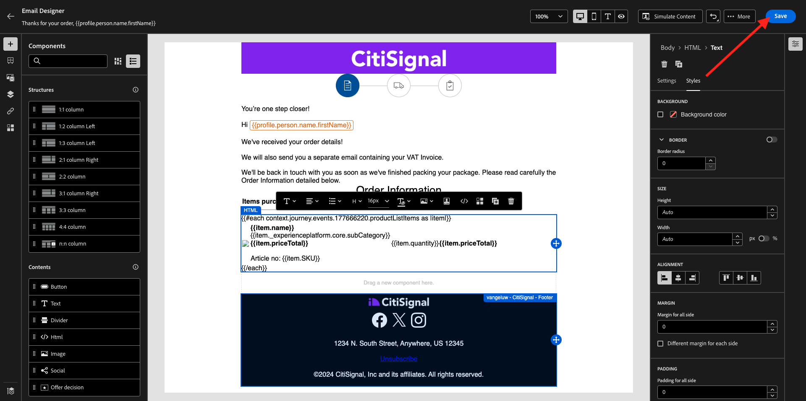
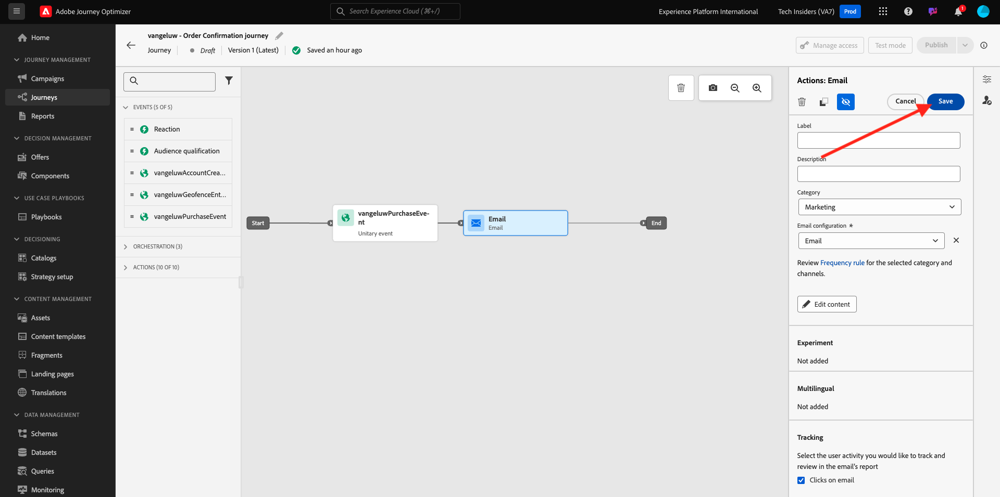
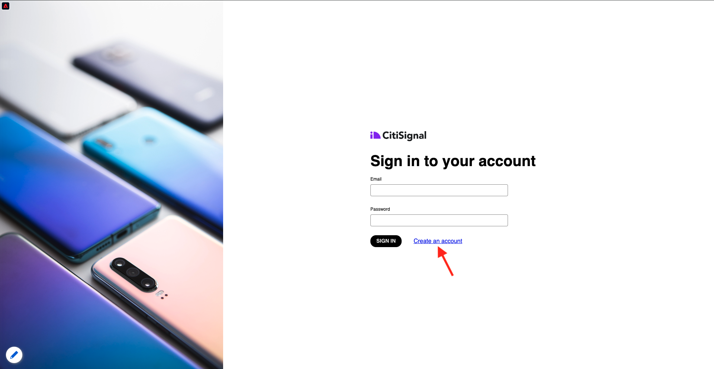
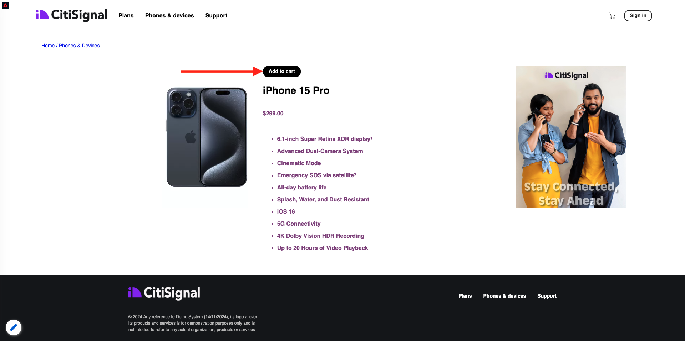

# 3.4.1 Configurare un percorso basato su trigger - Conferma dell’ordine

Accedi a Adobe Journey Optimizer da [Adobe Experience Cloud](https://experience.adobe.com). Fare clic su **Journey Optimizer**.


Verrai reindirizzato alla visualizzazione **Home** in Journey Optimizer. Innanzitutto, assicurati di utilizzare la sandbox corretta. La sandbox da utilizzare si chiama `--aepSandboxName--`. Ti troverai quindi nella **Home** della tua sandbox `--aepSandboxName--`.


## 3.4.1.1 Creare l’evento

Nel menu, vai a **Configurazioni** e fai clic su **Gestisci** in **Eventi**.


Nella schermata **Eventi** verrà visualizzata una visualizzazione simile a questa. Fare clic su **Crea evento**.


Viene quindi visualizzata una configurazione dell’evento vuota.

Prima di tutto, assegna all&#39;evento un nome come `--aepUserLdap--PurchaseEvent` e aggiungi una descrizione come questa: `Purchase Event`.

Per **Tipo**, selezionare **Unitario**.
Per **Tipo ID evento**, selezionare **Generato dal sistema**.


Di seguito è riportata la selezione dello schema. Per questo esercizio è stato preparato uno schema. Utilizzare lo schema `Demo System - Event Schema for Website (Global v1.1) v.1`.

Dopo aver selezionato lo schema, nella sezione **Payload** verranno selezionati diversi campi. Fai clic sull&#39;icona **Modifica/Matita** per aggiungere altri campi a questo evento.


Poi vedrai questo popup. È ora necessario selezionare caselle di controllo aggiuntive per accedere a dati aggiuntivi quando l’evento viene attivato.


Selezionare innanzitutto la casella di controllo alla riga `--aepTenantId--`.


Quindi scorrere verso il basso e selezionare la casella di controllo sulla riga `commerce`.


Quindi scorrere verso il basso e selezionare la casella di controllo sulla riga `productListItems`. Fare clic su **Ok**.


Vedrai quindi che sono stati aggiunti campi aggiuntivi all’evento. Fai clic su **Salva**.


Il nuovo evento viene quindi salvato e ora vedrai l’evento nell’elenco degli eventi disponibili.

Fai di nuovo clic sull&#39;evento per aprire di nuovo la schermata **Modifica evento**.
Passa di nuovo il puntatore del mouse sul campo **Payload** per visualizzare nuovamente le 3 icone. Fai clic sull&#39;icona **Visualizza payload**.


Ora vedrai un esempio del payload previsto. L&#39;evento ha un ID evento di orchestrazione univoco, che puoi trovare scorrendo verso il basso in tale payload fino a visualizzare `_experience.campaign.orchestration.eventID`.


L’ID evento è ciò che deve essere inviato a Adobe Journey Optimizer per attivare il percorso che verrà generato nel passaggio successivo. Scrivere questo eventID, in quanto sarà necessario in uno dei passaggi successivi.
`"eventID": "1c8148a8ab1993537d0ba4e6ac293dd4f2a88d80b2ca7be6293c3b28d4ff5ae6"`

Fai clic su **Ok**, seguito da **Annulla**.

L’evento è ora configurato e pronto per essere utilizzato.

## 3.4.1.2 Creare il percorso

Nel menu, vai a **Percorsi** e fai clic su **Crea Percorso**.


Poi vedrai questo. Assegna un nome al percorso. Usa `--aepUserLdap-- - Order Confirmation journey`. Fai clic su **Salva**.


Innanzitutto, devi aggiungere l’evento come punto di partenza del percorso. Cercare l&#39;evento `--aepUserLdap--PurchaseEvent` e trascinarlo sull&#39;area di lavoro. Fai clic su **Salva**.


Quindi, in **Azioni**, cerca l&#39;azione **E-mail** e aggiungilo all&#39;area di lavoro.


Imposta **Categoria** su **Marketing** e seleziona una superficie e-mail che ti consenta di inviare messaggi e-mail. In questo caso, la superficie e-mail da selezionare è **E-mail**. Assicurati che le caselle di controllo per **Clic su e-mail** e **aperture e-mail** siano entrambe abilitate.


Il passaggio successivo consiste nel creare il messaggio. A tale scopo, fare clic su **Modifica contenuto**.


Ora vedete questo. Fare clic sul campo di testo **Oggetto**.


Nell&#39;area di testo inizia a scrivere **Grazie per l&#39;ordine,** e fai clic sull&#39;icona **Personalization**.


L’oggetto non è ancora stato completato. Successivamente devi inserire il token di personalizzazione per il campo **First name**, memorizzato in `profile.person.name.firstName`. Nel menu a sinistra, scorri verso il basso per trovare il campo **Persona** > **Nome completo** > **Nome** e fai clic sull&#39;icona **+** per aggiungere il token di personalizzazione nella riga dell&#39;oggetto. Fai clic su **Salva**.


Allora tornerai qui. Fai clic su **Modifica corpo dell&#39;e-mail** per creare il contenuto dell&#39;e-mail.


Nella schermata successiva, fai clic su **Progetta da zero**.



Nel menu a sinistra trovi i componenti struttura che puoi utilizzare per definire la struttura dell’e-mail (righe e colonne).

Trascina e rilascia 8 volte una **colonna 1:1** nell&#39;area di lavoro, per ottenere quanto segue:


Nel menu a sinistra, vai a **Frammenti**. Trascina l’intestazione creata in precedenza nell’esercizio 3.2.2 sul primo componente nell’area di lavoro. Trascinare il piè di pagina creato in precedenza nell&#39;esercizio 3.2.2 sull&#39;ultimo componente dell&#39;area di lavoro.


Fai clic sull&#39;icona **+** nel menu a sinistra. Vai a **Sommario** per iniziare ad aggiungere contenuti all&#39;area di lavoro.


Vai a **Sommario** e trascina un componente **Immagine** sulla seconda riga. Fare clic su **Sfoglia**.


Apri la cartella **citi-signal-images**, fai clic per selezionare l&#39;immagine **citisignal-preparation.png**, quindi fai clic su **Select**.


In **Stili**, modifica la larghezza in **40%**.


Quindi, vai a **Sommario** e trascina un componente **Testo** sulla terza riga.


Selezionare il testo predefinito nel componente **Digitare qui il testo.** e sostituirlo con il testo seguente:

```javascript
You’re one step closer!

Hi 

We've received your order details!

We will also send you a separate email containing your VAT Invoice.

We'll be back in touch with you as soon as we've finished packing your package. Please read carefully the Order Information detailed below.
```


Posizionare il cursore accanto al testo **Ciao** e fare clic su **Aggiungi Personalization**.


Passa al campo **Persona** > **Nome completo** > **Nome** e fai clic sull&#39;icona **+** per aggiungere il token di personalizzazione nella riga dell&#39;oggetto. Fai clic su **Salva**.


A questo punto viene visualizzato quanto segue:


Quindi, vai a **Sommario** e trascina un componente **Testo** sulla quarta riga.


Selezionare il testo predefinito nel componente **Digitare qui il testo.** e sostituirlo con il testo seguente:

`Order Information`

Cambia la dimensione del carattere in **26px** e centrare il testo in questa cella. A questo punto si otterrà:


Quindi, vai a **Sommario** e trascina un componente **HTML** sulla quinta riga. Fare clic sul componente HTML e quindi su **Mostra il codice sorgente**.


Nel popup **Modifica HTML**, incolla questo HTML:

```<table><tbody><tr><td><b>Items purchased</b></td><td></td><td><b>Quantity</b></td><td><b>Subtotal</b></td></tr><tr><td colspan="4" width="500"><hr></td></tr></tbody></table>```

Fai clic su **Salva**.


Allora avrai questo. Fai clic su **Salva** per salvare l&#39;avanzamento.



Vai a **Sommario** e trascina un componente **HTML** sulla sesta riga. Fare clic sul componente HTML e quindi su **Mostra il codice sorgente**.


Nel popup **Modifica HTML**, incolla questo HTML:

```{{#each xxx as |item|}}<table width="500"><tbody><tr><td></td><td><table><tbody><tr><td><b>{{item.name}}</b><br>{{item.--aepTenantId--.core.subCategory}}<br><b>{{item.priceTotal}}</b><br>&nbsp;<br>Article no: {{item.SKU}}</td></tr></tbody></table></td><td>{{item.quantity}}</td><td><b>{{item.priceTotal}}</b></td></tr></tbody></table>{{/each}}```

A questo punto si otterrà:


È ora necessario sostituire **xxx** con un riferimento all&#39;oggetto productListItems che fa parte dell&#39;evento che attiva il percorso.


Elimina prima **xxx** nel codice HTML.


Nel menu a sinistra, fai clic su **Attributi contestuali**. Questo contesto viene passato al messaggio dal percorso.

Poi vedrai questo. Fai clic sulla freccia accanto a **Journey Orchestration** per approfondire.


Fai clic sulla freccia accanto a **Eventi** per approfondire.


Fare clic sulla freccia accanto a `--aepUserLdap--PurchaseEvent` per approfondire.


Fai clic sulla freccia accanto a **productListItems** per approfondire.


Fai clic sull&#39;icona **+** accanto a **Name** per aggiungerla all&#39;area di lavoro. Allora avrai questo. Selezionare **.name** come indicato nella schermata seguente, quindi rimuovere **.name**.


Allora avrai questo. Fai clic su **Salva**.


Ora tornerai al Designer delle e-mail. Fai clic su **Salva** per salvare l&#39;avanzamento.



Quindi, vai a **Sommario** e trascina un componente **HTML** sulla settima riga. Fare clic sul componente HTML e quindi su **Mostra il codice sorgente**.


Nel popup **Modifica HTML**, incolla questo HTML:

```<table><tbody><tr><td><b>Subtotal</b><br>Delivery charge (included)</td><td align="right"><b>xxx</b><br><b>5</b></td></tr><tr><td colspan="2" width="500"><hr></td></tr><tr><td><b>Total including VAT</b></td><td align="right"><b>xxx</b></td></tr></tbody></table>```

In questo codice HTML sono presenti 2 riferimenti di **xxx**. È ora necessario sostituire ogni **xxx** con un riferimento all&#39;oggetto productListItems che fa parte dell&#39;evento che attiva il percorso.


Elimina innanzitutto il primo **xxx** nel codice HTML.


Nel menu a sinistra, fai clic su **Attributi contestuali**.
Fai clic sulla freccia accanto a **Journey Orchestration** per approfondire.


Fai clic sulla freccia accanto a **Eventi** per approfondire.


Fare clic sulla freccia accanto a `--aepUserLdap--PurchaseEvent` per approfondire.


Fai clic sulla freccia accanto a **Commerce** per approfondire.


Fai clic sulla freccia accanto a **Ordine** per approfondire.


Fai clic sull&#39;icona **+** accanto a **Prezzo totale** per aggiungerla all&#39;area di lavoro.


Allora avrai questo. Ora elimina il secondo **xxx** nel codice HTML.


Fai di nuovo clic sull&#39;icona **+** accanto a **Prezzo totale** per aggiungerla all&#39;area di lavoro.
È inoltre possibile aggiungere il campo **Valuta** dall&#39;interno dell&#39;oggetto **Ordine** all&#39;area di lavoro, come illustrato in questa sezione.
Al termine, fai clic su **Salva** per salvare le modifiche.


Tornerai a utilizzare E-mail Designer. Fai di nuovo clic su **Salva**.


Torna alla dashboard dei messaggi facendo clic sulla **freccia** accanto al testo dell&#39;oggetto nell&#39;angolo in alto a sinistra.


Fai clic sulla freccia nell’angolo in alto a sinistra per tornare al percorso.


Fai clic su **Salva** per chiudere l&#39;azione e-mail.



Fai clic su **Publish** per pubblicare il percorso.


Fai di nuovo clic su **Publish**.


Il percorso è stato pubblicato.


## 3.4.1.5 Aggiornare la proprietà Client di raccolta dati di Adobe Experience Platform

Vai a [Raccolta dati Adobe Experience Platform](https://experience.adobe.com/launch/) e seleziona **Tag**.

Questa è la pagina Proprietà raccolta dati di Adobe Experience Platform che hai visto prima.


In **Guida introduttiva**, Demo System ha creato due proprietà client: una per il sito Web e una per l&#39;app mobile. Trovarli cercando `--aepUserLdap--` nella casella **[!UICONTROL Cerca]**. Fare clic per aprire la proprietà **Web**.


Vai a **Elementi dati**. Cerca e apri l&#39;elemento dati **XDM - Purchase**.


Poi vedrai questo. Passa al campo **_experience.campaign.orchestration.eventID** e compila qui il tuo eventID. L&#39;eventID da compilare qui è l&#39;eventID che hai creato come parte dell&#39;esercizio 3.4.1.1 Fai clic su **Salva** o **Salva nella libreria**.


Salva le modifiche nella proprietà, quindi pubblica le modifiche aggiornando la libreria di sviluppo.


Le modifiche sono ora implementate e possono essere testate.

## 3.4.1.6 Verifica l’e-mail di conferma dell’ordine utilizzando il sito web demo

Testiamo il percorso aggiornato acquistando un prodotto sul sito web demo.

Vai a [https://dsn.adobe.com](https://dsn.adobe.com). Dopo aver effettuato l’accesso con il tuo Adobe ID, visualizzerai questo. Fai clic sui tre punti **...** del progetto del sito Web, quindi fai clic su **Esegui** per aprirlo.


Poi vedrai il tuo sito web demo aperto. Seleziona l’URL e copialo negli Appunti.


Apri una nuova finestra del browser in incognito.


Incolla l’URL del sito web demo, che hai copiato nel passaggio precedente. Ti verrà quindi chiesto di effettuare l’accesso con il tuo Adobe ID.


Seleziona il tipo di account e completa la procedura di accesso.


Vedrai quindi il tuo sito web caricato in una finestra del browser in incognito. Per ogni esercizio, dovrai utilizzare una nuova finestra del browser in incognito per caricare l’URL del sito web demo.


Dai un&#39;occhiata al pannello Visualizzatore profili e al Profilo cliente in tempo reale con **ID Experience Cloud** come identificatore primario per questo cliente attualmente sconosciuto.


Vai alla pagina di registrazione/accesso. Fare clic su **CREA UN ACCOUNT**.



Compila i tuoi dettagli e fai clic su **Registra** dopo di che sarai reindirizzato alla pagina precedente.


Aggiungi qualsiasi prodotto al carrello



Vai alla pagina **Carrello**. Fai clic su **Estrai**.


Quindi, verifica i campi e completa se necessario. Fai clic su **Procedi**.


Fai clic su **Conferma ordine**.


Il tuo ordine è ora confermato.


Riceverai quindi l’e-mail di conferma dell’ordine entro pochi secondi.


Hai finito questo esercizio.

Passaggio successivo: [3.4.2 Configurare un percorso di newsletter basato su batch](./ex2.md)

[Torna al modulo 3.4](./journeyoptimizer.md)

[Torna a tutti i moduli](../../../overview.md)
