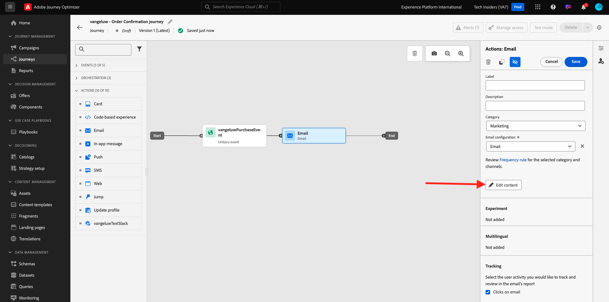

# 3.4.2 Configurare un percorso di newsletter basato su batch

Accedi a Adobe Journey Optimizer da [Adobe Experience Cloud](https://experience.adobe.com). Fare clic su **Journey Optimizer**.

Verrai reindirizzato alla visualizzazione **Home** in Journey Optimizer. Innanzitutto, assicurati di utilizzare la sandbox corretta. La sandbox da utilizzare si chiama `--aepSandboxName--`. Per passare da una sandbox all&#39;altra, fare clic su **Production Prod (VA7)** e selezionare la sandbox dall&#39;elenco. In questo esempio, la sandbox è denominata **AEP Enablement FY22**. Ti troverai quindi nella **Home** della tua sandbox `--aepSandboxName--`.

## 3.4.2.1 Creare un percorso di newsletter

Verrà ora creato un percorso basato su batch. A differenza del percorso basato sugli eventi dell’esercizio precedente che si basa su eventi di esperienza in arrivo o su entrate o uscite di segmenti per attivare un percorso per 1 cliente specifico, i percorsi basati su batch eseguono il targeting di un intero segmento una volta con contenuti univoci come newsletter, promozioni una tantum o informazioni generiche o periodicamente con contenuti simili inviati regolarmente, ad esempio campagne e promemoria di compleanno.

Nel menu, vai a **Percorsi** e fai clic su **Crea Percorso**.

Sul lato destro viene visualizzato un modulo in cui è necessario specificare il nome e la descrizione del percorso. Immetti i seguenti valori:

- **Nome**: `--aepUserLdap-- - Newsletter Journey`. Ad esempio: **vangeluw - Percorso newsletter**.
- **Descrizione**: newsletter mensile

Fare clic su **Ok**.

In **Orchestrazione**, trascina **Leggi segmento** nell&#39;area di lavoro. Ciò significa che, una volta pubblicato, il percorso inizierà recuperando l’intero pubblico del segmento, che diventerà quindi il pubblico target del percorso e del messaggio. Fai clic su **Seleziona un segmento**.

Nel popup **Scegli un segmento**, cerca il tuo ldap e seleziona il segmento creato nel [Modulo 2.3 - Real-time CDP - Crea un segmento e intervieni](./../../../modules/rtcdp-b2c/module2.3/real-time-cdp-build-a-segment-take-action.md) denominato `--aepUserLdap-- - Interest in PROTEUS FITNESS JACKSHIRT`. ad esempio: vangeluw - Interest in PROTEUS FITNESS JACKSHIRT. Fai clic su **Salva**.

Fare clic su **Ok**.

Nel menu a sinistra, individua la sezione **Azioni** e trascina un&#39;azione **E-mail** nell&#39;area di lavoro.

Imposta **Categoria** su **Marketing** e seleziona una superficie e-mail che ti consenta di inviare messaggi e-mail. In questo caso, la superficie e-mail da selezionare è **E-mail**. Assicurati che le caselle di controllo per **Clic su e-mail** e **aperture e-mail** siano entrambe abilitate.

Il passaggio successivo consiste nel creare il messaggio. A tale scopo, fare clic su **Modifica contenuto**.

Ora vedete questo. Fare clic sul campo di testo **Oggetto**.

Immettere il testo per la riga oggetto: `Luma Newsletter - your monthly update has arrived.`. Fai clic su **Salva**.

Allora tornerai qui. Fai clic su **Invia e-mail a Designer** per iniziare a creare il contenuto dell&#39;e-mail.

Poi vedrai questo. Fai clic su **Importa HTML**.

Nella schermata pop-up, devi trascinare e rilasciare il file HTML dell’e-mail. Puoi trovare il modello di HTML [qui](./../../../assets/html/ajo-newsletter.html.zip). Scarica il file zip con il modello HTML nel computer locale e decomprimi sul desktop.

Trascina e rilascia il file **ajo-newsletter.html** per caricarlo in Journey Optimizer. Fai clic su **Importa**.

Il contenuto di questa e-mail è pronto perché presenta tutte le personalizzazioni, le immagini e il testo previsti. Solo il segnaposto dell’offerta viene lasciato vuoto.

È possibile che venga visualizzato un messaggio di errore: **Errore durante il tentativo di recupero delle risorse**. Questo è collegato all’immagine nell’e-mail.

Se ricevi questo errore, seleziona l&#39;immagine e fai clic sul pulsante **Modifica immagine**.

Fai clic su **Assets Essentials** per tornare alla libreria AEM Assets Essentials.

Poi vedrai questo popup. Passa alla cartella **enablement-assets** e seleziona l&#39;immagine **luma-newsletterContent.png**. Fai clic su **Seleziona**.

L’e-mail della newsletter di base è ora pronta. Fai clic su **Salva**.

Torna alla dashboard dei messaggi facendo clic sulla **freccia** accanto al testo dell&#39;oggetto nell&#39;angolo in alto a sinistra.

Fai clic sulla freccia nell’angolo in alto a sinistra per tornare al percorso.

Fai clic su **Ok** per chiudere l&#39;azione e-mail.

Il percorso di newsletter è ora pronto per la pubblicazione. Prima di procedere, osserva la sezione **Pianifica** in cui puoi passare da questo percorso a una campagna ricorrente. Fai clic sul pulsante **Pianifica**.

Poi vedrai questo. Seleziona **Una volta**.

Seleziona una data e un’ora entro l’ora successiva per testare il percorso. Fare clic su **Ok**.

>[!NOTE]
>
>La data e l’ora di invio del messaggio devono essere entro più di un’ora.

Fare clic su **Publish**.

Fai di nuovo clic su **Publish**.

Il percorso di newsletter di base è ora pubblicato. Il messaggio e-mail della newsletter verrà inviato come definito nella pianificazione e il percorso verrà interrotto non appena l’ultima e-mail sarà stata inviata.

Hai finito questo esercizio.

Passaggio successivo: [3.4.3 Applica la personalizzazione a un messaggio e-mail](./ex3.md)

[Torna al modulo 3.4](./journeyoptimizer.md)

[Torna a tutti i moduli](../../../overview.md)
