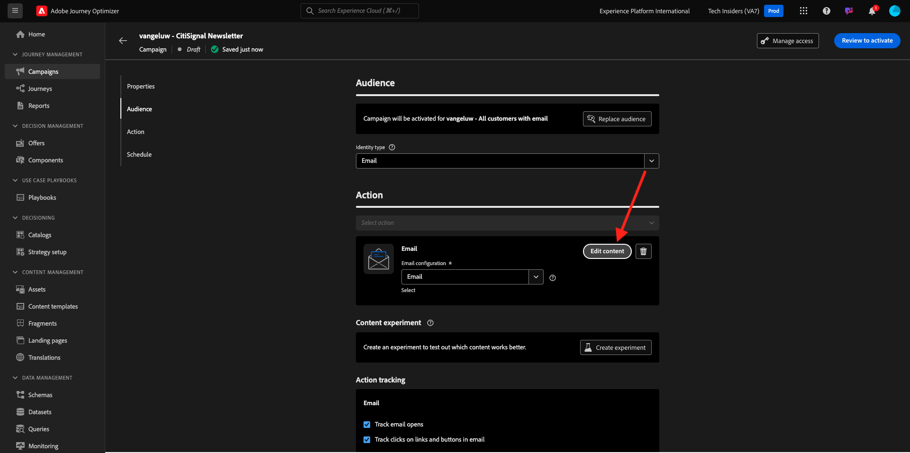
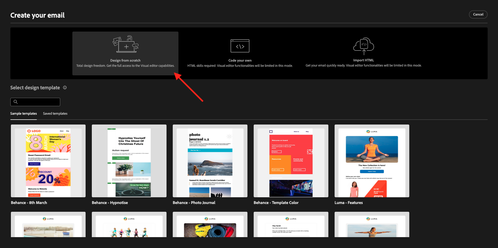
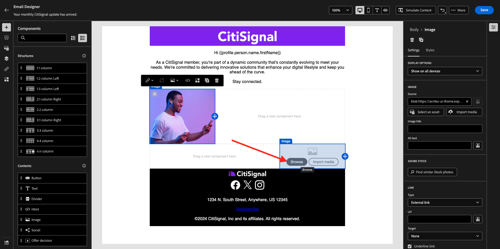
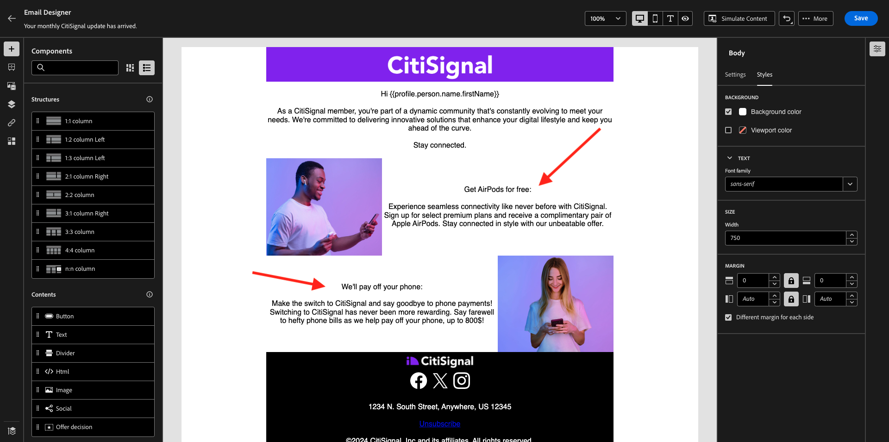

# 3.4.2 Configurare una campagna

Accedi a Adobe Journey Optimizer da [Adobe Experience Cloud](https://experience.adobe.com). Fare clic su **Journey Optimizer**.


Verrai reindirizzato alla visualizzazione **Home** in Journey Optimizer. Innanzitutto, assicurati di utilizzare la sandbox corretta. La sandbox da utilizzare si chiama `--aepSandboxName--`. Ti troverai quindi nella **Home** della tua sandbox `--aepSandboxName--`.


## 3.4.2.1 Creare un pubblico

Prima di creare la campagna, devi definire il pubblico che deve riceverla. Per creare un pubblico, vai a **Tipi di pubblico** nel menu a sinistra. Qui troverai tutto il pubblico creato in precedenza.

Fare clic su **+ Crea pubblico**.


Seleziona **Genera regola** e fai clic su **Crea**.


Seleziona il campo **Profilo individuale XDM > E-mail personale > Indirizzo** e aggiungilo all&#39;area di lavoro. Imposta la condizione della regola su **exists**.

Per evitare di inviare e-mail ad altri utenti nell&#39;ambiente di formazione condiviso, puoi anche aggiungere un filtro come **Nome uguale a -Nome-**.

Imposta il nome del pubblico su `--aepUserLdap-- - All customers with email` e fai clic su **Publish**.


Il pubblico ora è pubblicato e può essere utilizzato in una campagna.

## 3.4.2.2 Creare una campagna newsletter

Ora creerai una campagna. A differenza del percorso basato sugli eventi dell’esercizio precedente, che si basa su eventi di esperienza o entrate o uscite di pubblico in arrivo per attivare un percorso per 1 cliente specifico, le campagne sono indirizzate a un intero pubblico una volta con contenuti univoci come newsletter, promozioni una tantum o informazioni generiche, oppure periodicamente con contenuti simili inviati regolarmente, come ad esempio campagne e promemoria di compleanno.

Nel menu, vai a **Campagne** e fai clic su **Crea campagna**.


Seleziona **Pianificato - Marketing** e fai clic su **Crea**.


Nella schermata di creazione della campagna, configura quanto segue:

- **Nome**: `--aepUserLdap-- - CitiSignal Newsletter`.
- **Descrizione**: newsletter mensile
- **Tipo di identità**: modifica in E-mail

Fai clic su **Seleziona pubblico**.


Per il **pubblico**, seleziona il pubblico creato nel passaggio precedente, `--aepUserLdap-- - All customers with email`. Fai clic su **Salva**.


Per **Azione**, seleziona **E-mail** e una **Configurazione e-mail** esistente. Il contenuto verrà modificato in un paio di minuti.


Per la **Pianificazione**, scegli **In una data e un&#39;ora specifiche** e imposta un&#39;ora a scelta.


Ora puoi iniziare a creare il messaggio e-mail stesso. Scorrere in alto e fare clic su **Modifica contenuto**.



Poi vedrai questo. Per la **riga oggetto**, utilizzare: `Your monthly CitiSignal update has arrived.`. Quindi, fare clic su **Modifica corpo e-mail**.


Scegli **Progettazione da zero**.



Poi vedrai questo. Nel menu a sinistra trovi i componenti struttura che puoi utilizzare per definire la struttura dell’e-mail (righe e colonne).

Trascina e rilascia 3 volte una **colonna 1:1** nell&#39;area di lavoro, 1 volta una colonna 1:2 a sinistra e 1 volta una colonna 2:1 a destra, per ottenere questa struttura:


Nel menu a sinistra, vai a **Frammenti**. Trascina l&#39;intestazione creata in precedenza nell&#39;esercizio [3.1.2.1](./../module3.1/ex2.md) sul primo componente dell&#39;area di lavoro. Trascinare il piè di pagina creato in precedenza nell&#39;[esercizio 3.1.2.2](./../module3.1/ex2.md) sull&#39;ultimo componente dell&#39;area di lavoro.


Fai clic sull&#39;icona **+** nel menu a sinistra. Vai a **Sommario** per iniziare ad aggiungere contenuti all&#39;area di lavoro.


Trascina e rilascia un componente **Testo** sulla seconda riga.


Selezionare il testo predefinito nel componente **Digitare qui il testo.** e sostituirlo con il testo seguente. Cambia l&#39;allineamento in **Allineamento al centro**.

```javascript
Hi {{profile.person.name.firstName}}

As a CitiSignal member, you're part of a dynamic community that's constantly evolving to meet your needs. We're committed to delivering innovative solutions that enhance your digital lifestyle and keep you ahead of the curve.

Stay connected.
```


Trascina e rilascia un componente **Immagine** sulla terza e quarta riga. Fai clic su **Sfoglia** nella terza riga.


Apri la cartella **citi-signal-images**, fai clic per selezionare l&#39;immagine **Offer_AirPods.jpg** e fai clic su **Select**.


Fai clic su **Sfoglia** nel segnaposto dell&#39;immagine nella quarta riga.



Apri la cartella **citi-signal-images**, fai clic per selezionare l&#39;immagine **Offer_Phone.jpg** e fai clic su **Select**.


Trascina e rilascia un componente **Testo** sulla terza e quarta riga.


Selezionare il testo predefinito nel componente nella terza riga **Digitare il testo qui.** e sostituirlo con il testo seguente.

```javascript
Get AirPods for free:

Experience seamless connectivity like never before with CitiSignal. Sign up for select premium plans and receive a complimentary pair of Apple AirPods. Stay connected in style with our unbeatable offer.
```

Selezionare il testo predefinito nel componente nella quarta riga **Digitare il testo qui.** e sostituirlo con il testo seguente.

```javascript
We'll pay off your phone:

Make the switch to CitiSignal and say goodbye to phone payments! Switching to CitiSignal has never been more rewarding. Say farewell to hefty phone bills as we help pay off your phone, up to 800$!
```



L’e-mail della newsletter di base è ora pronta. Fai clic su **Salva**.


Torna al dashboard della campagna facendo clic sulla **freccia** accanto al testo dell&#39;oggetto nell&#39;angolo in alto a sinistra.


Fai clic su **Rivedi per attivare**.


L&#39;errore potrebbe quindi essere visualizzato. In questo caso, potresti dover aspettare fino a 24 ore prima che il pubblico sia stato valutato, quindi provare di nuovo ad attivare la campagna. Potrebbe essere inoltre necessario aggiornare la pianificazione della campagna per eseguirla in un secondo momento.

Fare clic su **Attiva**.


Una volta attivata, la campagna verrà pianificata per l’esecuzione.


La campagna è ora attivata. Il messaggio e-mail della newsletter verrà inviato come definito nella pianificazione e la campagna verrà interrotta non appena sarà stato inviato l’ultimo messaggio e-mail.

Dovresti anche ricevere l’e-mail sull’indirizzo e-mail utilizzato per il profilo demo creato in precedenza.


Hai finito questo esercizio.

Passaggio successivo: [3.4.3 Applica la personalizzazione basata su segmenti in un messaggio e-mail](./ex3.md)

[Torna al modulo 3.4](./journeyoptimizer.md)

[Torna a tutti i moduli](../../../overview.md)
