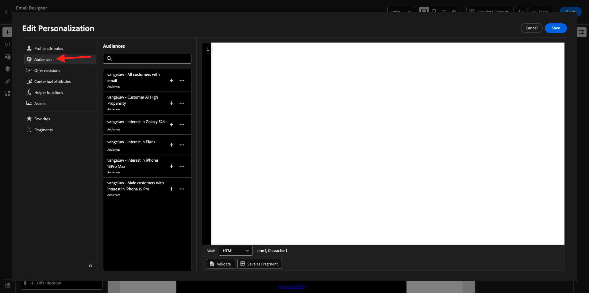

# 3.4.3 Applicare la personalizzazione in un messaggio e-mail

Accedi a Adobe Experience Cloud da [Adobe Experience Cloud](https://experience.adobe.com). Fare clic su **Adobe Journey Optimizer**.

Verrai reindirizzato alla visualizzazione **Home** in Journey Optimizer. Prima di continuare, devi selezionare una **sandbox**. La sandbox da selezionare è denominata ``--aepTenantId--``. A tale scopo, fai clic sul testo **[!UICONTROL Prod produzione]** nella riga blu nella parte superiore dello schermo.

## 3.4.3.1 Personalizzazione basata su segmenti

In questo esercizio migliorerai il messaggio e-mail per la newsletter con un testo personalizzato in base all’iscrizione al segmento.

Vai a **Percorsi**. Trova il percorso di newsletter creato nell’esercizio precedente. Cerca `--demoProfileLdap-- - Newsletter`. Fare clic sul percorso per aprirlo.

Poi vedrai questo. Fai clic su **Duplica**.

Fai clic su **Duplica**.

Seleziona l&#39;azione **Invia e-mail** e fai clic su **Modifica contenuto**.

Fai clic su **Invia e-mail a Designer**.

Poi vedrai questo.

Apri **Componenti contenuto** e trascina un componente **Testo** sotto il contenuto corrente della newsletter.

Selezionare l&#39;intero testo predefinito ed eliminarlo. Quindi fare clic sul pulsante **Aggiungi personalizzazione** nella barra degli strumenti.

A questo punto viene visualizzato quanto segue:

Nel menu a sinistra, fai clic su **Appartenenze a segmenti**.

>[!NOTE]
>
>Se il segmento non è presente in questo elenco, scorri verso il basso per trovare le istruzioni su come recuperare manualmente l’ID segmento.

Seleziona il segmento `Luma - Women's Category Interest` e fai clic sull&#39;icona **+**, che dovrebbe essere simile alla seguente:

Lasciare quindi invariata la prima riga e sostituire le righe 2 e 3 con questo codice:

``
    Psssst... a private sale in the women category will launch soon, we will keep you posted

    Thanks for taking the time to read our newsletter. Here is a 10% promo code to use on the website: READER10

``

A questo punto si otterrà:

Fai clic su **Convalida** per verificare che il codice sia corretto. Fai clic su **Salva**.

Per salvare il messaggio, fai clic sul pulsante **Salva** nell&#39;angolo in alto a destra. Quindi fare clic su **Simula contenuto**.

Seleziona uno dei profili creati come parte di questa esercitazione e fai clic su **Anteprima**. Viene quindi visualizzato il risultato della configurazione.

Poi vedrai questo. Quindi fare clic su **Chiudi**.

Torna alla dashboard dei messaggi facendo clic sulla **freccia** accanto al testo dell&#39;oggetto nell&#39;angolo in alto a sinistra.

Fai clic sulla freccia nell’angolo in alto a sinistra per tornare al percorso.

Fai clic su **Ok** per chiudere l&#39;azione e-mail.

Cambia la **pianificazione** in **una volta** e definisci una **data/ora**. Fare clic su **Ok**.

>[!NOTE]
>
>La data e l’ora di invio del messaggio devono essere entro più di un’ora.

Fai clic sul pulsante **Publish** nel percorso.

Nella finestra popup, fare di nuovo clic su **Publish**.

Il percorso di newsletter di base è ora pubblicato. Il messaggio e-mail della newsletter verrà inviato in base alla pianificazione e il percorso verrà interrotto non appena l’ultima e-mail sarà stata inviata.

Hai finito questo esercizio.

Passaggio successivo: [3.4.4 Configurare e utilizzare le notifiche push per iOS](./ex4.md)

[Torna al modulo 3.4](./journeyoptimizer.md)

[Torna a tutti i moduli](../../../overview.md)
