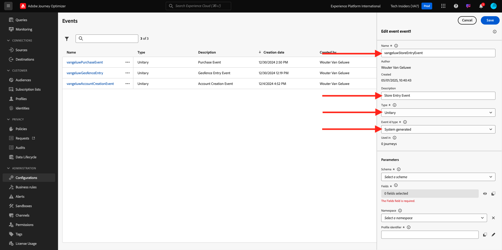
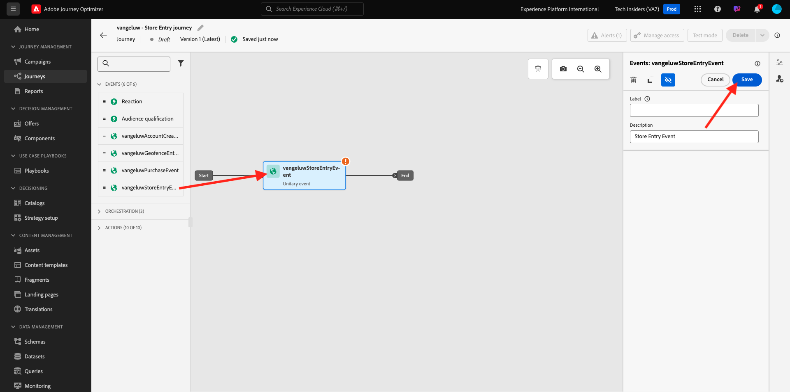
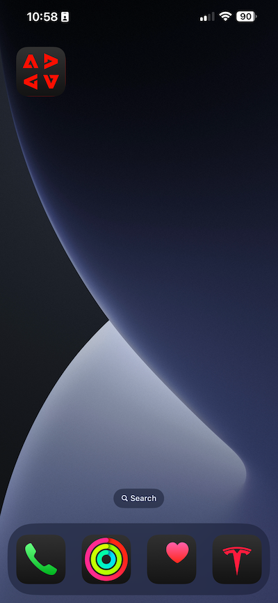

# 3.4.4 Configurazione e utilizzo delle notifiche push per iOS

Per utilizzare le notifiche push con Adobe Journey Optimizer, è necessario controllare e conoscere diverse impostazioni.

Di seguito sono elencate tutte le impostazioni da verificare:

- Set di dati e schemi in Adobe Experience Platform
- Stream di dati per dispositivi mobili
- Proprietà raccolta dati per dispositivi mobili
- Superficie app per certificati push
- Test della configurazione push con AEP Assurance

Esaminiamo questi uno per uno.

Accedi a Adobe Journey Optimizer da [Adobe Experience Cloud](https://experience.adobe.com). Fare clic su **Journey Optimizer**.

Verrai reindirizzato alla visualizzazione **Home** in Journey Optimizer. Innanzitutto, assicurati di utilizzare la sandbox corretta. La sandbox da utilizzare si chiama `--aepSandboxName--`. Ti troverai quindi nella **Home** della tua sandbox `--aepSandboxName--`.

## 3.4.4.1 Set di dati push

Adobe Journey Optimizer utilizza i set di dati per memorizzare elementi come i token push da dispositivi mobili o interazioni con messaggi push (come: messaggio inviato, messaggio aperto, ecc.) in un set di dati in Adobe Journey Optimizer.

Puoi trovare questi set di dati da **[!UICONTROL Set di dati]** nel menu sul lato sinistro della schermata. Per visualizzare i set di dati di sistema, fai clic sull’icona del filtro.

Abilita l&#39;opzione **Mostra set di dati di sistema** e cerca **AJO**. Vedrai quindi i set di dati utilizzati per le notifiche push.

## 3.4.4.2 Datastream per dispositivi mobili

Vai a [https://experience.adobe.com/#/data-collection/](https://experience.adobe.com/it#/data-collection/).

Nel menu a sinistra, vai a **[!UICONTROL Datastream]** e cerca lo stream di dati creato in [Esercizio 0.2](./../../../modules/gettingstarted/gettingstarted/ex2.md), denominato `--aepUserLdap-- - Demo System Datastream (Mobile)`. Fai clic su per aprirlo.

Fai clic su **Modifica** nel servizio **Adobe Experience Platform**.

Vengono quindi visualizzate le impostazioni dello stream di dati definite e in quali set di dati verranno memorizzati gli eventi e gli attributi del profilo.

Non sono necessarie modifiche, il flusso di dati è ora pronto per essere utilizzato nella proprietà Client di raccolta dati per Mobile.

## 3.4.4.3 Esaminare la proprietà Data Collection per Mobile

Vai a [https://experience.adobe.com/#/data-collection/](https://experience.adobe.com/it#/data-collection/). Nell&#39;ambito dell&#39;[esercizio 0.1](./../../../modules/gettingstarted/gettingstarted/ex1.md) sono state create 2 proprietà di raccolta dati.
Queste proprietà del client di raccolta dati sono già state utilizzate nei moduli precedenti.

Fai clic su per aprire la proprietà Raccolta dati per dispositivi mobili.

Nella proprietà Raccolta dati, vai a **Estensioni**. Vedrai quindi le varie estensioni necessarie per l’app mobile. Fai clic per aprire l&#39;estensione **Adobe Experience Platform Edge Network**.

Vedrai quindi che il flusso di dati per dispositivi mobili è collegato qui. Fai clic su **Annulla** per tornare alla panoramica delle estensioni.

Allora tornerai qui. Verrà visualizzata l&#39;estensione per **AEP Assurance**. AEP Assurance consente di verificare, verificare, simulare e convalidare la modalità di raccolta dei dati o di gestione delle esperienze nell’app mobile. Ulteriori informazioni su AEP Assurance e sul progetto Griffon sono disponibili qui [https://aep-sdks.gitbook.io/docs/beta/project-griffon](https://aep-sdks.gitbook.io/docs/beta/project-griffon).

Fare clic su **Configura** per aprire l&#39;estensione **Adobe Journey Optimizer**.

Qui è collegato il set di dati per il tracciamento degli eventi push.

Non è necessario apportare modifiche alla proprietà Data Collection.

## 3.4.4.4 Verifica la configurazione della superficie dell’app

Vai a [https://experience.adobe.com/#/data-collection/](https://experience.adobe.com/it#/data-collection/). Nel menu a sinistra, vai a **Superfici app** e apri, la Superficie app per **APNS app demo**.

Viene quindi visualizzata la superficie configurata dell’app per iOS e Android.

## 3.4.4.5 Test della configurazione delle notifiche push tramite AEP Assurance.

Una volta installata l’app, questa si trova nella schermata iniziale del dispositivo. Fai clic sull&#39;icona per aprire l&#39;app.

Quando utilizzi l’app per la prima volta, ti verrà richiesto di accedere con il tuo Adobe ID. Completa il processo di accesso.

Dopo aver effettuato l’accesso, verrà visualizzata una notifica con la richiesta dell’autorizzazione per l’invio di notifiche. Invieremo notifiche come parte dell&#39;esercitazione, quindi fai clic su **Consenti**.

Viene quindi visualizzata la home page dell’app. Vai a **Impostazioni**.

Nelle impostazioni, vedrai che attualmente un **progetto pubblico** è caricato nell&#39;app. Fai clic su **Progetto personalizzato**.

Ora puoi caricare un progetto personalizzato. Fai clic sul codice QR per caricare facilmente il progetto.

Dopo l&#39;esercizio 0.1, si è ottenuto questo risultato. Fai clic per aprire il **progetto Mobile Retail** creato per te.

Nel caso in cui tu abbia chiuso accidentalmente la finestra del browser o per sessioni di attivazione o demo future, puoi anche accedere al progetto del tuo sito web da [https://builder.adobedemo.com/projects](https://builder.adobedemo.com/projects). Dopo aver effettuato l’accesso con il tuo Adobe ID, visualizzerai questo. Fai clic sul progetto dell’app mobile per aprirlo.

Poi vedrai questo. Fai clic su **Integrazioni**.

Devi selezionare la proprietà Raccolta dati per dispositivi mobili creata nell&#39;esercizio 0.1. Fare clic su **Esegui**.

Viene quindi visualizzata questa finestra a comparsa contenente un codice QR. Esegui la scansione di questo codice QR dall’app mobile.

Nell&#39;app verrà quindi visualizzato l&#39;ID progetto, dopodiché potrai fare clic su **Salva**.

Ora torna alla **Home** nell&#39;app. L&#39;app è ora pronta per essere utilizzata.

Ora è necessario scansionare un codice QR per collegare il dispositivo mobile alla sessione di AEP Assurance.

Per avviare una sessione AEP Assurance, vai a [https://experience.adobe.com/#/@experienceplatform/griffon](https://experience.adobe.com/#/@experienceplatform/griffon). Fare clic su **Crea sessione**.

Fare clic su **Inizio**.

Compila i valori:

- Nome sessione: usa `--aepUserLdap-- - push debugging` e sostituisci ldap con il tuo ldap
- URL di base: utilizza **dxdemo://default**

Fai clic su **Avanti**.

Visualizzerai quindi un codice QR sullo schermo, che dovresti scansionare con il dispositivo iOS.

Sul dispositivo mobile, apri l’app della fotocamera e scansiona il codice QR visualizzato da AEP Assurance.

Viene quindi visualizzata una finestra a comparsa in cui viene richiesto di immettere il codice PIN. Copia il codice PIN dalla schermata Assurance di AEP e fai clic su **Connetti**.

Poi vedrai questo.

In AEP Assurance, ora vedrai che un dispositivo si trova nella sessione di AEP Assurance.

Vai a **Debug push**. Vedrai qualcosa del genere.

Alcune spiegazioni:

- La prima colonna, **Client**, mostra gli identificatori disponibili sul dispositivo iOS. Vedrai un ECID e un Token push.
- La seconda colonna mostra le informazioni del **profilo**, con informazioni aggiuntive sulla piattaforma in cui si trova il token push (APNS o APNSSandbox). Se fai clic sul pulsante **Profilo Inspect**, verrai indirizzato a Adobe Experience Platform e visualizzerai l&#39;intero Profilo cliente in tempo reale.
- La terza colonna mostra la **configurazione app**, che è stata impostata come parte dell&#39;esercizio **3.4.5.4 Crea configurazione app in Launch**

Per verificare la configurazione push, fai clic sul pulsante **Invia notifica push**.

Assicurati che l&#39;app **DX Demo** non sia aperta al momento di fare clic sul pulsante **Invia notifica push**. Se l’app è aperta, la notifica push potrebbe essere ricevuta in background e non sarebbe visibile.

Vedrai quindi una notifica push come questa visualizzata sul tuo dispositivo mobile.

Se hai ricevuto la notifica push, significa che la configurazione è corretta e funziona correttamente.

## 3.4.4.6 Creare un nuovo evento

Nel menu, vai a **Amministrazione Percorso** e fai clic su **Gestisci** in **Eventi**.

Nella schermata **Eventi** verrà visualizzata una visualizzazione simile a questa. Fare clic su **Crea evento**.

Viene quindi visualizzata una configurazione dell’evento vuota.

Prima di tutto, assegna all&#39;evento un nome come `--aepUserLdap--StoreEntryEvent` e imposta la descrizione su `Store Entry Event`.

La selezione **Tipo evento** è successiva. Seleziona **Unitario**.

La selezione del **Tipo ID evento** è successiva. Seleziona **Sistema generato**

Di seguito è riportata la selezione dello schema. Per questo esercizio è stato preparato uno schema. Utilizzare lo schema `Demo System - Event Schema for Mobile App (Global v1.1) v.1`.

Dopo aver selezionato lo schema, nella sezione **Payload** verranno selezionati diversi campi. Il tuo evento è ora completamente configurato.

Dovresti vedere questo. Fai clic su **Salva**.

L’evento è ora configurato e salvato. Fai di nuovo clic sull&#39;evento per aprire di nuovo la schermata **Modifica evento**.

Passa il puntatore del mouse sul campo **Payload** e fai clic sull&#39;icona **Visualizza payload**.

Ora vedrai un esempio del payload previsto.

Il tuo evento ha un ID evento di orchestrazione univoco, che puoi trovare scorrendo verso il basso in tale payload fino a visualizzare `_experience.campaign.orchestration.eventID`.

L’ID evento è ciò che deve essere inviato a Adobe Experience Platform per attivare il Percorso che verrà generato nel passaggio successivo. Annota questo eventID, come sarà necessario nel passaggio successivo.
`"eventID": "e3a8f0bdc0b609667cd96a72a6b1e5aafa0ddaf6ccf121c574e6a2030860a633"`

Fai clic su **Ok**, seguito da **Annulla**.

## 3.4.4.7 Creazione di un percorso

Nel menu, vai a **Percorsi** e fai clic su **Crea Percorso**.

Poi vedrai questo. Assegna un nome al percorso. Usa `--aepUserLdap-- - Store Entry journey`. Fai clic su **OK**.

Innanzitutto, devi aggiungere l’evento come punto di partenza del percorso. Cercare l&#39;evento `--aepUserLdap--StoreEntryEvent` e trascinarlo sull&#39;area di lavoro. Fai clic su **OK**.

Quindi, in **Azioni**, cerca l&#39;azione **Invia**.
Trascina e rilascia l&#39;azione **Push** nell&#39;area di lavoro.

Imposta **Categoria** su **Marketing** e seleziona una superficie push che ti consenta di inviare notifiche push. In questo caso, la superficie e-mail da selezionare è **Push-iOS-Android**.

Il passaggio successivo consiste nel creare il messaggio. A tale scopo, fare clic su **Modifica contenuto**.

Poi vedrai questo. Fai clic sull&#39;icona **personalization** per il campo **Title**.

Poi vedrai questo. Ora puoi selezionare qualsiasi attributo di profilo direttamente da Real-time Customer Profile.

Cerca il campo **Nome**, quindi fai clic sull&#39;icona **+** accanto al campo **Nome**. Verrà quindi visualizzato il token di personalizzazione per First Name aggiunto: **{{profile.person.name.firstName}}**.

Quindi, aggiungi il testo **, benvenuto nel nostro store!** dietro **{{profile.person.name.firstName}}**.

Fai clic su **Salva**.

Ora hai questo. Fai clic sull&#39;icona **personalization** per il campo **Body**.

Immetti questo testo **Fai clic qui per ottenere uno sconto del 10% al momento dell&#39;acquisto.** e fare clic su **Salva**.

Allora avrai questo. Fai clic sulla freccia nell’angolo in alto a sinistra per tornare al percorso.

Fai clic su **OK** per chiudere l&#39;azione push.

Fare clic su **Publish**.

Fai di nuovo clic su **Publish**.

Il percorso è stato pubblicato.

## 3.4.4.8 Test del percorso e messaggio push

Nell&#39;app mobile DX Demo 2.0, vai alla schermata **Impostazioni**. Fare clic sul pulsante **Voce archivio**.

>[!NOTE]
>
>Il pulsante **Voce archivio** è attualmente in fase di implementazione. Non lo troverai ancora nell’app.

Assicurati di chiudere l&#39;app immediatamente dopo aver fatto clic sull&#39;icona **Voce store**, altrimenti il messaggio push non verrà visualizzato.

Dopo un paio di secondi, verrà visualizzato il messaggio.

Hai finito questo esercizio.

Passaggio successivo: [3.4.5 Creazione di un percorso di eventi aziendali](./ex5.md)

[Torna al modulo 3.4](./journeyoptimizer.md)

[Torna a tutti i moduli](../../../overview.md)
