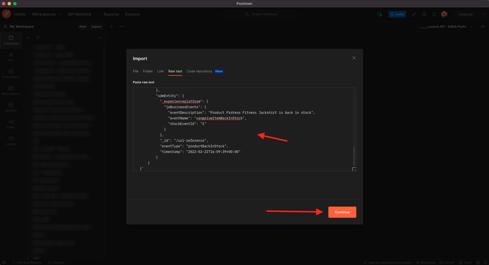

# 3.4.5 Creazione di un percorso di eventi di business

Accedi a Adobe Journey Optimizer da [Adobe Experience Cloud](https://experience.adobe.com). Fare clic su **Journey Optimizer**.


Verrai reindirizzato alla visualizzazione **Home** in Journey Optimizer. Innanzitutto, assicurati di utilizzare la sandbox corretta. La sandbox da utilizzare si chiama `--aepSandboxName--`. Ti troverai quindi nella **Home** della tua sandbox `--aepSandboxName--`.


## 3.4.5.1 Creare un evento di business

Nel menu a sinistra, fai clic su **Configurazioni**. Fai clic sul pulsante **Gestisci** nella scheda **Eventi**.


Gli eventi di business sono un nuovo tipo di evento che è possibile creare all’interno di Journey Optimizer. A differenza degli eventi **Unitari** creati nei moduli precedenti, gli eventi di business non vengono attivati dal cliente ma dall&#39;organizzazione. Ora creerai il tuo evento di business.

Fare clic su **Crea evento**.


Immetti i seguenti valori nel modulo Creazione evento:

- **Nome**: `--aepUserLdap--ItemBackInStock`. Esempio: **vangeluwItemBackInStock**
- **Descrizione**: questo evento viene attivato quando un prodotto è di nuovo disponibile
- **Tipo**: seleziona **Azienda** nel menu a discesa


Per lo schema, selezionare **Demo System - Event Schema for JO Business Events (Global v1.1) v.1**. Ora devi selezionare i campi nello schema necessari per il nostro caso d’uso.


Segui questi passaggi:

Fai clic sull&#39;icona **matita** nel campo in cui è indicato **1 campo selezionato**.


Seleziona tutti i campi disponibili nello schema, quindi fai clic su **OK**.


Per la condizione: è necessario specificare quali record in questo schema attiveranno l’evento business.

Segui questi passaggi:

Fai clic sull&#39;icona **matita** nel campo in cui è indicato **Aggiungi una condizione**.


Sul lato sinistro, espandere l&#39;oggetto `--aepTenantId--`, espandere l&#39;oggetto **joBusinessEvents** e trascinare il campo **eventName** nell&#39;area di lavoro.


Per il campo **eventName**, immettere il valore seguente: `--aepUserLdap--ItemBackInStock`. Ad esempio: vangeluwItemBackInStock.
Fai clic su **OK**.


Fai clic su **OK**.


Infine, il modulo di creazione degli eventi dovrebbe essere simile al seguente. Fai clic su **Salva** per salvare l&#39;evento business.


## 3.4.5.2 Creazione di un percorso di eventi di business

Ora puoi sfruttare questo evento di business e il messaggio all’interno di un percorso. Vai a **Percorsi**. Fare clic su **Crea Percorso**.


Sul lato destro viene visualizzato un modulo in cui è necessario specificare il nome e la descrizione del percorso. Immetti i seguenti valori:

- **Nome**: `--aepUserLdap-- - Item back in stock journey`. Ad esempio: vangeluw - Articolo di nuovo in magazzino percorso
- **Descrizione**: questo percorso invia un SMS quando un elemento è di nuovo disponibile al visitatore che ha mostrato interesse.

Fai clic su **OK**.


Nel menu a sinistra, in **Eventi**, cerca il tuo ldap. L&#39;evento di business `--aepUserLdap--ItemBackInStock` creato in precedenza è disponibile. Trascina e rilascia l’evento nell’area di lavoro, poiché sarà il punto iniziale del percorso.


Come puoi vedere, un&#39;attività **Read Audience** è stata aggiunta automaticamente all&#39;area di lavoro. Questo perché gli eventi di business inviano al percorso solo un trigger per la lettura di un pubblico specifico, che recupererà quindi l’elenco dei profili di quel percorso.

Fai clic sull&#39;attività **Read Audience**.
Nella configurazione di **Read Audience** è previsto che tu selezioni il pubblico a cui vuoi inviare la notifica dell&#39;evento di business appena accaduto. Fai clic sul campo **Seleziona un pubblico**.


Nel popup **Scegli un pubblico**, cerca il tuo ldap e seleziona il pubblico creato nel [Modulo 2.3 - Real-time CDP - Crea un pubblico e intervieni](./../../../modules/rtcdp-b2c/module2.3/real-time-cdp-build-a-segment-take-action.md) denominato `--aepUserLdap-- - Interest in Galaxy S24`. Fai clic su **Salva**.


Fare clic su **Ok**.


Il passaggio successivo consiste nel trascinare e rilasciare l&#39;azione che si desidera eseguire in questo percorso. Seleziona l&#39;azione **SMS**, quindi trascinala e rilasciala dopo la condizione appena aggiunta.


Imposta **Categoria** su **Marketing** e seleziona una superficie sms che ti consenta di inviare sms. In questo caso, la superficie e-mail da selezionare è **SMS**.


Il passaggio successivo consiste nel creare il messaggio. A tale scopo, fare clic su **Modifica contenuto**.


Viene visualizzata la dashboard dei messaggi, in cui è possibile configurare il testo dell’SMS. Fai clic sull&#39;area **Componi messaggio** per creare il messaggio.


Immettere il testo seguente: `Hi {{profile.person.name.firstName}}, the Proteus Fitness Jackshirt is back in stock at Luma.`. Fai clic su **Salva**.


Torna alla dashboard dei messaggi facendo clic sulla **freccia** accanto al testo dell&#39;oggetto nell&#39;angolo in alto a sinistra.


Ora vedrai l’azione SMS completata. Fare clic su **Ok**.


Il percorso è pronto per la pubblicazione. Fare clic su **Publish**.


Fai di nuovo clic su **Publish**.


Il percorso è ora pubblicato. Puoi testarlo.


## 3.4.5.3 Test del percorso di eventi aziendali

È ora possibile simulare la rivalutazione di un prodotto acquisendo un nuovo evento in base a **Demo System - Event Schema for JO Business Events (Global v1.1) v.1** utilizzando Postman.

Nel menu a sinistra, fare clic su **Origini** e quindi sulla scheda **Account**.


Nella scheda **Account** è disponibile l&#39;account denominato **Journey Optimizer Business Events**. Fai clic su di esso per aprirlo.


Questo account ha un solo flusso di dati, fai clic sul nome del flusso di dati per selezionarlo.


Fai clic su **Copia payload schema** nel menu a destra. Questa opzione consente di copiare l&#39;intero comando **curl** per inserire negli Appunti un record rispetto a **Demo System - Event Schema for JO Business Events (Global v1.1) v.1**.


Incollare il comando Curl in un editor di testo


Diamo un&#39;occhiata più da vicino a questa richiesta,

- La richiesta POST viene inviata all&#39;ID ingresso DCS
- La richiesta fa riferimento allo schema, al set di dati e all’ID organizzazione.
- Infine, contiene il nodo xdmEntity che rappresenta i dati da creare all’interno del set di dati.

È ora necessario sostituire la seguente riga `xdmEntity`...

```json
"xdmEntity": {
  "_experienceplatform": {
    "joBusinessEvents": {
      "eventDescription": "string",
      "eventName": "string",
      "stockEventId": "string"
    }
  },
  "_id": "/uri-reference",
  "eventType": "advertising.completes",
  "timestamp": "2018-11-12T20:20:39+00:00"
}
```

...in questa riga, verificare il campo eventName come dovrebbe indicare `--aepUserLdap--ItemBackInStock`, che rappresenta la condizione specificata nell&#39;evento business per attivare il percorso.

```json
"xdmEntity": {
  "_experienceplatform": {
    "joBusinessEvents": {
      "eventDescription": "Product Proteus Fitness Jackshirt is back in stock",
      "eventName": "--aepUserLdap--ItemBackInStock",
      "stockEventId": "1"
    }
  },
  "_id": "/uri-reference",
  "eventType": "productBackInStock",
  "timestamp": "2021-04-19T15:25:39+00:00"
}
```

Il comando **curl** aggiornato deve essere simile al seguente:


Seleziona tutto e copialo negli Appunti.

Apri Postman. Sul lato sinistro di Postman, fare clic su **Importa**.


Selezionare la scheda **Testo non elaborato** e incollare il comando precedentemente copiato qui. Fai clic su **Continua**.



Fai clic su **Importa**.


Postman ha convertito automaticamente il comando **curl** in un comando REST pronto per essere attivato. È sufficiente premere il pulsante **Invia** per richiedere la creazione di tale record all&#39;interno del set di dati.


Verifica che la richiesta sia stata ricevuta correttamente. Cerca lo stato **200 OK** in Postman.


L’SMS potrebbe richiedere un paio di minuti per arrivare al telefono cellulare. In caso contrario, il segmento **Interest in Proteus Fitness Jackshirt** potrebbe non contenere un profilo con un telefono cellulare corretto. In tal caso, vai sul sito web Luma, visita il prodotto **Proteus Fitness Jackshirt** e registrati assicurandoti di fornire il numero di telefono cellulare corretto.


Hai terminato questo esercizio.

Passaggio successivo: [Riepilogo e vantaggi](./summary.md)

[Torna al modulo 3.4](./journeyoptimizer.md)

[Torna a tutti i moduli](../../../overview.md)
