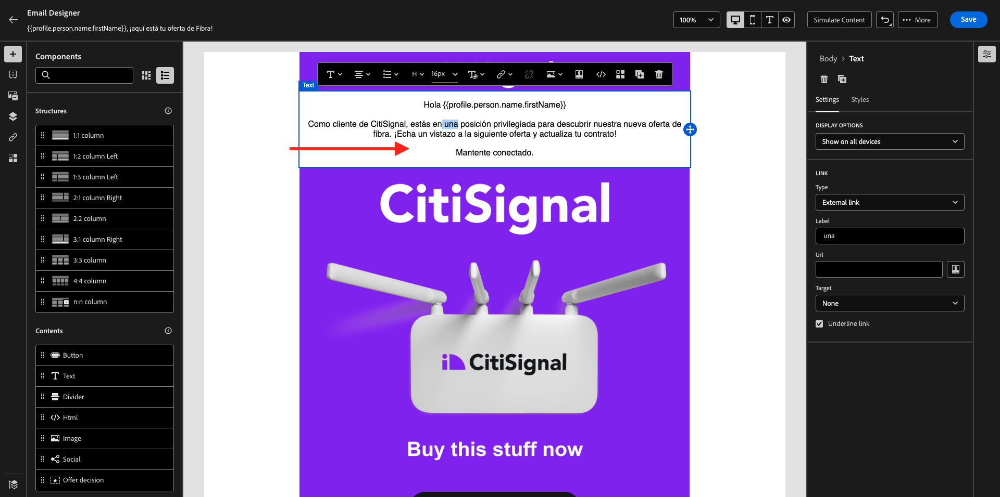

# 3.5.3 Aggiungere lingue all’e-mail

Vai a [https://experience.adobe.com/](https://experience.adobe.com/). Fare clic su **Journey Optimizer**.

Verrai reindirizzato alla visualizzazione **Home** in Journey Optimizer. Innanzitutto, assicurati di utilizzare la sandbox corretta. La sandbox da utilizzare si chiama `--aepSandboxName--`.

Vai a **Campagne** e fai clic per aprire la campagna appena creata.

Fare clic su **Modifica campagna**.

Fare clic su **Modifica**.

Scorri verso il basso fino all&#39;azione **E-mail** e fai clic su **Modifica contenuto**.

Fare clic su **Aggiungi lingue**.

Seleziona le **impostazioni lingua**, denominate `--aepUserLdap--_translations`. Fai clic su **Seleziona**.

Dovresti vedere questo. Fai clic su **Invia a traduzione**.

Dovresti visualizzare un messaggio come questo. Il flusso di lavoro **Invia a traduzione** è stato avviato e richiederà alcuni minuti.
Lo stato cambia in **Traduzione in corso**.

Dopo un paio di minuti, lo stato del flusso di lavoro delle traduzioni passerà a **Traduzione completata**.

Fare clic sulla traduzione **`[es] Spanish`**. Il testo aggiornato verrà quindi visualizzato nell&#39;anteprima e-mail e anche nella **riga Oggetto**.
Se necessario, puoi comunque rivedere e aggiornare la traduzione direttamente nel campo **Oggetto**.

Fai clic su **Modifica corpo dell&#39;e-mail** per rivedere la traduzione nell&#39;e-mail.

Puoi modificare il testo manualmente nel caso in cui la traduzione debba essere rivista.

Torna alla panoramica della campagna facendo clic sulla **freccia** accanto al testo dell&#39;oggetto nell&#39;angolo in alto a sinistra.

Allora dovresti tornare qui. Non è necessario attivare di nuovo questa campagna.

Torna alla campagna facendo clic sulla **freccia** in alto a sinistra.

Verifica che la campagna sia nello stato **Interrotto**.

Hai terminato questo esercizio.

## Passaggi successivi

Vai a [Riepilogo e vantaggi](./summary.md)

Torna a [Modulo 3.5](./ajotranslationsvcs.md){target="_blank"}

Torna a [Tutti i moduli](./../../../overview.md){target="_blank"}
