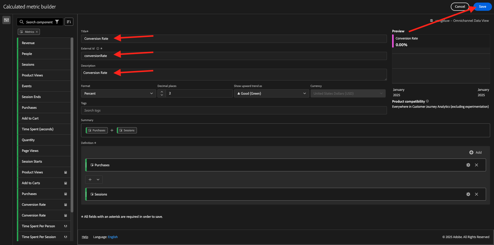

# 4.1.4 Preparazione dei dati in Analysis Workspace

## Obiettivi

- Comprendere l’interfaccia utente di Analysis Workspace in CJA
- Comprendere i concetti di preparazione dei dati in Analysis Workspace
- Scopri come eseguire i calcoli dei dati

## 4.1.4.1 Interfaccia utente di Analysis Workspace in CJA

Analysis Workspace rimuove tutte le limitazioni tipiche di un singolo rapporto Analytics. Fornisce un’area di lavoro solida e flessibile per la creazione di progetti di analisi personalizzati. Trascina e rilascia a un progetto un numero qualsiasi di tabelle di dati, visualizzazioni e componenti (dimensioni, metriche, segmenti e granularità temporali). Crea all’istante raggruppamenti e segmenti, crea coorti per l’analisi, crea avvisi, confronta segmenti, esegue analisi di flusso e di abbandono e cura e pianifica rapporti da condividere con chiunque nella tua azienda.

Customer Journey Analytics aggiunge questa soluzione ai dati di Platform. Consigliamo vivamente di guardare questo video introduttivo di quattro minuti:

>[!VIDEO](https://video.tv.adobe.com/v/35109?quality=12&learn=on&enablevpops)

Se non hai utilizzato Analysis Workspace in precedenza, ti consigliamo di guardare questo video:

>[!VIDEO](https://video.tv.adobe.com/v/26266?quality=12&learn=on&enablevpops)

### Crea il progetto

Ora è il momento di creare la tua prima area di lavoro CJA. Vai alla scheda **Workspace** in CJA.
Fare clic su **Crea progetto**.

Poi vedrai questo. Selezionare **Progetto Workspace vuoto**, quindi fare clic su **Crea**.

Viene quindi visualizzato un progetto vuoto.

Innanzitutto, assicurati di selezionare la visualizzazione dati corretta nell’angolo superiore destro dello schermo. La visualizzazione dati da selezionare è `--aepUserLdap-- - Omnichannel Data View`.

Ora salverai il progetto e gli assegnerai un nome. Per salvare, puoi utilizzare il seguente comando:

| Sistema operativo | Scelta rapida |
| ----------------- |-------------| 
| Windows | Ctrl+S |
| Mac | Comando+S |

Vedrai questo pop-up:

Utilizza questa convenzione per i nomi:

| Nome | Descrizione |
| ----------------- |-------------| 
| `--aepUserLdap-- - Omnichannel Analysis` | `--aepUserLdap-- - Omnichannel Analysis` |

Fare clic su **Salva**.

## 4.1.4.2 Metriche calcolate

Anche se abbiamo organizzato tutti i componenti nella visualizzazione dati, è ancora necessario adattarne alcuni, in modo che gli utenti aziendali siano pronti per iniziare l’analisi. Inoltre, durante qualsiasi analisi puoi creare metriche calcolate per approfondire i risultati delle informazioni.

Ad esempio, verrà creato un **Tasso di conversione** calcolato utilizzando la metrica/evento **Acquisti** definito nella visualizzazione dati.

### Tasso di conversione

Iniziamo ad aprire il generatore di metriche calcolate. Fai clic su **+** per creare la prima metrica calcolata in Analysis Workspace.

Verrà visualizzato il **Generatore di metriche calcolate**:

Trova **Acquisti** nell&#39;elenco delle metriche nel menu a sinistra. In **Metriche** fare clic su **Mostra tutto**

Trascina e rilascia la metrica **Acquisti** nella definizione della metrica calcolata.

In genere, il tasso di conversione indica **Conversioni/Sessioni**. Facciamo quindi lo stesso calcolo nell’area di lavoro della definizione della metrica calcolata. Trova la metrica **Sessioni** e trascinala nel generatore di definizioni, nell&#39;evento **Acquisti**.

L&#39;operatore di divisione viene selezionato automaticamente.

Il tasso di conversione è comunemente rappresentato in percentuale. Quindi, cambiamo il formato in percentuale e selezioniamo anche 2 decimali.

Infine, modifica il nome e la descrizione della metrica calcolata:

| Titolo | Descrizione | ID esterno |
| ----------------- |-------------| -------------| 
| Tasso di conversione | Tasso di conversione | conversionRate |

A quel punto si otterrà questo. Fai clic su **Salva**.

Fai di nuovo clic su **Salva**.

## 4.1.4.3 Dimensioni calcolate: filtri (segmentazione) e intervalli di date

### Filtri: dimensioni calcolate

I calcoli non devono essere utilizzati solo per le metriche. Prima di iniziare un&#39;analisi è inoltre interessante creare alcune **dimensioni calcolate**. In pratica questo significava **segmenti** di nuovo in Adobe Analytics. In Customer Journey Analytics, questi segmenti sono denominati **Filtri**.

La creazione di filtri aiuterà gli utenti aziendali ad avviare l’analisi con alcune preziose dimensioni calcolate. In questo modo verranno automatizzate alcune attività e verrà fornita assistenza per l’adozione. Di seguito sono riportati alcuni esempi:

1. Mezzi propri, mezzi a pagamento,
2. Visite nuove e di ritorno
3. Clienti con carrello abbandonato

Questi filtri possono essere creati prima o durante la parte di analisi (operazione che verrà eseguita nell&#39;esercizio successivo).

### Intervalli di date: dimensioni temporali calcolate

Le dimensioni temporali sono un altro tipo di dimensioni calcolate. Alcune sono già state create, ma puoi anche creare dimensioni temporali personalizzate nella fase di preparazione dei dati.

Queste dimensioni del tempo calcolato aiuteranno gli analisti e gli utenti aziendali a ricordare date importanti e a utilizzarle per filtrare e modificare l’ora di reporting. Domande e dubbi tipici che vengono in mente quando facciamo analisi:

- Quand&#39;è stato il Black Friday l&#39;anno scorso? 21-29?
- Quando abbiamo condotto quella campagna TV a dicembre?
- Da quando a quando abbiamo realizzato le vendite estive 2018? Voglio confrontarlo con il 2019. A proposito, conoscete i giorni esatti del 2019?

Ora hai completato l’esercizio di preparazione dei dati utilizzando CJA Analysis Workspace.

Passaggio successivo: [4.1.5 Visualizzazione con Customer Journey Analytics](./ex5.md)

[Torna al modulo 4.1](./customer-journey-analytics-build-a-dashboard.md)

[Torna a tutti i moduli](./../../../overview.md)
