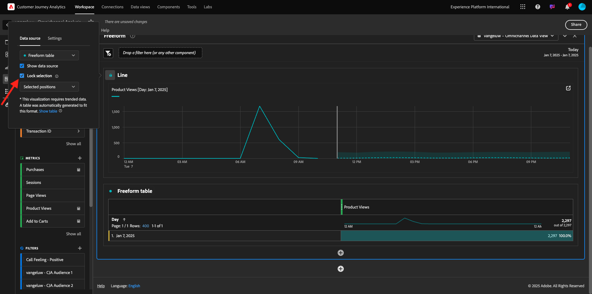
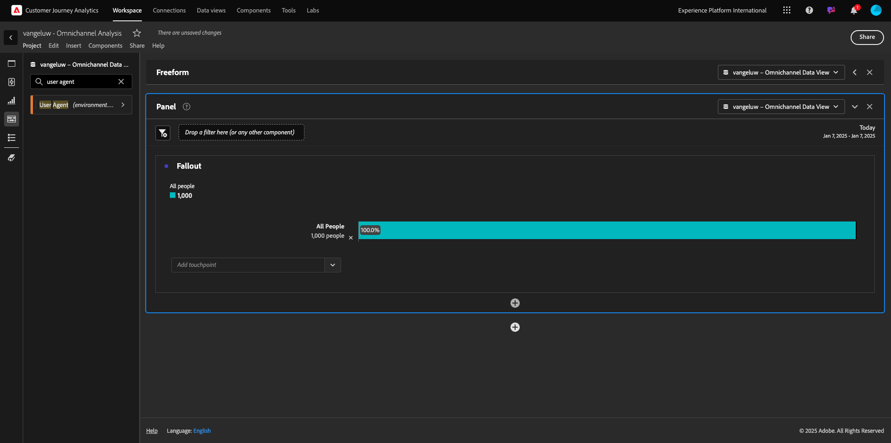
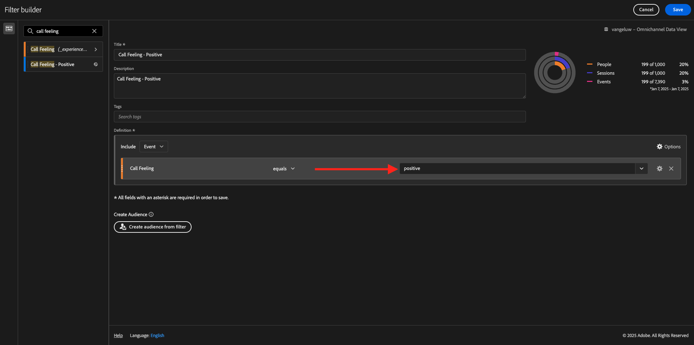

# 4.1.5 Visualizzazione tramite Customer Journey Analytics

## Obiettivi

- Interfaccia utente di Analysis Workspace
- Scopri alcune funzioni che rendono Analysis Workspace così diverso.
- Scopri come analizzare in CJA utilizzando Analysis Workspace

## Contesto

In questi esercizi utilizzerai Analysis Workspace all’interno di CJA per analizzare le visualizzazioni dei prodotti, i funnel di prodotto, l’abbandono, ecc.

Copriremo alcune delle query eseguite nel Modulo 7 - Query Service in modo da vedere quanto è facile eseguire le stesse query e altro ancora, ma senza utilizzare SQL e affidandosi solo alla filosofia di trascinamento della selezione di Analysis Workspace.

Utilizziamo il progetto creato in [11.4 Data Preparation in Analysis Workspace](./ex4.md), quindi passa a [https://analytics.adobe.com](https://analytics.adobe.com).

Apri il progetto `--demoProfileLdap-- - Omnichannel Analysis`.

Con il progetto aperto e la visualizzazione dati `--demoProfileLdap-- - Omnichannel Analysis` selezionata, puoi iniziare a creare le prime visualizzazioni.

## Quante visualizzazioni di prodotto abbiamo su base giornaliera

Prima di tutto, dobbiamo selezionare le date giuste per analizzare i dati. Vai al menu a discesa del calendario sul lato destro dell’area di lavoro. Fai clic su di esso e seleziona l’intervallo di date applicabile.

Nel menu a sinistra (area componenti), individua la metrica calcolata **Visualizzazioni prodotto**. Selezionala e trascinala nell’area di lavoro, in alto a destra all’interno della tabella a forma libera.

Automaticamente la dimensione **Day** verrà aggiunta per creare la prima tabella. Ora puoi vedere la tua domanda rispondere al volo.

Quindi, fai clic con il pulsante destro del mouse sul riepilogo delle metriche.

Fai clic su **Visualizza**, quindi seleziona **Riga** come visualizzazione.

Visualizzerai le visualizzazioni dei prodotti per giorno.

Puoi cambiare l&#39;ambito orario in giorno facendo clic su **Impostazioni** all&#39;interno della visualizzazione.

Fai clic sul punto accanto a **Riga** per **Gestire Data Source**.

Quindi, fai clic su **Blocca selezione** e seleziona **Elementi selezionati** per bloccare questa visualizzazione in modo che visualizzi sempre una timeline di Visualizzazioni prodotto.

## Primi 5 prodotti visualizzati

Quali sono i primi 5 prodotti visualizzati?

Ricorda di salvare il progetto di tanto in tanto.

| Sistema operativo | Scelta rapida |
| ----------------- |-------------| 
| Windows | Ctrl+S |
| Mac | Comando+S |

Iniziamo a trovare i primi 5 prodotti visualizzati. Nel menu a sinistra, individua il **Nome prodotto** - Dimension.

Trascina e rilascia **Nome prodotto** per sostituire la dimensione **Giorno**:

Questo sarà il risultato

Quindi, prova a suddividere uno dei prodotti per Marchio. Cerca **brandName** e trascinalo sotto il nome del primo prodotto.

Quindi, effettua un raggruppamento utilizzando l’agente utente. Cerca **Agente utente** e trascinalo con il nome del brand.

A questo punto viene visualizzato quanto segue:

Infine, puoi aggiungere altre visualizzazioni. Sul lato sinistro, in Visualizzazioni, cerca `Donut`. Prendi `Donut` e trascinalo sull&#39;area di lavoro sotto la visualizzazione **Line**.

Quindi, nella tabella, seleziona le prime 5 **righe Agente utente** dal raggruppamento eseguito in **Smartphone nero Google Pixel XL da 32 GB** > **Segnale Citi**. Durante la selezione delle 3 righe, tenere premuto il pulsante **CTRL** (in Windows) o il pulsante **Comando** (in Mac).

Il grafico ad anello verrà modificato:

Puoi anche adattare la progettazione in modo da renderla più leggibile, riducendo leggermente sia il grafico **Line** che il grafico **Donut** in modo che possano adattarsi l&#39;uno accanto all&#39;altro:

Fai clic sul punto accanto a **Anello** per **Gestire Data Source**.
Quindi, fai clic su **Blocca selezione** per bloccare questa visualizzazione in modo che visualizzi sempre una timeline di Visualizzazioni prodotto.

Ulteriori informazioni sulle visualizzazioni con Analysis Workspace disponibili qui:

- [https://experienceleague.adobe.com/docs/analytics/analyze/analysis-workspace/visualizations/freeform-analysis-visualizations.html](https://experienceleague.adobe.com/docs/analytics/analyze/analysis-workspace/visualizations/freeform-analysis-visualizations.html)
- [https://experienceleague.adobe.com/docs/analytics/analyze/analysis-workspace/visualizations/t-sync-visualization.html](https://experienceleague.adobe.com/docs/analytics/analyze/analysis-workspace/visualizations/t-sync-visualization.html)

## Funnel di interazione del prodotto, dalla visualizzazione all’acquisto

Ci sono molti modi per risolvere questa domanda. Una di queste consiste nell’utilizzare il tipo di interazione prodotto e utilizzarlo in una tabella a forma libera. Un altro modo consiste nell&#39;utilizzare una **Visualizzazione di fallout**. Usiamo l’ultimo dato che vogliamo visualizzare e analizzare allo stesso tempo.

Per chiudere il pannello corrente, fai clic qui:

Aggiungere ora un nuovo pannello vuoto facendo clic su **+ Aggiungi pannello vuoto**.

Fai clic sulla visualizzazione **Abbandono**.

Selezionare lo stesso intervallo di date dell&#39;esercizio precedente.

Poi vedrai questo.

Trova la dimensione **Tipo evento** sotto i componenti sul lato sinistro:

Fare clic sulla freccia per aprire la dimensione:

Verranno visualizzati tutti i tipi di evento disponibili.

Seleziona l&#39;elemento **commerce.productViews** e trascinalo sul campo **Aggiungi punto di contatto** all&#39;interno della **Visualizzazione di abbandono**.

Fai lo stesso con **commerce.productListAdds** e **commerce.purchases** e rilasciali nel campo **Aggiungi punto di contatto** all&#39;interno della **Visualizzazione di fallout**. La visualizzazione sarà ora simile alla seguente:

Puoi fare molte cose qui. Alcuni esempi: confronta nel tempo, confronta ogni passaggio per dispositivo o confronta per fedeltà. Tuttavia, se vogliamo analizzare aspetti interessanti come il motivo per cui i clienti non acquistano dopo aver aggiunto un articolo al carrello, possiamo utilizzare il migliore strumento in CJA: fai clic con il pulsante destro del mouse.

Fai clic con il pulsante destro del mouse sul punto di contatto **commerce.productListAdds**. Quindi fai clic su **Abbandono raggruppamento in questo punto di contatto**.

Verrà creata una nuova tabella a forma libera per analizzare le azioni intraprese dalle persone in caso di mancato acquisto.

Modificare **Tipo evento** in **Nome pagina** nella nuova tabella a forma libera per vedere quali pagine vanno invece della pagina di conferma dell&#39;acquisto.

## Cosa fanno le persone sul sito prima di raggiungere la pagina Annulla servizio?

Anche in questo caso, esistono diversi modi per eseguire questa analisi. Utilizziamo l&#39;analisi di flusso per avviare la parte di individuazione.

Per chiudere il pannello corrente, fai clic qui:

Aggiungere ora un nuovo pannello vuoto facendo clic su **+ Aggiungi pannello vuoto**.

Fai clic sulla visualizzazione **Flusso**.

A questo punto viene visualizzato quanto segue:

Selezionare lo stesso intervallo di date dell&#39;esercizio precedente.

Trova la dimensione **Nome pagina** sotto i componenti sul lato sinistro:

Fare clic sulla freccia per aprire la dimensione:

Troverai tutte le pagine visualizzate. Trovare il nome della pagina: **Annulla servizio**.
Trascina e rilascia **Annulla servizio** nella visualizzazione Flusso nel campo centrale:

A questo punto viene visualizzato quanto segue:

Analizziamo ora se i clienti che hanno visitato la pagina **Annulla servizio** del sito Web hanno chiamato anche il callcenter e qual è stato il risultato.

Nelle dimensioni, torna indietro e trova **Tipo di interazione chiamata**.
Trascina e rilascia **Tipo di interazione chiamata** per sostituire la prima interazione a destra nella **Visualizzazione flusso**.

Stai visualizzando il ticket di supporto dei clienti che hanno chiamato il call center dopo aver visitato la pagina **Annulla servizio**.

Quindi, nelle dimensioni, cerca **Sentimento chiamata**.  Trascinarlo e rilasciarlo per sostituire la prima interazione a destra nella **Visualizzazione flusso**.

A questo punto viene visualizzato quanto segue:

Come puoi vedere, abbiamo eseguito un’analisi omnicanale utilizzando la Visualizzazione del flusso. Grazie a questo abbiamo trovato che sembra che alcuni clienti che stavano pensando di annullare il loro servizio, ha avuto un sentimento positivo dopo aver chiamato il call center. Forse abbiamo cambiato idea con una promozione?

## Quali sono le prestazioni dei clienti con un contatto del centro chiamate positivo rispetto ai KPI principali?

Segmentiamo innanzitutto i dati per ottenere solo gli utenti con **chiamate positive**. In CJA, i segmenti sono denominati Filtri. Vai ai filtri all&#39;interno dell&#39;area dei componenti (a sinistra) e fai clic su **+**.

All’interno del Generatore di filtri, assegna un nome al filtro

| Nome | Descrizione |
| ----------------- |-------------| 
| Sentimento di chiamata - Positivo | Sentimento di chiamata - Positivo |

Sotto i componenti (nel Generatore di filtri), trova **Sentimento chiamata** e trascinalo nella definizione del Generatore di filtri.

Ora seleziona **positivo** come valore per il filtro.

Modifica l&#39;ambito impostandolo al livello **Persona**.

Per terminare, fai clic su **Salva**.

Allora tornerai qui. Se non l’hai ancora fatto, chiudi il pannello precedente.

Aggiungere ora un nuovo pannello vuoto facendo clic su **+ Aggiungi pannello vuoto**.

Selezionare lo stesso intervallo di date dell&#39;esercizio precedente.

Fai clic su **Tabella a forma libera**.

Trascina il filtro appena creato.

È ora di aggiungere alcune metriche. Inizia con **Visualizzazioni prodotto**. Trascina nella tabella a forma libera. Puoi anche eliminare la metrica **Eventi**.

Fai lo stesso con **Persone**, **Aggiungi al carrello** e **Acquisti**. Finirai con un tavolo come questo.

Grazie alla prima analisi di flusso, mi è venuta in mente una nuova domanda. Quindi abbiamo deciso di creare questa tabella e confrontare alcuni KPI con un segmento per rispondere a quella domanda. Come è possibile notare, il tempo necessario per ottenere informazioni approfondite è molto più veloce rispetto all&#39;utilizzo di SQL o di altre soluzioni BI.

## Riepilogo Customer Journey Analytics e Analysis Workspace

Come hai imparato in questo laboratorio, Analysis Workspace unisce i dati di tutti i canali per analizzare l’intero percorso di clienti. Inoltre, ricorda che puoi inserire dati nella stessa area di lavoro che non è unita al percorso.
Può essere molto utile inserire nell’analisi dati disconnessi per dare contesto al percorso. Alcuni esempi includono dati NPS, sondaggi, eventi Facebook Ads o interazioni offline (non identificate).

Passaggio successivo: [Riepilogo e vantaggi](./summary.md)

[Torna al modulo 4.1](./customer-journey-analytics-build-a-dashboard.md)

[Torna a tutti i moduli](./../../../overview.md)
