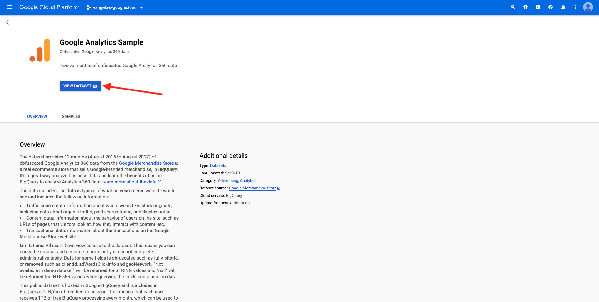

# 4.2.1 Creare l’account della piattaforma Google Cloud

## Obiettivi

- Creare l’account della piattaforma Google Cloud
- Acquisisci familiarità con la console della piattaforma Google Cloud
- Creare e preparare il progetto BigQuery

## 4.2.1.1 Perché collegare Google BigQuery a Adobe Experience Platform per ottenere dati Google Analytics

Google Cloud Platform (GCP) è una suite di servizi pubblici di cloud computing offerti da Google. La piattaforma Google Cloud include una serie di servizi in hosting per lo sviluppo di applicazioni, applicazioni e sistemi di elaborazione che vengono eseguiti su hardware Google.

BigQuery è uno di questi servizi ed è sempre incluso in Google Analytics 360. I dati Google Analytics vengono frequentemente campionati quando si tenta di ottenere dati direttamente da esso (ad esempio API). Ecco perché Google include BigQuery per ottenere dati non campionati, in modo che i brand possano eseguire analisi avanzate utilizzando SQL e beneficiare della potenza di GCP.

I dati Google Analytics vengono caricati quotidianamente in BigQuery utilizzando un meccanismo batch. Di conseguenza, non ha alcun senso utilizzare questa integrazione GCP/BigQuery per casi d’uso di personalizzazione e attivazione in tempo reale.

Se un brand desidera fornire casi di utilizzo di personalizzazione in tempo reale basati su dati Google Analytics, può raccogliere tali dati sul sito web con Google Tag Manager e quindi trasmetterli in streaming a Adobe Experience Platform in tempo reale.

Utilizza il connettore Source GCP/BigQuery per...

- tieni traccia del comportamento dei clienti sul sito web e carica tali dati in Adobe Experience Platform per l’analisi, la scienza dei dati e i casi d’uso di personalizzazione che non richiedono attivazione in tempo reale.
- caricare Google Analytics i dati storici in Adobe Experience Platform, anche in questo caso per casi di utilizzo di analisi e data science

## 4.2.1.2 Creare l’account Google

Per ottenere un account Google Cloud Platform è necessario un account Google.

## 4.2.1.3 Attivare l’account della piattaforma Google Cloud

Ora che disponi del tuo account Google, puoi creare un ambiente Google Cloud Platform. Per eseguire questa operazione, vai a [https://console.cloud.google.com/](https://console.cloud.google.com/).

Nella pagina successiva, Accetta i Termini e Condizioni.

Fare clic su **Seleziona un progetto**.

Fai clic su **NUOVO PROGETTO**.

Assegna un nome al progetto seguendo questa convenzione di denominazione:

| Convenzione | Esempio |
| ----------------- |-------------| 
| `--aepUserLdap---googlecloud` | delaigle-googlecloud |

Fai clic su **Crea**.

Attendi che la notifica in alto a destra dello schermo indichi che la creazione è terminata. Quindi, fai clic su **Visualizza progetto**.

Quindi, vai alla barra di ricerca nella parte superiore dello schermo e digita **BigQuery**. Selezionare il primo risultato.

Successivamente verrai reindirizzato alla console BigQuery e visualizzerai un messaggio a comparsa.

**Fai clic su Fine**.

L’obiettivo di questo modulo è quello di inserire i dati Google Analytics in Adobe Experience Platform. Per farlo, abbiamo bisogno di dati fittizi in un set di dati Google Analytics per iniziare con.

Fai clic su **Aggiungi dati** nel menu a sinistra, quindi fai clic su **Esplora set di dati pubblici**.

Viene quindi visualizzata questa finestra:

Immetti il termine di ricerca **Google Analytics campione** nella barra di ricerca e seleziona il primo risultato.

Viene visualizzata la schermata seguente con una descrizione del set di dati. Fare clic su **VISUALIZZA SET DI DATI**.

Verrai quindi reindirizzato a BigQuery dove visualizzerai questo **set di dati bigquery-public-data** in **Explorer**.

In **Explorer**, ora dovresti visualizzare diverse tabelle. Sentiti libero di esplorarle. Vai a `google_analytics_sample`.

Fare clic per aprire la tabella `ga_sessions`.

Prima di continuare con l&#39;esercizio successivo, annotare i seguenti elementi in un file di testo separato sul computer:

| Credenziali | Denominazione | Esempio |
| ----------------- |-------------| -------------|
| Nome progetto | `--aepUserLdap---googlecloud` | vangeluw-googlecloud |
| ID Progetto | random | 306413-attività-composta |

Per trovare il nome e l&#39;ID progetto, fai clic sul **nome progetto** nella barra dei menu superiore:

A questo punto, a destra viene visualizzato il tuo ID progetto:

Ora puoi passare all’esercizio 12.2, in cui sporcherai le mani interrogando i dati delle Google Analytics.

Passaggio successivo: [4.2.2 Crea la prima query in BigQuery](./ex2.md)

[Torna al modulo 4.2](./customer-journey-analytics-bigquery-gcp.md)

[Torna a tutti i moduli](./../../../overview.md)
