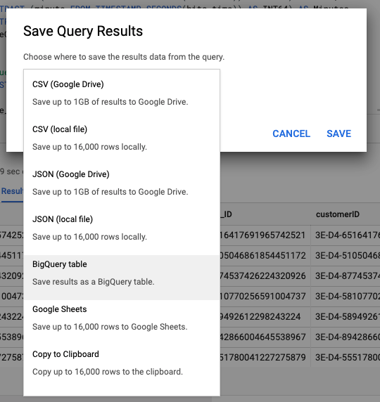

# 4.2.2 Creare la prima query in BigQuery

## Obiettivi

- Esplorare l’interfaccia utente BigQuery
- Creare una query SQL in BigQuery
- Salvare i risultati della query SQL in un set di dati in BigQuery

## Contesto

Quando i dati Google Analytics sono in BigQuery, dimensioni, metriche e altre variabili sono tutte nidificate. Inoltre, i dati delle Google Analytics vengono caricati quotidianamente in tabelle diverse. Ciò significa che provare a collegare direttamente le tabelle Google Analytics all’interno di BigQuery a Adobe Experience Platform è molto difficile e non è una buona idea.

La soluzione a questo problema consiste nel trasformare i dati Google Analytics in un formato leggibile per semplificare l’acquisizione in Adobe Experience Platform.

## 4.2.2.1 Creare un set di dati per salvare nuove tabelle BigQuery

Passa alla [console BigQuery](https://console.cloud.google.com/bigquery).


In **Explorer** verrà visualizzato l&#39;ID progetto. Fai clic sull&#39;ID progetto (non fare clic sul set di dati **bigquery-public-data**).


Puoi notare che non esiste ancora un set di dati, quindi creane uno ora.
Fare clic su **CREA SET DI DATI**.


Sul lato destro dello schermo viene visualizzato il menu **Crea set di dati**.


Per l&#39;**ID set di dati**, utilizzare la convenzione di denominazione seguente. Per gli altri campi, lascia le impostazioni predefinite.

| Denominazione | Esempio |
| ----------------- | ------------- | 
| `--demoProfileLdap--_BigQueryDataSets` | vangeluw_BigQueryDataSets |


Fare clic su **Crea set di dati**.


Tornerai quindi alla console BigQuery con il set di dati creato.


## 4.2.2.2 Creare il primo BigQuery SQL

Successivamente, creerai la tua prima query in BigQuery. L’obiettivo di questa query è quello di prendere i dati di esempio delle Google Analytics e trasformarli in modo che possano essere acquisiti in Adobe Experience Platform. Passa alla scheda **EDITOR**.


Copiare la seguente query SQL e incollarla nell&#39;editor di query. Leggi la query e comprendi la sintassi Google Analytics di BigQuery.


```sql
SELECT
  CONCAT(fullVisitorId, CAST(hitTime AS String), '-', hitNumber) AS _id,
  TIMESTAMP(DATETIME(Year_Current, Month_Current, Day_Current, Hour, Minutes, Seconds)) AS timeStamp,
  fullVisitorId as GA_ID,
  -- Fake CUSTOMER ID
  CONCAT('3E-D4-',fullVisitorId, '-1W-93F' ) as customerID,
  Page,
  Landing_Page,
  Exit_Page,
  Device,
  Browser,
  MarketingChannel,
  TrafficSource,
  TrafficMedium,
  -- Enhanced Ecommerce
  TransactionID,
  CASE
      WHEN EcommerceActionType = '2' THEN 'Product_Detail_Views'
      WHEN EcommerceActionType = '3' THEN 'Adds_To_Cart'
      WHEN EcommerceActionType = '4' THEN 'Product_Removes_From_Cart'
      WHEN EcommerceActionType = '5' THEN 'Product_Checkouts'
      WHEN EcommerceActionType = '6' THEN 'Product_Refunds'
    ELSE
    NULL
  END
     AS Ecommerce_Action_Type,
  -- Entrances (metric)
  SUM(CASE
      WHEN isEntrance = TRUE THEN 1
    ELSE
    0
  END
    ) AS Entries,
    
--Pageviews (metric)
    COUNT(*) AS Pageviews,
    
 -- Exits 
    SUM(
    IF
      (isExit IS NOT NULL,
        1,
        0)) AS Exits,
        
 --Bounces
   SUM(CASE
      WHEN isExit = TRUE AND isEntrance = TRUE THEN 1
    ELSE
    0
  END
    ) AS Bounces,
        
  -- Unique Purchases (metric)
  COUNT(DISTINCT TransactionID) AS Unique_Purchases,
  -- Product Detail Views (metric)
  COUNT(CASE
      WHEN EcommerceActionType = '2' THEN fullVisitorId
    ELSE
    NULL
  END
    ) AS Product_Detail_Views,
  -- Product Adds To Cart (metric)
  COUNT(CASE
      WHEN EcommerceActionType = '3' THEN fullVisitorId
    ELSE
    NULL
  END
    ) AS Adds_To_Cart,
  -- Product Removes From Cart (metric)
  COUNT(CASE
      WHEN EcommerceActionType = '4' THEN fullVisitorId
    ELSE
    NULL
  END
    ) AS Product_Removes_From_Cart,
  -- Product Checkouts (metric)
  COUNT(CASE
      WHEN EcommerceActionType = '5' THEN fullVisitorId
    ELSE
    NULL
  END
    ) AS Product_Checkouts,
  -- Product Refunds (metric)
  COUNT(CASE
      WHEN EcommerceActionType = '7' THEN fullVisitorId
    ELSE
    NULL
  END
    ) AS Product_Refunds
  FROM (
  SELECT
    -- Landing Page (dimension)
    CASE
      WHEN hits.isEntrance = TRUE THEN hits.page.pageTitle
    ELSE NULL
  END
    AS Landing_page,
    
        -- Exit Page (dimension)
    CASE
      WHEN hits.isExit = TRUE THEN hits.page.pageTitle
    ELSE
    NULL
  END
    AS Exit_page,
    
    hits.page.pageTitle AS Page,
    hits.isEntrance,
    hits.isExit,
    hits.hitNumber as hitNumber,
    hits.time as hitTime,
    date as Fecha,
    fullVisitorId,
    visitStartTime,
    device.deviceCategory AS Device,
    device.browser AS Browser,
    channelGrouping AS MarketingChannel,
    trafficSource.source AS TrafficSource,
    trafficSource.medium AS TrafficMedium,
    hits.transaction.transactionId AS TransactionID,
    CAST(EXTRACT(YEAR FROM CURRENT_DATE()) AS INT64) AS Year_Current,
    CAST(EXTRACT(MONTH FROM CURRENT_DATE()) AS INT64) AS Month_Current,
     CAST(EXTRACT(DAY FROM CURRENT_DATE()) AS INT64) AS Day_Current,
    CAST(EXTRACT(DAY FROM DATE_SUB(CURRENT_DATE(),INTERVAL 1 DAY)) AS INT64) AS Day_Current_Before,
    CAST(FORMAT_DATE('%Y', PARSE_DATE("%Y%m%d", date)) AS INT64) AS Year,
  CAST(FORMAT_DATE('%m', PARSE_DATE("%Y%m%d",date)) AS INT64) AS Month,
  CAST(FORMAT_DATE('%d', PARSE_DATE("%Y%m%d",date)) AS INT64) AS Day,
    CAST(EXTRACT (hour FROM TIMESTAMP_SECONDS(hits.time)) AS INT64) AS Hour,
  CAST(EXTRACT (minute FROM TIMESTAMP_SECONDS(hits.time)) AS INT64) AS Minutes,
  CAST(EXTRACT (second FROM TIMESTAMP_SECONDS(hits.time)) AS INT64) AS SecondS,
    hits.eCommerceAction.action_type AS EcommerceActionType
  
  FROM
    `bigquery-public-data.google_analytics_sample.ga_sessions_*`,
     UNNEST(hits) AS hits
  WHERE
    _table_suffix BETWEEN '20170101'
    AND '20170331'
    AND totals.visits = 1
    AND hits.type = 'PAGE'
    )
    
GROUP BY
  1,
  2,
  3,
  4,
  5,
  6,
  7,
  8,
  9,
  10,
  11,
  12,
  13,
  14
    
  ORDER BY 2 DESC
```

Quando sei pronto, fai clic su **Esegui** per eseguire la query:


L&#39;esecuzione della query può richiedere alcuni minuti.

Al termine dell&#39;esecuzione della query, verrà visualizzato l&#39;output seguente in **Risultati query**.


## 4.2.2.3 Salvare i risultati della query SQL BigQuery

Il passaggio successivo consiste nel salvare l&#39;output della query facendo clic sul pulsante **SALVA RISULTATI**.


Come percorso per l&#39;output, selezionare **Tabella BigQuery**.



Verrà quindi visualizzata una nuova finestra a comparsa in cui i valori **Nome progetto** e **Nome set di dati** sono precompilati. Il nome del set di dati deve essere il set di dati creato all’inizio di questo esercizio, con questa convenzione di denominazione:

| Denominazione | Esempio |
| ----------------- | ------------- | 
| `--demoProfileLdap--_BigQueryDataSets` | `vangeluw_BigQueryDataSets` |

È ora necessario immettere il nome di una tabella. Utilizza questa convenzione per i nomi:

| Denominazione | Esempio |
| ----------------- |------------- | 
| `--demoProfileLdap--_GAdataTableBigQuery` | `vangeluw_GAdataTableBigQuery` |


Fai clic su **SALVA**.

La preparazione dei dati nella tabella creata potrebbe richiedere del tempo. Dopo alcuni minuti, aggiorna il browser. Dovresti quindi visualizzare all&#39;interno del set di dati la tabella `--demoProfileLdap--_GAdataTableBigquery` in **Explorer** all&#39;interno del progetto BigQuery.


Ora puoi continuare con l’esercizio successivo, in cui connetterai questa tabella a Adobe Experience Platform.

Passaggio successivo: [4.2.3 Connetti GCP e BigQuery a Adobe Experience Platform](./ex3.md)

[Torna al modulo 4.2](./customer-journey-analytics-bigquery-gcp.md)

[Torna a tutti i moduli](./../../../overview.md)
