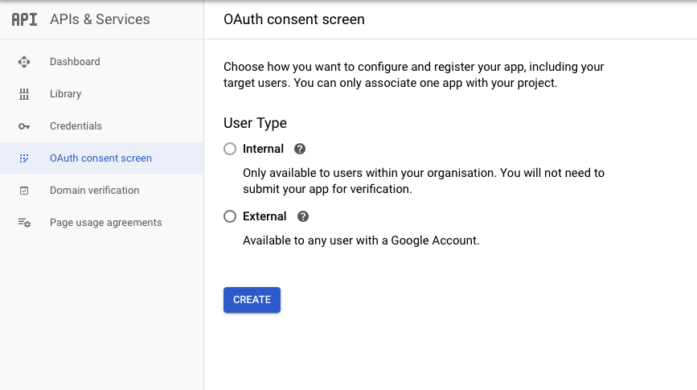
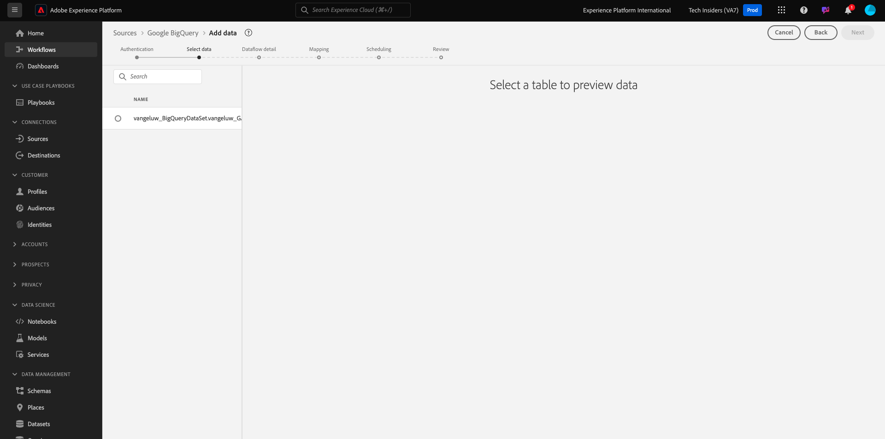

# 4.2.3 Collegare GCP e BigQuery a Adobe Experience Platform

## Obiettivi

- Esplora API e servizi nella piattaforma Google Cloud
- Conoscere OAuth Playground per testare le API di Google
- Creare la prima connessione BigQuery in Adobe Experience Platform

## Contesto

Adobe Experience Platform fornisce un connettore all&#39;interno di **Sorgenti** che ti aiuterà a portare set di dati BigQuery in Adobe Experience Platform. Questo connettore dati è basato sull’API BigQuery di Google. Pertanto, è importante preparare correttamente la piattaforma Google Cloud e l’ambiente BigQuery per ricevere chiamate API da Adobe Experience Platform.

Per configurare il connettore Source BigQuery in Adobe Experience Platform, sono necessari i seguenti 4 valori:

- progetto
- clientId
- clientSecret
- refreshToken

Finora disponi solo del primo, **ID progetto**. Il valore **ID progetto** è un ID casuale generato da Google durante la creazione del progetto BigQuery nell&#39;esercizio 12.1.

Copia l&#39;ID progetto in un file di testo separato.

| Credenziali | Denominazione | Esempio |
| ----------------- |-------------| -------------|
| ID Progetto | random | 306413-attività-composta |

Puoi controllare il tuo ID progetto in qualsiasi momento facendo clic sul **Nome progetto** nella barra dei menu superiore:

Vedrai l’ID progetto sul lato destro:

In questo esercizio imparerai a ottenere gli altri 3 campi obbligatori:

- clientId
- clientSecret
- refreshToken

## 4.2.3.1 API e servizi di Google Cloud

Per iniziare, torna alla home page della piattaforma Google Cloud. A tale scopo, fai clic sul logo nell’angolo in alto a sinistra dello schermo.

Una volta nella home page, vai al menu a sinistra e fai clic su **API e servizi**, quindi fai clic su **Dashboard**.

Verrà visualizzata la home page di **API e servizi**.

In questa pagina puoi vedere l’utilizzo delle varie connessioni API di Google. Per impostare una connessione API in modo che Adobe Experience Platform possa leggere da BigQuery, devi seguire questi passaggi:

- Innanzitutto, devi creare una schermata di consenso OAuth per abilitare le autenticazioni future. I motivi di sicurezza di Google richiedono inoltre che un essere umano effettui la prima autenticazione, prima che sia consentito un accesso programmatico.
- In secondo luogo, sono necessarie le credenziali API (clientId e clientSecret) che verranno utilizzate per l’autenticazione API e per l’accesso al connettore BigQuery.

## 4.2.3.2 Schermata di consenso OAuth

Cominciamo con la creazione della schermata di consenso OAuth. Nel menu a sinistra della home page di **API e servizi**, fai clic sulla **schermata di consenso OAuth**.

A questo punto viene visualizzato quanto segue:

Selezionare il tipo di utente: **Esterno**. Fare clic su **CREA**.

Ti troverai nella finestra **Configurazione schermata di consenso OAuth**.

L&#39;unica cosa da fare qui è immettere il nome della schermata di consenso nel campo **Nome applicazione** e selezionare l&#39;**e-mail di supporto utente**. Per il nome dell&#39;applicazione, utilizzare la convenzione di denominazione seguente:

| Denominazione | Esempio |
| ----------------- |-------------| 
| `--demoProfileLdap-- - AEP BigQuery Connector` | vangeluw - Connettore BigQuery AEP |

Quindi scorri verso il basso fino a visualizzare **le informazioni di contatto per gli sviluppatori** e compila un indirizzo e-mail.

Fai clic su **SALVA E CONTINUA**.

Poi vedrai questo. Fai clic su **SALVA E CONTINUA**.

Poi vedrai questo. Fai clic su **SALVA E CONTINUA**.

Poi vedrai questo. Fai clic su **TORNA AL DASHBOARD**.

Poi vedrai questo. Fai clic su **APP PUBLISH**.

Fare clic su **CONFIRM**.

Poi vedrai questo.

Nel passaggio successivo, completerai la configurazione API e otterrai le tue credenziali API.

## 4.2.3.3 Credenziali API di Google: Segreto client e ID client

Nel menu a sinistra, fai clic su **Credenziali**. A questo punto viene visualizzato quanto segue:

Fare clic sul pulsante **+ CREA CREDENZIALI**.

Vedrai 3 opzioni. Fai clic sull&#39;**ID client OAuth**:

Nella schermata successiva, selezionare **Applicazione Web**.

Verranno visualizzati diversi nuovi campi. È ora necessario immettere **Name** dell&#39;ID client OAuth e anche **URI di reindirizzamento autorizzati**.

Segui questa convenzione di denominazione:

| Campo | Valore | Esempio |
| ----------------- |-------------| -------------| 
| Nome | ldap - Connettore BigQuery AEP | vangeluw - Connettore BigQuery della piattaforma |
| URI di reindirizzamento autorizzati | https://developers.google.com/oauthplayground | https://developers.google.com/oauthplayground |

Il campo **URI di reindirizzamento autorizzati** è molto importante perché sarà necessario in seguito per ottenere RefreshToken necessario per completare la configurazione del connettore Source BigQuery in Adobe Experience Platform.

Prima di continuare, è necessario premere fisicamente il pulsante **Invio** dopo aver immesso l&#39;URL per memorizzare il valore nel campo **URI di reindirizzamento autorizzati**. Se non fai clic sul pulsante **Invio**, riscontrerai problemi in una fase successiva, nell&#39;area di riproduzione **OAuth 2.0**.

Fare clic su **Crea**:

Ora puoi visualizzare il tuo ID client e il tuo segreto client.

Copiare questi due campi e incollarli in un file di testo sul desktop. Puoi sempre accedere a queste credenziali in un secondo momento, ma è più semplice salvarle in un file di testo accanto all’ID progetto BigQuery.

Come ricapitolazione per la configurazione del connettore Source BigQuery in Adobe Experience Platform, ora disponi già dei seguenti valori:

| Credenziali del connettore BigQuery | Valore |
| ----------------- |-------------| 
| ID Progetto | il tuo Project ID (es.: component-task-306413) |
| clientid | yourclientid |
| cilentsecret | yourclientsecret |

Manca ancora il **refreshToken**. refreshToken è un requisito per motivi di sicurezza. Nel mondo delle API, i token scadono in genere ogni 24 ore. Pertanto, **refreshToken** è necessario per aggiornare il token di sicurezza ogni 24 ore, in modo che la configurazione del connettore Source possa continuare a connettersi a Google Cloud Platform e BigQuery.

## 4.2.3.4 API BigQuery e refreshToken

Esistono diversi modi per ottenere un refreshToken per accedere alle API di Google Cloud Platform. Una di queste opzioni è, ad esempio, l’utilizzo di Postman.
Tuttavia, Google ha creato qualcosa di più semplice da testare e riprodurre con le loro API, uno strumento denominato **Ambiente playground OAuth 2.0**.

Per accedere a **Ambiente OAuth 2.0**, vai a [https://developers.google.com/oauthplayground](https://developers.google.com/oauthplayground).

Verrà visualizzata la home page di **OAuth 2.0 Playground**.

Fai clic sull&#39;icona **ingranaggio** in alto a destra dello schermo:

Assicurati che le impostazioni siano le stesse di quelle visualizzate nell’immagine precedente.

Verifica che le impostazioni siano sicure al 100%.

Al termine, seleziona la casella di **Usa le tue credenziali OAuth**

Dovrebbero essere visualizzati due campi, per i quali si dispone del relativo valore.

Compila i campi seguenti questa tabella:

| Impostazioni API Playground | Credenziali API Google |
| ----------------- |-------------| 
| ID client OAuth | il tuo ID client (nel file di testo sul desktop) |
| Segreto client OAuth | il segreto client (nel file di testo sul desktop) |

Copia il **ID client** e il **Segreto client** dal file di testo creato sul desktop.

Dopo aver compilato le credenziali, fai clic su **Chiudi**

Nel menu a sinistra, puoi visualizzare tutte le API di Google disponibili. Cerca **API BigQuery v2**.

Quindi, seleziona l’ambito come indicato nell’immagine seguente:

Dopo averli selezionati, dovresti visualizzare un pulsante blu che indica **Autorizza API**. Fai clic su di esso.

Seleziona l’account Google utilizzato per configurare GCP e BigQuery.

È possibile che venga visualizzato un avviso importante: **L&#39;app non è stata verificata**. Questo accade perché il connettore BigQuery della piattaforma non è ancora stato formalmente rivisto, quindi Google non sa se si tratta di un’app autentica o meno. Ignora questa notifica.

Fare clic su **Avanzate**.

Fare clic su **Vai a ldap - Connettore BigQuery AEP (non sicuro)**.

Verrai reindirizzato alla schermata di consenso OAuth creata.

Se si utilizza l&#39;autenticazione a due fattori (2FA), immettere il codice di verifica inviato.

In Google verranno ora visualizzate otto **richieste di autorizzazione** diverse. Fai clic su **Consenti** per tutte e otto le richieste di autorizzazione. (Questa è una procedura che deve essere seguita e confermata una volta da un essere umano reale, prima che l’API consenta le richieste programmatiche)

Anche in questo caso, **otto finestre popup diverse** non verranno visualizzate. È necessario fare clic su **Consenti** per tutte le finestre popup.

Dopo le otto richieste di autorizzazione, visualizzerai questa panoramica. Fai clic su **Consenti** per completare il processo.

Dopo l&#39;ultimo **Consenti** clic, verrai rimandato a OAuth 2.0 Playground e visualizzerai quanto segue:

Fare clic su **Codice di autorizzazione Exchange per i token**.

Dopo un paio di secondi, il **Passaggio 2 - Codice di autorizzazione di Exchange per i token** verrà chiuso automaticamente e verrà visualizzato **Passaggio 3 - Configura richiesta all&#39;API**.

Devi tornare al **Passaggio 2 Codice di autorizzazione di Exchange per i token**, quindi fai di nuovo clic sul **Passaggio 2 Codice di autorizzazione di Exchange per i token** per visualizzare il **Aggiorna token**.

Ora visualizzerai il **token di aggiornamento**.

Copiare il **token di aggiornamento** e incollarlo nel file di testo sul desktop insieme alle altre credenziali del connettore Source BigQuery:

| Credenziali connettore Source BigQuery | Valore |
| ----------------- |-------------| 
| ID Progetto | il tuo ID progetto casuale (ad es.: apt-summer-273608) |
| clientid | yourclientid |
| cilentsecret | yourclientsecret |
| refreshtoken | il token di aggiornamento |

Quindi, configuriamo il connettore Source in Adobe Experience Platform.

## 4.2.3.5 - Connettere la piattaforma con la propria tabella BigQuery

Accedi a Adobe Experience Platform da questo URL: [https://experience.adobe.com/platform](https://experience.adobe.com/platform).

Dopo aver effettuato l’accesso, accedi alla home page di Adobe Experience Platform.

Prima di continuare, devi selezionare una **sandbox**. La sandbox da selezionare è denominata ``--aepSandboxId--``. A tale scopo, fai clic sul testo **[!UICONTROL Prod produzione]** nella riga blu nella parte superiore dello schermo. Dopo aver selezionato la sandbox appropriata, la schermata cambia e ora sei nella sandbox dedicata.

Nel menu a sinistra, vai a Sorgenti. Verrà quindi visualizzata la home page **Sources**. Nel menu **Origini**, fare clic su **Database**. Fai clic sulla scheda **Google BigQuery**. Fare clic su **Configura** o **+ Configura**.

È ora necessario creare una nuova connessione.

Fai clic su **Nuovo account**. Ora devi compilare tutti i campi seguenti, in base alla configurazione eseguita in GCP e BigQuery.

Iniziamo con la denominazione della connessione:

Utilizza questa convenzione per i nomi:

| Credenziali del connettore BigQuery | Valore | Esempio |
| ----------------- |-------------| -------------| 
| Nome account | `--demoProfileLdap-- - BigQuery Connection` | vangeluw - Connessione BigQuery |
| Descrizione | `--demoProfileLdap-- - BigQuery Connection` | vangeluw - Connessione BigQuery |

Il che dovrebbe darti qualcosa del genere:

Compila quindi i dettagli relativi all’autenticazione dell’account **GCP e BigQuery API** che hai memorizzato in un file di testo sul desktop:

| Credenziali del connettore BigQuery | Valore |
| ----------------- |-------------| 
| ID Progetto | il tuo ID progetto casuale (ad es.: apt-summer-273608) |
| clientId | ... |
| clientSecret | ... |
| refreshToken | ... |

I dettagli dell&#39;**autenticazione account** ora dovrebbero essere simili ai seguenti:

Dopo aver compilato tutti questi campi, fare clic su **Connetti all&#39;origine**.

Se i dettagli di **Autenticazione account** sono stati compilati correttamente, è ora possibile visualizzare una conferma visiva che la connessione funziona correttamente, visualizzando la conferma di **Connesso**.

Dopo aver creato la connessione, fai clic su **Avanti**:

Ora visualizzerai il set di dati BigQuery creato durante l’esercizio 12.2.

Ben fatto! Nell’esercizio successivo, caricherai i dati da tale tabella e li mapperai su uno schema e un set di dati in Adobe Experience Platform.

Passaggio successivo: [4.2.4 Carica i dati da BigQuery in Adobe Experience Platform](./ex4.md)

[Torna al modulo 4.2](./customer-journey-analytics-bigquery-gcp.md)

[Torna a tutti i moduli](./../../../overview.md)
