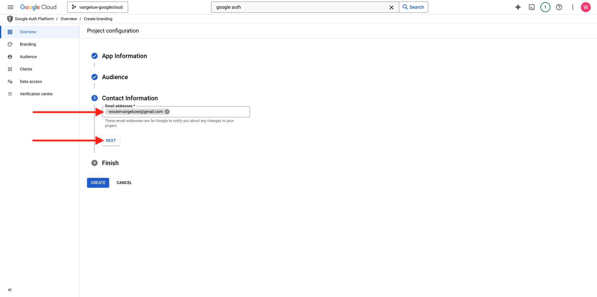
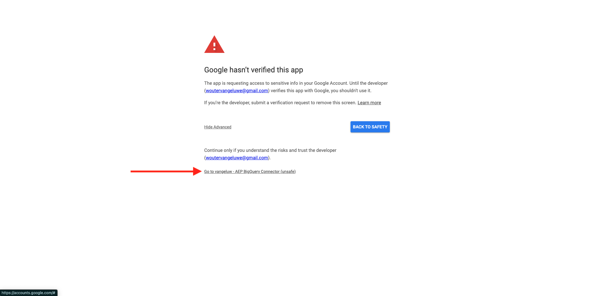

# 4.2.3 Collegare GCP e BigQuery a Adobe Experience Platform

## Obiettivi

- Esplora API e servizi nella piattaforma Google Cloud
- Conoscere OAuth Playground per testare le API di Google
- Creare la prima connessione BigQuery in Adobe Experience Platform

## Contesto

Adobe Experience Platform fornisce un connettore all&#39;interno di **Sorgenti** che ti aiuterà a portare set di dati BigQuery in Adobe Experience Platform. Questo connettore dati è basato sull’API BigQuery di Google. Pertanto, è importante preparare correttamente la piattaforma Google Cloud e l’ambiente BigQuery per ricevere chiamate API da Adobe Experience Platform.

Per configurare il connettore Source BigQuery in Adobe Experience Platform, sono necessari i seguenti 4 valori:

- progetto
- clientId
- clientSecret
- refreshToken

Finora disponi solo del primo, **ID progetto**. Il valore **ID progetto** è un ID casuale generato da Google durante la creazione del progetto BigQuery nell&#39;esercizio 12.1.

Copia l&#39;ID progetto in un file di testo separato.

| Credenziali | Denominazione | Esempio |
| ----------------- |-------------| -------------|
| ID Progetto | random | possible-bee-447102-h3 |

Puoi controllare il tuo ID progetto in qualsiasi momento facendo clic sul **Nome progetto** nella barra dei menu superiore:

Vedrai l’ID progetto sul lato destro:

In questo esercizio imparerai a ottenere gli altri 3 campi obbligatori:

- clientId
- clientSecret
- refreshToken

## 4.2.3.1 Piattaforma Google Auth

Per iniziare, torna alla home page della piattaforma Google Cloud. A tale scopo, fai clic sul logo nell’angolo in alto a sinistra dello schermo.

Una volta nella home page, cercare **Google Auth Platform** nella barra di ricerca. Fare clic sul primo risultato per aprirlo.

Verrà visualizzata la home page di **Google Auth Platform**. Fare clic su **GET AVVIATO**.

Per il **nome app**, utilizzare:

| Denominazione | Esempio |
| ----------------- |-------------| 
| `--aepUserLdap-- - AEP BigQuery Connector` | vangeluw - Connettore BigQuery AEP |

Seleziona il tuo indirizzo e-mail per il campo **E-mail supporto utente**.

Fai clic su **AVANTI**.

Seleziona **External** e fai clic su **NEXT**.

Immetti il tuo indirizzo e-mail e fai clic su **AVANTI**.

Selezionare la casella di controllo e fare clic su **CONTINUA**. Quindi fare clic su **CREA**.

## 4.2.3.2 Creazione del client OAuth

Fare clic su **CREA CLIENT OAUTH**.

Poi vedrai questo.

Seleziona **applicazione Web**.

Verranno visualizzati diversi nuovi campi. È ora necessario immettere **Name** dell&#39;ID client OAuth e anche **URI di reindirizzamento autorizzati**.

Per il campo **Nome**, utilizza questo:

| Campo | Valore | Esempio |
| ----------------- |-------------| -------------| 
| Nome | ldap - Connettore BigQuery AEP | vangeluw - Connettore BigQuery della piattaforma |

Fare clic su **+ ADD URI** in **URI di reindirizzamento autorizzati**. Aggiungi il nuovo URI seguente.

| Campo | Valore |
| ----------------- |-------------| 
| URI di reindirizzamento autorizzati | https://developers.google.com/oauthplayground |

Il campo **URI di reindirizzamento autorizzati** è molto importante perché sarà necessario in seguito per ottenere RefreshToken necessario per completare la configurazione del connettore Source BigQuery in Adobe Experience Platform.

Fai clic su **Crea**.

L&#39;ID client OAuth è stato creato. Fai clic su di esso per visualizzare ora l’ID client e il segreto client.

Vengono quindi visualizzati i valori per ID client e Segreto client.

Copiare questi due campi e incollarli in un file di testo sul desktop. Puoi sempre accedere a queste credenziali in un secondo momento, ma è più semplice salvarle in un file di testo accanto all’ID progetto BigQuery.

Come ricapitolazione per la configurazione del connettore Source BigQuery in Adobe Experience Platform, ora disponi già dei seguenti valori:

| Credenziali del connettore BigQuery | Valore |
| ----------------- |-------------| 
| ID Progetto | il tuo Project ID (es.: possible-bee-447102-h3) |
| clientid | yourclientid |
| cilentsecret | yourclientsecret |

Successivamente, devi pubblicare l’app OAuth. Vai a **Pubblico** e fai clic su **APP PUBLISH**.

Fare clic su **CONFIRM**.

Manca ancora il **refreshToken**. refreshToken è un requisito per motivi di sicurezza. Nel mondo delle API, i token scadono in genere ogni 24 ore. Pertanto, **refreshToken** è necessario per aggiornare il token di sicurezza ogni 24 ore, in modo che la configurazione del connettore Source possa continuare a connettersi a Google Cloud Platform e BigQuery.

## 4.2.3.3 API BigQuery e refreshToken

Esistono diversi modi per ottenere un refreshToken per accedere alle API di Google Cloud Platform. Una di queste opzioni è, ad esempio, l’utilizzo di Postman.
Tuttavia, Google ha creato qualcosa di più semplice da testare e riprodurre con le loro API, uno strumento denominato **Ambiente playground OAuth 2.0**.

Per accedere a **Ambiente OAuth 2.0**, vai a [https://developers.google.com/oauthplayground](https://developers.google.com/oauthplayground).

Verrà visualizzata la home page di **OAuth 2.0 Playground**.

Fai clic sull&#39;icona **ingranaggio** in alto a destra dello schermo. Assicurati che le impostazioni siano le stesse di quelle visualizzate nell’immagine precedente.

Seleziona la casella di controllo: **Usa le tue credenziali OAuth**

Vengono visualizzati due campi.

Compila i campi seguenti questa tabella:

| Impostazioni API Playground | Credenziali API Google |
| ----------------- |-------------| 
| ID client OAuth | il tuo ID client (nel file di testo sul desktop) |
| Segreto client OAuth | il segreto client (nel file di testo sul desktop) |

Dopo aver compilato le credenziali, fai clic su **Chiudi**.

Nel menu a sinistra, puoi visualizzare tutte le API di Google disponibili. Cerca **API BigQuery v2** e fai clic su di essa per aprirla.

Quindi, selezionare l&#39;ambito come indicato nell&#39;immagine seguente. Fai clic su ciascuna API disponibile per visualizzare un segno di spunta per ogni API selezionata.

Fare clic su **Autorizza API**.

Fai clic sull’indirizzo e-mail utilizzato per configurare GCP e BigQuery.

Verrà visualizzato un avviso importante: **L&#39;app non è stata verificata**. Questo accade perché il connettore BigQuery della piattaforma non è ancora stato formalmente rivisto, quindi Google non sa se si tratta di un’app autentica o meno.

Fare clic su **Avanzate**.

Quindi, fai clic su **Vai a —aepUserLdap— - Connettore BigQuery AEP (unsafe)**.

Verrà quindi visualizzato un prompt di protezione per l&#39;accesso. Fare clic su **Seleziona tutto**.

Scorri verso il basso e fai clic su **Continua**.

Ora verrai rimandato al Playground di OAuth 2.0 e vedrai questo. Fare clic su **Codice di autorizzazione Exchange per i token**.

Dopo un paio di secondi, il **Passaggio 2 - Codice di autorizzazione di Exchange per i token** verrà chiuso automaticamente e verrà visualizzato **Passaggio 3 - Configura richiesta all&#39;API**.

Devi tornare al **Passaggio 2 Codice di autorizzazione di Exchange per i token**, quindi fai di nuovo clic sul **Passaggio 2 Codice di autorizzazione di Exchange per i token** per visualizzare il **Aggiorna token**.

Ora visualizzerai il **token di aggiornamento**.

Copiare il **token di aggiornamento** e incollarlo nel file di testo sul desktop insieme alle altre credenziali del connettore Source BigQuery:

| Credenziali connettore Source BigQuery | Valore |
| ----------------- |-------------| 
| ID Progetto | il tuo ID progetto casuale (ad es.: apt-summer-273608) |
| clientid | yourclientid |
| cilentsecret | yourclientsecret |
| refreshtoken | il token di aggiornamento |

Quindi, configuriamo il connettore Source in Adobe Experience Platform.

## 4.2.3.5 - Connettere la piattaforma con la propria tabella BigQuery

Accedi a Adobe Experience Platform da questo URL: [https://experience.adobe.com/platform](https://experience.adobe.com/platform).

Dopo aver effettuato l’accesso, accedi alla home page di Adobe Experience Platform.

Prima di continuare, devi selezionare una **sandbox**. La sandbox da selezionare è denominata ``--aepSandboxName--``. Dopo aver selezionato la sandbox appropriata, la schermata cambia e ora sei nella sandbox dedicata.

Nel menu a sinistra, vai a Sorgenti. Verrà quindi visualizzata la home page **Sources**. Nel menu **Origini**, fare clic su **Database**. Fai clic sulla scheda **Google BigQuery**. Fare clic su **Configura**.

È ora necessario creare una nuova connessione.

Fai clic su **Nuovo account**. Ora devi compilare tutti i campi seguenti, in base alla configurazione eseguita in GCP e BigQuery.

Iniziamo con la denominazione della connessione:

Utilizza questa convenzione per i nomi:

| Credenziali del connettore BigQuery | Valore | Esempio |
| ----------------- |-------------| -------------| 
| Nome account | `--aepUserLdap-- - BigQuery Connection` | vangeluw - Connessione BigQuery |
| Descrizione | `--aepUserLdap-- - BigQuery Connection` | vangeluw - Connessione BigQuery |

A questo punto si otterrà:

Compila quindi i dettagli relativi all’autenticazione dell’account **GCP e BigQuery API** che hai memorizzato in un file di testo sul desktop:

| Credenziali del connettore BigQuery | Valore |
| ----------------- |-------------| 
| ID Progetto | il tuo ID progetto casuale (ad es.: possible-bee-447102-h3) |
| clientId | ... |
| clientSecret | ... |
| refreshToken | ... |

I dettagli dell&#39;**autenticazione account** ora dovrebbero essere simili a questi. Fare clic su **Connetti all&#39;origine**.

Se i dettagli di **Autenticazione account** sono stati compilati correttamente, è ora possibile visualizzare una conferma visiva che la connessione funziona correttamente, visualizzando la conferma di **Connesso**. Fai clic su **Avanti**.

Ora viene visualizzato il set di dati BigQuery creato nell’esercizio precedente.

Ben fatto! Nell’esercizio successivo, caricherai i dati da tale tabella e li mapperai su uno schema e un set di dati in Adobe Experience Platform.

Passaggio successivo: [4.2.4 Carica i dati da BigQuery in Adobe Experience Platform](./ex4.md)

[Torna al modulo 4.2](./customer-journey-analytics-bigquery-gcp.md)

[Torna a tutti i moduli](./../../../overview.md)
