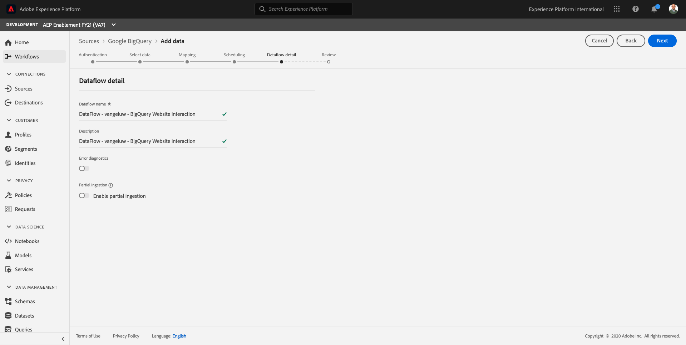

# 4.2.4 Caricare dati da BigQuery in Adobe Experience Platform

## Obiettivi

- Mappare i dati BigQuery su uno schema XDM
- Caricare dati BigQuery in Adobe Experience Platform
- Acquisisci familiarità con l’interfaccia utente del connettore Source BigQuery

## Prima di iniziare

Dopo l’esercizio 12.3, dovresti aprire questa pagina in Adobe Experience Platform:

**Se è aperto, continuare con l&#39;esercizio 12.4.1.**

**Se non è aperto, passare a [Adobe Experience Platform](https://experience.adobe.com/platform/home).**

Nel menu a sinistra, vai a Sorgenti. Verrà quindi visualizzata la home page **Sources**. Nel menu **Origini**, fare clic su **Database**.

Seleziona il connettore Source **Google BigQuery** e fai clic su **+ Configura**.

Viene visualizzata la schermata di selezione dell’account BigQuery Google.

Seleziona il tuo account e fai clic su **Avanti**.

Verrà quindi visualizzata la visualizzazione **Aggiungi dati**.

## 4.2.4.1 Selezione della tabella BigQuery

Nella visualizzazione **Aggiungi dati**, seleziona il set di dati BigQuery.

Ora puoi visualizzare un’anteprima dei dati di Google Analytics di esempio in BigQuery.

Fai clic su **Avanti**.

## 4.2.4.2 Mappatura XDM

Ora visualizzerai questo:

Ora devi creare un nuovo set di dati o selezionare un set di dati esistente in cui caricare i dati delle Google Analytics. Per questo esercizio, sono già stati creati un set di dati e uno schema. Non è necessario creare un nuovo schema o set di dati.

Seleziona **Set di dati esistente**. Apri il menu a discesa per selezionare un set di dati. Cercare il set di dati denominato `Demo System - Event Dataset for BigQuery (Global v1.1)` e selezionarlo. Fai clic su **Avanti**.

Scorri verso il basso. Ora devi mappare ogni **Campo Source** da Google Analytics/BigQuery a un **Campo di destinazione** XDM, campo per campo.

Utilizzare la tabella di mapping riportata di seguito per questo esercizio.

| Campo origine | Campo di destinazione |
| ----------------- |-------------| 
| **_id** | _id |
| **_id** | canale._id |
| timestamp | timestamp |
| GA_ID | ``--aepTenantId--``.identifier.core.gaid |
| customerID | ``--aepTenantId--``.identifier.core.loyaltyId |
| Pagina | web.webPageDetails.name |
| Dispositivo | device.type |
| Browser | environment.browserDetails.vendor |
| MarketingChannel | marketing.trackingCode |
| TrafficSource | channel.typeAtSource |
| TrafficMedium | channel.mediaType |
| TransactionID | commerce.order.payments.transactionID |
| Tipo_Azione_Ecommerce | eventType |
| Visualizzazioni pagina | web.webPageDetails.pageViews.value |
| Acquisti_univoci | commerce.purchases.value |
| Visualizzazioni dettagli prodotto | commerce.productViews.value |
| Adds_To_Cart | commerce.productListAdds.value |
| Product_Removes_From_Cart | commerce.productListRemovals.value |
| Product_Checkouts | commerce.checkouts.value |

Dopo aver copiato e incollato la mappatura di cui sopra nell’interfaccia utente di Adobe Experience Platform, verifica di non visualizzare errori dovuti a errori di battitura o a spazi iniziali/finali.

Hai ora una **Mappatura** come questa:

I campi di origine **GA_ID** e **customerID** sono mappati a un identificatore in questo schema XDM. Questo ti consentirà di arricchire i dati Google Analytics (dati sul comportamento web/app) con altri set di dati come Dati fedeltà o Dati del call center.

Fai clic su **Avanti**.

## 4.2.4.3 Connessione e programmazione dell’acquisizione dei dati

Verrà visualizzata la scheda **Pianificazione**:

Nella scheda **Pianificazione**, è possibile definire una frequenza per il processo di acquisizione dei dati per **Mappatura** e dati.

Poiché in Google BigQuery utilizzi dati demo che non verranno aggiornati, non è realmente necessario impostare una pianificazione in questo esercizio. Devi selezionare qualcosa e, per evitare troppi processi inutili di acquisizione dei dati, devi impostare la frequenza in questo modo:

- Frequenza: **Settimana**
- Intervallo: **200**

**Importante**: assicurarsi di attivare l&#39;opzione **Backfill**.

Ultimo ma non meno importante, è necessario definire un campo **delta**.

Il campo **delta** viene utilizzato per pianificare la connessione e caricare solo le nuove righe incluse nel set di dati BigQuery. Un campo delta è in genere sempre una colonna timestamp. Pertanto, per le future acquisizioni pianificate di dati, verranno acquisite solo le righe con una nuova marca temporale più recente.

Selezionare **timestamp** come campo delta.

Ora hai questo.

Fai clic su **Avanti**.

## 4.2.4.4 Revisione e avvio della connessione

Nella visualizzazione **Dettagli flusso set di dati**. devi assegnare un nome alla connessione, per facilitarne la ricerca in seguito.

Utilizza questa convenzione per i nomi:

| Campo | Denominazione | Esempio |
| ----------------- |-------------| -------------|
| Nome flusso set di dati | Flusso di dati - ldap - Interazione con il sito Web BigQuery | DataFlow - vangeluw - Interazione con il sito Web BigQuery |
| Descrizione | Flusso di dati - ldap - Interazione con il sito Web BigQuery | DataFlow - vangeluw - Interazione con il sito Web BigQuery |

Fai clic su **Avanti**.

Ora viene visualizzata una panoramica dettagliata della connessione. Assicurati che tutto sia corretto prima di continuare, poiché alcune impostazioni non possono più essere modificate in seguito, come ad esempio la mappatura XDM.

Fai clic su **Fine**.

L&#39;impostazione della connessione potrebbe richiedere del tempo, quindi non preoccuparti se noti che:

Una volta creata la connessione, visualizzerai quanto segue:

Ora puoi continuare con il prossimo esercizio, in cui utilizzerai il Customer Journey Analytics per creare visualizzazioni efficaci oltre ai dati Google Analytics.

Passaggio successivo: [4.2.5 Analizzare i dati di Google Analytics utilizzando il Customer Journey Analytics](./ex5.md)

[Torna al modulo 4.2](./customer-journey-analytics-bigquery-gcp.md)

[Torna a tutti i moduli](./../../../overview.md)
