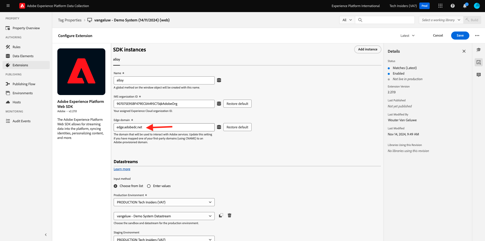

# 1.1.3 - Introduzione alla raccolta dati di Adobe Experience Platform

## Contesto

Ora diamo un’occhiata più approfondita agli elementi di base di Raccolta dati di Adobe Experience Platform, per capire cosa è installato sul tuo sito web demo. Esaminerai più da vicino l’estensione Adobe Experience Platform Web SDK, configurerai un elemento dati e una regola e imparerai a pubblicare una libreria.

## 1.1.3.1 - Estensione Adobe Experience Platform Web SDK

Un’estensione è un set di codici che estende l’interfaccia di Adobe Experience Platform Data Collection e la funzionalità della libreria. Adobe Experience Platform Data Collection è la piattaforma; le estensioni sono simili alle app eseguite sulla piattaforma. Tutte le estensioni utilizzate nell’esercitazione vengono create e gestite da Adobe, ma terze parti possono creare estensioni proprie per limitare la quantità di codice personalizzato che gli utenti di Adobe Experience Platform Data Collection devono gestire.

Vai a [Raccolta dati Adobe Experience Platform](https://experience.adobe.com/launch/) e seleziona **Tag**.

Questa è la pagina Proprietà raccolta dati di Adobe Experience Platform che hai visto prima.

Nel modulo 0, Demo System ha creato due proprietà client per te: una per il sito web e una per l’app mobile. Trovarli cercando `--demoProfileLdap--` nella casella **[!UICONTROL Cerca]**.

Apri la proprietà **Web**.

Viene visualizzata la pagina Panoramica proprietà. Fai clic su **[!UICONTROL Estensioni]** nella barra a sinistra. Fai clic sul pulsante **[!UICONTROL Configura]** sotto l&#39;estensione Adobe Experience Platform Web SDK.

Benvenuti in Adobe Experience Platform Web SDK. Qui puoi configurare l&#39;estensione con lo stream di dati creato in [Esercizio 0.2](./../../../modules/gettingstarted/gettingstarted/ex2.md) e alcune configurazioni più avanzate. Configurerai solo due impostazioni per questo esercizio.

Il dominio Edge predefinito è sempre **edge.adobedc.net**. Se hai implementato una configurazione CNAME nell&#39;ambiente Adobe Experience Cloud o Adobe Experience Platform, dovrai aggiornare il **[!UICONTROL dominio Edge]**. L&#39;istanza di Adobe Experience Platform utilizza questo dominio Edge: `--webSdkEdgeDomain--`.

Se il dominio Edge della tua istanza è diverso da quello predefinito, aggiorna il dominio Edge. Un dominio Edge consente di configurare un server di tracciamento di prima parte, che a sua volta utilizza una configurazione CNAME nel backend per garantire che i dati vengano raccolti in Adobe.

Verificare che il pulsante di scelta **[!UICONTROL Scegli dall&#39;elenco]** sia selezionato nell&#39;intestazione **[!UICONTROL Flussi di dati]** e selezionare lo stream di dati denominato `--demoProfileLdap-- - Demo System Datastream` dall&#39;elenco nella casella **[!UICONTROL Flussi di dati]**.

Fai clic su **[!UICONTROL Salva]** per tornare alla vista Estensioni.

## 1.1.3.2 Elementi dati

Gli elementi dati sono i blocchi costitutivi per il dizionario dati (o mappa dati). Utilizza elementi dati per raccogliere, organizzare e distribuire dati in tutta la tecnologia marketing e pubblicitaria.

Un singolo elemento dati è una variabile il cui valore può essere mappato alle stringhe di query, agli URL, ai valori dei cookie, alle variabili JavaScript e così via. Puoi fare riferimento a questo valore per mezzo del suo nome variabile in Raccolta dati di Adobe Experience Platform. Questa raccolta di elementi dati diventa il dizionario dati definiti che è possibile utilizzare per creare le regole (eventi, condizioni e azioni). Questo dizionario dati viene condiviso in tutta Adobe Experience Platform Data Collection e può essere utilizzato con qualsiasi estensione aggiunta alla proprietà.

Ora stai per modificare un elemento dati già esistente in un formato compatibile con SDK per web.

Fai clic su Elementi dati nella barra a sinistra per passare alla pagina Elementi dati.

>[!NOTE]
>
>In questo esercizio stai solo modificando un elemento dati, ma puoi visualizzare il pulsante **[!UICONTROL Aggiungi elemento dati]** in questa pagina, che verrebbe utilizzato per aggiungere una nuova variabile al dizionario dati. Questa può quindi essere utilizzata in Raccolta dati di Adobe Experience Platform. Puoi dare un’occhiata ad alcuni degli altri elementi dati già esistenti, per lo più utilizzando l’archiviazione locale come origine di dati.

Nella barra di ricerca, digita **XDM - Product View** e fai clic sull&#39;elemento dati restituito.

Questa schermata mostra l’oggetto XDM da modificare. Experience Data Model (XDM) è un concetto che verrà approfondito molto in questa esercitazione tecnica, ma per ora è sufficiente comprenderlo come il formato richiesto da Adobe Experience Platform Web SDK. Aggiungerai un po’ di più ai dati raccolti sulle pagine dell’articolo del sito web della demo.

Fai clic sul pulsante più accanto a **web** nella parte inferiore della struttura.

Fai clic sul pulsante più accanto a **webPageDetails**.

Fai clic su **siteSection**. **siteSection** non è ancora collegato ad alcun elemento dati. Cambiamolo.

Scorrere verso l&#39;alto e immettere il testo `%Product Category%`. Fai clic su **[!UICONTROL Salva]**.

A questo punto, viene installata l’estensione Adobe Experience Platform Web SDK e hai aggiornato un elemento dati per raccogliere i dati in base a una struttura XDM. Quindi, controlliamo le regole che invieranno i dati all&#39;ora corretta.

## 1.1.3.3 Norme

Raccolta dati di Adobe Experience Platform è un sistema basato su regole. Cerca l&#39;interazione con l&#39;utente e i dati associati. Quando i criteri descritti nelle tue regole vengono soddisfatti, la regola attiva l&#39;estensione, lo script o il codice lato client identificato.

Genera le regole per integrare dati e funzionalità di tecnologie marketing e annunci che unificano prodotti diversi in un&#39;unica soluzione.

Suddividiamo la regola che invia i dati sulle pagine dell’articolo.

Fai clic su **[!UICONTROL Regole]** nella barra a sinistra.

**[!UICONTROL Cerca]** per `Product View`.

Fai clic sulla regola restituita.

Diamo un&#39;occhiata ai singoli elementi che compongono questa regola. Per tutte le regole Se si verifica un **[!UICONTROL Evento]** specificato, vengono valutate le **[!UICONTROL Condizioni]**, quindi vengono eseguite le **[!UICONTROL Azioni]** specificate, se necessario.

Fai clic sull&#39;evento **Custom Event - Product View**. Questa è la vista che si carica.

Fai clic sul menu a discesa **Tipo evento**.

Elenca alcune delle interazioni standard che è possibile utilizzare per segnalare a Raccolta dati di Adobe Experience Platform di eseguire le azioni, se le condizioni sono vere.

Fai clic su **[!UICONTROL Annulla]** per tornare alla regola.

Fai clic sull&#39;azione **Invia evento &quot;Visualizzazione prodotto&quot; ad AEP**.

Qui puoi vedere i dati che vengono inviati ad Adobe Edge da Adobe Experience Platform Web SDK. In particolare, si sta utilizzando la **lega** **[!UICONTROL istanza]** dell&#39;SDK Web. La configurazione di un&#39;altra **[!UICONTROL istanza]** consente, tra l&#39;altro, l&#39;utilizzo di flussi di dati diversi. Hai specificato l&#39;evento **[!UICONTROL Type]** come **commerce.productViews** e i dati XDM che stai inviando sono l&#39;elemento dati **XDM - Product View** modificato in precedenza.

Dopo aver esaminato la regola, puoi pubblicare tutte le modifiche in Raccolta dati di Adobe Experience Platform.

## 1.1.3.4 Publish in una libreria

Infine, per convalidare la regola e l’elemento dati appena aggiornati, devi pubblicare una libreria contenente gli elementi modificati nella nostra proprietà. È necessario eseguire alcuni passaggi rapidi nella sezione **[!UICONTROL Pubblicazione]** della raccolta dati di Adobe Experience Platform.

Fai clic su **[!UICONTROL Flusso di pubblicazione]** nel menu di navigazione a sinistra

Fai clic sulla libreria esistente, denominata **Principale**.

Fare clic sul pulsante **Aggiungi tutte le risorse modificate**.

Scorri verso il basso per visualizzare la maggior parte delle risorse rimarrà come **Revisione 1 (più recente)**, ma i due elementi modificati - **Elemento dati: ruleArticlePages** e **Estensione: Adobe Experience Platform Web SDK** saranno contrassegnati con solo **Più recente**.

Fai clic sul pulsante **Salva e genera per sviluppo**.

La creazione della libreria potrebbe richiedere alcuni minuti; una volta completata, a sinistra del nome della libreria compare un punto verde.

Come puoi vedere nella schermata Flusso di pubblicazione, il processo di pubblicazione in Raccolta dati di Adobe Experience Platform richiede molto di più, e questo va oltre l&#39;ambito di questa esercitazione. Utilizzeremo un’unica libreria nel nostro ambiente di sviluppo.

Passaggio successivo: [1.1.4 Raccolta dati Web lato client](./ex4.md)

[Torna al modulo 1.1](./data-ingestion-launch-web-sdk.md)

[Torna a tutti i moduli](./../../../overview.md)
