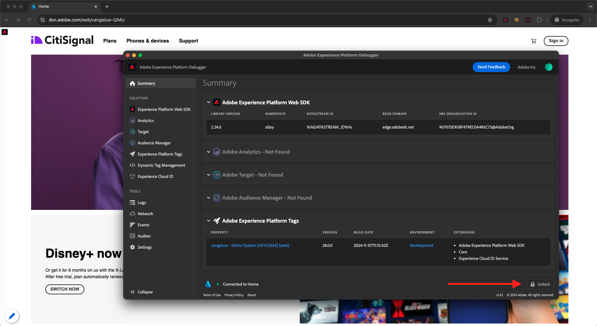

# 1.1.4 Raccolta di dati web lato client

## 1.1.4.1 Convalidare i dati nella richiesta

### Installare l’Adobe Experience Platform Debugger

Experience Platform Debugger è un’estensione disponibile per i browser Chrome e Firefox che consente di visualizzare la tecnologia Adobe implementata nelle pagine web. Installa la versione per il browser preferito:

- [Estensione Firefox](https://addons.mozilla.org/it/firefox/addon/adobe-experience-platform-dbg/)

- [Estensione Chrome](https://chrome.google.com/webstore/detail/adobe-experience-platform/bfnnokhpnncpkdmbokanobigaccjkpob)

Se non hai mai utilizzato il debugger in precedenza (e questo è diverso dal precedente Adobe Experience Cloud Debugger), guarda questo video introduttivo di cinque minuti:

>[!VIDEO](https://video.tv.adobe.com/v/32156?quality=12&learn=on)

Dato che stai caricando il sito web demo in modalità in incognito, devi assicurarti che Debugger Experience Platform sia disponibile anche in modalità in incognito. Per farlo, vai a **chrome://extensions** nel browser e apri l&#39;estensione Debugger di Experience Platform.

Verifica che le due impostazioni seguenti siano abilitate:

- Modalità sviluppatore
- Consenti in incognito

### Apri il sito web della demo

Vai a [https://dsn.adobe.com](https://dsn.adobe.com). Dopo aver effettuato l’accesso con il tuo Adobe ID, visualizzerai questo. Fai clic sui tre punti **...** del progetto del sito Web, quindi fai clic su **Esegui** per aprirlo.

Poi vedrai il tuo sito web demo aperto. Seleziona l’URL e copialo negli Appunti.

Apri una nuova finestra del browser in incognito.

Incolla l’URL del sito web demo, che hai copiato nel passaggio precedente. Ti verrà quindi chiesto di effettuare l’accesso con il tuo Adobe ID.

Seleziona il tipo di account e completa la procedura di accesso.

Vedrai quindi il tuo sito web caricato in una finestra del browser in incognito. Per ogni dimostrazione, dovrai utilizzare una nuova finestra del browser in incognito per caricare l’URL del sito web demo.

### Utilizza Experience Platform Debugger per visualizzare le chiamate indirizzate all’Edge

Accertati di avere aperto il sito web demo e fai clic sull’icona dell’estensione Experience Platform Debugger.

Verrà aperto Debugger e verranno visualizzati i dettagli dell’implementazione creata nella proprietà Adobe Experience Platform Data Collection. Ricorda che stai eseguendo il debug dell’estensione e delle regole che hai appena modificato.

Fai clic sul pulsante **[!UICONTROL Accedi]** in alto a destra per eseguire l&#39;autenticazione. Se disponi già di una scheda del browser aperta con l’interfaccia di Adobe Experience Platform Data Collection, il passaggio di autenticazione sarà automatico e non dovrai immettere nuovamente il nome utente e la password.

In seguito, potrai accedere al Debugger.

Premi il pulsante Ricarica sul sito web demo per collegare il debugger a quella scheda specifica.

Conferma che il debugger è **[!UICONTROL connesso alla Home]** come illustrato in precedenza, quindi fai clic sull&#39;icona **[!UICONTROL blocca]** per bloccare il debugger sul sito Web demo. Se non esegui questa operazione, il debugger continuerà a passare per esporre i dettagli di implementazione di qualsiasi scheda del browser attiva, il che può creare confusione. Una volta bloccato il debugger, l&#39;icona diventerà **Sblocca**.

Quindi, vai a qualsiasi pagina del sito web demo, ad esempio la pagina della categoria **Piani**.

Ora fai clic su **[!UICONTROL Experience Platform Web SDK]** nell&#39;area di navigazione a sinistra per visualizzare le **[!UICONTROL richieste di rete]**.

Ogni richiesta contiene una riga **[!UICONTROL events]**.

Fare clic per aprire una riga di **[!UICONTROL eventi]**. Nota come visualizzare l&#39;evento **web.webpagedetails.pageViews** e altre variabili predefinite conformi al formato **Web SDK ExperienceEvent XDM**.

Questi tipi di dettagli della richiesta sono visibili anche nella scheda Rete. Filtra le richieste con **interagire** per individuare le richieste inviate da Web SDK. Puoi trovare tutti i dettagli del payload XDM nella sezione Payload:

Passaggio successivo: [1.1.5 Implementare Adobe Analytics e Adobe Audience Manager](./ex5.md)

[Torna al modulo 1.1](./data-ingestion-launch-web-sdk.md)

[Torna a tutti i moduli](./../../../overview.md)
