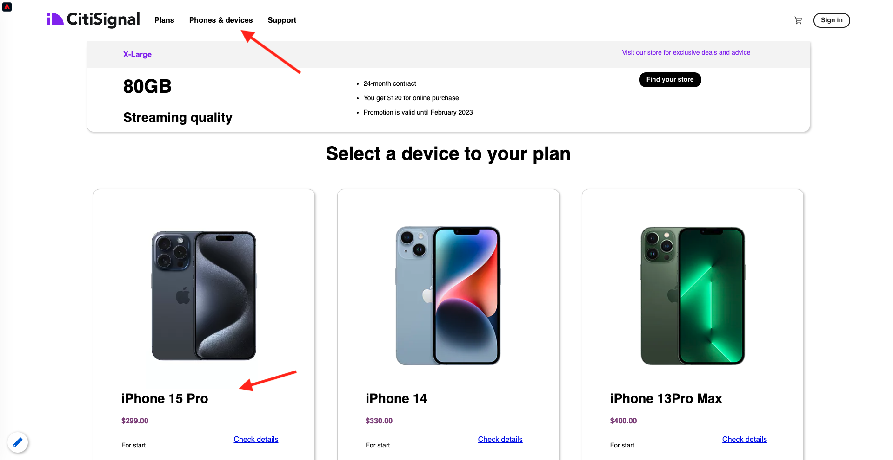

# 1.2.1 Da sconosciuto a noto sul sito web

## Contesto

Il percorso da sconosciuto a noto è uno degli argomenti più importanti tra i brand di oggi, così come il percorso del cliente dall&#39;acquisizione alla conservazione.

Adobe Experience Platform gioca un ruolo fondamentale in questo percorso. Platform è il cervello della comunicazione, il sistema di esperienza di registrazione.

Platform è un ambiente in cui la parola **cliente** è più ampia rispetto ai soli **clienti noti**. Questo è un aspetto molto importante da menzionare quando si parla con i marchi: un visitatore sconosciuto sul sito web è anche un cliente dal punto di vista di Platform e, come tale, anche tutto il comportamento come visitatore sconosciuto viene inviato a Platform. Grazie a questo approccio, quando il cliente diventa un cliente noto, un marchio può visualizzare anche ciò che è successo prima di quel momento. Questo è utile dal punto di vista dell’attribuzione e dell’ottimizzazione dell’esperienza.

## Cosa farai?

Ora acquisirai i dati in Adobe Experience Platform e i dati verranno collegati a identificatori come ECID e indirizzi e-mail. L&#39;obiettivo è comprendere il contesto di business di ciò che si sta per fare dal punto di vista della configurazione. Nel prossimo esercizio, inizierai a configurare tutto il necessario per rendere possibile l’acquisizione dei dati nel tuo ambiente sandbox.

### Flusso di Percorso cliente

Vai a [https://dsn.adobe.com](https://dsn.adobe.com). Dopo aver effettuato l’accesso con il tuo Adobe ID, visualizzerai questo. Fai clic sui tre punti **...** nel progetto del tuo sito Web, quindi fai clic su **Modifica**.

Poi vedrai il tuo sito web demo aperto. Seleziona l’URL e copialo negli Appunti.

Apri una nuova finestra del browser in incognito.

Incolla l’URL del sito web demo, che hai copiato nel passaggio precedente. Ti verrà quindi chiesto di effettuare l’accesso con il tuo Adobe ID.

Seleziona il tipo di account e completa la procedura di accesso.

Vedrai quindi il tuo sito web caricato in una finestra del browser in incognito. Per ogni dimostrazione, dovrai utilizzare una nuova finestra del browser in incognito per caricare l’URL del sito web demo.

Fai clic sull’icona del logo di Adobe nell’angolo in alto a sinistra dello schermo per aprire il Visualizzatore profili.

Dai un&#39;occhiata al pannello Visualizzatore profili e al Profilo cliente in tempo reale con **ID Experience Cloud** come identificatore primario per questo cliente attualmente sconosciuto.

Puoi anche visualizzare tutti gli eventi esperienza che sono stati raccolti in base al comportamento del cliente. L’elenco è attualmente vuoto, ma cambierà presto.

Vai alla categoria di prodotto **Telefoni e dispositivi**. Fare clic sul prodotto **iPhone 15 Pro**.

Viene visualizzata la pagina dei dettagli del prodotto. Un evento esperienza di tipo **Visualizzazione prodotto** è stato ora inviato a Adobe Experience Platform utilizzando l&#39;implementazione Web SDK esaminata nel modulo precedente.

Apri il pannello Provider Viewer e osserva i tuoi **eventi esperienza**.

Torna alla pagina della categoria **Telefoni e dispositivi** e fai clic su un altro prodotto. Un altro evento esperienza è stato inviato a Adobe Experience Platform.

Apri il pannello Visualizzatore profili. Verranno visualizzati 2 eventi esperienza di tipo **Visualizzazione prodotto**. Anche se il comportamento è anonimo e con il consenso appropriato, siamo in grado di tenere traccia di ogni clic e memorizzarlo in Adobe Experience Platform. Una volta che il cliente anonimo verrà a conoscenza, saremo in grado di unire automaticamente tutti i comportamenti anonimi al profilo know.

Fai clic su **Accedi** per passare alla pagina Registra/Accedi.

Fare clic su **CREA UN ACCOUNT**.

Compila i tuoi dettagli e fai clic su **Registra** dopo di che sarai reindirizzato alla pagina precedente.

Apri il pannello Visualizzatore profilo e passa a Profilo cliente in tempo reale. Nel pannello Visualizzatore profili dovresti visualizzare tutti i dati personali, come gli identificatori e-mail e telefonici appena aggiunti.

Nel pannello Visualizzatore profili, vai a Eventi esperienza. Nel pannello Visualizzatore profili vengono visualizzati i 2 prodotti precedenti. Entrambi gli eventi sono ora connessi anche al tuo profilo &quot;noto&quot;.

Ora che hai acquisito i dati in Adobe Experience Platform, li hai collegati a identificatori come ECID e indirizzi e-mail. L&#39;obiettivo è quello di capire il contesto di business di ciò che si sta per fare. Nel prossimo esercizio, inizierai a configurare tutto il necessario per rendere possibile l’acquisizione dei dati.

Passaggio successivo: [1.2.2 Configurare schemi e impostare identificatori](./ex2.md)

[Torna al modulo 1.2](./data-ingestion.md)

[Torna a tutti i moduli](../../../overview.md)
