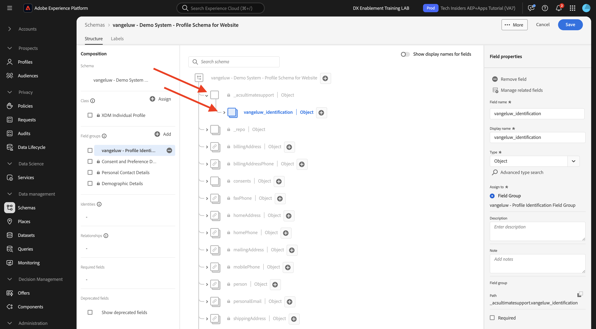
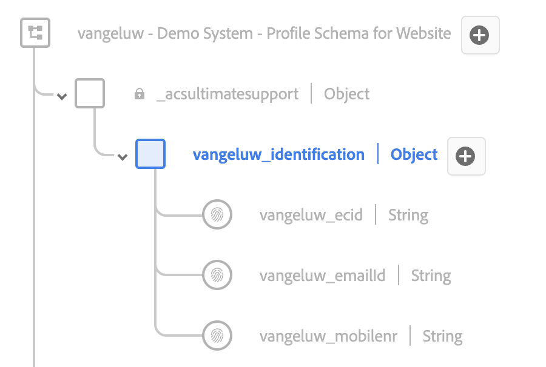
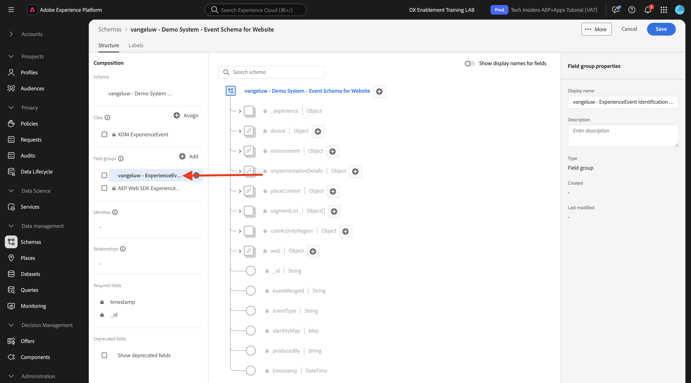

# 1.2.2 Configurare schemi e impostare identificatori

In questo esercizio configurerai gli schemi XDM richiesti per classificare le informazioni di profilo e il comportamento del cliente. In ogni schema XDM, dovrai anche configurare un identificatore primario a cui collegare tutte le informazioni.

## Storia

Prima di iniziare a configurare lo schema XDM e a impostare gli identificatori primari, è necessario considerare il contesto di business di ciò che si sta tentando di fare:

- Desideri dati
- Desideri collegare i dati a un cliente
- Desideri creare un profilo cliente progressivo e in tempo reale

Esistono 2 tipi di dati che desideri acquisire:

- Chi è questo cliente?
- Cosa fa questo cliente?

Tuttavia, la domanda **Chi è questo cliente?** è una domanda molto aperta che ha molte risposte. Quando la tua azienda vuole vedere la risposta a questa domanda, stai cercando informazioni demografiche come Nome, Cognome e Indirizzo. Ma anche per informazioni di contatto come un indirizzo e-mail o un numero di telefono cellulare. E anche per informazioni collegate a Lingua, OptIn/OptOut e forse anche Immagini del profilo. Infine, quello che bisogna sapere è come identificheremo questo cliente nei vari sistemi utilizzati dalla vostra azienda.

Lo stesso vale per la domanda **Che cosa fa questo cliente?**. È una domanda molto aperta con molte risposte. Quando la tua azienda vuole vedere la risposta a questa domanda, stai cercando qualsiasi interazione che un cliente ha avuto con una qualsiasi delle tue proprietà online e offline. Quali pagine o prodotti sono stati visitati? Il cliente ha aggiunto un prodotto al carrello o acquistato un articolo? Quale dispositivo e browser è stato utilizzato per navigare nel sito web? Che tipo di informazioni sta cercando questo cliente e come possiamo utilizzarle per configurare e fornire al cliente un&#39;esperienza eccezionale? E infine, ciò che dobbiamo davvero sapere, è come identificheremo questo cliente nei vari sistemi che la vostra azienda utilizzerà.

## 1.2.1.1 - Chi è questo cliente

Acquisizione della risposta a **Chi è questo cliente?** per la tua azienda viene eseguito tramite la pagina di accesso/registrazione.

Dal punto di vista dello schema, questo viene considerato come una **classe**. La domanda: **Chi è questo cliente?** è definito nella classe **[!UICONTROL Profilo individuale XDM]**.

Quando si crea uno schema XDM per acquisire la risposta a **Chi è questo cliente?**, prima di tutto, devi creare e definire 1 schema che fa riferimento alla classe **[!UICONTROL Profilo individuale XDM]**.

Per specificare il tipo di risposte da fornire a tale domanda, è necessario definire [!UICONTROL Gruppi di campi]. [!UICONTROL I gruppi di campi] sono estensioni della classe Profile e dispongono di configurazioni molto specifiche. Ad esempio, informazioni demografiche come Nome, Cognome, Genere e Compleanno fanno parte del [!UICONTROL Gruppo di campi]: **[!UICONTROL Dettagli demografici]**.

In secondo luogo, la tua azienda deve decidere come identificare questo cliente. Nel caso dell’azienda, l’identificatore principale di un cliente noto potrebbe essere un ID cliente specifico, ad esempio un indirizzo e-mail. Tecnicamente, esistono altri modi per identificare un cliente nella tua azienda, come utilizzare un numero di telefono cellulare.
In questo laboratorio, definiremo l’indirizzo e-mail come identificatore primario e il numero di telefono come identificatore secondario.

Infine, è importante distinguere il canale su cui sono stati acquisiti i dati. In questo caso, parleremo delle registrazioni dei siti Web e lo schema da definire deve riflettere **dove** sono stati acquisiti i dati di registrazione. Il canale avrà anche un ruolo importante nell’influenzare i dati acquisiti. Di conseguenza, è consigliabile definire gli schemi per ogni combinazione di canale, identificatore principale e tipo di dati raccolti.

In base a quanto sopra, dovrai configurare uno schema in Adobe Experience Platform.

Accedi a Adobe Experience Platform da questo URL: [https://experience.adobe.com/platform](https://experience.adobe.com/platform).

Dopo aver effettuato l’accesso, accedi alla home page di Adobe Experience Platform.

Prima di continuare, devi selezionare una **sandbox**. La sandbox da selezionare è denominata ``--module2sandbox--``. A tale scopo, fai clic sul testo **[!UICONTROL Prod produzione]** nella riga blu nella parte superiore dello schermo. Dopo aver selezionato la sandbox appropriata, la schermata cambia e ora sei nella sandbox dedicata.

In Adobe Experience Platform, fai clic su **[!UICONTROL Schemi]** nel menu sul lato sinistro dello schermo. Verrà visualizzato l&#39;elenco degli [!UICONTROL schemi] disponibili.

Devi creare un nuovo schema. Per creare un nuovo schema, fare clic sul pulsante **[!UICONTROL + Crea schema]** e selezionare **[!UICONTROL Profilo individuale XDM]**.

Dopo aver fatto clic sul pulsante **[!UICONTROL + Crea schema]**, verrà creato un nuovo schema e verrà richiesto di selezionare o creare **gruppi di campi**.

Ora è necessario definire quale risposta alla domanda **Chi è questo cliente?** dovrebbe essere simile a.
Nell’introduzione di questo laboratorio, abbiamo notato la necessità dei seguenti attributi per definire un cliente:

- Informazioni demografiche come nome, cognome e indirizzo
- Informazioni di contatto come l’indirizzo dell’abitazione, l’indirizzo e-mail o un numero di telefono cellulare
- Altre informazioni collegate a Lingua, OptIn/OptOut e forse anche Immagini del profilo.
- Identificatore principale di un cliente

Per rendere queste informazioni parte dello schema, devi aggiungere i seguenti [!UICONTROL Gruppi di campi] allo schema:

- Dettagli demografici (informazioni demografiche)
- Dati di contatto personali (informazioni di contatto)
- Dettagli sulle preferenze (altre informazioni)
- Gruppo di campi di identificazione profilo personalizzato della tua azienda (identificatori primario e secondario)

Nella schermata **[!UICONTROL Aggiungi gruppo di campi]**, selezionare il [!UICONTROL gruppo di campi] **[!UICONTROL Dettagli demografici]**, **[!UICONTROL Dettagli contatto personali]** e **[!UICONTROL Dettagli preferenze]**.

Fai clic sul pulsante **[!UICONTROL Aggiungi gruppi di campi]** per aggiungere il [!UICONTROL gruppo di campi] allo schema.

Ora avrai questo:

È quindi necessario un nuovo [!UICONTROL Gruppo di campi] per acquisire l&#39;**[!UICONTROL Identificatore]** utilizzato per la raccolta dati. Come hai visto nell’esercizio precedente, esiste un concetto di identificatori primari e secondari. L’identificatore primario è il più importante, in quanto tutti i dati raccolti saranno collegati a questo identificatore.

Ora creerai il tuo [!UICONTROL Gruppo di campi] personalizzato e come tale estenderai lo [!UICONTROL schema XDM] per soddisfare i requisiti della tua azienda.

Fai clic sul pulsante **[!UICONTROL + Aggiungi]** per iniziare ad aggiungere un [!UICONTROL gruppo di campi].

Invece di riutilizzare un [!UICONTROL Gruppo di campi] esistente, ora creerai il tuo [!UICONTROL Gruppo di campi]. A tale scopo, selezionare **[!UICONTROL Crea nuovo gruppo di campi]**.

È ora necessario fornire **[!UICONTROL Nome visualizzato]** e **[!UICONTROL Descrizione]** per il nuovo [!UICONTROL Gruppo di campi].

Come nome dello schema, utilizzeremo quanto segue:
`--demoProfileLdap-- - Profile Identification Field Group`

Ad esempio, per ldap **[!UICONTROL vangeluw]**, deve essere il nome dello schema:

**[!UICONTROL vangeluw - Gruppo di campi per l&#39;identificazione del profilo]**

Questo dovrebbe darti qualcosa del genere:

Fai clic sul pulsante **[!UICONTROL Aggiungi gruppi di campi]** per aggiungere il [!UICONTROL gruppo di campi] appena creato allo schema.

A questo punto dovrebbe essere presente questa struttura di schema.

Il nuovo [!UICONTROL Gruppo di campi] è ancora vuoto, quindi ora dovrai aggiungere campi a tale [!UICONTROL Gruppo di campi].
Nell&#39;elenco [!UICONTROL Gruppo di campi], fai clic sul tuo [!UICONTROL Gruppo di campi] personalizzato.

Ora vengono visualizzati diversi nuovi pulsanti.

Nel primo livello dello schema, fare clic sul pulsante **[!UICONTROL + Aggiungi campo]**.

Dopo aver fatto clic sul pulsante **[!UICONTROL + Aggiungi campo]**, verrà visualizzato un nuovo **[!UICONTROL oggetto]** nello schema. Questo oggetto rappresenta un **[!UICONTROL oggetto]** personalizzato nello schema e prende il nome dall&#39;ID tenant di Adobe Experience Platform. L&#39;ID tenant Adobe Experience Platform è `--aepTenantId--`.

Ora aggiungi un nuovo oggetto sotto tale tenant. A tale scopo, fare clic sul campo **[!UICONTROL Nuovo campo]** sotto l&#39;oggetto tenant.

Utilizza le seguenti definizioni di oggetto:

- Nome campo: **[!UICONTROL identificazione]**
- Nome visualizzato: **[!UICONTROL identificazione]**
- Tipo: **[!UICONTROL oggetto]**

Fai clic su **[!UICONTROL Applica]** per salvare le modifiche.

Dopo aver fatto clic su **[!UICONTROL Applica]**, l&#39;oggetto **[!UICONTROL identificazione]** verrà visualizzato nello schema.

Ora aggiungerai 3 nuovi campi sotto l&#39;oggetto **[!UICONTROL identity]**:

- ecid:
   - Nome campo: **[!UICONTROL ecid]**
   - Nome visualizzato: **[!UICONTROL ecid]**
   - Tipo: **[!UICONTROL Stringa]**

- emailId
   - Nome campo: **[!UICONTROL emailId]**
   - Nome visualizzato: **[!UICONTROL emailId]**
   - Tipo: **[!UICONTROL Stringa]**

- cellulare
   - Nome campo: **[!UICONTROL mobilenr]**
   - Nome visualizzato: **[!UICONTROL mobilenr]**
   - Tipo: **[!UICONTROL Stringa]**

Ogni campo verrà definito come tipo **[!UICONTROL Stringa]** e tali campi verranno configurati come **[!UICONTROL Identità]**. Per lo schema **[!UICONTROL Schema di registrazione sito Web]**, si presuppone che un cliente sarà sempre identificato dal suo indirizzo e-mail, il che significa che devi configurare il campo **[!UICONTROL emailId]** come identificatore **[!UICONTROL primary]** e gli altri campi come identificatori **[!UICONTROL secondary]**.

Per aggiungere i campi, fare clic sul pulsante **[!UICONTROL +]** accanto all&#39;oggetto **[!UICONTROL identity]**.

Ora hai un campo vuoto. Devi configurare i tre campi precedenti come indicato.

Questo è il modo in cui ogni campo dovrebbe apparire dopo la configurazione iniziale del campo.

Fai clic sul pulsante **[!UICONTROL +]** accanto all&#39;oggetto **[!UICONTROL identity]** per creare un nuovo campo e compilare i campi come indicato.

- ecid

Per salvare il campo, scorri verso il basso in **[!UICONTROL Proprietà campo]** fino a visualizzare il pulsante **[!UICONTROL Applica]**. Fare clic sul pulsante **[!UICONTROL Applica]**.

Fai clic sul pulsante **[!UICONTROL +]** accanto all&#39;oggetto **[!UICONTROL identity]** per creare un nuovo campo e compilare i campi come indicato.

- emailId

Per salvare il campo, scorri verso il basso in **[!UICONTROL Proprietà campo]** fino a visualizzare il pulsante **[!UICONTROL Applica]**. Fare clic sul pulsante **[!UICONTROL Applica]**.

Fai clic sul pulsante **[!UICONTROL +]** accanto all&#39;oggetto **[!UICONTROL identity]** per creare un nuovo campo e compilare i campi come indicato.

- cellulare

Per salvare il campo, scorri verso il basso in **[!UICONTROL Proprietà campo]** fino a visualizzare il pulsante **[!UICONTROL Applica]**. Fare clic sul pulsante **[!UICONTROL Applica]**.

Ora sono presenti 3 campi, ma questi campi non sono ancora stati definiti come **[!UICONTROL campi di identità]**.

Per iniziare a definire questi campi come campi **[!UICONTROL Identity]**, effettua le seguenti operazioni:

- Seleziona il campo **[!UICONTROL emailId]**.
- Sul lato destro, nelle proprietà del campo, scorri verso il basso fino a visualizzare **[!UICONTROL Identità]**. Seleziona la casella di controllo per **[!UICONTROL Identità]**.

  

- Ora seleziona la casella di controllo per **[!UICONTROL Identità primaria]**.

  

- Infine, seleziona lo spazio dei nomi **[!UICONTROL E-mail]** dall&#39;elenco di **[!UICONTROL Spazi dei nomi]**. Uno spazio dei nomi viene utilizzato dal grafo delle identità in Adobe Experience Platform per classificare gli identificatori negli spazi dei nomi e definire la relazione tra tali spazi dei nomi.

  

- Infine, fai clic su **[!UICONTROL Applica]** per salvare le modifiche.

  

Definire quindi gli altri campi per **[!UICONTROL ecid]** e **[!UICONTROL mobilenr]** come identificatori secondari.

- Seleziona il campo **[!UICONTROL ecid]**.
- Sul lato destro, nelle proprietà del campo, scorri verso il basso fino a visualizzare **[!UICONTROL Identità]**. Seleziona la casella di controllo per **[!UICONTROL Identità]**.

  

- Selezionare quindi lo spazio dei nomi **[!UICONTROL ECID]** dall&#39;elenco di **[!UICONTROL Spazi dei nomi]**. Uno [!UICONTROL Spazio dei nomi] viene utilizzato dal grafo delle identità in Adobe Experience Platform per classificare gli identificatori negli spazi dei nomi e definire la relazione tra tali spazi dei nomi.

  

- Fai clic su **[!UICONTROL Applica]** per salvare le modifiche.

  

- Selezionare il campo **[!UICONTROL mobilenr]**.
- Sul lato destro, nelle proprietà del campo, scorri verso il basso fino a visualizzare **[!UICONTROL Identità]**. Seleziona la casella di controllo per **[!UICONTROL Identità]**.

  

- Assicurarsi di selezionare lo spazio dei nomi **[!UICONTROL Telefono]** dall&#39;elenco di **[!UICONTROL Spazi dei nomi]**. Uno spazio dei nomi viene utilizzato dal grafo delle identità in Adobe Experience Platform per classificare gli identificatori negli spazi dei nomi e definire la relazione tra tali spazi dei nomi.

  

- Fai clic su **[!UICONTROL Applica]** per salvare le modifiche.

  

L&#39;oggetto **[!UICONTROL identity]** dovrebbe ora avere questo aspetto, con i 3 campi ID che ora mostrano anche un&#39;icona **[!UICONTROL impronta digitale]** per mostrare che sono stati definiti come identificatori.

Assegna un nome allo schema. Selezionare il campo **Schema senza titolo**.

Come nome del nostro schema, utilizzerai quanto segue:

`--demoProfileLdap-- - Demo System - Profile Schema for Website`

Sostituisci **[!UICONTROL ldap]** con il tuo LDAP specifico. Ad esempio, per ldap **[!UICONTROL vangeluw]**, deve essere il nome dello schema:

**[!UICONTROL vangeluw - Sistema demo - Schema profilo per sito Web]**

Questo dovrebbe darti qualcosa del genere:

Hai definito uno schema, collegato [!UICONTROL Gruppi di campi] esistenti e appena creati e disponi di identificatori definiti.

Fai clic su **[!UICONTROL Salva]** per salvare le modifiche.

L&#39;ultima cosa da fare qui è attivare lo schema da collegare al **[!UICONTROL profilo]**.
Attivando lo schema per il profilo, ti assicuri che tutti i dati inviati a Adobe Experience Platform in base a questo schema facciano parte dell’ambiente Profilo cliente in tempo reale, il quale assicura che tutti i dati possano essere utilizzati in tempo reale per l’esecuzione di query, la segmentazione e l’attivazione.

A questo scopo, selezioniamo il nome dello schema.

Nella scheda a destra dello schema verrà visualizzata l&#39;opzione **[!UICONTROL Attiva/Disattiva profilo]**, attualmente disattivata.

Attiva il [!UICONTROL profilo] facendo clic su di esso.

Verrà visualizzato il seguente messaggio:

Fai clic su **[!UICONTROL Abilita]** per abilitare questo schema per il profilo.

Lo schema è ora configurato per far parte di [!UICONTROL Real-time Customer Profile].

Infine, fai clic su **[!UICONTROL Salva]** per salvare lo schema.

### 1.2.1.2 - Quali sono le funzioni del cliente

Acquisizione della risposta alla domanda **Quali operazioni svolge il cliente?** per la tua azienda viene eseguito tramite, ad esempio una visualizzazione prodotto in una pagina di prodotto.

Dal punto di vista dello schema, questo viene considerato come una **[!UICONTROL Classe]**. La domanda: **Cosa fa questo cliente?** è definito nella classe **[!UICONTROL ExperienceEvent]**.

Quando crei uno [!UICONTROL schema XDM] per acquisire la risposta a **Quali operazioni svolge il cliente?**, innanzitutto devi creare e definire 1 schema che fa riferimento alla classe **[!UICONTROL ExperienceEvent]**.

Per specificare il tipo di risposte da fornire a tale domanda, è necessario definire [!UICONTROL Gruppo di campi]. [!UICONTROL I gruppi di campi] sono estensioni della classe [!UICONTROL ExperienceEvent] e dispongono di configurazioni molto specifiche. Ad esempio, informazioni sul tipo di prodotti visualizzati o aggiunti al carrello da un cliente fanno parte del [!UICONTROL Gruppo di campi] **Dettagli Commerce**.

In secondo luogo, la tua azienda deve decidere come identificare il comportamento di questo cliente. Poiché stiamo parlando di interazioni su un sito web, è possibile che la tua azienda conosca il cliente, ma è ugualmente possibile che un visitatore anonimo sconosciuto sia attivo sul sito web. Quindi non possiamo usare un identificatore come l&#39;indirizzo e-mail. In questo caso, la tua azienda probabilmente deciderà di utilizzare l&#39;[!UICONTROL ID Experience Cloud (ECID)] come identificatore primario.

Infine, è importante distinguere il canale su cui sono stati acquisiti i dati. In questo caso, parleremo delle interazioni con il sito Web e lo schema da definire deve riflettere **dove** sono stati acquisiti i dati di interazione. Il canale avrà anche un ruolo importante nell’influenzare i dati acquisiti. Di conseguenza, è consigliabile definire gli schemi per ogni combinazione di canale, identificatore principale e tipo di dati raccolti.

In base a quanto sopra, dovrai configurare uno schema in Adobe Experience Platform.

Dopo aver effettuato l’accesso, accedi alla home page di Adobe Experience Platform.

Prima di continuare, devi selezionare una **[!UICONTROL sandbox]**. La [!UICONTROL sandbox] da selezionare è denominata ``--module2sandbox--``. A tale scopo, fai clic sul testo **[!UICONTROL Prod produzione]** nella riga blu nella parte superiore dello schermo. Dopo aver selezionato la sandbox appropriata, la schermata cambia e ora sei nella sandbox dedicata.

In Adobe Experience Platform, fai clic su **[!UICONTROL Schemi]** nel menu sul lato sinistro dello schermo.

In [!UICONTROL Schemi] verranno visualizzati tutti gli schemi esistenti.

Devi creare un nuovo schema. Per creare un nuovo schema, fai clic sul pulsante **[!UICONTROL + Crea schema]** e seleziona **[!UICONTROL XDM ExperienceEvent]**.

Dopo aver fatto clic sul pulsante **[!UICONTROL + Crea schema]**, verrà creato un nuovo schema e verrà richiesto di selezionare o creare **gruppi di campi**.

Ora è necessario definire una risposta alla domanda **Che cosa fa questo cliente?** dovrebbe essere simile a.
Nell’introduzione di questo laboratorio, abbiamo notato la necessità dei seguenti attributi per definire ciò che un cliente fa:

- Quali pagine o prodotti sono stati visitati?
- Il cliente ha aggiunto un prodotto al carrello o acquistato un articolo?
- Quale dispositivo e browser è stato utilizzato per navigare nel sito web?
- Che tipo di informazioni sta cercando questo cliente e come possiamo utilizzarle per configurare e fornire al cliente un&#39;esperienza eccezionale?
- Identificatore principale di un cliente

Per rendere queste informazioni parte dello schema, devi aggiungere il seguente [!UICONTROL Gruppo di campi] allo schema:

- Dettagli web
- Dettagli commerciali
- Dettagli sull’ambiente
- Identificazione profilo personalizzata della tua azienda [!UICONTROL Gruppo di campi] (identificatori primario e secondario)

Nella schermata **[!UICONTROL Aggiungi gruppo di campi]**, selezionare [!UICONTROL Gruppi di campi] **[!UICONTROL Dettagli Web]**, **[!UICONTROL Dettagli Commerce]** e **[!UICONTROL Dettagli ambiente]**.

Fai clic sul pulsante **[!UICONTROL Aggiungi gruppi di campi]** per aggiungere il gruppo di campi allo schema.

A questo punto si otterrà:

È quindi necessario creare un nuovo [!UICONTROL Gruppo di campi] per acquisire l&#39;**[!UICONTROL Identificatore]** utilizzato per la raccolta dati. Come hai visto nell’esercizio precedente, esiste un concetto di identificatori primari e secondari. L’identificatore primario è il più importante, in quanto tutti i dati raccolti saranno collegati a questo identificatore.

Ora creerai il tuo [!UICONTROL Gruppo di campi] personalizzato e come tale estenderai lo [!UICONTROL schema XDM] per soddisfare i requisiti della tua azienda.

Un [!UICONTROL Gruppo di campi] è collegato a una [!UICONTROL Classe], pertanto non è possibile riutilizzare semplicemente il [!UICONTROL Gruppo di campi] creato in precedenza.

Fai clic sul pulsante **[!UICONTROL + Aggiungi]** per iniziare ad aggiungere un [!UICONTROL gruppo di campi].

Invece di riutilizzare un [!UICONTROL Gruppo di campi] esistente, ora creerai il tuo [!UICONTROL Gruppo di campi]. A tale scopo, selezionare **[!UICONTROL Crea nuovo gruppo di campi]**.

È ora necessario fornire **[!UICONTROL Nome visualizzato]** e **[!UICONTROL Descrizione]** per il nuovo gruppo di campi.

Come nome del gruppo di campi, utilizza:

`--demoProfileLdap-- - ExperienceEvent Identification Field Group`

Ad esempio, per ldap **[!UICONTROL vangeluw]**, deve essere il nome dello schema:

**[!UICONTROL vangeluw - Gruppo di campi di identificazione ExperienceEvent]**

Questo dovrebbe darti qualcosa del genere:

Fai clic sul pulsante **[!UICONTROL Aggiungi gruppo di campi]** per aggiungere il [!UICONTROL gruppo di campi] appena creato allo schema.

La struttura [!UICONTROL Schema] deve essere ora attiva.

Il nuovo [!UICONTROL Gruppo di campi] è ancora vuoto, quindi è necessario aggiungere campi a tale gruppo di campi.
Nell&#39;elenco [!UICONTROL Gruppo di campi], fai clic sul tuo [!UICONTROL Gruppo di campi] personalizzato.

Ora vengono visualizzati diversi nuovi pulsanti.

Nel livello principale dello schema, accanto al nome dello schema, fare clic sul pulsante **[!UICONTROL +]**.

Dopo aver fatto clic sul pulsante **[!UICONTROL +]**, verrà visualizzato un nuovo **[!UICONTROL oggetto]** nello schema. Questo oggetto rappresenta un **[!UICONTROL oggetto]** personalizzato nel tuo [!UICONTROL schema] e prende il nome dal tuo ID tenant Adobe Experience Platform. L&#39;ID tenant Adobe Experience Platform è `--aepTenantId--`.

Ora aggiungi un nuovo oggetto sotto tale tenant. A tale scopo, fare clic sul campo **[!UICONTROL Nuovo campo]** sotto l&#39;oggetto tenant.

Utilizza le seguenti definizioni di oggetto:

- Nome campo: **[!UICONTROL identificazione]**
- Nome visualizzato: **[!UICONTROL identificazione]**
- Tipo: **[!UICONTROL oggetto]**

Scorri verso il basso e fai clic su **[!UICONTROL Applica]** per salvare le modifiche.

Dopo aver fatto clic su **[!UICONTROL Applica]**, l&#39;oggetto **[!UICONTROL identificazione]** verrà visualizzato nello schema.

Ora aggiungi 1 nuovo campo sotto l&#39;oggetto **[!UICONTROL identity]**.

Fai clic sul pulsante **[!UICONTROL +]** accanto all&#39;oggetto **[!UICONTROL identity]** per creare un nuovo campo.

Il campo ECID sarà definito come tipo **[!UICONTROL Stringa]** e configurerai questo campo come **[!UICONTROL Identità]**. Per lo schema **[!UICONTROL Demo System - Event Schema for Website]**, si presuppone che un cliente sarà sempre identificato dal proprio [!UICONTROL ECID], il che significa che è necessario configurare il campo **[!UICONTROL ECID]** come identificatore **primary**

Ora hai un campo vuoto. Devi configurare il campo precedente come indicato.

- ecid:

   - Nome campo: **[!UICONTROL ecid]**
   - Nome visualizzato: **[!UICONTROL ecid]**
   - Tipo: **[!UICONTROL Stringa]**

Il campo [!UICONTROL ecid] deve essere visualizzato in questo modo dopo la configurazione iniziale del campo:

Scorri verso il basso e fai clic su **[!UICONTROL Applica]**.

Ora hai un nuovo campo, ma questo campo non è ancora stato definito come campo **[!UICONTROL Identità]**.

Per iniziare a definire questi campi come campi **[!UICONTROL Identity]**, effettua le seguenti operazioni:

- Seleziona il campo **[!UICONTROL ecid]**.
- Sul lato destro, nelle proprietà del campo, scorri verso il basso fino a visualizzare **[!UICONTROL Identità]**. Seleziona la casella di controllo per **[!UICONTROL Identità]**.

- Ora seleziona la casella di controllo per **[!UICONTROL Identità primaria]**.

- Infine, selezionare lo spazio dei nomi **[!UICONTROL ECID]** dall&#39;elenco di **[!UICONTROL Spazi dei nomi]**. [!UICONTROL Namespace] è utilizzato dal [!UICONTROL grafo identità] in Adobe Experience Platform per classificare gli identificatori negli spazi dei nomi e definire la relazione tra tali spazi dei nomi.

  

- Infine, fai clic su **[!UICONTROL Applica]** per salvare le modifiche.

  

L&#39;oggetto **[!UICONTROL identity]** dovrebbe ora avere questo aspetto, con il campo ecid che ora mostra anche un&#39;icona **impronta digitale** per mostrare che sono stati definiti come identificatori.

Assegna un nome allo schema. Selezionare il campo **Schema senza titolo**.

Come nome dello schema, utilizzeremo quanto segue:
`--demoProfileLdap-- - Demo System - Event Schema for Website`

Ad esempio, per ldap **[!UICONTROL vangeluw]**, deve essere il nome dello schema:

**[!UICONTROL vangeluw - Sistema demo - Schema eventi per sito Web]**

Questo dovrebbe darti qualcosa del genere:

Fai clic su **[!UICONTROL Salva]** per salvare le modifiche.

È importante notare che quando alla fine si acquisiscono dati in base a questo schema, alcuni campi sono obbligatori.
Ad esempio, i campi **[!UICONTROL _id]** e **[!UICONTROL timestamp]** sono campi obbligatori.

- _id deve contenere un id univoco per una specifica acquisizione di dati
- il timestamp deve essere il timestamp dell&#39;hit nel formato **[!UICONTROL &quot;YYYY-MM-DDTHH:MM:SSSZ&quot;]**, ad esempio: **[!UICONTROL &quot;2019-04-08T07:20:000Z&quot;]**

Hai definito uno schema, collegato [!UICONTROL Gruppi di campi] esistenti e appena creati e disponi di identificatori definiti.

L&#39;ultima cosa da fare qui è attivare lo schema da collegare al **[!UICONTROL profilo]**.
Attivando lo schema per [!UICONTROL Profilo], assicurati che tutti i dati inviati a Adobe Experience Platform in base a questo schema facciano parte di Real-time Customer Profile, che garantisce che tutti i dati possano essere utilizzati in tempo reale per l&#39;esecuzione di query, la segmentazione e l&#39;attivazione.

A questo scopo, selezioniamo il nome dello schema.

Nella scheda a destra dello schema verrà visualizzata l&#39;opzione **[!UICONTROL Profilo]**, attualmente disattivata.

Attiva il [!UICONTROL profilo] facendo clic su di esso.

Verrà visualizzato il seguente messaggio:

Fai clic su **[!UICONTROL Abilita]** per abilitare questo schema per il profilo.

Lo schema è ora configurato per far parte di Real-time Customer Profile.

Infine, fai clic su **[!UICONTROL Salva]** per salvare lo schema.

Ora hai completato la creazione di schemi attivati per essere utilizzati nel Profilo cliente in tempo reale.

Nel prossimo esercizio esamineremo i set di dati.

Passaggio successivo: [1.2.3 Configurare i set di dati](./ex3.md)

[Torna al modulo 1.2](./data-ingestion.md)

[Torna a tutti i moduli](../../../overview.md)
