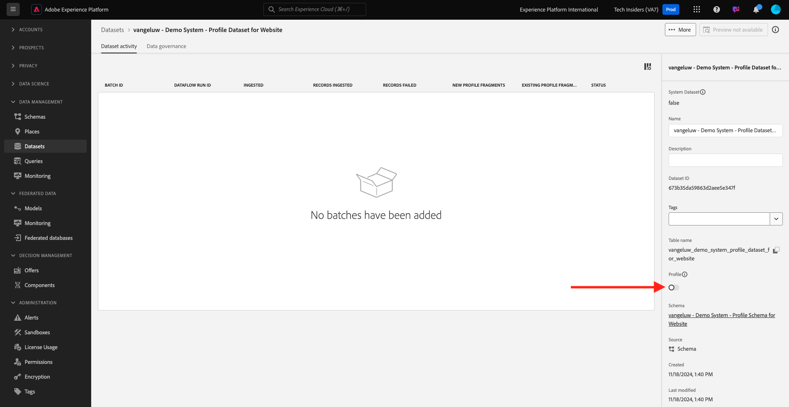

# 1.2.3 Configurare i set di dati

In questo esercizio configurerai i set di dati per acquisire e memorizzare informazioni di profilo e comportamento del cliente. Ogni set di dati creato in utilizzerà uno degli schemi generati nel passaggio precedente.

## Contesto

Dopo aver definito la risposta alle domande **Chi è questo cliente?** e **Quali sono le operazioni del cliente?** dovrebbe essere simile a, è ora necessario creare un bucket che utilizzi tali informazioni, per ricevere e convalidare i dati inviati a Adobe Experience Platform.

## Creare set di dati

Ora devi creare 2 set di dati:

- 1 set di dati per acquisire le informazioni che rispondono a **Chi è questo cliente?** - domanda.
- 1 set di dati per acquisire le informazioni che rispondono a **Funzionamento del cliente** - domanda.

Accedi a Adobe Experience Platform da questo URL: [https://experience.adobe.com/platform](https://experience.adobe.com/platform).

Dopo aver effettuato l’accesso, accedi alla home page di Adobe Experience Platform.

Prima di continuare, devi selezionare una **[!UICONTROL sandbox]**. La sandbox da selezionare è denominata ``--module2sandbox--``. A tale scopo, fai clic sul testo **[!UICONTROL Prod produzione]** nella riga blu nella parte superiore dello schermo. Dopo aver selezionato la [!UICONTROL sandbox] appropriata, la schermata verrà modificata e ora sei nella [!UICONTROL sandbox] dedicata.

In Adobe Experience Platform, fai clic su **[!UICONTROL Set di dati]** nel menu sul lato sinistro dello schermo.  A questo punto viene visualizzato quanto segue:

Cominciamo creando il set di dati per acquisire le informazioni di registrazione del sito web.

Devi creare un nuovo set di dati. Per creare un nuovo set di dati, fare clic sul pulsante **[!UICONTROL + Crea set di dati]**.

È necessario definire un set di dati dallo schema definito nel passaggio precedente. Fare clic sull&#39;opzione **[!UICONTROL Crea set di dati dallo schema]**.

Nella schermata successiva, è necessario selezionare lo schema creato in 1, `--aepUserLdap-- - Demo System - Profile Schema for Website`.

Fai clic su **Avanti**.

Diamo un nome al set di dati.

Come nome per il set di dati, utilizza quanto segue:

`--aepUserLdap-- - Demo System - Profile Dataset for Website`

Fai clic su **Fine**.

Ora visualizzerai questo:

Torna alla panoramica dei [!UICONTROL Set di dati]. Ora nella panoramica viene visualizzato il set di dati creato.

Ora configurerai un secondo set di dati per acquisire le interazioni con i siti web.

Fare clic su **[!UICONTROL + Crea set di dati]**.

È necessario definire un set di dati dallo schema definito nel passaggio precedente. Fare clic sull&#39;opzione **[!UICONTROL Crea set di dati dallo schema]**.

Nella schermata successiva, è necessario selezionare lo schema creato in precedenza, `--aepUserLdap-- - Demo System - Event Schema for Website`.

Fai clic su **Avanti**.

Diamo un nome al set di dati.

Come nome per il set di dati, utilizza questo:

`--aepUserLdap-- - Demo System - Event Dataset for Website`

Fai clic su **Fine**.

A questo punto viene visualizzato quanto segue:

Torna alla schermata di panoramica dei [!UICONTROL Set di dati].

Ora devi abilitare i set di dati per far parte di Real-time Customer Profile di Adobe Experience Platform.

Aprire il set di dati `--aepUserLdap-- - Demo System - Profile Dataset for Website` facendo clic su di esso.

Individua l&#39;icona di attivazione/disattivazione [!UICONTROL Profilo] sul lato destro dello schermo.
Fai clic sull&#39;interruttore [!UICONTROL Profilo] per abilitare questo set di dati per [!UICONTROL Profilo].

Fare clic su **[!UICONTROL Abilita]**.

Il set di dati è ora abilitato per [!UICONTROL Profilo].

Tornare alla panoramica dei set di dati e aprire il set di dati `--aepUserLdap-- - Demo System - Event Dataset` per il sito Web facendo clic su di esso.

Individua l&#39;icona di attivazione/disattivazione [!UICONTROL Profilo] sul lato destro dello schermo. Fai clic sull&#39;interruttore [!UICONTROL Profilo] per abilitare [!UICONTROL Profilo].

Fare clic su **[!UICONTROL Abilita]**.

Il set di dati è ora abilitato per [!UICONTROL Profilo].

Passaggio successivo: [1.2.4 Acquisizione di dati da origini offline](./ex4.md)

[Torna al modulo 1.2](./data-ingestion.md)

[Torna a tutti i moduli](../../../overview.md)
