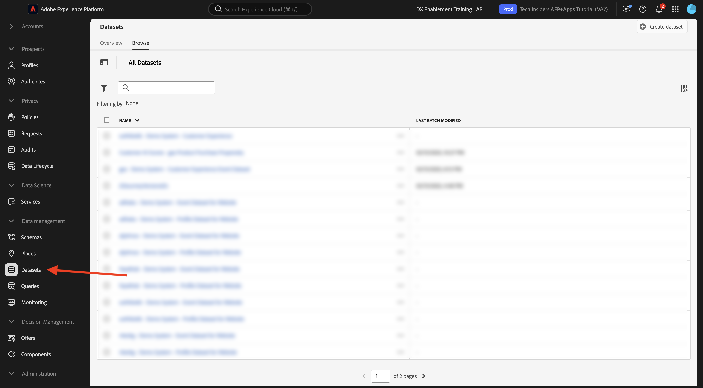
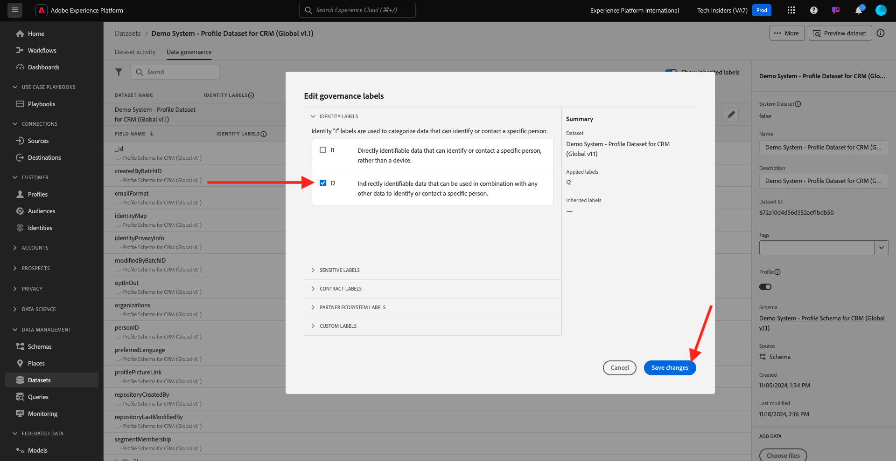

# 1.2.4 Acquisizione dei dati da origini offline

In questo esercizio, l’obiettivo è quello di integrare dati esterni come i dati CRM in Platform.

## Finalità di apprendimento

- Scopri come generare i dati di test
- Scopri come acquisire CSV
- Scopri come utilizzare l’interfaccia utente web per l’acquisizione dei dati tramite flussi di lavoro
- Comprendere le funzioni di governance dei dati di Experience Platform

## Risorse

- Interfaccia utente Mockaroo: [https://www.mockaroo.com/](https://www.mockaroo.com/)
- Interfaccia utente Experience Platform: [https://experience.adobe.com/platform/](https://experience.adobe.com/platform/)

## Attività

- Crea un file CSV con data demo. Acquisisci il file CSV in Adobe Experience Platform utilizzando i flussi di lavoro disponibili.
- Comprendere le opzioni di governance dei dati in Adobe Experience Platform

## 1.2.4.1 Creare il set di dati CRM tramite uno strumento per la generazione di dati

Per questo sono necessarie 1000 righe di esempio di dati CRM.

Apri il modello Mockaroo da [https://www.mockaroo.com/12674210](https://www.mockaroo.com/12674210).

Nel modello, noterai i seguenti campi:

- id
- nome
- cognome
- e-mail
- genere
- bornDate
- home_latitude
- home_longitude
- country_code
- città
- paese

Tutti questi campi sono stati definiti per produrre dati compatibili con Platform.

Per generare il file CSV, fai clic sul pulsante **[!UICONTROL Scarica dati]** che ti fornirà un file CSV con 1000 righe di dati dimostrativi.

Apri il file CSV in Microsoft Excel per visualizzarne il contenuto.

Quando il file CSV è pronto, puoi procedere con la mappatura rispetto a XDM.

### 1.2.4.2 Verificare il set di dati di onboarding CRM in Adobe Experience Platform

Apri [Adobe Experience Platform](https://experience.adobe.com/platform) e passa a **[!UICONTROL Set di dati]**.

Prima di continuare, devi selezionare una **[!UICONTROL sandbox]**. La sandbox da selezionare è denominata ``--module2sandbox--``. A tale scopo, fai clic sul testo **[!UICONTROL Prod produzione]** nella riga blu nella parte superiore dello schermo. Dopo aver selezionato la [!UICONTROL sandbox] appropriata, la schermata verrà modificata e ora sei nella [!UICONTROL sandbox] dedicata.

In Adobe Experience Platform, fai clic su **[!UICONTROL Set di dati]** nel menu sul lato sinistro dello schermo.

Stai per utilizzare un set di dati condiviso basato su questa abilitazione. Il set di dati condiviso è già stato creato ed è denominato **[!UICONTROL Sistema demo - Set di dati profilo per CRM (Global v1.1)]**.

Apri il set di dati **[!UICONTROL Sistema demo - Set di dati profilo per CRM (versione globale 1.1)]**.

Nella schermata di panoramica puoi visualizzare 3 informazioni principali.

Innanzitutto, il dashboard [!UICONTROL Attività set di dati] mostra il numero totale di record CRM nel set di dati, i batch acquisiti e il relativo stato

In secondo luogo, scorrendo la pagina, puoi verificare quando sono stati acquisiti i batch di dati, quanti record sono stati caricati e anche se il batch è stato caricato correttamente o meno. L&#39;**[!UICONTROL ID batch]** è l&#39;identificatore di un processo batch specifico e l&#39;**[!UICONTROL ID batch]** è importante in quanto può essere utilizzato per la risoluzione dei problemi relativi al mancato avvio di un batch specifico.

Infine, la scheda [!UICONTROL Informazioni sul set di dati] mostra informazioni importanti come [!UICONTROL ID set di dati] (importante anche in questo caso dal punto di vista della risoluzione dei problemi), il nome del set di dati e se il set di dati è stato abilitato per il profilo.

L’impostazione più importante è il collegamento tra il set di dati e lo schema. Lo schema definisce quali dati possono essere acquisiti e come dovrebbero apparire.

In questo caso, viene utilizzato lo schema di profilo **[!UICONTROL Sistema demo per CRM (Global v1.1)]**, mappato alla classe di **[!UICONTROL Profilo]** e con estensioni implementate, dette anche gruppi di campi.

Facendo clic sul nome dello schema, si passa alla panoramica dello [!UICONTROL schema] in cui è possibile visualizzare tutti i campi attivati per questo schema.

Ogni schema deve avere un descrittore primario personalizzato definito. Nel caso del set di dati CRM, lo schema ha definito che il campo **[!UICONTROL crmId]** deve essere l&#39;identificatore primario. Se desideri creare uno schema e collegarlo al [!UICONTROL Profilo cliente in tempo reale], devi definire un [!UICONTROL Gruppo di campi] personalizzato che faccia riferimento al descrittore principale.

Nella schermata precedente, puoi vedere che il nostro descrittore si trova in `--aepTenantId--.identification.core.crmId`, impostato come [!UICONTROL Identificatore primario], collegato allo [!UICONTROL spazio dei nomi] di **[!UICONTROL Sistema demo - CRMID]**.

Ogni schema e, di conseguenza, ogni set di dati da utilizzare nel [!UICONTROL Profilo cliente in tempo reale] deve avere un [!UICONTROL Identificatore primario]. Questo [!UICONTROL identificatore primario] è l&#39;identificatore utente per marchio di un cliente in quel set di dati. Nel caso di un set di dati CRM potrebbe essere l’indirizzo e-mail o l’ID del sistema di gestione delle relazioni con i clienti; nel caso di un set di dati Call Center potrebbe essere il numero di cellulare di un cliente.

È consigliabile creare uno schema separato e specifico per ogni set di dati e impostare il descrittore per ogni set di dati in modo che corrisponda al funzionamento delle soluzioni correnti utilizzate dal brand.

### 1.2.4.3 Utilizzo di un flusso di lavoro per mappare un file CSV su uno schema XDM

L’obiettivo è quello di integrare i dati CRM in Platform. Tutti i dati acquisiti in Platform devono essere mappati sullo schema XDM specifico. Attualmente disponi di un set di dati CSV con 1000 righe da un lato e un set di dati collegato a uno schema dall’altro. Per caricare il file CSV in tale set di dati, è necessario eseguire una mappatura. Per facilitare questo esercizio di mappatura, sono disponibili **[!UICONTROL Flussi di lavoro]** in Adobe Experience Platform.

Il [!UICONTROL flusso di lavoro] che utilizzeremo qui è il [!UICONTROL flusso di lavoro] denominato **[!UICONTROL Mappa CSV a schema XDM]** nel menu [!UICONTROL Acquisizione dati].

Fai clic sul pulsante **[!UICONTROL Mappa da CSV a schema XDM]**. Fai clic su **[!UICONTROL Avvia]** per avviare il processo.

Nella schermata successiva, devi selezionare un set di dati in cui acquisire il file. Puoi scegliere se selezionare un set di dati già esistente o crearne uno nuovo. Per questo esercizio ne riutilizzeremo uno esistente: seleziona **[!UICONTROL Sistema demo - Set di dati profilo per CRM (Global v1.1)]** come indicato di seguito e lascia le altre impostazioni predefinite.

Fai clic su **[!UICONTROL Avanti]** per passare al passaggio successivo.

Trascina e rilascia il file CSV o fai clic su **[!UICONTROL Sfoglia]**, passa al desktop del computer e seleziona il file CSV.

Dopo aver selezionato il file CSV, verrà caricato immediatamente e visualizzerai un’anteprima del file in pochi secondi.

Fai clic su **[!UICONTROL Avanti]** per passare al passaggio successivo. L&#39;elaborazione del file può richiedere alcuni secondi.

Ora devi mappare le intestazioni di colonna CSV con una proprietà XDM nel **[!UICONTROL sistema di dimostrazione - set di dati profilo per CRM]**.

Adobe Experience Platform ha già fatto alcune proposte per te, tentando di collegare [!UICONTROL Attributi Source] con i [!UICONTROL Campi schema di destinazione].

Per le [!UICONTROL mappature schema], Adobe Experience Platform ha già tentato di collegare i campi. Tuttavia, non tutte le proposte di mappatura sono corrette. È ora necessario **Accettare i campi di destinazione** uno per uno.

#### bornDate

Il campo schema Source **dataDiNascita** deve essere collegato al campo di destinazione **person.dataDiNascita**.

#### città

Il campo schema Source **city** deve essere collegato al campo di destinazione **homeAddress.city**.

#### paese

Il campo schema Source **country** deve essere collegato al campo di destinazione **homeAddress.country**.

#### country_code

Il campo schema Source **country_code** deve essere collegato al campo di destinazione **homeAddress.countryCode**.

#### e-mail

Il campo schema Source **email** deve essere collegato al campo di destinazione **personalEmail.address**.

#### crmid

Il campo dello schema Source ** crmid** deve essere collegato al campo di destinazione **`--aepTenantId--`.identifier.core.crmId**.

#### nome

Il campo schema Source **first_name** deve essere collegato al campo di destinazione **person.name.firstName**.

#### genere

Il campo schema Source **gender** deve essere collegato al campo di destinazione **person.gender**.

#### home_latitude

Il campo schema Source **home_latitude** deve essere collegato al campo di destinazione **homeAddress._schema.latitude**.

#### home_longitude

Il campo schema Source **home_longitude** deve essere collegato al campo di destinazione **homeAddress._schema.longitude**.

#### id

Il campo schema Source **id** deve essere collegato al campo di destinazione **_id**.

#### cognome

Il campo schema Source **last_name** deve essere collegato al campo di destinazione **person.name.lastName**.

Ora dovresti disporre di:

Fai clic sul pulsante **[!UICONTROL Fine]** per completare il flusso di lavoro.

Dopo aver fatto clic su **[!UICONTROL Fine]**, verrà visualizzata la **panoramica del flusso di dati** e dopo alcuni minuti sarà possibile aggiornare la schermata per verificare se il flusso di lavoro è stato completato correttamente. Fai clic sul nome del set di dati di **destinazione**.

Visualizzerai quindi il set di dati in cui è stata elaborata l’acquisizione.

Nel set di dati verrà visualizzato un [!UICONTROL ID batch] che è stato appena acquisito, con 1000 record acquisiti e uno stato di **[!UICONTROL Operazione completata]**.

Fare clic sul pulsante **[!UICONTROL Anteprima set di dati]** per visualizzare rapidamente un piccolo campione del set di dati e verificare che i dati caricati siano corretti.

Una volta caricati i dati, puoi definire l’approccio di governance dei dati corretto per il nostro set di dati.

### 1.2.5.4 Aggiunta della governance dei dati al set di dati

Ora che i dati del cliente vengono acquisiti, è necessario assicurarsi che questo set di dati sia gestito correttamente per il controllo dell’utilizzo e dell’esportazione. Fai clic sulla scheda **[!UICONTROL Governance dei dati]** e osserva che puoi impostare tre tipi di restrizioni: Dati contrattuali, di identità e sensibili.

Puoi trovare ulteriori informazioni sulle diverse etichette e su come verranno applicate in futuro tramite il framework dei criteri su questo collegamento: [https://www.adobe.io/apis/experienceplatform/home/dule/duleservices.html](https://www.adobe.io/apis/experienceplatform/home/dule/duleservices.html)

Limitiamo i dati di identità per l’intero set di dati. Passa il puntatore sul nome del set di dati, quindi fai clic sull’icona a forma di matita per modificare le impostazioni.

Vai a **[!UICONTROL Dati identità]** e vedrai che l&#39;opzione **[!UICONTROL I2]** è selezionata. Ciò presuppone che tutte le informazioni in questo set di dati siano almeno indirettamente identificabili per la persona.

Fai clic su **[!UICONTROL Salva modifiche]** e osserva che **[!UICONTROL I2]** è ora impostato per tutti i campi dati nel set di dati.

È inoltre possibile impostare questi flag per singoli campi dati, ad esempio il campo **[!UICONTROL firstName]** verrà probabilmente classificato come livello **[!UICONTROL I1]** per informazioni direttamente identificabili.

Seleziona il campo **[!UICONTROL firstName]** selezionando la casella di controllo e fai clic su **[!UICONTROL Modifica etichette di governance]** nell&#39;angolo superiore destro dello schermo.

Vai a **[!UICONTROL Dati identità]** e vedrai che l&#39;opzione **[!UICONTROL I2]** è già selezionata (ereditata dal set di dati). Il campo firstName ha anche una configurazione specifica per il campo ed è impostato come **[!UICONTROL I1 - Dati direttamente identificabili]**.

Con questo, ora hai acquisito e classificato correttamente i dati CRM in Adobe Experience Platform.

Passaggio successivo: [1.2.5 Data Landing Zone](./ex5.md)

[Torna al modulo 1.2](./data-ingestion.md)

[Torna a tutti i moduli](../../../overview.md)
