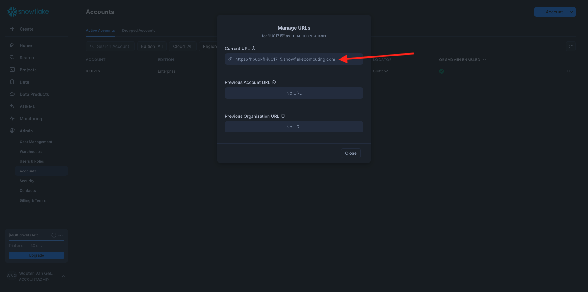
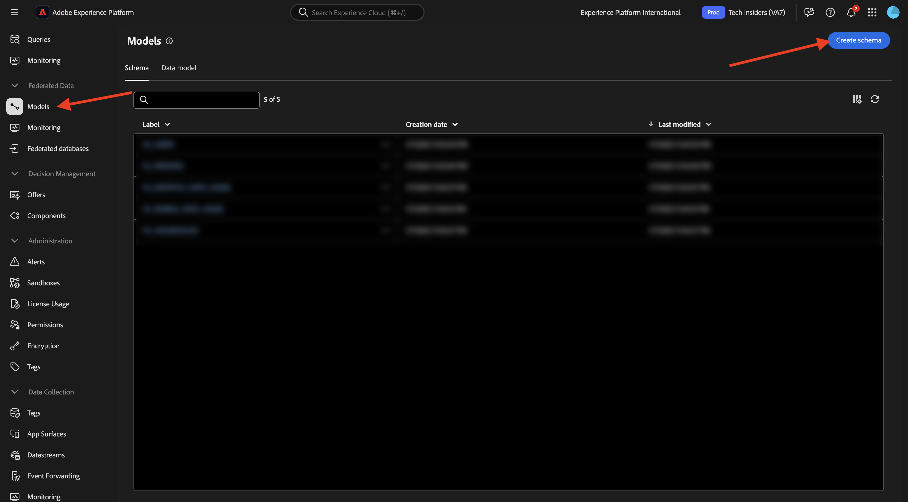
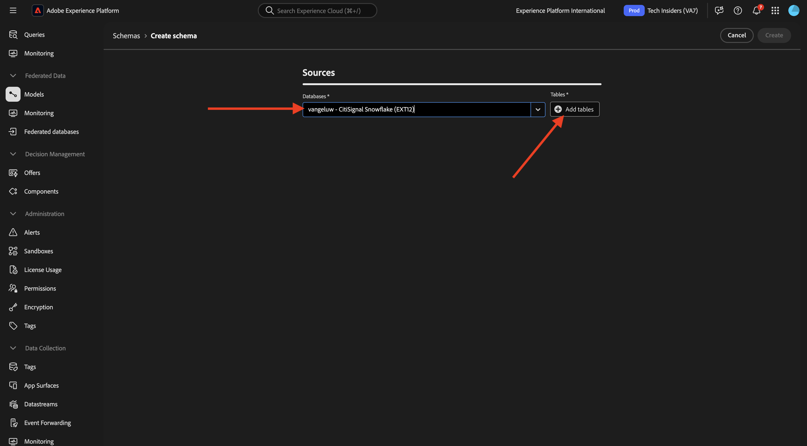

# 1.3.2 Creare schemi, modelli di dati e collegamenti

È ora possibile configurare il database federato in Adobe Experience Platform.

Accedi a Adobe Experience Platform da questo URL: [https://experience.adobe.com/platform](https://experience.adobe.com/platform).

Dopo aver effettuato l’accesso, accedi alla home page di Adobe Experience Platform.

Prima di continuare, devi selezionare una **sandbox**. La sandbox da selezionare è denominata ``--aepSandboxName--``. Dopo aver selezionato la sandbox appropriata, la schermata cambia e ora sei nella sandbox dedicata.

## 1.3.2.1 Configurare un database federato in AEP

Fai clic su **Federated databases** nel menu a sinistra. Quindi fare clic su **Aggiungi database federato**.

Come **Etichetta**, usa `--aepUserLdap-- - CitiSignal Snowflake` e per il tipo scegli **Snowflake**.

Nella sezione dei dettagli, devi compilare le credenziali, che avranno un aspetto simile a questo:

**Server**:

In Snowflake, vai a **Amministratore > Account**. Fai clic sul 3 **...** accanto al tuo account e fai clic su **Gestisci URL**.

Poi vedrai questo. Copia l&#39;**URL corrente** e incollalo nel campo **Server** in AEP.

**Utente**: il nome utente creato in precedenza nell&#39;esercizio 1.3.1.1
**Password**: password creata in precedenza nell&#39;esercizio 1.3.1.1
**Database**: utilizzare **CITISIGNAL**

Quindi, alla fine, dovresti avere questo. Fare clic su **Verifica connessione**. Se il test ha esito positivo, fare clic su **Distribuisci funzioni**, per creare sul lato Snowflake le funzioni necessarie per il motore del flusso di lavoro.

Una volta verificata la connessione e distribuite le funzioni, la configurazione verrà archiviata.

Tornando al menu **Database federati**, la connessione verrà visualizzata.

## 1.3.2.2 Creare schemi in AEP

Nel menu a sinistra, fai clic su **Modelli**, quindi vai a **Schemi**. Fare clic su **Crea schema**.

Selezionare il database federato e fare clic su **+ Aggiungi tabelle**.

Poi vedrai questo. Seleziona le 5 tabelle create in Snowflake prima:

- `--aepUserLdap--_HOUSEHOLDS`
- `--aepUserLdap--_MOBILE_DATA_USAGE`
- `--aepUserLdap--_MONTHLY_DATA_USAGE`
- `--aepUserLdap--_PERSONS`
- `--aepUserLdap--_USERS`

Fai clic su **Aggiungi**.

AEP carica quindi le informazioni di ciascuna tabella e le mostra nell’interfaccia utente.

Per ogni tabella è possibile:

- modificare l’etichetta dello schema
- aggiungi una descrizione
- rinominare tutti i campi e impostarne la visibilità
- seleziona la chiave primaria per lo schema

Per questo esercizio non sono necessarie modifiche.

Fai clic su **Crea**.

Poi vedrai questo. Puoi fare clic su qualsiasi schema e rivedere le informazioni. Ad esempio, fare clic su **—aepUserLdap—_PERSONS**.

Vedrai questo, con la possibilità di modificare la configurazione. Fai clic su **Dati** per visualizzare un esempio dei dati presenti nel database di Snowflake.

Viene quindi visualizzato un esempio dei dati.

## 1.3.2.3 Creare un modello in AEP

Nel menu a sinistra, vai a **Modelli** e quindi vai a **Modello dati**. Fare clic su **Crea modello dati**.

Per l&#39;etichetta, utilizzare `--aepUserLdap-- - CitiSignal Snowflake Data Model`. Fai clic su **Crea**.

Fare clic su **Aggiungi schemi**.

Seleziona gli schemi e fai clic su **Aggiungi**.

Poi vedrai questo. Fai clic su **Salva**.

### `--aepUserLdap--_PERSONS` - `--aepUserLdap--_USERS`

Ora puoi iniziare a definire i collegamenti tra schemi. Per iniziare a definire un collegamento, fai clic su **Crea collegamenti**.

Definiamo innanzitutto il collegamento tra la tabella `--aepUserLdap--_USERS` e `--aepUserLdap--_PERSONS`.

Fai clic su **Aggiungi**.

### `--aepUserLdap--_HOUSEHOLDS` - `--aepUserLdap--_PERSONS`

Allora tornerai qui. Fai clic su **Crea collegamenti** per creare un altro collegamento.

Definiamo quindi il collegamento tra la tabella `--aepUserLdap--_HOUSEHOLDS` e `--aepUserLdap--_PERSONS`.

### `--aepUserLdap--_USERS` - `--aepUserLdap--_MONTHLY_DATA_USAGE`

Allora tornerai qui. Fai clic su **Crea collegamenti** per creare un altro collegamento.

Definiamo quindi il collegamento tra la tabella `--aepUserLdap--_USERS` e `--aepUserLdap--_MONTHLY_DATA_USAGE`.

### `--aepUserLdap--_USERS` - `--aepUserLdap--_HOUSEHOLDS`

Allora tornerai qui. Fai clic su **Crea collegamenti** per creare un altro collegamento.

Definiamo quindi il collegamento tra la tabella `--aepUserLdap--_USERS` e `--aepUserLdap--_HOUSEHOLDS`.

### `--aepUserLdap--_USERS` - `--aepUserLdap--_MOBILE_DATA_USAGE`

Allora tornerai qui. Fai clic su **Crea collegamenti** per creare un altro collegamento.

Definiamo quindi il collegamento tra la tabella `--aepUserLdap--_USERS` e `--aepUserLdap--_MOBILE_DATA_USAGE`.

Dovresti vedere questo. Fai clic su **Salva**.

La configurazione in AEP è terminata. Ora puoi iniziare a utilizzare i dati federati in una composizione di pubblico federato.

Passaggio successivo: [1.3.3 Creare una composizione federata](./ex3.md)

[Torna al modulo 1.3](./fac.md)

[Torna a tutti i moduli](../../../overview.md)
