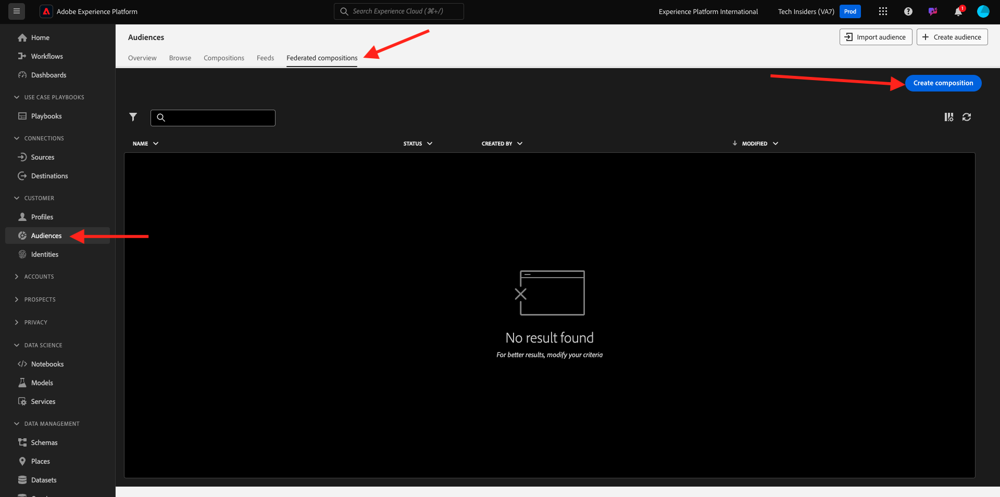
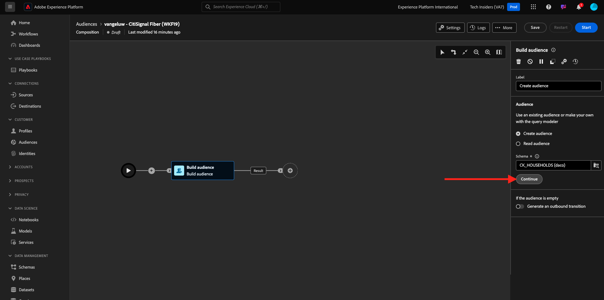
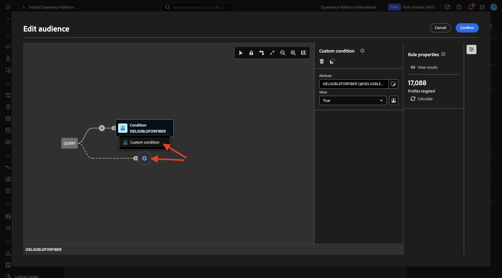
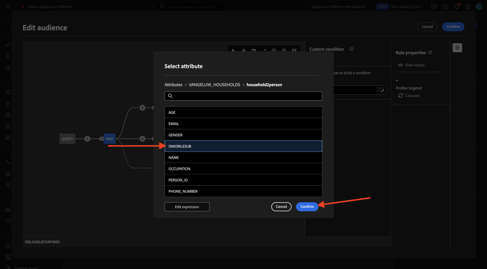

# 1.3.3 Creare una composizione federata

Ora puoi configurare la composizione del pubblico federato in AEP.

Accedi a Adobe Experience Platform da questo URL: [https://experience.adobe.com/platform](https://experience.adobe.com/platform).

Dopo aver effettuato l’accesso, accedi alla home page di Adobe Experience Platform.

Prima di continuare, devi selezionare una **sandbox**. La sandbox da selezionare è denominata ``--aepSandboxName--``. Dopo aver selezionato la sandbox appropriata, la schermata cambia e ora sei nella sandbox dedicata.

## 1.3.3.1 Creare il pubblico

Nel menu a sinistra, vai a **Tipi di pubblico** e quindi vai a **Composizioni federate**. Fare clic su **Crea composizione**.

Per l&#39;etichetta, utilizzare: `--aepUserLdap-- - CitiSignal Fiber`. Selezionare il modello dati creato nell&#39;esercizio precedente, denominato `--aepUserLdap-- - CitiSignal Snowflake Data Model`. Fai clic su **Crea**.

Poi vedrai questo.

Fai clic sull&#39;icona **+** e fai clic su **Genera pubblico**.

Poi vedrai questo. Seleziona **Crea pubblico**. Fai clic sull&#39;icona **cerca** per selezionare uno schema.

Selezionare lo schema **—aepUserLdap—_HOUSEHOLDS**. Fai clic su **Conferma**.

Fare clic su **Continua**.

Ora puoi iniziare a creare la query che verrà inviata a Snowflake. Fare clic sull&#39;icona **+** e quindi su **Condizione personalizzata**.

Selezionare l&#39;attributo **ISELIGIBLEFORFIBER** Fare clic su **Confirm**.

Poi vedrai questo. Imposta il campo **Value** su **True**. Fai clic su **Calcola** per inviare la query a Snowflake e ottenere una stima dei profili idonei.

Quindi fare di nuovo clic sull&#39;icona **+** e fare di nuovo clic su **Condizione personalizzata** per aggiungere un&#39;altra condizione.

La seconda condizione da aggiungere è: `Is the user an existing CitiSignal Mobile subscriber?`. Per rispondere a questa domanda, utilizzare la relazione tra la famiglia e il cliente principale della famiglia, definita in un&#39;altra tabella, **—aepUserLdap—_PERSONS**. Puoi eseguire il drill-down nel menu degli attributi utilizzando il collegamento **family2person**.

Selezionare l&#39;attributo **ISMOBILESUB** e fare clic su **Conferma**.

Imposta il campo **Valore** su **Vero** Fai clic di nuovo su **Calcola** per aggiornare il numero di profili di destinazione. Fai clic su **Conferma**.

Fai clic sull&#39;icona **+** e quindi su **Salva pubblico**.

Imposta **etichetta pubblico** su `--aepUserLdap-- - CitiSignal Eligible for Fiber`.

Fare clic su **+ Aggiungi mapping pubblico**.

Seleziona **HOUSEHOLD_ID** e fai clic su **Conferma**.

Fare clic su **+ Aggiungi mapping pubblico**.

Espandere facendo clic su **Dimensione targeting**.

Espandere facendo clic sul collegamento **family2person**.

Selezionare il campo **NAME**. Fai clic su **Conferma**.

Fare clic su **+ Aggiungi mapping pubblico**.

Espandere facendo clic su **Dimensione targeting**.

Espandere facendo clic sul collegamento **family2person**.

Seleziona il campo **EMAIL**. Fai clic su **Conferma**.

Poi vedrai questo. È ora necessario impostare il campo **Identità primaria** su **Household2person_EMAIL**. Imposta **Spazio dei nomi identità** su **E-mail**.

Fai clic su **Salva**.

La tua composizione ora è finita. Fare clic su **Inizio** per eseguirlo.

La query verrà ora inviata a Snowflake, che eseguirà la query sui dati di origine. I risultati verranno inviati nuovamente ad AEP, ma i dati di origine rimangono in Snowflake.

Il pubblico ora è popolato e può essere indirizzato dall’interno dell’ecosistema AEP.

Passaggio successivo: [Riepilogo e vantaggi](./summary.md)

[Torna al modulo 1.3](./fac.md)

[Torna a tutti i moduli](../../../overview.md)
