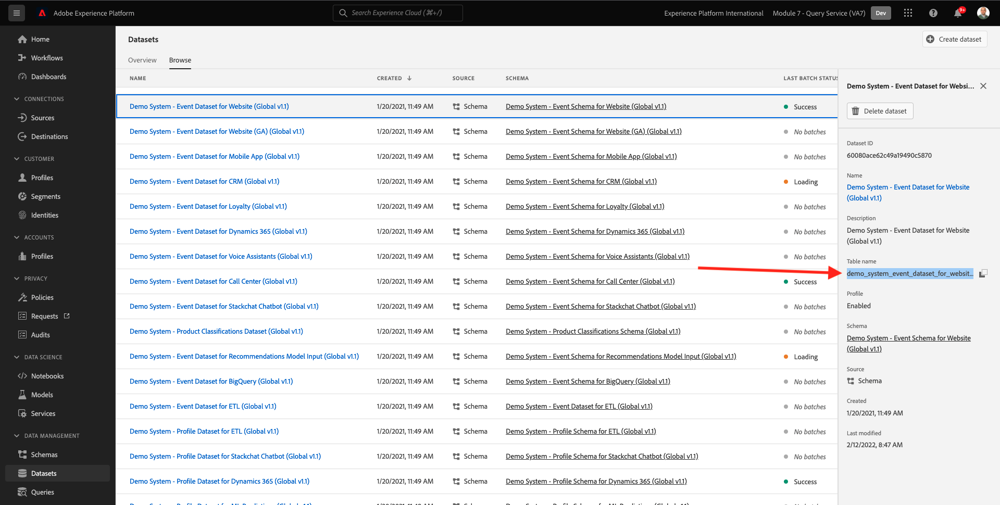

# 5.1.2 Utilizzo di Query Service

## Finalità

- Trovare ed esplorare i set di dati
- Scopri come gestire oggetti e attributi di Experience Data Models nelle query

## Contesto

Questo video illustra come utilizzare PSQL per recuperare informazioni sui set di dati disponibili, come scrivere query per Experience Data Model (XDM) e come scrivere le prime semplici query di reporting utilizzando i set di dati Query Service e Citi Signal.

## 5.1.2.1 Query di base

In questo corso scoprirai i metodi per recuperare informazioni sui set di dati disponibili e come recuperare correttamente i dati con una query da un set di dati XDM.

Tutti i set di dati esplorati tramite Adobe Experience Platform all’inizio del 1 sono disponibili per l’accesso tramite un’interfaccia SQL come tabelle. Per elencare tali tabelle è possibile utilizzare il comando **show tables;**.

Eseguire **show tables;** nell&#39;interfaccia della riga di comando **PSQL**. (non dimenticare di terminare il comando con un punto e virgola).

Copiare il comando **show tables;** e incollarlo al prompt:


Vedrai il seguente risultato:

```text
aepenablementfy21:all=> show tables;
                            name                            |        dataSetId         |                            dataSet                             | description | resolved 
------------------------------------------------------------+--------------------------+----------------------------------------------------------------+-------------+----------
 demo_system_event_dataset_for_call_center_global_v1_1      | 5fd1a9dea30603194baeea43 | Demo System - Event Dataset for Call Center (Global v1.1)      |             | false
 demo_system_event_dataset_for_mobile_app_global_v1_1       | 5fd1a9de250e4f194bec84cd | Demo System - Event Dataset for Mobile App (Global v1.1)       |             | false
 demo_system_event_dataset_for_voice_assistants_global_v1_1 | 5fd1a9de49ee76194b85f73c | Demo System - Event Dataset for Voice Assistants (Global v1.1) |             | false
 demo_system_event_dataset_for_website_global_v1_1          | 5fd1a9dee3224d194cdfe786 | Demo System - Event Dataset for Website (Global v1.1)          |             | false
 demo_system_profile_dataset_for_loyalty_global_v1_1        | 5fd1a9de250e4f194bec84cc | Demo System - Profile Dataset for Loyalty (Global v1.1)        |             | false
 demo_system_profile_dataset_for_ml_predictions_global_v1_1 | 5fd1a9de241f58194b0cb117 | Demo System - Profile Dataset for ML Predictions (Global v1.1) |             | false
 demo_system_profile_dataset_for_mobile_app_global_v1_1     | 5fd1a9deddf353194a2e00b7 | Demo System - Profile Dataset for Mobile App (Global v1.1)     |             | false
 demo_system_profile_dataset_for_website_global_v1_1        | 5fd1a9de42a61c194dd7b810 | Demo System - Profile Dataset for Website (Global v1.1)        |             | false
 journey_step_events                                        | 5fd1a7f30268c5194bbb7e5e | Journey Step Events                                            |             | false
```

Premere due punti sulla barra spaziatrice per visualizzare la pagina successiva del set di risultati oppure immettere `q` per tornare al prompt dei comandi.

Ogni set di dati in Platform ha la corrispondente tabella Query Service. Puoi trovare la tabella di un set di dati tramite l’interfaccia utente Set di dati:



La tabella `demo_system_event_dataset_for_website_global_v1_1` è la tabella di Query Service che corrisponde al set di dati `Demo System - Event Schema for Website (Global v1.1)`.

Per eseguire una query su alcune informazioni sulla posizione in cui è stato visualizzato un prodotto, verranno selezionate le informazioni **geo**.

Copia l&#39;istruzione seguente e incollala al prompt nell&#39;interfaccia della riga di comando **PSQL** e premi Invio:

```sql
select placecontext.geo
from   demo_system_event_dataset_for_website_global_v1_1
where  eventType = 'commerce.productViews'
and placecontext.geo.countryCode <> ''
limit 1;
```

Nei risultati della query, noterai che le colonne nel Experience Data Model (XDM) possono essere tipi complessi e non solo scalari. Nella query precedente vogliamo identificare le posizioni geografiche in cui si è verificato un **commerce.productViews**. Per identificare un **commerce.productViews** è necessario navigare nel modello XDM utilizzando **.Notazione** (punto).

```text
aepenablementfy21:all=> select placecontext.geo
aepenablementfy21:all-> from   demo_system_event_dataset_for_website_global_v1_1
aepenablementfy21:all-> where  eventType = 'commerce.productViews'
aepenablementfy21:all-> and placecontext.geo.countryCode <> ''
aepenablementfy21:all-> limit 1;
                  geo                   
----------------------------------------
 ("(57.4694803,-3.1269422)",Tullich,GB)
(1 row)
```

Il risultato è un oggetto piatto anziché un singolo valore? L&#39;oggetto **placecontext.geo** contiene quattro attributi: schema, paese e città. Quando un oggetto viene dichiarato come colonna, restituisce l’intero oggetto come stringa. Lo schema XDM può essere più complesso di quello che conosci, ma è molto potente ed è stato progettato per supportare molte soluzioni, canali e casi d’uso.

Per selezionare le singole proprietà di un oggetto, utilizzare **.Notazione** (punto).

Copia l&#39;istruzione seguente e incollala al prompt nell&#39;interfaccia della riga di comando **PSQL**:

```sql
select placecontext.geo._schema.longitude
      ,placecontext.geo._schema.latitude
      ,placecontext.geo.city
      ,placecontext.geo.countryCode
from   demo_system_event_dataset_for_website_global_v1_1
where  eventType = 'commerce.productViews'
and placecontext.geo.countryCode <> ''
limit 1;
```

Il risultato della query di cui sopra deve essere simile al seguente.
Il risultato è ora un insieme di valori semplici:

```text
aepenablementfy21:all=> select placecontext.geo._schema.longitude
aepenablementfy21:all->       ,placecontext.geo._schema.latitude
aepenablementfy21:all->       ,placecontext.geo.city
aepenablementfy21:all->       ,placecontext.geo.countryCode
aepenablementfy21:all-> from   demo_system_event_dataset_for_website_global_v1_1
aepenablementfy21:all-> where  eventType = 'commerce.productViews'
aepenablementfy21:all-> and placecontext.geo.countryCode <> ''
aepenablementfy21:all-> limit 1;
 longitude  |  latitude  |  city   | countrycode 
------------+------------+---------+-------------
 -3.1269422 | 57.4694803 | Tullich | GB
(1 row)
```

Non preoccuparti, c&#39;è un modo semplice per ottenere il percorso verso una proprietà specifica. Nella parte seguente verrà illustrato come.

Sarà necessario modificare una query, quindi apriamo prima un editor.

Su Windows

Fai clic sull&#39;icona **ricerca** nella barra degli strumenti di Windows, digita **blocco note** nel campo **ricerca**, quindi fai clic sul risultato **blocco note**:


Su Mac

Installa [Brackets](https://github.com/adobe/brackets/releases/download/release-1.14/Brackets.Release.1.14.dmg) o utilizza un altro editor di testo, se non è installato, e segui le istruzioni. Dopo l&#39;installazione, cercare **Brackets** tramite Mac Spotlight Search e aprirlo.

Copiare l&#39;istruzione seguente nel blocco note o tra parentesi quadre:

```sql
select your_attribute_path_here
from   demo_system_event_dataset_for_website_global_v1_1
where  eventType = 'commerce.productViews'
and placecontext.geo.countryCode <> ''
limit 1;
```

Torna all&#39;interfaccia utente di Adobe Experience Platform (dovrebbe essere aperta nel browser) o passa a [https://platform.adobe.com](https://platform.adobe.com).

Seleziona **Schemi**, immetti `Demo System - Event Schema for Website (Global v1.1)` nel campo **cerca** e seleziona `Demo System - Event Schema for Website (Global v1.1) Schema` dall&#39;elenco.


Esplora il modello XDM per **Demo System - Event Schema for Website (Global v1.1)**, facendo clic su un oggetto. Espandere la struttura per **placecontext**, **geo** e **schema**. Quando selezioni l&#39;attributo effettivo **longitude**, visualizzerai il percorso completo nella casella rossa evidenziata. Per copiare il percorso dell&#39;attributo, fare clic sull&#39;icona Copia percorso.


Passa al blocco note/parentesi quadre e rimuovi **il percorso_attributo_qui** dalla prima riga. Posiziona il cursore dopo **select** sulla prima riga e incolla (CTRL-V).

Copiare l&#39;istruzione modificata dal blocco note/parentesi quadre e incollarla al prompt nell&#39;interfaccia della riga di comando **PSQL**, quindi premere Invio.

Il risultato dovrebbe essere simile al seguente:

```text
aepenablementfy21:all=> select placeContext.geo._schema.longitude
aepenablementfy21:all-> from   demo_system_event_dataset_for_website_global_v1_1
aepenablementfy21:all-> where  eventType = 'commerce.productViews'
aepenablementfy21:all-> and placecontext.geo.countryCode <> ''
aepenablementfy21:all-> limit 1;
 longitude  
------------
 -3.1269422
```

Passaggio successivo: [5.1.3 Query, query, query e analisi dell&#39;abbandono](./ex3.md)

[Torna al modulo 5.1](./query-service.md)

[Torna a tutti i moduli](../../../overview.md)
