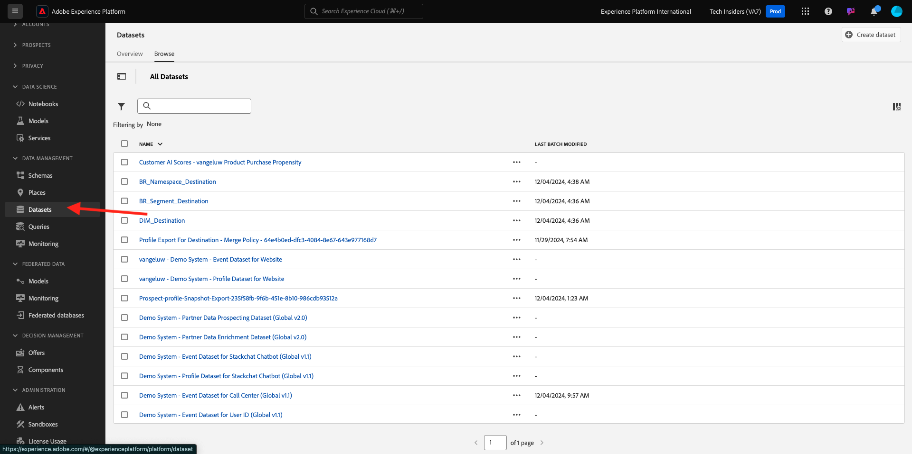

# 5.1.2 Guida introduttiva

## Introduzione all’interfaccia utente di Adobe Experience Platform

Vai a [Adobe Experience Platform](https://experience.adobe.com/platform). Dopo aver effettuato l’accesso, accedi alla home page di Adobe Experience Platform.

Prima di continuare, devi selezionare una **sandbox**. La sandbox da selezionare è denominata ``--aepSandboxName--``. Dopo aver selezionato la [!UICONTROL sandbox] appropriata, la schermata verrà modificata e ora sei nella [!UICONTROL sandbox] dedicata.

## Esplora i dati sulla piattaforma

Portare dati da canali diversi è un compito difficile per qualsiasi marchio. E in questo esercizio, i clienti di Citi Signal si interessano a Citi Signal sul suo sito web, sulla sua app mobile, i dati di acquisto vengono raccolti dal sistema Citi Signal’s Point of Sale, e hanno dati CRM e di fedeltà. Citi Signal utilizza Adobe Analytics e Adobe Launch per acquisire dati dal sito web, dall’app mobile e dal sistema POS, in modo che tali dati fluiscano già in Adobe Experience Platform. Iniziamo con l’esplorare tutti i dati per Citi Signal che esiste già in Adobe Experience Platform.

Nel menu a sinistra, vai a **Set di dati**.

Segnale Citi trasmette dati in streaming a Adobe Experience Platform e questi dati sono disponibili nel set di dati `Demo System - Event Dataset for Website (Global v1.1)`. Cerca `Demo System - Event Dataset for Website`.

I dati relativi all&#39;interazione del centro chiamate di Citi Signal vengono acquisiti nel set di dati `Demo System - Event Dataset for Call Center (Global v1.1)`. Cerca dati `Demo System - Event Dataset for Call Center` nella casella di ricerca. Fai clic sul nome del set di dati per aprirlo.

Dopo aver fatto clic sul set di dati, otterrai una panoramica dell’attività del set di dati, ad esempio i batch acquisiti e quelli non riusciti. Fare clic su **Anteprima set di dati** per visualizzare un esempio dei dati archiviati nel set di dati `Demo System - Event Dataset for Call Center (Global v1.1)`.

Il pannello a sinistra mostra la struttura dello schema per questo set di dati e sul lato destro viene visualizzato un esempio dei dati acquisiti.

Fare clic su **Chiudi** per chiudere la finestra **Anteprima set di dati**.

## Introduzione a Query Service

È possibile accedere a Query Service facendo clic su **Query** nel menu a sinistra.

Andando su **Registro** viene visualizzata la pagina Elenco query, che fornisce un elenco di tutte le query eseguite in questa organizzazione, con l&#39;ultima all&#39;inizio.

Fai clic su una query SQL dall’elenco e osserva i dettagli forniti nella barra a destra.

È possibile scorrere la finestra per visualizzare l&#39;intera query oppure fare clic sull&#39;icona evidenziata di seguito per copiare l&#39;intera query nel blocco note. Al momento non è necessario copiare la query.

Non solo puoi visualizzare le query eseguite, ma questa interfaccia utente ti consente di creare nuovi set di dati dalle query. Questi set di dati possono essere collegati al profilo cliente in tempo reale di Adobe Experience Platform o utilizzati come input per Adobe Experience Platform Data Science Workspace.

## Connetti client PSQL a Query Service

Query Service supporta i client con un driver per PostgreSQL. In questo utilizzeremo PSQL, un’interfaccia della riga di comando e Power BI o Tableau. Connetterci a PSQL.

Fare clic su **Credenziali**.

Viene visualizzata la schermata seguente. La schermata fornisce informazioni sul server e credenziali per l’autenticazione in Query Service. Per il momento, ci concentreremo sul lato destro della schermata che contiene un comando connect per PSQL. Fare clic sul pulsante Copia per copiare il comando negli Appunti.

Per Windows: aprire la riga di comando premendo il tasto Windows, digitare cmd e quindi fare clic sul risultato del prompt dei comandi.

Per macOS: apri terminal.app tramite ricerca in evidenza:

Incolla il comando di connessione copiato dall’interfaccia utente di Query Service e premi Invio nella finestra del prompt dei comandi:

Windows:

MacOS:

È ora attiva la connessione a Query Service tramite PSQL.

Nei prossimi esercizi, ci sarà una certa interazione con questa finestra. Verrà indicata come interfaccia della riga di comando **PSQL**.

Ora puoi iniziare a inviare le query.

Passaggio successivo: [5.1.3 Utilizzo di Query Service](./ex3.md)

[Torna al modulo 5.1](./query-service.md)

[Torna a tutti i moduli](../../../overview.md)
